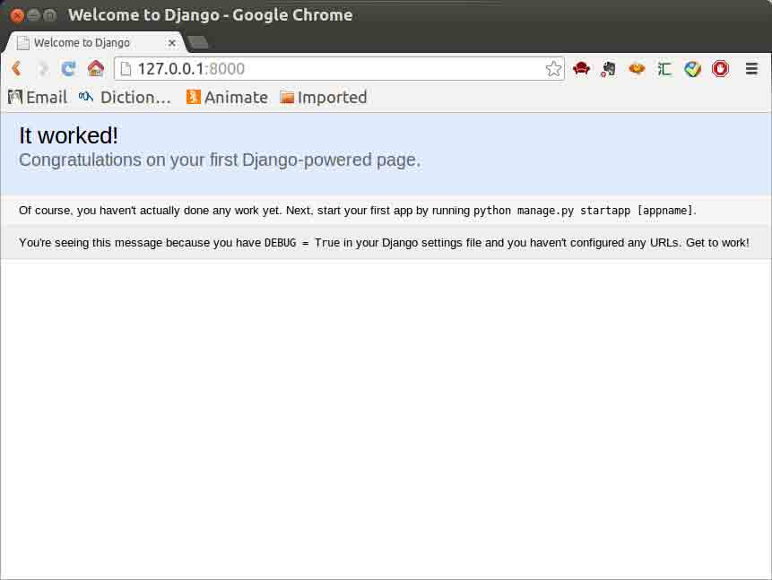
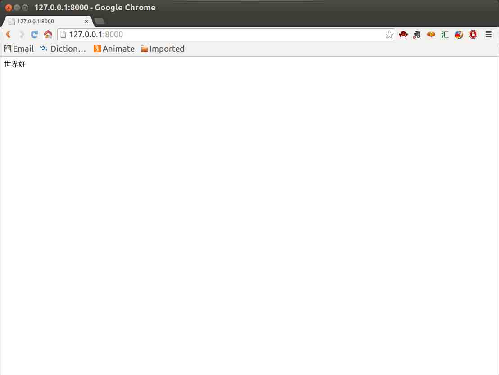
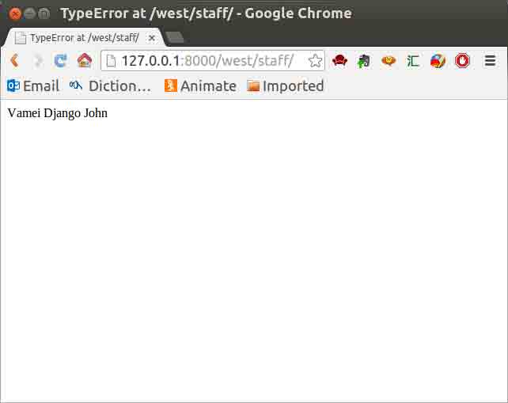

# 第 12 节 Django（上）

作者：Vamei 出处：http://www.cnblogs.com/vamei 欢迎转载，也请保留这段声明。谢谢！

Django 是 Python 下的一款网络服务器框架。Python 下有许多款不同的框架。Django 是重量级选手中最有代表性的一位。许多成功的网站和 APP 都基于 Django。虽然 Django 之于 Python，达不到 Rail 之于 Ruby 的一统江湖的地位，但 Django 无疑也是 Python 在网络应用方面的一位主将。使用 Django，可以方便的实现一个功能全面、管理简便的网站或 App 后端。这里从实用的角度出发，介绍如何使用 Django 框架。

## 一、安装 Django

启动计算机中的 Python，尝试载入 Django 模块。如果可以成功载入，那么说明 Django 已经安装好：

```py
import django
print(django.VERSION) 
```

但是实验楼环境里 Django 还没有安装，可以**在命令行**，尝试使用 pip 安装:

```py
sudo pip install -i http://mirrors.aliyuncs.com/pypi/simple django 
```

或者使用 easy_install:

```py
sudo easy_install django 
```

## 二、启动

在**命令行**使用下面的命令创建项目：

```py
django-admin.py startproject mysite 
```

在**当前目录**下，将生成 mysite 文件夹。其文件树结构如下:

```py
mysite
├── manage.py
└── mysite
    ├── __init__.py
    ├── settings.py
    ├── urls.py
    └── wsgi.py

1 directory, 5 files 
```

进入 mysite 目录，启动服务器：

```py
cd mysite

python manage.py runserver 8000 
```

上面的 8000 为端口号。如果不说明，那么端口号默认为 8000。

打开浏览器，访问 http://127.0.0.1:8000，可以看到服务器已经在运行：



虽然有一个能跑的服务器，但什么内容都没有。

## 三、第一个网页

在 http 协议中可以看到，网络服务器是“请求-回应”的工作模式。客户向 URL 发送请求，服务器根据请求，开动后厨，并最终为客人上菜。Django 采用的 MVC 结构，即点单、厨房、储藏室分离。

我们需要一个指挥员，将 URL 对应分配给某个对象处理，这需要在 mysite/mysite 下的 urls.py 设定。Python 会根据该程序，将 URL 请求分给某个厨师。

```py
mysite
├── manage.py
└── mysite
    ├── __init__.py
    ├── settings.py
    ├── urls.py
    └── wsgi.py

1 directory, 5 files 
```

将 urls.py 修改为:

```py
from django.conf.urls import patterns, include, url

from django.contrib import admin
admin.autodiscover()

urlpatterns = patterns('',
    # Examples:
    # url(r'^$', 'mysite.views.home', name='home'),
    # url(r'^blog/', include('blog.urls')),

    url(r'^admin/', include(admin.site.urls)),
    url(r'^$', 'mysite.views.first_page'),
) 
```

我们添加了最后一行。它将根目录的 URL 分配给一个对象进行处理，这个对象是 mysite.views.first_page。

用以处理 HTTP 请求的这一对象还不存在，我们在 mysite/mysite 下创建 views.py，并在其中定义 first_page 函数:

```py
# -*- coding: utf-8 -*-

from django.http import HttpResponse

def first_page(request):
    return HttpResponse("<p>世界好</p>") 
```

第一行说明字符编码为 utf-8，为下面使用中文做准备。first_page 函数的功能，是返回 http 回复，即这里的<p>世界好</p>。first_page 有一个参数 request，该参数包含有请求的具体信息，比如请求的类型等，这里并没有用到。

页面效果如下：



## 四、增加 APP

一个网站可能有多个功能。我们可以在 Django 下，以 app 为单位，模块化的管理，而不是将所有的东西都丢到一个文件夹中。在 mysite 目录下，运行 manange.py，创建新的 app：

```py
$python manage.py startapp west 
```

这个新的 app 叫做 west，用来处理西餐。

我们的根目录下，出现了一个新的叫做 west 的文件夹。

```py
mysite/
├── manage.py
├── mysite
│   ├── __init__.py
│   ├── __init__.pyc
│   ├── settings.py
│   ├── settings.pyc
│   ├── urls.py
│   ├── views.py
│   └── wsgi.py
└── west
    ├── admin.py
    ├── __init__.py
    ├── models.py
    ├── tests.py
    └── views.py 
```

我们还需要修改项目设置，说明我们要使用 west。在 mysite/mysite/settings.py 中，在 INSTALLED_APPS 中，增加"west"：

```py
INSTALLED_APPS = (
    'django.contrib.admin',
    'django.contrib.auth',
    'django.contrib.contenttypes',
    'django.contrib.sessions',
    'django.contrib.messages',
    'django.contrib.staticfiles',
    'west',
) 
```

可以看到，除了新增加的 west，Django 已经默认加载了一些功能性的 app，比如用户验证、会话管理、显示静态文件等。我们将在以后讲解它们的用途。

## 五、增加 APP 页面

我们下面为 APP 增加首页。我们之前是在 mysite/urls.py 中设置的 URL 访问对象。依然采用类似的方式设置。

另一方面，为了去耦合，实现模块化，我们应该在 west/urls.py 中设置 URL 访问对象。具体如下：

首先，修改 mysite/urls.py：

```py
from django.conf.urls import patterns, include, url

from django.contrib import admin
admin.autodiscover()

urlpatterns = patterns('',
    # Examples:
    # url(r'^$', 'mysite.views.home', name='home'),
    # url(r'^blog/', include('blog.urls')),

    url(r'^admin/', include(admin.site.urls)),
    url(r'^$', 'mysite.views.first_page'),
    url(r'^west/', include('west.urls')),
) 
```

注意新增加的最后一行。这里，我们提醒指挥员，对于 west/的访问，要参考 west/urls.py。

随后，我们创建 west/urls.py，添加内容：

```py
from django.conf.urls import patterns, include, url

urlpatterns = patterns('',
    url(r'^$', 'west.views.first_page'),
) 
```

将 URL 对应 west 下，views.py 中的 first_page 函数。

最后，在 west 下，修改 views.py 为:

```py
# -*- coding: utf-8 -*-

from django.http import HttpResponse

def first_page(request):
    return HttpResponse("<p>西餐</p>") 
```

访问 http://127.0.0.1:8000/west，查看效果。

可以看到，Django 的创建过程非常简单。但这只是初次尝试 Django。为了创建一个完整功能的网站，还需要调用 Django 许多其它的功能。

## 六、连接数据库

Django 为多种数据库后台提供了统一的调用 API。根据需求不同，Django 可以选择不同的数据库后台。MySQL 算是最常用的数据库。我们这里将 Django 和 MySQL 连接。

安装 MYSQLdb：

```py
sudo apt-get install python-mysqldb 
```

在 Linux 终端下启动 mysql:

```py
sudo service mysql start
mysql -u root 
```

在 MySQL 中创立 Django 项目的数据库：

```py
mysql> CREATE DATABASE villa DEFAULT CHARSET=utf8; 
```

这里使用 utf8 作为默认字符集，以便支持中文。

在 MySQL 中创立用户，并授予相关权限:

```py
mysql> GRANT SELECT, INSERT, UPDATE, DELETE, CREATE, DROP, INDEX, ALTER, CREATE TEMPORARY TABLES, LOCK TABLES ON villa.* TO 'vamei'@'localhost' IDENTIFIED BY 'shiyanlou'; 
```

在 settings.py 中，将 DATABASES 对象更改为:

```py
DATABASES = {
    'default': {
        'ENGINE': 'django.db.backends.mysql',
        'NAME': 'villa',
        'USER': 'root',
        'HOST':'localhost',
        'PORT':'3306',
    }
} 
```

后台类型为 mysql。上面包含数据库名称和用户的信息，它们与 MySQL 中对应数据库和用户的设置相同。Django 根据这一设置，与 MySQL 中相应的数据库和用户连接起来。此后，Django 就可以在数据库中读写了。

## 七、创立模型

MySQL 是关系型数据库。但在 Django 的帮助下，我们不用直接编写 SQL 语句。Django 将关系型的表(table)转换成为一个类(class)。而每个记录(record)是该类下的一个对象(object)。我们可以使用基于对象的方法，来操纵关系型的 MySQL 数据库。

在传统的 MySQL 中，数据模型是表。在 Django 下，一个表为一个类。表的每一列是该类的一个属性。在 models.py 中，我们创建一个只有一列的表，即只有一个属性的类：

```py
from django.db import models

class Character(models.Model):
    name = models.CharField(max_length=200)
    def __unicode__(self):
        return self.name 
```

类 Character 定义了数据模型，它需要继承自 models.Model。在 MySQL 中，这个类实际上是一个表。表只有一列，为 name。可以看到，name 属性是字符类型，最大长度为 200。

类 Character 有一个 __unicode__()方法，用来说明对象的字符表达方式。如果是 Python 3，定义 __str__()方法，实现相同的功能。

命令 Django 同步数据库。Django 根据 west/models.py 中描述的数据模型，在 MySQL 中真正的创建各个关系表：

```py
python manage.py syncdb
python manage.py makemigrations west
python manage.py migrate 
```

同步数据库后，Django 将建立相关的 MySQL 表格，并要求你创建一个超级用户:

```py
Creating tables ...
Creating table django_admin_log
Creating table auth_permission
Creating table auth_group_permissions
Creating table auth_group
Creating table auth_user_groups
Creating table auth_user_user_permissions
Creating table auth_user
Creating table django_content_type
Creating table django_session
Creating table west_character

You just installed Django's auth system, which means you don't have any superusers defined.
Would you like to create one now? (yes/no): yes
Username (leave blank to use 'tommy'): root
Email address: xxxxx@xmail.com
Password: 
Password (again): 
Superuser created successfully.
Installing custom SQL ...
Installing indexes ...
Installed 0 object(s) from 0 fixture(s) 
```

数据模型建立了。打开 MySQL 命令行（提示输入密码：shiyanlou）：

```py
$mysql -u root 
```

查看数据模型：

```py
USE villa;
SHOW TABLES;
SHOW COLUMNS FROM west_character; 
```

最后一个命令返回 Character 类的对应表格:

```py
+-------+--------------+------+-----+---------+----------------+
| Field | Type         | Null | Key | Default | Extra          |
+-------+--------------+------+-----+---------+----------------+
| id    | int(11)      | NO   | PRI | NULL    | auto_increment |
| name  | varchar(200) | NO   |     | NULL    |                |
+-------+--------------+------+-----+---------+----------------+
2 rows in set (0.00 sec) 
```

可以看到，Django 还自动增加了一个 id 列，作为记录的主键(Primary Key)。

## 八、显示数据

数据模型虽然建立了，但还没有数据输入。为了简便，我们手动添加记录。打开 MySQL 命令行,并切换到相应数据库。添加记录：

```py
INSERT INTO west_character (name) Values ('Vamei');
INSERT INTO west_character (name) Values ('Django');
INSERT INTO west_character (name) Values ('John'); 
```

查看记录：

```py
SELECT * FROM west_character; 
```

可以看到，三个名字已经录入数据库。

下面我们从数据库中取出数据，并返回给 http 请求。在 west/views.py 中，添加视图。对于对应的请求，我们将从数据库中读取所有的记录，然后返回给客户端：

```py
# -*- coding: utf-8 -*-

from django.http import HttpResponse

from west.models import Character

def staff(request):
    staff_list = Character.objects.all()
    staff_str  = map(str, staff_list)
    return HttpResponse("<p>" + ' '.join(staff_str) + "</p>") 
```

可以看到，我们从 west.models 中引入了 Character 类。通过操作该类，我们可以读取表格中的记录。

为了让 http 请求能找到上面的程序，在 west/urls.py 增加 url 导航：

```py
from django.conf.urls import patterns, include, url

urlpatterns = patterns('',
    url(r'^staff/','west.views.staff'),
) 
```

运行服务器。在浏览器中输入 URL：

```py
127.0.0.1:8000/west/staff 
```

查看效果，从数据库读出数据，显示在页面：



Django 使用类和对象接口，来操纵底层的数据库。有了数据库，就有了站点内容的大本营。

## 作业

按照实验过程操作一遍并截图。