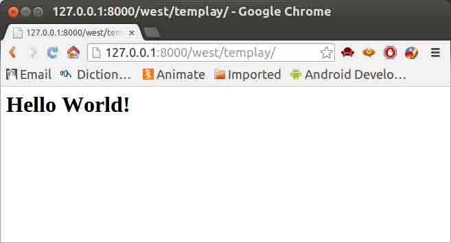
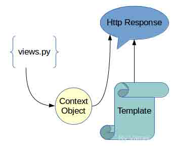
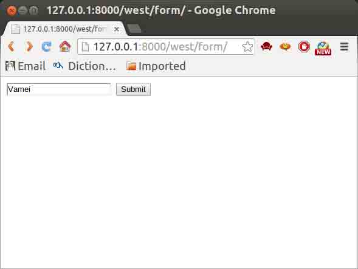
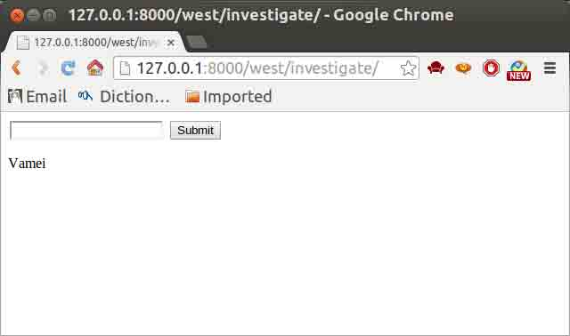
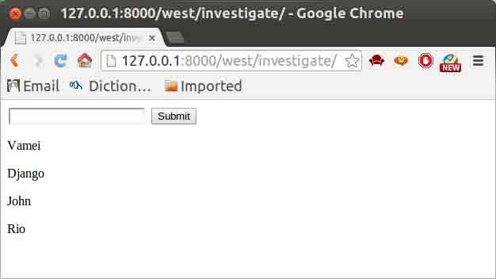
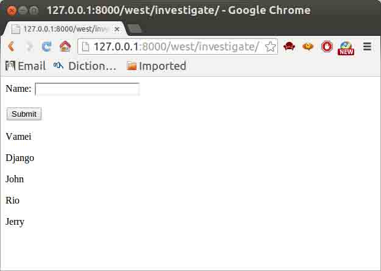

# 第 13 节 Django（中）

作者：Vamei 出处：http://www.cnblogs.com/vamei 欢迎转载，也请保留这段声明。谢谢！

在之前的程序中，我们直接生成一个字符串，作为 http 回复，返回给客户端。这一过程中使用了 django.http.HttpResponse()。

在这样的一种回复生成过程中，我们实际上将数据和视图的格式混合了到上面的字符串中。看似方便，却为我们的管理带来困难。想像一个成熟的网站，其显示格式会有许多重复的地方。如果可以把数据和视图格式分离，就可以重复使用同一视图格式了。

Django 中自带的模板系统，可以将视图格式分离出来，作为模板使用。这样，不但视图可以容易修改，程序也会显得美观大方。

## 一、模板初体验

我们拿一个独立的 templay.html 文件作为模板。它放在 templates/west/文件夹下。文件系统的结构现在是:

```py
mysite/
├── mysite
├── templates
│   └── west
└── west 
```

templay.html 文件的内容是：

```py
<h1>{{ label }}</h1> 
```

可以看到，这个文件中，有一个奇怪的双括号包起来的陌生人。这就是我们未来数据要出现的地方。而相关的格式控制，即<h1>标签，则已经标明在该模板文件中。

我们需要向 Django 说明模板文件的搜索路径，修改 mysite/settings.py，添加:

```py
# Template dir
# This is for django 1.8
TEMPLATES = [
    {
        'BACKEND': 'django.template.backends.django.DjangoTemplates',
        'DIRS': (os.path.join(BASE_DIR, 'templates/west'),),
        'APP_DIRS': True,
        'OPTIONS': {
            'context_processors': [
                'django.template.context_processors.debug',
                'django.template.context_processors.i18n',
                'django.template.context_processors.tz',
                'django.template.context_processors.media',
                'django.template.context_processors.static',
                'django.contrib.auth.context_processors.auth',
                'django.contrib.messages.context_processors.messages',
            ],
        },
    },
] 
```

如果还有其它的路径用于存放模板，可以增加该元组中的元素，以便 Django 可以找到需要的模板。

我们现在修改 west/views.py，增加一个新的对象，用于向模板提交数据：

```py
# -*- coding: utf-8 -*-

#from django.http import HttpResponse
from django.shortcuts import render

def templay(request):
    context          = {}
    context['label'] = 'Hello World!'
    return render(request, 'templay.html', context) 
```

可以看到，我们这里使用 render 来替代之前使用的 HttpResponse。render 还使用了一个词典 context 作为参数。这就是我们的数据。

context 中元素的键值为'label'，正对应刚才的“陌生人”的名字。这样，该 context 中的‘label’元素值，就会填上模板里的坑，构成一个完整的 http 回复。

作为上节内容的一个小练习，自行修改 west/urls.py，让 http://127.0.0.1:8000/west/templay 的 URL 请求可以找到相应的 view 对象。

访问 http://127.0.0.1:8000/west/templay，可以看到页面：



## 二、流程

再来回顾一下整个流程。west/views.py 中的 templay()在返回时，将环境数据 context 传递给模板 templay.html。Django 根据 context 元素中的键值，将相应数据放入到模板中的对应位置，生成最终的 http 回复。



这一模板系统可以与 Django 的其它功能相互合作。上一回，我们从数据库中提取出了数据。如果将数据库中的数据放入到 context 中，那么就可以将数据库中的数据传送到模板。

修改上次的 west/views.py 中的 staff:

```py
def staff(request):
    staff_list  = Character.objects.all()
    staff_str  = map(str, staff_list)
    context   = {'label': ' '.join(staff_str)}
    return render(request, 'templay.html', context) 
```

## 三、循环与选择

Django 实际上提供了丰富的模板语言，可以在模板内部有限度的编程，从而更方便的编写视图和传送数据。

我们下面体验一下最常见的循环与选择。

上面的 staff 中的数据实际上是一个数据容器，有三个元素。刚才我们将三个元素连接成一个字符串传送。

实际上，利用模板语言，我们可以直接传送数据容器本身，再循环显示。修改 staff()为:

```py
def staff(request):
    staff_list = Character.objects.all()
    return render(request, 'templay.html', {'staffs': staff_list}) 
```

从数据库中查询到的三个对象都在 staff_list 中。我们直接将 staff_list 传送给模板。

将模板 templay.html 修改为：

```py

<p>{{ item.id }}, {{item}}</p>
 
```

我们以类似于 Python 中 for 循环的方式来定义模板中的 for，以显示 staffs 中的每个元素。

还可以看到，对象.属性名的引用方式可以直接用于模板中。

选择结构也与 Python 类似。根据传送来的数据是否为 True，Django 选择是否显示。使用方式如下：

```py

   ... display 1

   ... display 2

   ... display 3
 
```

其中的 elif 和 else 和 Python 中一样，是可以省略的。

## 四、模板继承

模板可以用继承的方式来实现复用。我们下面用 templay.html 来继承 base.html。这样，我们可以使用 base.html 的主体，只替换掉特定的部分。

新建 templates/west/base.html:

```py
<html>
  <head>
    <title>templay</title>
  </head>

  <body>
    <h1>come from base.html</h1>
    
       <p>original</p>
    
  </body>
</html> 
```

该页面中，名为 mainbody 的 block 标签是可以被继承者们替换掉的部分。

我们在下面的 templay.html 中继承 base.html，并替换特定 block：

```py





<p>{{ item.id }},{{ item.name }}</p>


 
```

第一句说明 templay.html 继承自 base.html。可以看到，这里相同名字的 block 标签用以替换 base.html 的相应 block。

## 五、html 表格

HTTP 协议以“请求－回复”的方式工作。客户发送请求时，可以在请求中附加数据。服务器通过解析请求，就可以获得客户传来的数据，并根据 URL 来提供特定的服务。

HTML 文件中可以包含表格标签。HTML 表格的目的是帮助用户构成 HTTP 请求，把数据用 GET 或者 POST 的方法，传递给某一 URL 地址。下面是一个表格的例子：

```py
<form action="/west/investigate/" method="get">
  <input type="text" name="staff">
  <input type="submit" value="Submit">
</form> 
```

这里的 form 标签有两个属性。action 用于说明 URL 地址，method 说明请求的方法。

表格中还包含有两个 input 标签，即两个输入栏目。根据 type 的不同，第一个为一个文本框，第二个为一个提交按钮。name 为输入栏的名字。服务器在解析数据时，将以 name 为索引。

我们可以将上面的表格直接存入模板 form.html，并在 west/views.py 中定义一个视图 form()来显示表格:

```py
from django.shortcuts import render

def form(request):
    return render(request, 'form.html') 
```

设置 urls.py，让对[site]/west/form/的访问，指向该视图。

最后，我们在 west/views.py 中定义 investigate()来处理该表格提交的数据:

```py
from django.shortcuts import render

def investigate(request):
    rlt = request.GET['staff']
    return HttpResponse(rlt) 
```

可以看到，HTTP 请求的相关信息，包括请求的方法，提交的数据，都包含在 request 参数中。

表格是通过 GET 方法提交的。我们可以通过 request.GET['staff']，来获得 name 为 staff 的输入栏的数据。该数据是一个字符串。investigate()将直接显示该字符串。

设置 urls.py，让该处理函数对应 action 的 URL([site]/west/investigate/)。

当我们访问 http://127.0.0.1:8000/west/form 时，将显示:



提交表格后，页面将转到[site]/west/investigate。investigate()读取字符串后，在页面上显示出来。

## 六、POST 方法

上面我们使用了 GET 方法。视图显示和请求处理分成两个函数处理。

提交数据时更常用 POST 方法。我们下面使用该方法，并用一个 URL 和处理函数，同时显示视图和处理请求。

先创建模板 investigate.html

```py
<form action="/west/investigate/" method="post">
  
  <input type="text" name="staff">
  <input type="submit" value="Submit">
</form>

<p>{{ rlt }}</p> 
```

我们修改提交表格的方法为 post。在模板的末尾，我们增加一个 rlt 记号，为表格处理结果预留位置。

表格后面还有一个的标签。csrf 全称是 Cross Site Request Forgery。这是 Django 提供的防止伪装提交请求的功能。POST 方法提交的表格，必须有此标签。

在 west/views.py 中，用 investigate()来处理表格：

```py
from django.shortcuts import render
from django.core.context_processors import csrf

def investigate(request):
    ctx ={}
    ctx.update(csrf(request))
    if request.POST:
        ctx['rlt'] = request.POST['staff']
    return render(request, "investigate.html", ctx) 
```

这里的 csrf()是和上面的对应。我们在这里不深究。

看程序的其它部分。对于该 URL，可能有 GET 或者 POST 方法。if 的语句有 POST 方法时，额外的处理，即提取表格中的数据到环境变量。

最终效果如下：



## 七、存储数据

我们还可以让客户提交的数据存入数据库。使用庄园疑云中创建的模型。我们将客户提交的字符串存入模型 Character。

修改 west/views.py 的 investigate():

```py
from django.shortcuts import render
from django.core.context_processors import csrf

from west.models import Character

def investigate(request):
    if request.POST:
        submitted  = request.POST['staff']
        new_record = Character(name = submitted)
        new_record.save()
    ctx ={}
    ctx.update(csrf(request))
    all_records = Character.objects.all()
    ctx['staff'] = all_records
    return render(request, "investigate.html", ctx) 
```

在 POST 的处理部分，我们调用 Character 类创建新的对象，并让该对象的属性 name 等于用户提交的字符串。通过 save()方法，我们让该记录入库。

随后，我们从数据库中读出所有的对象，并传递给模板。

我们还需要修改模板 investigate.html，以更好的显示：

```py
<form action="/west/investigate/" method="post">
  
  <input type="text" name="staff">
  <input type="submit" value="Submit">
</form>


<p>{{ person }}</p>
 
```

我们使用模板语言的 for，来显示所有的记录。

效果如下:



## 八、表格对象

客户提交数据后，服务器往往需要对数据做一些处理。比如检验数据，看是否符合预期的长度和数据类型。在必要的时候，还需要对数据进行转换，比如从字符串转换成整数。这些过程通常都相当的繁琐。

Django 提供的数据对象可以大大简化这一过程。该对象用于说明表格所预期的数据类型和其它的一些要求。这样 Django 在获得数据后，可以自动根据该表格对象的要求，对数据进行处理。

修改 west/views.py：

```py
from django.shortcuts import render
from django.core.context_processors import csrf

from west.models import Character

from django import forms

class CharacterForm(forms.Form):
    name = forms.CharField(max_length = 200)

def investigate(request):
    if request.POST:
        form = CharacterForm(request.POST)
        if form.is_valid():
            submitted  = form.cleaned_data['name']
            new_record = Character(name = submitted)
            new_record.save()

    form = CharacterForm()
    ctx ={}
    ctx.update(csrf(request))
    all_records = Character.objects.all()
    ctx['staff'] = all_records
    ctx['form']  = form
    return render(request, "investigate.html", ctx) 
```

上面定义了 CharacterForm 类，并通过属性 name，说明了输入栏 name 的类型为字符串，最大长度为 200。

在 investigate()函数中，我们根据 POST，直接创立 form 对象。该对象可以直接判断输入是否有效，并对输入进行预处理。空白输入被视为无效。

后面，我们再次创建一个空的 form 对象，并将它交给模板显示。

在模板 investigate.html 中，我们可以直接显示 form 对象：

```py
<form action="/west/investigate/" method="post">
  
  {{ form.as_p }}
  <input type="submit" value="Submit">
</form>


<p>{{ person }}</p>
 
```

如果有多个输入栏，我们可以用相同的方式直接显示整个 form，而不是加入许多个<input>标签。

效果如下：



## 作业

#### 1、显示上面“流程”部分的“staff”页面。

#### 2、按照实验过程操作一遍并截图。