# 第 14 节 Django（下）

作者：Vamei 出处：http://www.cnblogs.com/vamei 欢迎转载，也请保留这段声明。谢谢！

Django 提供一个管理数据库的 app，即 django.contrib.admin。这是 Django 最方便的功能之一。通过该 app，我们可以直接经由 web 页面，来管理我们的数据库。这一工具，主要是为网站管理人员使用。

这个 app 通常已经预装好，你可以在 mysite/settings.py 中的 INSTALLED_APPS 看到它。

## 一、默认界面

admin 界面位于[site]/admin 这个 URL。这通常在 mysite/urls.py 中已经设置好。比如，下面是我的 urls.py:

```py
from django.conf.urls import patterns, include, url

from django.contrib import admin

admin.autodiscover()                            # admin

urlpatterns = patterns('',
    url(r'^admin/', include(admin.site.urls)),  # admin
    url(r'^west/', include('west.urls')),
) 
```

为了让 admin 界面管理某个数据模型，我们需要先注册该数据模型到 admin。比如，我们之前在 west 中创建的模型 Character。修改 west/admin.py:

```py
from django.contrib import admin
from west.models import Character

# Register your models here.
admin.site.register(Character) 
```

访问 http://127.0.0.1:8000/admin，登录后，可以看到管理界面：

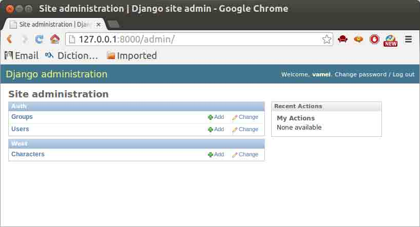

这个页面除了 west.characters 外，还有用户和组信息。它们来自 Django 预装的 Auth 模块。我们将在以后处理用户管理的问题。

## 二、复杂模型

管理页面的功能强大，完全有能力处理更加复杂的数据模型。

先在 west/models.py 中增加一个更复杂的数据模型：

```py
from django.db import models

# Create your models here.
class Contact(models.Model):
    name   = models.CharField(max_length=200)
    age    = models.IntegerField(default=0)
    email  = models.EmailField()
    def __unicode__(self):
        return self.name

class Tag(models.Model):
    contact = models.ForeignKey(Contact)
    name    = models.CharField(max_length=50)
    def __unicode__(self):
        return self.name 
```

这里有两个表。Tag 以 Contact 为外部键。一个 Contact 可以对应多个 Tag。

我们还可以看到许多在之前没有见过的属性类型，比如 IntegerField 用于存储整数。

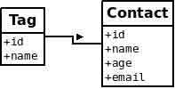

同步数据库:

```py
$python manage.py syncdb 
```

在 west/admin.py 注册多个模型并显示：

```py
from django.contrib import admin
from west.models import Character,Contact,Tag

# Register your models here.
admin.site.register([Character, Contact, Tag]) 
```

模型将在管理页面显示。比如 Contact 的添加条目的页面如下：

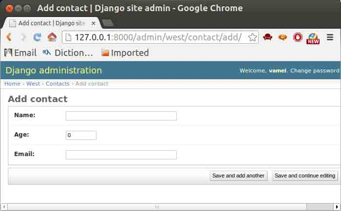

## 三、自定义界面

我们可以自定义管理页面，来取代默认的页面。比如上面的"add"页面。我们想只显示 name 和 email 部分。修改 west/admin.py:

```py
from django.contrib import admin
from west.models import Character,Contact,Tag

# Register your models here.
class ContactAdmin(admin.ModelAdmin):
    fields = ('name', 'email')

admin.site.register(Contact, ContactAdmin)
admin.site.register([Character, Tag]) 
```

上面定义了一个 ContactAdmin 类，用以说明管理页面的显示格式。里面的 fields 属性，用以说明要显示的输入栏。我们没有让"age"显示。由于该类对应的是 Contact 数据模型，我们在注册的时候，需要将它们一起注册。显示效果如下：

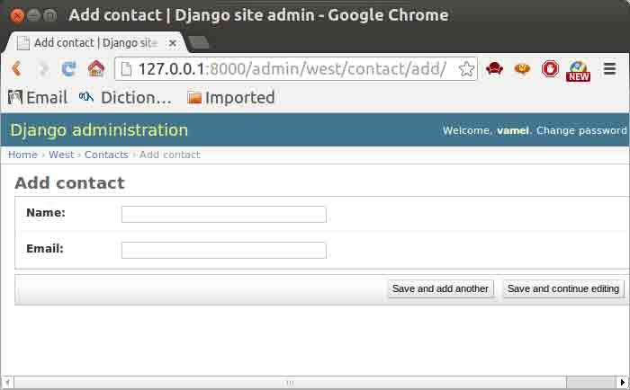

我们还可以将输入栏分块，给每一块输入栏以自己的显示格式。修改 west/admin.py 为：

```py
from django.contrib import admin
from west.models import Character,Contact,Tag

# Register your models here.
class ContactAdmin(admin.ModelAdmin):
    fieldsets = (
        ['Main',{
            'fields':('name','email'),
        }],
        ['Advance',{
            'classes': ('collapse',), # CSS
            'fields': ('age',),
        }]
    )

admin.site.register(Contact, ContactAdmin)
admin.site.register([Character, Tag]) 
```

上面的栏目分为了 Main 和 Advance 两部分。classes 说明它所在的部分的 CSS 格式。这里让 Advance 部分收敛起来：

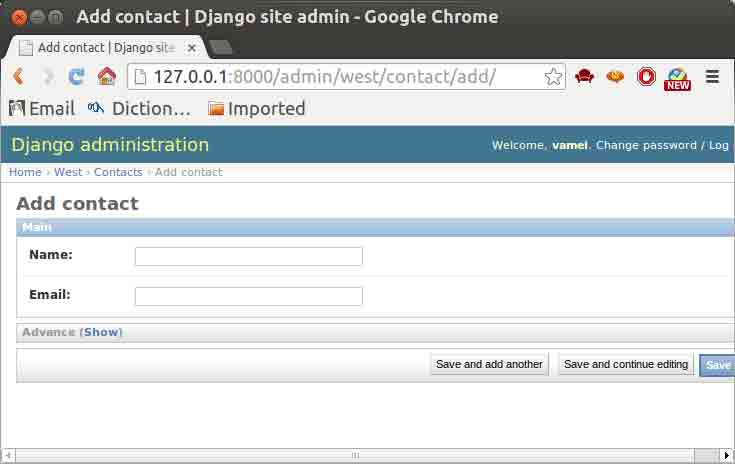

Advance 部分旁边有一个 Show 按钮，用于展开。

## 四、Inline 显示

上面的 Contact 是 Tag 的外部键，所以有外部参考的关系。而在默认的页面显示中，将两者分离开来，无法体现出两者的从属关系。我们可以使用 Inline 显示，让 Tag 附加在 Contact 的编辑页面上显示。

修改 west/admin.py：

```py
from django.contrib import admin
from west.models import Character,Contact,Tag

# Register your models here.
class TagInline(admin.TabularInline):
    model = Tag

class ContactAdmin(admin.ModelAdmin):
    inlines = [TagInline]  # Inline
    fieldsets = (
        ['Main',{
            'fields':('name','email'),
        }],
        ['Advance',{
            'classes': ('collapse',),
            'fields': ('age',),
        }]

    )

admin.site.register(Contact, ContactAdmin)
admin.site.register([Character]) 
```

效果如下：

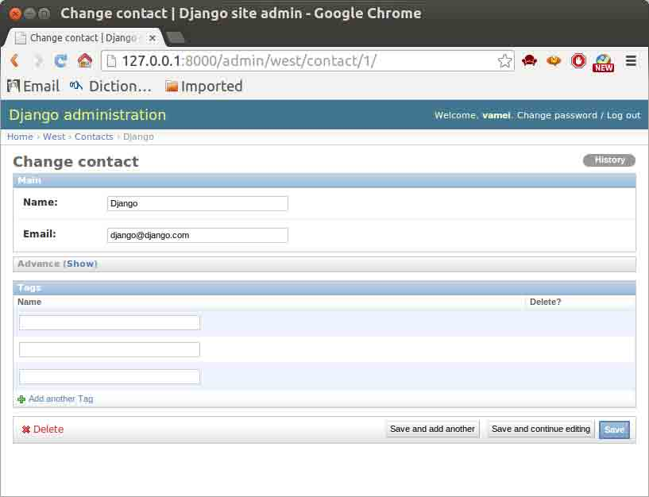

## 五、列表页的显示

在 Contact 输入数条记录后，Contact 的列表页看起来如下:

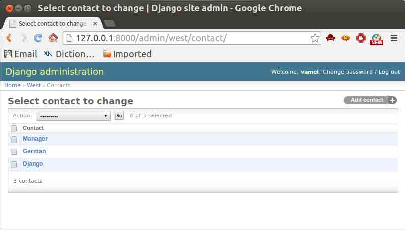

我们也可以自定义该页面的显示，比如在列表中显示更多的栏目，只需要在 ContactAdmin 中增加 list_display 属性:

```py
from django.contrib import admin
from west.models import Character,Contact,Tag

# Register your models here.
class ContactAdmin(admin.ModelAdmin):
    list_display = ('name','age', 'email') # list

admin.site.register(Contact, ContactAdmin)
admin.site.register([Character, Tag]) 
```

列表页新的显示效果如下：

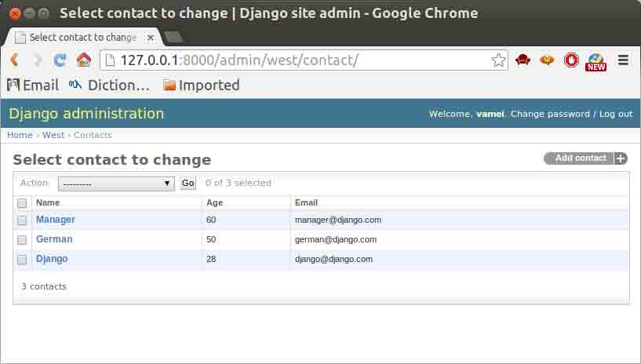

我们还可以为该列表页增加搜索栏。搜索功能在管理大量记录时非常有用。使用 search_fields 说明要搜索的属性：

```py
from django.contrib import admin
from west.models import Character,Contact,Tag

# Register your models here.
class ContactAdmin(admin.ModelAdmin):
    list_display = ('name','age', 'email') 
    search_fields = ('name',)

admin.site.register(Contact, ContactAdmin)
admin.site.register([Character]) 
```

效果如下：

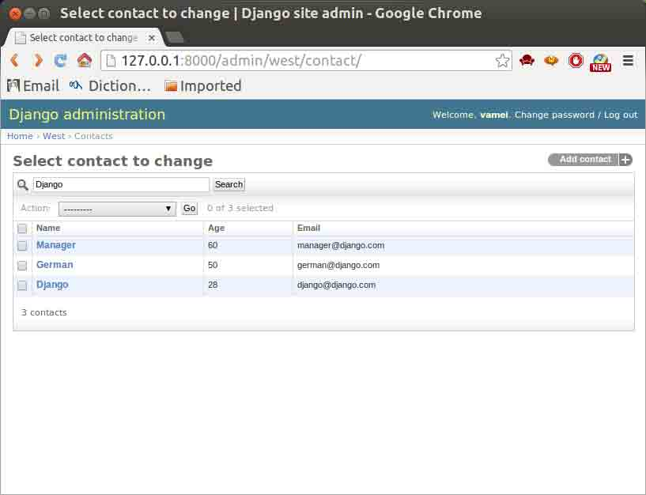

## 六、创建用户

之前我们了解了：

*   创建 Django 项目

*   数据库

*   模板

*   表格提交

*   admin 管理页面

上面的功能模块允许我们做出一个具有互动性的站点，但无法验证用户的身份。我们这次了解用户验证部分。通过用户验证，我们可以根据用户的身份，提供不同的服务。

一个 Web 应用的用户验证是它的基本组成部分。我们在使用一个应用时，总是从“登录”开始，到“登出”结束。另一方面，用户验证又和网站安全、数据库安全息息相关。HTTP 协议是无状态的，但我们可以利用储存在客户端的 cookie 或者储存在服务器的 session 来记录用户的访问。

Django 有管理用户的模块，即 django.contrib.auth。你可以在 mysite/settings.py 里看到，这个功能模块已经注册在 INSTALLED_APPS 中。利用该模块，你可以直接在逻辑层面管理用户，不需要为用户建立模型，也不需要手工去实现会话。

你可以在 admin 页面直接看到用户管理的对话框，即 Users。从这里，你可以在这里创建、删除和修改用户。点击 Add 增加用户 daddy，密码为 daddyiscool。

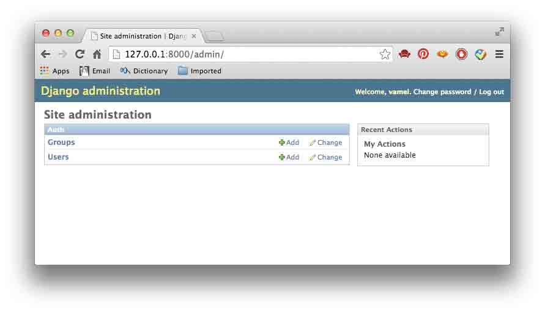

在 admin 页面下，我们还可以控制不同用户组对数据库的访问权限。我们可以在 Groups 中增加用户组，设置用户组对数据库的访问权限，并将用户加入到某个用户组中。

在这一章节中，我们创立一个新的 app，即 users。下文的模板和 views.py，都针对该 app。

## 七、用户登录

我们建立一个简单的表格。用户通过该表格来提交登陆信息，并在 Django 服务器上验证。如果用户名和密码正确，那么登入用户。

我们首先增加一个登录表格：

```py
<form role="form" action="/login" method="post">
      <label>Username</label>
      <input type="text" name='username'>
      <label>Password</label>
      <input name="password" type="password">
      <input type="submit" value="Submit">
 </form> 
```

我们在 views.py 中，定义处理函数 user_login()，来登入用户：

```py
# -*- coding: utf-8 -*-
from django.shortcuts import render, redirect
from django.core.context_processors import csrf
from django.contrib.auth import *

def user_login(request):
    '''
    login
    '''
    if request.POST:
        username = password = ''
        username = request.POST.get('username')
        password = request.POST.get('password')
        user     = authenticate(username=username, password=password)
        if user is not None and user.is_active:
                login(request, user)
                return redirect('/')
    ctx = {}
    ctx.update(csrf(request))
    return render(request, 'login.html',ctx) 
```

上面的 authenticate()函数，可以根据用户名和密码，验证用户信息。而 login()函数则将用户登入。它们来自于 django.contrib.auth。

作为替换，我们可以使用特别的 form 对象，而不自行定义表格。这将让代码更简单，而且提供一定的完整性检验。

## 八、登出

有时用户希望能销毁会话。我们可以提供一个登出的 URL，即/users/logout。登入用户访问该 URL，即可登出。在 views.py 中，增加该 URL 的处理函数：

```py
# -*- coding: utf-8 -*-
from django.shortcuts import redirect

def user_logout(request):
    '''
    logout
    URL: /users/logout
    '''
    logout(request)
    return redirect('/') 
```

我们修改 urls.py，让 url 对应 user_logout()。访问 http://127.0.0.1/users/logout，就可以登出用户。

## 九、views.py 中的用户

上面说明了如何登入和登出用户，但还没有真正开始享受用户验证带来的好处。用户登陆的最终目的，就是为了让服务器可以区别对待不同的用户。比如说，有些内容只能让登陆用户看到，有些内容则只能让特定登陆用户看到。我们下面将探索如何实现这些效果。

在 Django 中，对用户身份的检验，主要是在 views.py 中进行。views.py 是连接模型和视图的中间层。HTTP 请求会转给 views.py 中的对应处理函数处理，并发回回复。在 views.py 的某个处理函数准备 HTTP 回复的过程中，我们可以检验用户是否登陆。根据用户是否登陆，我们可以给出不同的回复。最原始的方式，是使用 if 式的选择结构：

```py
# -*- coding: utf-8 -*-
from django.http import HttpResponse

def diff_response(request):
    if request.user.is_authenticated():
        content = "<p>my dear user</p>"
    else:
        content = "<p>you wired stranger</p>"
    return HttpResponse(content) 
```

可以看到，用户的登录信息包含在 request.user 中，is_authenticated()方法用于判断用户是否登录，如果用户没有登录，那么该方法将返回 false。该 user 对象属于 contrib.auth.user 类型，还有其它属性可供使用，比如：

```py
| 属性           | 功能         |
|:---------------|:-------------|
| get*username() | 返回用户名   |
| set*password() | 设置密码     |
| get*fullname() | 返回姓名     |
| last*login     | 上次登录时间 |
| date_joined    | 账户创建时间 |
```

在 Django 中，我们还可以利用装饰器，根据用户的登录状况，来决定 views.py 中处理函数的显示效果。相对于上面的 if 结构，装饰器使用起来更加方便。下面的 user_only()是 views.py 中的一个处理函数。

```py
from django.contrib.auth.decorators import login_required
from django.http import HttpResponse

@login_required
def user_only(request):
    return HttpResponse("<p>This message is for logged in user only.</p>") 
```

注意上面的装饰器 login_required，它是 Django 预设的装饰器。user_only()的回复结果只能被登录用户看到，而未登录用户将被引导到其他页面。

Django 中还有其它的装饰器，用于修饰处理函数。相应的 http 回复，只能被特殊的用户看到。比如 user_passes_test，允许的用户必须满足特定标准，而这一标准是可以用户自定义的。比如下面，在 views.py 中增添：

```py
from django.contrib.auth.decorators import user_passes_test
from django.http import HttpResponse
def name_check(user):
    return user.get_username() == 'vamei'

@user_passes_test(name_check)
def specific_user(request):
    return HttpResponse("<p>for Vamei only</p>") 
```

装饰器带有一个参数，该参数是一个函数对象 name_check。当 name_check 返回真值，即用户名为 vamei 时，specific_user 的结果才能被用户看到。

## 十、模板中的用户

进一步，用户是否登陆这一信息，也可以直接用于模板。比较原始的方式是把用户信息直接作为环境数据，提交给模板。然而，这并不是必须的。事实上，Django 为此提供了捷径：我们可以直接在模板中调用用户信息。比如下面的模板：

```py

  <p>Welcome, my genuine user, my true love.</p>

  <p>Sorry, not login, you are not yet my sweetheart. </p>
 
```

不需要环境变量中定义，我们就可以直接在模板中引用 user。这里，模板中调用了 user 的一个方法，is_authenticated，将根据用户的登录情况，返回真假值。需要注意，和正常的 Python 程序不同，在 Django 模板中调用方法并不需要后面的括号。

## 十一、用户注册

我们上面利用了 admin 管理页面来增加和删除用户。这是一种简便的方法，但并不能用于一般的用户注册的情境。我们需要提供让用户自主注册的功能。这可以让站外用户提交自己的信息，生成自己的账户，并开始作为登陆用户使用网站。

用户注册的基本原理非常简单，即建立一个提交用户信息的表格。表格中至少包括用户名和密码。相应的处理函数提取到这些信息后，建立 User 对象，并存入到数据库中。

我们可以利用 Django 中的 UserCreationForm，比较简洁的生成表格，并在 views.py 中处理表格：

```py
from django.contrib.auth.forms import UserCreationForm
from django.shortcuts import render, redirect
from django.core.context_processors import csrf

def register(request): 
    if request.method == 'POST': 
        form = UserCreationForm(request.POST) 
        if form.is_valid(): 
            new_user = form.save() 
        return redirect("/") 
    else:
        form = UserCreationForm()
        ctx = {'form': form}
        ctx.update(csrf(request))       
        return render(request, "register.html", ctx) 
```

相应的模板 register.html 如下：

```py
<form action="" method="post">
   
   {{ form.as_p }}
   <input type="submit" value="Register">
</form> 
```

## 十二、apache 安装

前面介绍了 Django 最主要的几个方面：数据库，模板，动态生成页面等。但都是使用 python manage.py runserver 来运行服务器。这是一个实验性的 web 服务器，不适用于正常的站点运行。我们需要一个可以稳定而持续的服务器。这个服务器负责监听 http 端口，将收到的请求交给 Django 处理，将 Django 的回复发还给客户端。

这样的持续性服务器可以有很多选择，比如 apache, Nginx, lighttpd 等。这里将使用最常见的 apache 服务器。服务器和 Django 之间通过 Python 的 web 服务接口 WSGI 连接，因此我们同样需要 apache 下的 mod_wsgi 模块。

首先需要安装 apache2 和 mod_wsgi。我们可以使用 apt-get 安装：

```py
sudo apt-get install apache2
sudo apt-get install libapache2-mod-wsgi 
```

在 apache 的配置文件/etc/apache2/apache2.conf 中增加下面的配置：

```py
# Django
WSGIScriptAlias / /home/shiyanlou/mysite/mysite/wsgi.py
WSGIPythonPath /home/shiyanlou/mysite

<Directory /home/shiyanlou/mysite/mysite>
<Files wsgi.py>
  Order deny,allow
  Require all granted
</Files>
</Directory> 
```

上面的配置中/home/shiyanlou/mysite 是 Django 项目所在的位置。而/home/shiyanlou/mysite/mysite/wsgi.py 是 Django 项目中 z 自动创建的文件。

可以看到，利用 WSGIScriptAlias，我们实际上将 URL /对应了 wsgi 接口程序。这样，当我们访问根 URL 时，访问请求会经由 WSGI 接口，传递给 Django 项目 mysite。

配置好后，重启 apache2：

```py
sudo /etc/init.d/apache2 restart 
```

使用浏览器，可以检查效果：

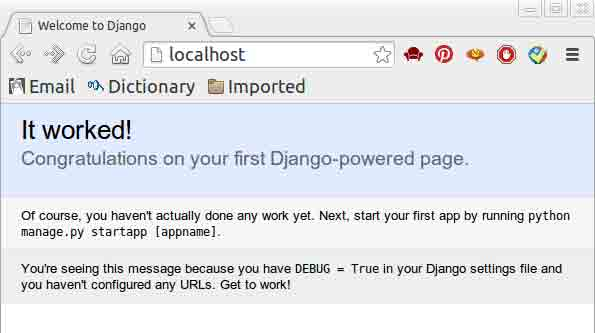

## 十三、静态文件

Django 的主要功能是动态的生成 HTTP 回复。很多媒体文件是静态存储的，如.js 文件，.css 文件和图片文件。这些文件变动的频率较小。我们希望静态的提供这些文件，而不是动态的生成。这样既可以减小服务器的负担，也便于在浏览器缓存，提高用户体验。

我们可以在 apache2.conf 中添加如下配置：

```py
Alias /media/ /home/shiyanlou/media/
Alias /static/ /home/shiyanlou/static/

<Directory /home/shiyanlou/static/>
Order deny,allow
Require all granted
</Directory>

<Directory /home/shiyanlou/media/>
Order deny,allow
Require all granted
</Directory>

# Django
WSGIScriptAlias / /home/shiyanlou/mysite/mysite/wsgi.py
WSGIPythonPath /home/shiyanlou/mysite

<Directory /home/shiyanlou/mysite/mysite/ >
<Files wsgi.py>
    Order deny,allow
    Require all granted
</Files>
</Directory> 
```

这样，/static/和/media/这两个 URL 的访问将引导向存有静态文件的/home/shiyanlou/static/和/home/shiyanlou/media/，apache 将直接向客户提供这两个文件夹中的静态文件。而剩下的 URL 访问，将导向 WSGI 接口，由 Django 动态处理。

在/home/shiyanlou/static/中放入文件 revenge.jpg，访问 http://localhost/static/revenge：

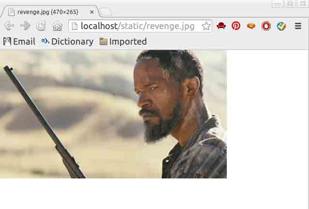

云平台或者服务器的部署是一个大的课题，这里无法深入到所有的细节。幸运的是，在网上有丰富的资料。你可以根据自己的平台和问题，搜索相应的资料。

在 Django 的 debug 模式下，我们可以在 app 文件夹中建立 static 目录，放入静态文件。Django 将自动搜索到其中的静态文件。但这一方法有很大的安全隐患，只适用于开发。

## 作业

#### 1、使用 contrib.auth.forms.AuthenticationForm。来简化上面“用户登录”的模板和处理函数。

#### 2、实验上面“views.py 中的用户”中的处理函数 diff_response()的效果。

#### 3、增加处理函数，显示“模板中的用户”中的模板，然后查看不同登录情况下的显示结果。