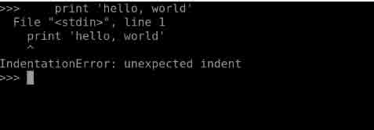
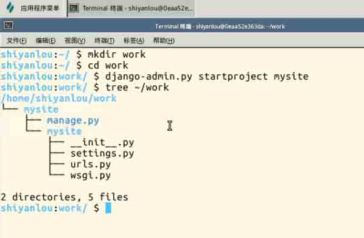

# 第 1 节 Python 快速入门

## 实验简介

本章介绍 Python 的基本感概念，Python 既可以在交互式解释器中运行也可以在用源代码方式运行，可以用`help()`查看函数或模块的帮助。Python 常用数据类型有字面意义上的常量，数（包含整数、长整数、浮点数和复数），字符串和对象，另外编码过程中要特别注意缩进。

## 一、实验说明

### 1\. 环境登录

无需密码自动登录，系统用户名 shiyanlou 若不小心登出后，直接刷新页面即可

### 2\. 环境使用

实验报告可以在个人主页中查看，其中含有每次实验的截图及笔记，以及每次实验的有效学习时间（指的是在实验桌面内操作的时间，如果没有操作，系统会记录为发呆时间）。这些都是您学习的真实性证明。

### 3\. 参考文档

《python 官方手册》http://python.usyiyi.cn/python_278/tutorial/index.html

《简明 Python 教程》http://woodpecker.org.cn/abyteofpython_cn/chinese/

《Python 核心编程(第二版)》

### 4.Python 介绍

Python 是一门简单易学且功能强大的编程语言。 它拥有高效的高级数据结构，并且能够用简单而又高效的方式进行面向对象编程。 Python 优雅的语法和动态类型，再结合它的解释性，使其在大多数平台的许多领域成为编写脚本或开发应用程序的理想语言。

### 5.安装 Python

Linux 操作系统已经内置了 Python，如果是 Windows 的话，需要到[Python 官网](http://www.python.org/)下载，基本一直点击下一步就可以安装到 Win32 系统。本实验在 Linux 下进行，所以无需再安装。现在几乎所有的 Linux 发行版，都会预装 python2.x 版本。

> 请选择 python2.7 的版本，这个版本是官方在 python3.0 之前的最后一个版本，用于和最新的 3.x 过渡的，所以 2.7 不仅包含了老版本的所有属性，也含有了新版的很多特性，作为入门的话，是非常合适的。

## 二、第一个 Python 程序

Python 编程中由两种方法可以运行你的程序——使用交互式的带提示符的**解释器**或传统的使用**源文件**的方式。

我们将会使用这两种方式分别输出——"hello, world"

### 1.调用 Python 交互式解释器

在 Linux 命令行的 shell 提示符下键入 python，启动解释器。 然后输入`print 'hello, world'`，然后按 Enter 键。你应该可以看到输出的单词 hello, world。


Python 解释器会在下一行立即给出你输出！你刚才键入的是一句 Python 语句 。我们使用 print 来打印你提供给它的值。这里，我们提供的是字符串'hello, world'，它会被迅速地打印在屏幕上。

> 如何退出 Python 提示符 > 如果你使用的是 Linux，那么按 Ctrl+d 退出提示符(意思是按住 Ctrl 键再按 d，本课程中出现的组合键都会这样表示)。 > 如果是在 Windows 命令行中，则按 Ctrl+z 再按 Enter。 > 有一种更通用的方式，直接输入`exit()`这个函数，回车之后就会退出。

当输入的程序有错误的时候，解释器将捕获到这个错误，并打印这个错误信息和栈跟踪器。



以上的错误是因为在 print 前面多了一个缩进，所以报错提示：**意外出现的缩进**

这里涉及到了 Python 代码风格的解释，提供一下链接，按需求学习不同的代码风格：

[Python-pep8 官方代码风格指导](http://wiki.woodpecker.org.cn/moin/PythonCodingRule)

[Google-python 代码风格指导](http://zh-google-styleguide.readthedocs.org/en/latest/google-python-styleguide/background/)

如果选择使用 pep8 风格的话，在 linux 下有个方便的工具可以对你的 python 源代码进行格式检查，并提示格式错误在源代码的第几行和错误的原因：

```py
$ sudo apt-get update
$ sudo apt-get install pep8 
```

pep8 可以直接使用：

```py
$ pep8 file.py 
```

如果`file.py`有任何违背了 pep8 格式的地方，都会详细的错误信息都会打印出来，我们可以根据显示的信息去修改我们源代码。

### 2\. 源文件运行程序

首先创建一个源文件并用 vim 打开:

```py
$ vim hello.py 
```

执行 Python 脚本： BSD 类的 Unix 系统中，Python 脚本可以像 Shell 脚本那样直接执行。只要在脚本文件第一行，指定文件和模式。

```py
#!/usr/bin/env python 
```

源程序编码：默认情况下，Python 源文件是 UTF-8 编码。也可以在 #! 行（首行）后插入至少一行特殊的注释行来定义源文件的编码。

```py
#-*- coding: utf-8 -*- 
```

所以我们最后的源文件是这样的：

```py
#!/usr/bin/env python
#-*- coding:utf-8 -*-

# Filename : hello.py
print 'Hello, World' 
```

`:wq`保存并退出

运行效果：


如果你得到的输出与上面所示的一样，那么恭喜！——你已经成功地运行了你的第一个 Python 程序。

万一你得到一个错误，那么请确保你键入的程序准确无误，然后再运行一下程序。注意 Python 是大小写敏感的，即 print 与 Print 不一样——注意前一个是小写 p 而后一个是大写 P。另外，确保在每一行的开始字符前没有空格或者制表符——我们将在后面讨论为什么这点是很重要的。

**它如何工作**

让我们思考一下这个程序的前 3 行。它们被称作**注释**——任何在#符号右面的内容都是注释。注释主要作为提供给程序读者的笔记。

Python 至少应当有第一行那样的特殊形式的注释。它被称作**组织行**——源文件的头两个字符是**#!**，后面跟着一个程序。这行告诉你的 Linux/Unix 系统当你执行你的程序的时候，它应该运行哪个解释器。这会在下一节做详细解释。注意，你总是可以通过在命令行直接指定解释器，从而在任何平台上运行你的程序。就如同命令 python hello.py 一样。

### 3.查看帮助

```py
>>> help(MODULE_NAME) 
```

将 MODULE_NAME 替换为需要获得帮助的函数名或模块名即可

```py
>>> help(dir) 
```

查看 dir 函数帮助，点击 q 可以退出

### 4\. 可执行的 Python 程序

首先我们需要通过`chmod`命令，给程序可执行的许可，然后运行程序。



chmod 命令用来改变文件的权限，给系统中所有用户对这个源文件的执行许可。然后我们可以直接通过指定源文件的位置来执行程序。我们使用`./`来指示程序位于当前目录。

为了更加有趣一些，你可以把你的文件名改成 hello（去掉.py 后缀），然后运行./hello。这样，这个程序仍然可以工作，因为系统知道它必须用源文件第一行指定的那个解释器来运行程序。

另外，我们可以直接使用`python hello.py`运行程序，像这样：


## 三、Python 基本概念

仅仅打印"hello, world"是不够的！我们还要做更多的事情——得到一些输入（input），然后做一些操作，再从中得到一些输出（output）。在 Python 中，我们可以使用常量和变量来完成这些工作。

我们将用很少的时间，来介绍 Python 的一些基本概念。

### 1\. 字面意义上的常量

一个字面意义上的常量的例子是如同 5、1.23、9.25e-3 这样的数，或者如同'This is a string'、"It's a string!"这样的字符串。它们被称作字面意义上的，因为它们具备字面的意义——你按照它们的字面意义使用它们的值。数 2 总是代表它自己，而不会是别的什么东西——它是一个常量，因为不能改变它的值。因此，所有这些都被称为**字面意义上的常量**。

### 2\. 数

在 Python 中有 4 种类型的数 —— 整数、长整数、浮点数和复数。 一些例子：

1.  2 是一个整数的例子。
2.  长整数不过是大一些的整数。(`10000000000L`)
3.  3.23 和 52.3E-4 是浮点数的例子。E 标记表示 10 的幂。在这里，52.3E-4 表示 52.3 * 10^-4。(0.00012 等价于 1.2e-4)
4.  带有后缀 j 或 J 就被视为虚数。带有非零实部的复数写为 (real+imagj) ，或者可以用 complex(real, imag) 函数创建。

```py
>>> 1j * 1J
(-1+0j)
>>> 1j * complex(0, 1)
(-1+0j)
>>> 3+1j*3
(3+3j)
>>> (3+1j)*3
(9+3j)
>>> (1+2j)/(1+1j)
(1.5+0.5j) 
```

### 3\. 字符串

字符串是字符的序列。字符串基本上就是一个个单词组成的语句。

我几乎可以保证你在每个 Python 程序中都要用到字符串，所以请特别留心下面这部分的内容。下面告诉你如何在 Python 中使用字符串。

**使用单引号（'）**

你可以用单引号指示字符串，就如同`'Quote me on this'`这样。所有的空白，即空格和制表符都照原样保留。

**使用双引号（"）**

在双引号中的字符串与单引号中的字符串的使用完全相同，例如`"What's your name?"`。

**使用三引号（'''或""", 三个单引号或三个双引号）**

利用三引号，你可以指示一个多行的字符串。你可以在三引号中自由的使用单引号和双引号。例如：

```py
'''This is a multi-line string. This is the first line.
This is the second line.
"What's your name?," I asked.
He said "Bond, James Bond."
''' 
```

**转义符**

假设你想要在一个字符串中使用单引号（'），那么你该怎么指示这个字符串？例如，这个字符串是 What's your name?。你肯定不能用`'What's your name?'`来指示它，因为 Python 会弄不明白这个字符串从何处开始，何处结束。所以，你需要指明单引号而不是字符串的结尾。可以通过转义符来完成这个任务。你用`\'`来指示单引号——注意这个反斜杠。现在你可以把字符串表示为`'What\'s your name?'`。

另一个表示这个特别的字符串的方法是`"What's your name?"`，即用双引号。类似地，要在双引号字符串中使用双引号本身的时候，也可以借助于转义符。另外，你可以用转义符`\\`来指示反斜杠本身。

值得注意的一件事是，在一个字符串中，行末的单独一个反斜杠表示字符串在下一行继续，而不是开始一个新的行。例如：

```py
"This is the first sentence. \
This is the second sentence."
等价于"This is the first sentence. This is the second sentence." 
```

**自然字符串**

如果你想要指示某些不需要如转义符那样的特别处理的字符串，那么你需要指定一个自然字符串。自然字符串通过给字符串加上前缀 r 或 R 来指定。例如`r"Newlines are indicated by \n"`。

一定要用自然字符串处理正则表达式。否则会需要使用很多的反斜杠。例如，后向引用符可以写成`'\\1'或 r'\1'`。

**Unicode 字符串**

Unicode 是国际文本的标准方法。如果你想要用中文或阿拉伯语等写文本，那么你需要有一个支持 Unicode 的编辑器。类似地，Python 允许你处理 Unicode 文本——你只需要在字符串前加上前缀 u 或 U。例如，`u"This is a Unicode string."`

记住，在你处理文本文件的时候使用 Unicode 字符串，特别是当你知道这个文件含有用非英语的语言写的文本。

**按字面意义级联字符串**

如果你把两个字符串按字面意义相邻放着，他们会被 Python 自动级联。例如，`'What\'s' 'your name?'`会被自动转为`"What's your name?"`。

**标识符的命名**

标识符是一个笼统的概念，包括了变量名，函数名，类名，常量名等等。 标识符是用来标识某样东西的名字。在命名标识符的时候，你要遵循这些规则：

1.  标识符的第一个字符必须是字母表中的字母（大写或小写）或者一个下划线（' _ '）。

2.  标识符名称的其他部分可以由字母（大写或小写）、下划线（' _ '）或数字（0-9）组成。

3.  标识符名称是对大小写敏感的。例如，myname 和 myName 不是一个标识符。注意前者中的小写 n 和后者中的大写 N。

4.  有效标识符名称的例子有`i、__my_name、name_23 和 a1b2_c3`。

5.  无效标识符名称的例子有 2things、this is spaced out 和 my-name。

### 4\. 对象

记住，Python 把在程序中用到的任何东西都称为对象。这是从广义上说的。因此我们不会说“某某 东西 ”，我们说“某个 对象 ”。

**面向对象编程** 就每一个东西包括数、字符串甚至函数都是对象这一点来说，Python 是极其完全地面向对象的。

我们将看一下如何使用变量和字面意义上的常量。

**如何编写 Python 程序** 下面是保存和运行 Python 程序的标准流程。

1.  打开你最喜欢的编辑器，这里推荐使用 vim。
2.  输入例子中的程序代码。
3.  用注释中给出的文件名把它保存为一个文件，按照惯例把所有的 Python 程序都以扩展名.py 保存，`:w var.py`。
4.  运行解释器命令`python var.py`或者使用 IDLE 运行程序。你也可以使用先前介绍的可执行的方法。

使用变量和字面意义上的常量

**var.py**

```py
i = 5
print i
i = i + 1
print i

s = '''This is a multi-line string.
This is the second line.'''
print s 
```

输出


下面来说明一下这个程序如何工作。首先我们使用赋值运算符（=）把一个字面意义上的常数 5 赋给变量 i。这一行称为一个语句。语句声明需要做某件事情，在这个地方我们把变量名 i 与值 5 连接在一起。接下来，我们用 print 语句打印 i 的值，就是把变量的值打印在屏幕上。

然后我们对 i 中存储的值加 1，再把它存回 i。我们打印它时，得到期望的值 6。

类似地，我们把一个字面意义上的字符串赋给变量 s 然后打印它。

### 5\. 缩进

空白在 Python 中是重要的。事实上是**行首**的空白是重要的。它称为**缩进**。在逻辑行首的空白（空格和制表符）用来决定缩进层次，从而用来决定语句的分组。

这意味着同一层次的语句必须有相同的缩进。每一组这样的语句称为一个块。我们将在后面的章节中看到有关块的用处的例子。

你需要记住的一样东西是错误的缩进会引发错误。例如：

```py
i = 5
 print 'Value is', i # Error! Notice a single space at the start of the line
print 'I repeat, the value is', i 
```

当你运行这个程序的时候，你会得到下面的错误：

```py
 File "whitespace.py", line 4
    print 'Value is', i # Error! Notice a single space at the start of the line
    ^
SyntaxError: invalid syntax 
```

注意，在第二行的行首有一个空格。Python 指示的这个错误告诉我们程序的语法是无效的，即程序没有正确地编写。它告诉你，你不能随意地开始新的语句块 （当然除了你一直在使用的主语句块）。何时你能够使用新语句块，将会在后面的章节，如控制流中详细介绍。

**如何缩进**

**不要混合**使用制表符和空格来缩进，因为这在跨越不同的平台的时候，无法正常工作。**强烈建议**你在每个缩进层次使用单个制表符或两个或四个空格。选择这三种缩进风格之一。更加重要的是，选择一种风格，然后坚持使用它，即**只使用**这一种风格。

## 作业

请使用整数和浮点数做加减乘除运算，并输出 Hello ShiYanLou!。