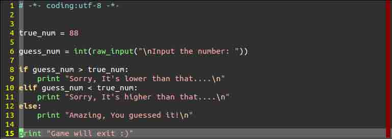
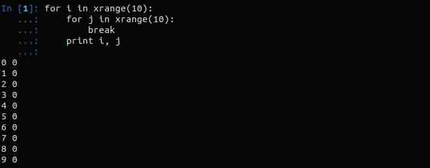

# 第 2 节 Python 流程控制

## 实验简介

本节介绍 Python 的流程控制 if 和 for，range 函数能够产生一个指定范围的列表，可以用 def 定义函数，其中有关键字参数、可变参数，lambda 可以创建匿名函数。

## 一、实验准备

### 1.实验说明

此实验介绍 Python 的流程控制及函数。

## 二、if 语句

### 1.if 为条件判断语句

我们用一个猜数的游戏来讲解 if 的用法：



**输出结果：**

```py
$ python guess.py

Input the number: 87
Sorry, It's higher than that....

Game will exit :)
$ python guess.py

Input the number: 89
Sorry, It's lower than that....

Game will exit :)
$ python guess.py

Input the number: 88
Amazing, You guessed it!

Game will exit :) 
```

**代码说明**

程序运行时，将会提示我们输入数字，然后根据数字来判断我们输入的数字(guess*num)是否和预定义的(true*num)是相等的。

使用`raw_input()`函数来获取用户的输入，由于这个函数的特性，它获取的所有的值都会被转化为一个字符串，但是我们需要的是一个整型的数字，所以使用`int()`函数，强制转换为整型，以便我们接下来的判断。

第 8 行开始到 13 行，我们将输入的猜测数与我们预定义的的数做比较。如果相等，我们打印一个成功的消息。

> 注意，我们使用了缩进层次来告诉 Python 每个语句分别属于哪一个块。这就是为什么缩进在 Python 如此重要的原因。我希望你能够坚持**每个缩进层一个制表符，或 2 个或 4 个空格**的规则。

注意 if 语句(包括了 elif，else)在结尾处包含一个**冒号** —— 我们通过它告诉 Python 下面跟着一个语句块。

然后，我们检验猜测是否小于我们的数，如果是这样的，我们告诉用户它的猜测大了一点。我们在这里使用的是 elif 从句，它事实上把两个相关联的`if else-if else`语句合并为一个 if-elif-else 语句。这使得程序更加简单，并且减少了所需的缩进数量。

> elif 和 else 从句都必须在逻辑行结尾处有一个冒号，下面跟着一个相应的语句块（当然还包括正确的缩进）。

> 你也可以在一个 if 块中使用另外一个 if 语句，等等——这被称为嵌套的 if 语句。

> 记住，elif 和 else 部分是可选的。一个最简单的有效 if 语句是：

```py
if True:
    print 'It is true' 
```

> 甚至，我们可以使用三元操作符：`condition1 if exp else condition2`，exp 为真执行 condition1，否则为 condition2，如

```py
print "I'm True" if True else "False" 
```

## 三、for 语句

### 1.for 语句用于循环迭代

定义一个列表：

```py
>>> a = ['cat', 'window', 'defenestrate'] 
```

循环打印列表内容及内容长度：

```py
>>> for x in a:
...     print x, len(x)
...
cat 3
window 6
defenestrate 12 
```

## 四、range()函数

### 1.使用 range()函数

```py
>>> range(10)
[0, 1, 2, 3, 4, 5, 6, 7, 8, 9] 
```

`range(10)` 生成了一个包含 10 个值的链表，它用链表的索引值填充了这个长度为 10 的列表，所生成的链表中不包括范围中的结束值。也可以让 range 操作从另一个数值开始，或者可以指定一个不同的步进值（甚至是负数，有时这也被称为“步长”）:

```py
>>> range(5, 10)
[5, 6, 7, 8, 9]
>>> range(0, 10, 3)
[0, 3, 6, 9]
>>> range(-10, -100, -30)
[-10, -40, -70] 
```

### 2.通过 range()和 len()迭代序列

```py
>>> a = ['Mary', 'had', 'a', 'little', 'lamb']
>>> for i in range(len(a)):
...     print i, a[i]
...
0 Mary
1 had
2 a
3 little
4 lamb 
```

## 五、跳出循环：break 和 continue

### 1.break 语句

break 语句用于跳出最近的一级 for 或 while 循环。

```py
>>> for i in range(5):
...    if i == 3:
...        break
...    print i
...
0
1
2
>>> 
```

> 一定要注意，这是很多新手会弄混的地方，break，只是跳出当前循环，不是跳出所有的循环（嵌套循环的情况下）

> 

> 如上图，当程序第一次执行的时候 i=0，**里面的** for 循环 j=0，这时遇到了 break，于是退出当前的这层循环(即这里的第二层循环)，回到外层循环，于是 i 从 0 变成了 1，又开始了第 2 次循环；里面的循环又开始了一次全新的循环 j=0，所以看结果，i 的值从 0 到 9，而 j 的值一直是 0。

> **xrange**，是 range 的另一种形式，对 xrange 的讨论已经超出了本课程的范围，所以可以认为 xrange 是一个优化版的 range，特别是当你需要循环一个特别大的序列的时候。

> [有兴趣了解一下 range 和 xrange 的区别？](http://ciniao.me/article.php?id=17)，记住如果有些东西实在没法理解，就跳过它，等到我们对 python 有更多了解的时候再回头重新浏览，也许就会豁然开朗了 :)

### 2.continue 语句

continue 语句是从 C 中借鉴来的，它表示跳过本次循环继续执行下一次迭代。

```py
>>> for i in range(5):
...    if i == 3:
...        continue
...    print i
...
0
1
2
4
>>> 
```

> 了解了 break 的原理，continue 就 easy 多了，当循环中遇到了 continue，在它之后的语句便不再执行，立马对当前循环进行下一次循环(或者是说迭代)。

## 六、pass 语句

### 1.pass 语句什么也不做

pass 语句用于那些语法上必须要有什么语句，但程序什么也不做的场合。

```py
>>> while True:
...     pass  # Busy-wait for keyboard interrupt (Ctrl+C)
...
>>> 
```

用于创建最小结构的类

```py
>>> class MyEmptyClass:
...     pass
...
>>> 
```

## 七、Python 中的函数

### 1.定义函数

关键字 def 引入了一个函数定义。在其后必须跟有函数名和包括形式参数的圆括号。函数体语句从下一行开始，必须是缩进的。

```py
>>> def fib(n):    # write Fibonacci series up to n
...     """Print a Fibonacci series up to n."""
...     a, b = 0, 1
...     while a < n:
...         print a,
...         a, b = b, a+b
...
>>> # Now call the function we just defined:
... fib(2000)
0 1 1 2 3 5 8 13 21 34 55 89 144 233 377 610 987 1597 
```

### 2.默认参数值

```py
def ask_ok(prompt, retries=4, complaint='Yes or no, please!'):
    while True:
        ok = raw_input(prompt)
        if ok in ('y', 'ye', 'yes'):
            return True
        if ok in ('n', 'no', 'nop', 'nope'):
            return False
        retries = retries - 1
        if retries < 0:
            raise IOError('refusenik user')
        print complaint 
```

这个函数可以通过几种不同的方式调用: 只给出必要的参数: `ask_ok('Do you really want to quit?')` 给出一个可选的参数: `ask_ok('OK to overwrite the file?', 2)` 或者给出所有的参数: `ask_ok('OK to overwrite the file?', 2, 'Come on, only yes or no!')`

```py
>>> i = 5
>>> def f(arg=i):
>>>     print arg
>>> i = 6
>>> f() 
```

输出：5 > 重要警告: 默认值只被赋值一次。这使得当默认值是可变对象时会有所不同，比如列表、字典或者大多数类的实例。

### 3.关键字参数

函数可以通过关键字参数的形式来调用，形如 keyword = value。

```py
def parrot(voltage, state='a stiff', action='voom', type='Norwegian Blue'):
    print "-- This parrot wouldn't", action,
    print "if you put", voltage, "volts through it."
    print "-- Lovely plumage, the", type
    print "-- It's", state, "!"
parrot(1000)                                          # 1 positional argument
parrot(voltage=1000)                                  # 1 keyword argument
parrot(voltage=1000000, action='VOOOOOM')             # 2 keyword arguments
parrot(action='VOOOOOM', voltage=1000000)             # 2 keyword arguments
parrot('a million', 'bereft of life', 'jump')         # 3 positional arguments
parrot('a thousand', state='pushing up the daisies')  # 1 positional, 1 keyword 
```

### 4.可变参数列表

一个最不常用的选择是可以让函数调用可变个数的参数。这些参数被包装进一个元组。在这些可变个数的参数之前，可以有零到多个普通的参数。

```py
>>> def test(tep, *args):
...        print args
...
>>> test(1, 2, 3, 4, 5)
(2, 3, 4, 5) 
```

### 5.参数列表的分拆

当你要传递的参数已经是一个列表，但要调用的函数却接受一个个分开的参数值. 这时候你要把已有的列表拆开来. 例如内建函数 range() 需要要独立的 start , stop 参数.你可以在调用函数时加一个`*`操作符来自动把参数列表拆开。

```py
>>> list(range(3, 6))            # normal call with separate arguments
[3, 4, 5]
>>> args = [3, 6]
>>> list(range(*args))            # call with arguments unpacked from a list
[3, 4, 5] 
```

以同样的方式，可以使用 `**` 操作符拆分字典:

```py
>>> def parrot(voltage, state='a stiff', action='voom'):
...     print "-- This parrot wouldn't", action,
...     print "if you put", voltage, "volts through it.",
...     print "E's", state, "!"
...
>>> d = {"voltage": "four million", "state": "bleedin' demised", "action": "VOOM"}
>>> parrot(**d)
-- This parrot wouldn't VOOM if you put four million volts through it. E's bleedin' demised ! 
```

### 6.Lambda 形式

通过 lambda 关键字，可以创建短小的匿名函数。

```py
>>> def make_incrementor(n):
...     return lambda x: x + n
...
>>> f = make_incrementor(42)
>>> f(0)
42
>>> f(1)
43 
```


[lambda 表达式多用是什么](http://www.iplaypython.com/wenda/lambda.html)

### 7.文档字符串

第一行应该是关于对象用途的简介。简短起见，不用明确的陈述对象名或类型，因为它们可以从别的途径了解到（除非这个名字碰巧就是描述这个函数操作的动词）。这一行应该以大写字母开头，以句号结尾。 如果文档字符串有多行，第二行应该空出来，与接下来的详细描述明确分隔。接下来的文档应该有一或多段描述对象的调用约定、边界效应等。

Python 的解释器不会从多行的文档字符串中去除缩进，所以必要的时候应当自己清除缩进。这符合通常的习惯。第一行之后的第一个非空行决定了整个文档的缩进格式。（我们不用第一行是因为它通常紧靠着起始的引号，缩进格式显示的不清楚。）留白“相当于”是字符串的起始缩进。每一行都不应该有缩进，如果有缩进的话，所有的留白都应该清除掉。留白的长度应当等于扩展制表符的宽度（通常是 8 个空格）。

```py
>>> def my_function():
...     """Do nothing, but document it.
...
...     No, really, it doesn't do anything.
...     """
...     pass
...
>>> print my_function.__doc__
Do nothing, but document it.

        No, really, it doesn't do anything. 
```

## 作业

请定义一个函数，实现输入 n，输出 0-n 之间的所有素数。