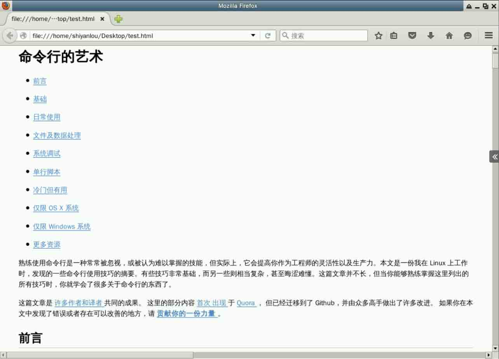
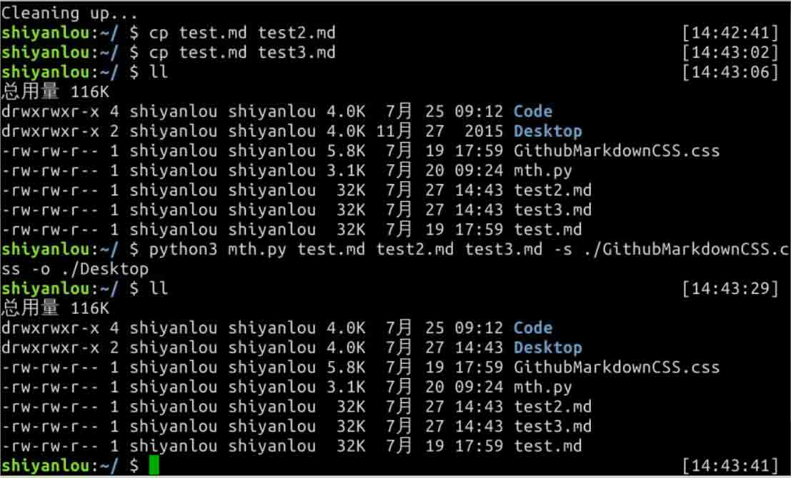

# 第 1 节 使用 Python 3 编写系列实用脚本

# Markdown to HTML

## 一、实验简介

这个课程教授如何使用 Python 3 编写一个转换 markdown 为 HTML 的脚本文件，这个脚本能够进行批量处理操作，可以自定义 HTML 的 CSS 样式（默认没有样式），可以自定义输出目录（默认为 markdown 文件所在目录）

### 1.1\. 知识点

*   Python 3 的模块的安装
*   Python 3 基础知识
*   使用 [os](https://docs.python.org/3/library/os.html) 模块进行路径相关的操作
*   [markdown](http://pythonhosted.org/Markdown/reference.html) 模块的使用
*   使用 [BeautifulSoup](https://www.crummy.com/software/BeautifulSoup/bs4/doc.zh/) 模块格式化 HTML
*   命令行选项的实现

### 1.2\. 效果展示



## 二、实验步骤

### 2.1\. 安装包

首先更新一下软件源

```py
$ sudo apt-get update 
```

安装 `pip3`，`pip` 是 Python2 的软件包管理系统，使用它来安装 Python2 的模块非常简便，而 `pip3` 则是对应于 Python3 的版本

```py
$ sudo apt-get install python3-pip 
```

安装 `markdown`，本实验使用这个模块编译 Markdown 文件

```py
$ sudo pip3 install markdown 
```

安装 `BeautifulSoup`，本实验使用 BeautifulSoup 仅是为了格式化 HTML 代码为可读性更强的代码，不需要可以不安装

```py
$ sudo pip3 install beautifulsoup4 
```

### 2.2\. 编写 MarkdownToHtml 类

类名定义为 MarkdownToHtml 吧

```py
class MarkdownToHtml: 
```

我们的类有 4 个属性，3 个方法属性，1 个数据属性

因为 markdown 模块生成的 HTML 代码是不包括 `head` 标签的，这样会可能造成浏览器中渲染 HTML 时显示乱码，而且我们有时可能也需要添加 CSS 来美化网页

所以我们需要一个数据属性存放生成 HTML 代码时用到的 `head` 标签以及准备存放可能用到的 `style` 标签

```py
headTag = '<head><meta charset="utf-8" /></head>' 
```

构造方法，有一个参数 `cssFilePath` ，默认值为 `None`

```py
def __init__(self,cssFilePath = None):
    if cssFilePath != None:
        self.genStyle(cssFilePath) 
```

方法 `genStyle()` 读取外部 CSS 文件的内容并存放到 `headTag` 变量中

关于文件读写操作，最常见的是这样的操作：

```py
f = open(cssFilePath,'r')
cssString = f.read()
f.close() 
```

然而更推荐使用关键字 `with` 处理文件对象，它的先进之处在于文件用完后会自动关闭，就算发生异常也没关系。它是 `try` `finally` 块的简写

```py
with open(cssFilePath,'r') as f:
    cssString = f.read() 
```

因此，方法 `genStyle()` 的代码如下

```py
def genStyle(self,cssFilePath):
    with open(cssFilePath,'r') as f:
        cssString = f.read()
    self.headTag = self.headTag[:-7] + '<style type="text/css">{}</style>'.format(cssString) + self.headTag[-7:] 
```

接下来是方法 `markdownToHtml()` ，作用是编译 Markdown 输出 HTML

有 3 个参数，分别是 Markdown 源码路径，输出文件目录（可选），输出文件名称（可选）

```py
def markdownToHtml(self, sourceFilePath, destinationDirectory = None, outputFileName = None): 
```

若是方法调用时没指定输出目录和输出文件名，那么我们将默认使用源文件目录和源文件名

```py
if not destinationDirectory:
    # 未定义输出目录则将源文件目录(注意要转换为绝对路径)作为输出目录
    destinationDirectory = os.path.dirname(os.path.abspath(sourceFilePath))
if not outputFileName:
    # 未定义输出文件名则沿用输入文件名
    outputFileName = os.path.splitext(os.path.basename(sourceFilePath))[0] + '.html' 
```

`os.path.abspath()` 将参数路径转为绝对路径并返回

`os.path.dirname()` 获得参数路径的目录部分并返回（如 `"\home\a.txt"` 为参数，返回 `"\home"`）

`os.path.basename()` 返回参数路径字符串中的完整文件名（文件名+后缀名）

`os.path.splitext()` 将参数转换为包含文件名和后缀名两个元素的元组并返回

关于 os 模块更多详情，参见[官方文档](https://docs.python.org/3/library/os.html)

还有一个问题，输出文件的路径我们通过拼接 `destinationDirectory`，`outputFileName` 这两个变量中的字符串得到，若是变量 `destinationDirectory` 中的字符串并不以 `'/'` 字符结尾，那么输出文件的路径会是错误的，所以需要处理一下：

```py
if destinationDirectory[-1] != '/':
    destinationDirectory += '/' 
```

然后读取源文件

文件打开函数 `open()` 有一个参数是 `encoding` ，若是不指定它，那么将会默认使用平台的编码，而在 Windows 命令行里默认是 GBK 编码的，对于使用 UTF-8 编码格式的 Mardown 文件将会出错，因此为了在任意平台保证脚本正确，无论是读取 Markdown 还是之后的写入 HTML 文件都需要传入这个参数 `encoding='utf8'`

```py
with open(sourceFilePath,'r', encoding='utf8') as f:
    markdownText = f.read() 
```

之后使用 `markdown.markdown()` 这个函数编译 `markdownText` 变量中的 Markdown 字符串

`markdown.markdown()` 有一个位置参数和若干可选参数，除了 markdown 字符串，我们还要用到参数 `output_format` 来设定输出 HTML 的版本

另外，前面说过 markdown 模块生成的 HTML 代码是不包括 `head` 标签的，需要加上它

```py
rawHtml = self.headTag + markdown.markdown(markdownText,output_format='html5') 
```

把变量 `rawHtml` 中的 HTML 的字符串写入文件

```py
with open(destinationDirectory + outputFileName, 'w', encoding='utf8') as f:
        f.write(rawHtml) 
```

有一个可选的步骤是，把上面一段代码改成下面这段，因为 markdown 模块生成的 HTML 代码可阅读性很差，可以把 `rawHtml` 中的 HTML 代码用 `BeautifulSoup` 模块格式化为可读性更强的代码

```py
beautifyHtml = BeautifulSoup(rawHtml,'html5lib').prettify()
with open(destinationDirectory + outputFileName, 'w', encoding='utf8') as f:
    f.write(beautifyHtml) 
```

至此，方法 `markdownToHtml()` 编写完成，类 `MarkdownToHtml` 编写完成

### 2.3\. 完成脚本

上一小节完成了 MarkdownToHtml 类，这一节将完成其它部分

需要在脚本文件开头导入模块，建议把自带模块放在第三方模块前面

```py
import sys
import os

# 不使用 BeautifulSoup 模块可不导入
from bs4 import BeautifulSoup
import markdown 
```

脚本文件支持 3 种命令行参数，分别是一个到多个 Markdown 文件路径，选项 `-s` 和选项 `-o`，

选项 `-s` 是 CSS 文件路径，选项 `-o` 是输出目录

剩下的代码所做的工作是这样的：根据命令行参数来使用类 `MarkdownToHtml` 的实例编译一个到多个 Markdown 源文件

本实验的剩余代码除了用到了下面两个函数，只是运用 Python 的基本语法来处理一些逻辑，这里不会细讲（给出的代码有较为详细的注释），各位同学可以自己先尝试来编写这一部分代码

`os.path.isfile()` 检测参数是否为文件路径，是返回 `True`，否则返回 `False`

`os.path.isdir()` 检测参数是否为目录，是返回 `True`，否则返回 `False`

本实验剩余的所有代码如下：

```py
if __name__ == "__main__":
    mth = MarkdownToHtml()
    # 做一个命令行参数列表的浅拷贝，不包含脚本文件名
    argv = sys.argv[1:]
    # 目前列表 argv 可能包含源文件路径之外的元素（即选项信息）
    # 程序最后遍历列表 argv 进行编译 markdown 时，列表中的元素必须全部是源文件路径
    outputDirectory = None
    if '-s' in argv:
        cssArgIndex = argv.index('-s') +1
        cssFilePath = argv[cssArgIndex]
        # 检测样式表文件路径是否有效
        if not os.path.isfile(cssFilePath):
            print('Invalid Path: '+cssFilePath)
            sys.exit()
        mth.genStyle(cssFilePath)
        # pop 顺序不能随意变化
        argv.pop(cssArgIndex)
        argv.pop(cssArgIndex-1)
    if '-o' in argv:
        dirArgIndex = argv.index('-o') +1
        outputDirectory = argv[dirArgIndex]
        # 检测输出目录是否有效
        if not os.path.isdir(outputDirectory):
            print('Invalid Directory: ' + outputDirectory)
            sys.exit()
        # pop 顺序不能随意变化
        argv.pop(dirArgIndex)
        argv.pop(dirArgIndex-1)
    # 至此，列表 argv 中的元素均是源文件路径
    # 遍历所有源文件路径
    for filePath in argv:
        # 判断文件路径是否有效
        if os.path.isfile(filePath):
            mth.markdownToHtml(filePath, outputDirectory)
        else:
            print('Invalid Path: ' + filePath) 
```

可能有同学有疑问，`if __name__ == "__main__":` 有何作用，它的作用在于保证这个 `if` 块内的代码不会在脚本文件作为模块导入的时候被执行

另外，使用 [argparse](https://docs.python.org/3/library/argparse.html) 模块处理命令行参数更容易也更用户友好，在之后的课程将会使用到这个模块

### 2.4\. 测试脚本

使用 `wget` 把这个测试用 markdown 文件下载下来

```py
$ wget http://labfile.oss.aliyuncs.com/courses/580/test.md 
```

以及 CSS 文件

```py
$ wget http://labfile.oss.aliyuncs.com/courses/580/GithubMarkdownCSS.css 
```

把 markdown 文件复制多份

假设你的脚本名字为 mth.py；markdown 文件有 test.md，test2.md，test3.md；且当前目录有 `Desktop` 这个子目录。那么可以运行下面的命令来测试你的脚本文件，注意是 `python3` 而不是`python`

```py
$ python3 mth.py test.md test2.md test3.md -s ./GithubMarkdownCSS.css -o ./Desktop 
```



你可以用浏览器打开生成的 HTML 文件查看效果

## 三、实验总结

本实验完成后，知道了如何安装 Python3 的模块，这与 Python2 有很大的不同，明白怎样操作文件更安全，了解了如何使用 markdown 模块来编译 markdown 输出 HTML ，熟悉了使用 os 模块进行路径相关的操作，以及模仿系统命令实现了程序命令行选项

## 四、完整代码

可以在实验环境中用如下命令下载下来

```py
$ wget http://labfile.oss.aliyuncs.com/courses/580/mth.py 
```

代码：

```py
import sys
import os

from bs4 import BeautifulSoup
import markdown

class MarkdownToHtml:

    headTag = '<head><meta charset="utf-8" /></head>'

    def __init__(self,cssFilePath = None):
        if cssFilePath != None:
            self.genStyle(cssFilePath)

    def genStyle(self,cssFilePath):
        with open(cssFilePath,'r') as f:
            cssString = f.read()
        self.headTag = self.headTag[:-7] + '<style type="text/css">{}</style>'.format(cssString) + self.headTag[-7:]

    def markdownToHtml(self, sourceFilePath, destinationDirectory = None, outputFileName = None):
        if not destinationDirectory:
            # 未定义输出目录则将源文件目录(注意要转换为绝对路径)作为输出目录
            destinationDirectory = os.path.dirname(os.path.abspath(sourceFilePath))
        if not outputFileName:
            # 未定义输出文件名则沿用输入文件名
            outputFileName = os.path.splitext(os.path.basename(sourceFilePath))[0] + '.html'
        if destinationDirectory[-1] != '/':
            destinationDirectory += '/'
        with open(sourceFilePath,'r', encoding='utf8') as f:
            markdownText = f.read()
        # 编译出原始 HTML 文本
        rawHtml = self.headTag + markdown.markdown(markdownText,output_format='html5')
        # 格式化 HTML 文本为可读性更强的格式
        beautifyHtml = BeautifulSoup(rawHtml,'html5lib').prettify()
        with open(destinationDirectory + outputFileName, 'w', encoding='utf8') as f:
            f.write(beautifyHtml)

if __name__ == "__main__":
    mth = MarkdownToHtml()
    # 做一个命令行参数列表的浅拷贝，不包含脚本文件名
    argv = sys.argv[1:]
    # 目前列表 argv 可能包含源文件路径之外的元素（即选项信息）
    # 程序最后遍历列表 argv 进行编译 markdown 时，列表中的元素必须全部是源文件路径
    outputDirectory = None
    if '-s' in argv:
        cssArgIndex = argv.index('-s') +1
        cssFilePath = argv[cssArgIndex]
        # 检测样式表文件路径是否有效
        if not os.path.isfile(cssFilePath):
            print('Invalid Path: '+cssFilePath)
            sys.exit()
        mth.genStyle(cssFilePath)
        # pop 顺序不能随意变化
        argv.pop(cssArgIndex)
        argv.pop(cssArgIndex-1)
    if '-o' in argv:
        dirArgIndex = argv.index('-o') +1
        outputDirectory = argv[dirArgIndex]
        # 检测输出目录是否有效
        if not os.path.isdir(outputDirectory):
            print('Invalid Directory: ' + outputDirectory)
            sys.exit()
        # pop 顺序不能随意变化
        argv.pop(dirArgIndex)
        argv.pop(dirArgIndex-1)
    # 至此，列表 argv 中的元素均是源文件路径
    # 遍历所有源文件路径
    for filePath in argv:
        # 判断文件路径是否有效
        if os.path.isfile(filePath):
            mth.markdownToHtml(filePath, outputDirectory)
        else:
            print('Invalid Path: ' + filePath) 
```

## 五、参考资料

*   [Python 3 官方文档](https://docs.python.org/3/)
*   [markdown 模块文档](http://pythonhosted.org/Markdown/reference.html)
*   [BeautifulSoup 模块文档](https://www.crummy.com/software/BeautifulSoup/bs4/doc.zh/)