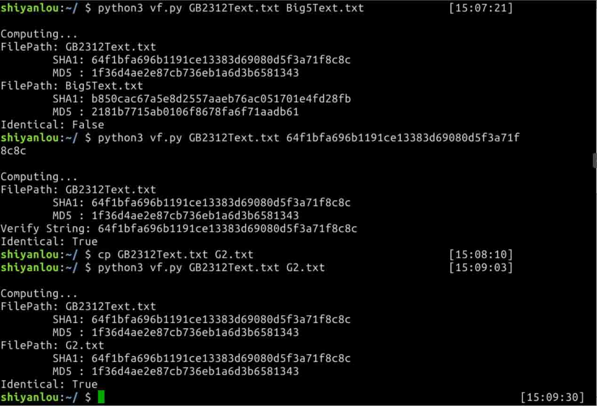

# 第 3 节 使用 Python 3 编写系列实用脚本

# 文件校验

## 一、实验简介

本实验将会编写一个文件校验工具，它利用 md5 和 sha1 摘要算法来比较文件，并且这个文件校验工具能完成文件与文件、文件与摘要字符串、摘要字符串与摘要字符串的比较

### 1.1\. 知识点

*   Python 3 基础知识
*   [hashlib](https://docs.python.org/3/library/hashlib.html) 模块的使用

### 1.2\. 效果展示



## 二、实验步骤

进行下面的步骤前，首先导入需要的模块

```py
import os
import hashlib 
```

### 2.1\. 计算文件摘要字符串

我们仅使用两个常见的摘要算法： md5 和 sha1

sha1 计算函数如下

```py
def calcSHA1(filepath):
    with open(filepath,'rb') as f:
        sha1obj = hashlib.sha1()
        sha1obj.update(f.read())
        return sha1obj.hexdigest() 
```

md5 计算函数如下

```py
def calcMD5(filepath):
    with open(filepath,'rb') as f:
        md5obj = hashlib.md5()
        md5obj.update(f.read())
        return md5obj.hexdigest() 
```

### 2.2\. 包含摘要信息的文件类

类有两个数据属性，`sha1` `md5` ，分别存储各自的摘要字符串，有两个函数，分别用于与目标文件比较，与目标摘要字符串比较

类的设计如下

```py
class VFile():
    sha1=None
    md5=None

    def __init__(self,sourceFilePath):
        self.sourceFilePath = sourceFilePath
        self.sha1 = calcSHA1(self.sourceFilePath)
        self.md5 = calcMD5(self.sourceFilePath)

    def compareVerifystrings(self,targetVerifystring,algorithm='sha1'):
        if algorithm == 'sha1':
            return self.sha1 == targetVerifystring.lower()
        elif algorithm == 'md5':
            return self.md5 == targetVerifystring.lower()

    def compareFiles(self,targetFilePath,algorithm='sha1'):
        targetFile = VFile(targetFilePath)
        if algorithm == 'sha1':
            return targetFile.sha1 == self.sha1
        elif algorithm == 'md5':
            return targetFile.md5 == self.md5 
```

### 2.3\. 设计比较函数

比较函数要能够智能比较文件与摘要字符串的任意组合，所以有较多的 `if else` 语句嵌套。还要将文件相关信息与比较结果打印出来

函数设计如下

```py
def smartComparison(source,target):
    if os.path.isfile(source):
        sf = VFile(source)
        print('FilePath:', source)
        print('\tSHA1:', sf.sha1)
        print('\tMD5 :', sf.md5)
        if os.path.isfile(target):
            tf = VFile(target)
            print('FilePath:', target)
            print('\tSHA1:', tf.sha1)
            print('\tMD5 :', tf.md5)
            print('Identical:', str(sf.sha1 == tf.sha1))
        else:
            target = target.lower()
            print('Verify String:', target)
            # 判断校验算法种类
            if len(target)==40:
                print('Identical:', str(sf.sha1 == target))
            else:
                print('Identical:', str(sf.md5 == target))
    else:
        source = source.lower()
        print('Verify String:', source)
        if os.path.isfile(target):
            tf = VFile(target)
            print('FilePath:', target)
            print('\tSHA1:', tf.sha1)
            print('\tMD5 :', tf.md5)
            if len(source)==40:
                print('Identical:', str(tf.sha1 == source))
            else:
                print('Identical:', str(tf.md5 == source))
        else:
            target = target.lower()
            print('Verify String:', target)
            print('Identical:', str(source == target)) 
```

### 2.4\. 文件比较

这部分代码只在源代码文件作为脚本时运行

如果用户输入两个参数，那么比较它们

输入一个参数，打印这个文件的摘要信息

```py
if __name__ == "__main__":
    import sys
    if len(sys.argv)==3:
        print()
        print('Computing...')
        smartComparison(sys.argv[1],sys.argv[2])
    elif len(sys.argv)==2 and os.path.isfile(sys.argv[1]):
        print()
        print('Computing...')
        vf = VFile(sys.argv[1])
        print('FilePath:', sys.argv[1])
        print('\tSHA1:', vf.sha1)
        print('\tMD5 :', vf.md5) 
```

### 2.5\. 测试脚本

使用 `wget` 把这两个测试用文本文件下载下来（是上一个实验的文件，下载过可以不用下了）

```py
$ wget http://labfile.oss.aliyuncs.com/courses/580/GB2312Text.txt
$ wget http://labfile.oss.aliyuncs.com/courses/580/Big5Text.txt 
```

假设你的脚本名字为 vf.py，运行下面的命令执行脚本，注意是 `python3` 而不是`python`

```py
$ python3 vf.py GB2312Text.txt Big5Text.txt
$ python3 vf.py GB2312Text.txt 
```

可以复制一个文件，然后比较这两个文件

也可以尝试比较文件与摘要字符串，你可以自己多尝试各种组合

## 三、实验总结

本次实验使用了 hashlib 这个模块，了解了如何对文件进行摘要计算

## 四、完整代码

可以在实验环境中用如下命令下载下来

```py
$ wget http://labfile.oss.aliyuncs.com/courses/580/VerifyFile.py 
```

代码：

```py
import os
import hashlib

def calcSHA1(filepath):
    with open(filepath,'rb') as f:
        sha1obj = hashlib.sha1()
        sha1obj.update(f.read())
        return sha1obj.hexdigest()

def calcMD5(filepath):
    with open(filepath,'rb') as f:
        md5obj = hashlib.md5()
        md5obj.update(f.read())
        return md5obj.hexdigest()

class VFile():
    sha1=None
    md5=None

    def __init__(self,sourceFilePath):
        self.sourceFilePath = sourceFilePath
        self.sha1 = calcSHA1(self.sourceFilePath)
        self.md5 = calcMD5(self.sourceFilePath)

    def compareVerifystrings(self,targetVerifystring,algorithm='sha1'):
        if algorithm == 'sha1':
            return self.sha1 == targetVerifystring.lower()
        elif algorithm == 'md5':
            return self.md5 == targetVerifystring.lower()

    def compareFiles(self,targetFilePath,algorithm='sha1'):
        targetFile = VFile(targetFilePath)
        if algorithm == 'sha1':
            return targetFile.sha1 == self.sha1
        elif algorithm == 'md5':
            return targetFile.md5 == self.md5

def smartComparison(source,target):
    if os.path.isfile(source):
        sf = VFile(source)
        print('FilePath:', source)
        print('\tSHA1:', sf.sha1)
        print('\tMD5 :', sf.md5)
        if os.path.isfile(target):
            tf = VFile(target)
            print('FilePath:', target)
            print('\tSHA1:', tf.sha1)
            print('\tMD5 :', tf.md5)
            print('Identical:', str(sf.sha1 == tf.sha1))
        else:
            target = target.lower()
            print('Verify String:', target)
            # 判断校验算法种类
            if len(target)==40:
                print('Identical:', str(sf.sha1 == target))
            else:
                print('Identical:', str(sf.md5 == target))
    else:
        source = source.lower()
        print('Verify String:', source)
        if os.path.isfile(target):
            tf = VFile(target)
            print('FilePath:', target)
            print('\tSHA1:', tf.sha1)
            print('\tMD5 :', tf.md5)
            if len(source)==40:
                print('Identical:', str(tf.sha1 == source))
            else:
                print('Identical:', str(tf.md5 == source))
        else:
            target = target.lower()
            print('Verify String:', target)
            print('Identical:', str(source == target))

if __name__ == "__main__":
    import sys
    if len(sys.argv)==3:
        print()
        print('Computing...')
        smartComparison(sys.argv[1],sys.argv[2])
    elif len(sys.argv)==2 and os.path.isfile(sys.argv[1]):
        print()
        print('Computing...')
        vf = VFile(sys.argv[1])
        print('FilePath:', sys.argv[1])
        print('\tSHA1:', vf.sha1)
        print('\tMD5 :', vf.md5) 
```