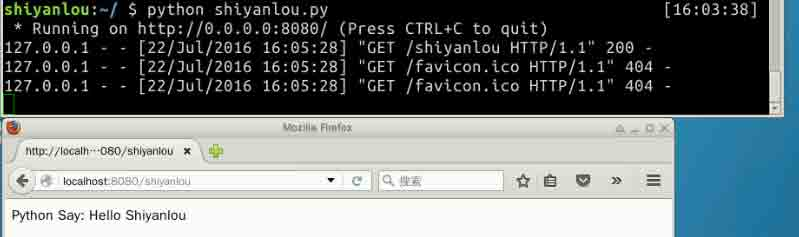
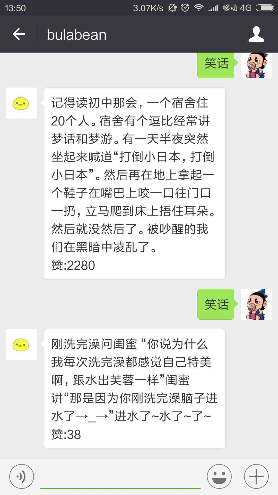

# 基于 Flask 及爬虫实现微信娱乐机器人

本次课程是基于 Flask Web 框架开发的娱乐级别的微信公众号后台，学习并实践 python 编程，Flask Web 开发以及微信公众平台开发机器人的基本步骤。

## 一、课程介绍

### 1.1 课程简介

本次课程是基于 `Flask` 开发的微信公众号后台，提供机器人聊天功能，涉及到微信的公众平台开发知识。学习本课程的童鞋们，需要去申请一个微信的公众平台，最好是在能有自己的微信公众平台和 80 端口正常的 IP 地址情况下进行，可以即时看到演示效果。

实验目标包括以下三个方面：

*   首先，肯定是正常运行，微信接口正常接入我们的服务器。
*   其次，当用户发送文字，我们可以倒序送回。
*   再者，只逆序回话，略显单调，额外添加一个讲笑话的功能，笑话内容通过爬虫获取。

### 1.2 开发工具

实验楼提供的环境中只提供了 `vim` 及 `gedit` 编写 Python 代码，如有需要可以选择其他的编辑工具。

```py
vim / gedit：自带编辑器，无需安装

IDLE：python 的编译器，推荐新手使用
实验楼中安装方法：sudo apt-get install idle

sublime：需要学习学习
安装方法：只能自己下载安装包安装 
```

### 1.3 知识点

本实验课程将学习并实践以下知识点：

*   微信公众平台参数配置
*   Python 的编程基础
*   Flask 的基本知识（看懂官网的几个小例子）
*   Http 的基本知识（GET 和 POST 请求，80 端口）
*   Web 服务网络知识

### 1.4 实验效果图

本项目完成后，可以实现下面的机器人对话效果，自动用在网络上爬取的笑话内容回复用户的 `笑话` 文本。

在实验楼中的运行效果：



机器人对话效果图：



### 1.5 实验注意事项

介于微信公众平台的后台配置，服务器地址只能是 80 端口或者 443 端口，必须以 `http://` 或 `https://` 开头，分别对应 80 端口和 443 端口。

最理想的方法是去云服务买个云主机，搭建一个自己的服务器，如果仅仅是为了学习，可以在本地主机或实验楼的环境中使用 `ngrok` 进行内网穿透，将内部主机通过一个域名作为服务器提供出去。

## 二、ngrok 内网穿透配置

**注意：如果你有自己的独立服务器，可以忽略本节内容。**

`ngrok` 官网地址如下：

*   [地址链接](http://www.ngrok.cc/)

`ngrok` 简介内容：

> 由于开发 Web 项目，经常需要将本地部署的网站让外网能直接访问到，最便捷的做法当然是在 ADSL 路由器上直接做端口映射，很不幸大部分运营商都屏蔽了 80 等常用端口，曾经的做法是在公网一台 VPS 上架设 OpenVPN，将笔记本和 VPS 连到一个虚拟局域网，再用 iptables 做端口转发来达到目的，虽然可行，但速度比较慢，由于线路不稳定造成掉线几率较高。偶然发现还有个叫 ngrok 的神器专门做了这件事，不但提供了一个在外网能够安全的访问内网 Web 主机，还能捕获所有请求的 http 内容，方便调试，甚至还支持 tcp 层端口映射，不局限于某一特定的服务。支持 Mac OS X，Linux，Windows 平台。

国内使用 `ngrok`，最好使用国内的服务器，推荐一个 [ngrok-sunny](http://www.ngrok.cc/index.php/Member/index.html)，下面介介绍下 `ngrok` 基本配置的步骤：

*   注册账号，得到 ngrok 的 Token
*   下载你需要的 Ngrok 版本，解压
*   修改 ngrok.cfg 配置文件，修改 token 参数，其余的基本可以不动
*   运行适合自己平台的执行命令
*   随机就会显示登陆成功，否则显示失败

`ngrok` 配置截图：


配置完成，运行成功之后的输出内容：

```py
Tunnel Status                 online
Version                       1.6/1.5
Forwarding                    http://steven-mbp.ngrok.com -> 127.0.0.1:8080
Forwarding                    https://steven-mbp.ngrok.com -> 127.0.0.1:8080
Web Interface                 127.0.0.1:4040
# Conn                        16
Avg Conn Time                 558ms 
```

这里显示映射到本机的 8080 端口，所以我们的程序也需要监听 8080 端口。

## 三、微信公众号配置

微信公众号申请后，需要进行如下图所示的配置：


其中每一项的详细介绍：

*   URL 是服务器地址，我的服务器 IP 是 `120.27.51.6`，URL 匹配是 `/wechat`，头部需要加入 `http://`
*   Token 是自己填写，传输过程不传输 Token，需要自己在代码中写入
*   EncodingAESKey 也已自己填，也可以点随机输入
*   加密方式：建议明文或者兼容模式
*   配置完成过后，点击提交。

提交后可能的情况处理：

*   提示提交成功则一切正常。
*   提示 URL 请求超时，可能是网络好的暂时没通，或者是网络没有配置好。
*   提示 Token 错误，则是网络通过但是程序中的 Token 和服务器中配置的 Token 不一致，请调试程序。

注意 URL 需要设置成你自己的服务器地址或 `ngrok` 的地址。

## 四、微信公众平台的配置请求

微信公众平台的接入第一步是输入服务器地址，先跳过，从第二步开始，请按照 [微信公众平台开发者文档](http://mp.weixin.qq.com/wiki) 的接入指南进行操作。

其中需要特殊注意加密/校验流程，如下：

1.  将 token、timestamp、nonce 三个参数进行**字典序**排序
2.  将三个参数字符串拼接成一个字符串进行 sha1 加密
3.  开发者获得加密后的字符串可与 signature 对比，标识该请求来源于微信

微信的校验过程，是 GET 请求，所以三个参数都在 URL 中就能获取到，（另外 token 是在微信公众平台的配置页面自己配置的），校验流程的代码如下：

```py
 if request.method == 'GET':
        data = request.args
        token = 'YourToken'
        signature = data.get('signature','')
        timestamp = data.get('timestamp','')
        nonce = data.get('nonce','')
        echostr = data.get('echostr','')
        s = [timestamp,nonce,token]
        s.sort()
        s = ''.join(s)
        if (hashlib.sha1(s).hexdigest() == signature):
            return make_response(echostr) 
```

解释下代码内容：

*   token 是微信公众平台后台自己手动配置的，传参是不会传过来，需要自己定义这个变量。
*   signature、nonce、echostr、timestamp 是请求带过来的参数。

代码比较简单，在微信开放平台后台参数配置页面，配置完成点提交，可能会出现请求 URL 延时，多试几次，并确认 Token 正确以及 80 或 443 端口没有被屏蔽。

## 五、可运行代码

附上本节可运行代码 `wechat.py` ：

```py
#coding:utf-8

from flask import Flask, request, make_response

app = Flask(__name__)

@app.route('/',methods=['GET','POST'])
def wechat_auth():
    if request.method == 'GET':
        print 'coming Get'
        data = request.args
        token = '***************'
        signature = data.get('signature','')
        timestamp = data.get('timestamp','')
        nonce = data.get('nonce','')
        echostr = data.get('echostr','')
        s = [timestamp,nonce,token]
        s.sort()
        s = ''.join(s)
        if (hashlib.sha1(s).hexdigest() == signature):
            return make_response(echostr)
if __name__ == "__main__":
    app.run(host='0.0.0.0', port=8080) 
```

代码执行方式可以在实验楼桌面上打开 XFce，执行下面的程序：

```py
python wechat.py 
```

微信后台对服务器的请求信息：

```py
[pid: 841|app: 0|req: 200/408] 140.207.54.78 () {36 vars in 810 bytes} [Thu Jul 21 13:46:32 2016] POST /?signature=97f0da25d3a052704bc46bc075fa529e24db794f&timestamp=1469079992&nonce=337988175&openid=**********************&encrypt_type=aes&msg_signature=c1732ba90e1e47b0b70dc593b772c7bc309ff7f4 => generated 290 bytes in 6 msecs (HTTP/1.1 200) 2 headers in 80 bytes (1 switches on core 0) 
```

## 六、总结

这节主要介绍代码的运行以及对微信公众平台后台的对接，程序调通后，我们可以进入到下一个环节，自动逆序回复。