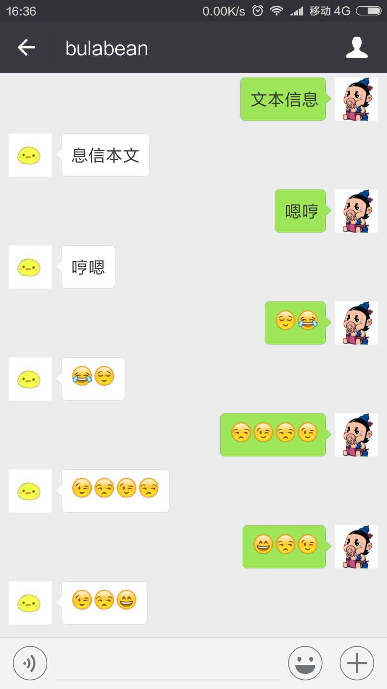
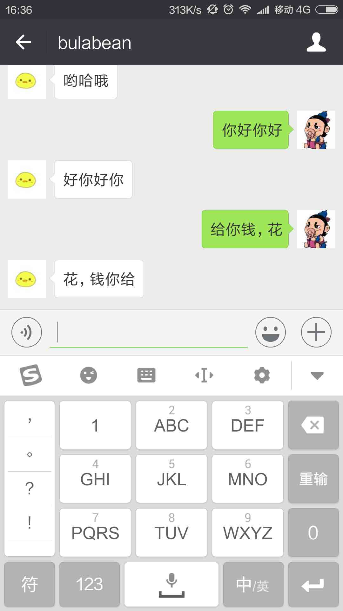

# 第 2 节 支持逆序自动回复

## 一、实验介绍

这小节的主要内容，是得到微信服务器传过来的文本消息，然后逆序回给微信服务器。

根据这个需求，你可以思考下有什么好的方法？

## 二、Python 实现倒序输出

最简单的实现思路是使用 for 循环，申请同等大小的字符串，逆序赋值然后返回给服务器，但使用 Python 最方便的一点就是可以使用字符串的切片来实现逆序。

首先来复习下 Python 列表切片知识，打开 Xfce 终端，输入 `python` 启动进入命令行：

```py
>>> s = 'shiyanlou'
>>> s[1:3] #这里呢，是左闭右开，是角标大于等于 1 并且小于 3，就是 1,2 咯，所以是'hi'
'hi'
>>> s[0:7:1] #这里呢，等于 s[0:7]，因为递增的值 1 是默认的，你也可以改
'shiyanl'
>>> s[0:7:2] #递增 2，看下结果，对上了吧
'sial'
>>> s[-9:-3] #其实 s 是不仅仅是'shiyanlou'，更是'shiyanloushiyanlou'，中间的 s 角标是 0，而 0 前面的就是负数了
'shiyan'
>>> s[9:0:-1] #少了个 s，不太好，因为右开，下标为 0 是不输出的
'uolnayih'
>>> s[::-1] #这样就可以了，不填，默认全部咯，ok，完成了
'uolnayihs' 
```

## 三、微信接收和回复文本信息

### 3.1 接收文本

本节主要参考的文档是 [微信公众平台开发者文档](https://mp.weixin.qq.com/wiki?t=resource/res_main&id=mp1421140453&token=&lang=zh_CN)。

微信公众平台发过来的 XML 消息如下：

```py
# 这是微信公众平台发过来的 xml 格式的信息
<xml>
 <ToUserName><![CDATA[toUser]]></ToUserName>
 <FromUserName><![CDATA[fromUser]]></FromUserName>
 <CreateTime>1348831860</CreateTime>
 <MsgType><![CDATA[text]]></MsgType>
 <Content><![CDATA[this is a test]]></Content>
 <MsgId>1234567890123456</MsgId>
 </xml> 
```

其中每个字段的描述：

```py
|参数    |描述|备注信息|
| ------------ |:-------------:|
|ToUserName|    开发者微信号|在上一节，我用*注释掉的那个，就是了|
|FromUserName|    发送方帐号（一个 OpenID）|这个是微信后台临时的，如果用户取消关注，那就没了，下次关注时又不一样
|CreateTime|    消息创建时间 （整型）| 就像是签合同时的时间戳|
|MsgType|    text|信息类型，text 类|
|Content|    文本消息内容|信息的具体内容|
|MsgId|    消息 id，64 位整型|这个用处也不大|
```

Python 分析 XML 格式的信息，可以在 Python 中引入：

```py
import xml.etree.ElementTree as ET 
```

从 XML 消息中读取 `Content` 的内容，然后倒序，就可以发回了。

下面我们看下如何按照规定的格式回复文本信息。

### 3.2 回复文本

本节参考的文档：[微信公众平台开发者文档](https://mp.weixin.qq.com/wiki?t=resource/res_main&id=mp1421140543&token=&lang=zh_CN)。

回复的文本内容如下：

```py
<xml>
<ToUserName><![CDATA[toUser]]></ToUserName>
<FromUserName><![CDATA[fromUser]]></FromUserName>
<CreateTime>12345678</CreateTime>
<MsgType><![CDATA[text]]></MsgType>
<Content><![CDATA[你好]]></Content>
</xml> 
```

其中每一项字段的介绍：

```py
|参数    |是否必须   |描述|
|-------|--|--|
|ToUserName|    是   |接收方帐号（收到的 OpenID）|
|FromUserName|    是|  开发者微信号|
|CreateTime|    是|  消息创建时间 （整型）|
|MsgType|    是|  text|
|Content|    是|  回复的消息内容（换行：在 content 中能够换行，微信客户端就支持换行显示）|
```

## 四、实现

接收微信发来的文本消息，不是 GET 请求，而是 POST 请求，因此在 `POST` 处理流程中进行操作：

```py
if request.method == 'POST':
        xml_str = request.stream.read()
        xml = ET.fromstring(xml_str)
        toUserName=xml.find('ToUserName').text
        fromUserName = xml.find('FromUserName').text
        createTime = xml.find('CreateTime').text
        msgType = xml.find('MsgType').text 
```

一个正常的流程，先读取发信者收信者和写信时间，还有一个特重要的就是信的类型，微信支持文本、图片、视频、音频等... 我们是回复文本信息，如果发来的不是文本信息，那我们就回复一句话提醒一下：

```py
if msgType != 'text':
            reply = '''
            <xml>
            <ToUserName><![CDATA[%s]]></ToUserName>
            <FromUserName><![CDATA[%s]]></FromUserName>
            <CreateTime>%s</CreateTime>
            <MsgType><![CDATA[%s]]></MsgType>
            <Content><![CDATA[%s]]></Content>
            </xml>
            ''' % (
                fromUserName, 
                toUserName, 
                createTime, 
                'text', 
                'Unknow Format, Please check out'
                )
            return reply 
```

如果信息不是文本类，返回 `Unknow Format, Please check out`。

如果是文本呢，我们就继续操作，读取文本内容和文本信息的 ID，然后逆序，赋值，最后回复：

```py
 content = xml.find('Content').text
        msgId = xml.find('MsgId').text
        else:
            content = content[::-1]

            reply = '''
                    <xml>
                    <ToUserName><![CDATA[%s]]></ToUserName>
                    <FromUserName><![CDATA[%s]]></FromUserName>
                    <CreateTime>%s</CreateTime>
                    <MsgType><![CDATA[%s]]></MsgType>
                    <Content><![CDATA[%s]]></Content>
                    </xml>
                    ''' % (fromUserName, toUserName, createTime, msgType, content)
            return reply 
```

这里并没有完成，回复会出现乱码。可以通过 `content.encode('UTF-8')` 编码成 `UTF-8` 解决乱码问题。

## 五、可运行代码

附上本节可运行代码 `wechat.py` ：

```py
def wechat_auth():
    if request.method == 'GET':
        print 'coming Get'
        data = request.args
        token = '*****************'
        signature = data.get('signature','')
        timestamp = data.get('timestamp','')
        nonce = data.get('nonce','')
        echostr = data.get('echostr','')
        s = [timestamp,nonce,token]
        s.sort()
        s = ''.join(s)
        if (hashlib.sha1(s).hexdigest() == signature):
            return make_response(echostr)
    if request.method == 'POST':
        xml_str = request.stream.read()
        xml = ET.fromstring(xml_str)
        toUserName=xml.find('ToUserName').text
        fromUserName = xml.find('FromUserName').text
        createTime = xml.find('CreateTime').text
        msgType = xml.find('MsgType').text
        if msgType != 'text':
            reply = '''
            <xml>
            <ToUserName><![CDATA[%s]]></ToUserName>
            <FromUserName><![CDATA[%s]]></FromUserName>
            <CreateTime>%s</CreateTime>
            <MsgType><![CDATA[%s]]></MsgType>
            <Content><![CDATA[%s]]></Content>
            </xml>
            ''' % (
                fromUserName, 
                toUserName, 
                createTime, 
                'text', 
                'Unknow Format, Please check out'
                )
            return reply
        content = xml.find('Content').text
        msgId = xml.find('MsgId').text
        if type(content).__name__ == "unicode":
            content = content[::-1]
            content = content.encode('UTF-8')
        elif type(content).__name__ == "str":
            print type(content).__name__
            content = content.decode('utf-8')
            content = content[::-1]
        reply = '''
                <xml>
                <ToUserName><![CDATA[%s]]></ToUserName>
                <FromUserName><![CDATA[%s]]></FromUserName>
                <CreateTime>%s</CreateTime>
                <MsgType><![CDATA[%s]]></MsgType>
                <Content><![CDATA[%s]]></Content>
                </xml>
                ''' % (fromUserName, toUserName, createTime, msgType, content)
        return reply
if __name__ == "__main__":
    app.run(host='0.0.0.0', port=8080) 
```

代码执行方式可以在实验楼桌面上打开 XFce，执行下面的程序：

```py
python wechat.py 
```

本节运行后进行对话的效果截图：





## 六、总结

这节主要介绍如何实现机器人自动回复逆序文本的功能，程序调通后，我们可以进入到下一个环节，爬取笑话内容并自动回复。