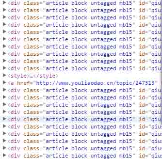
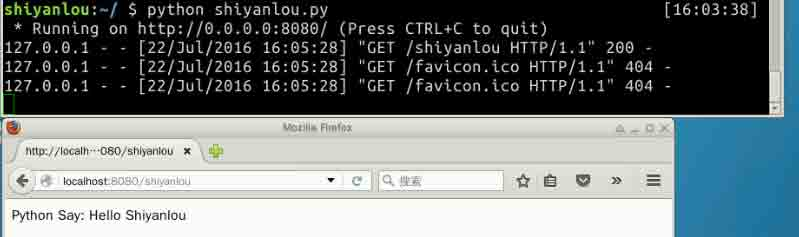
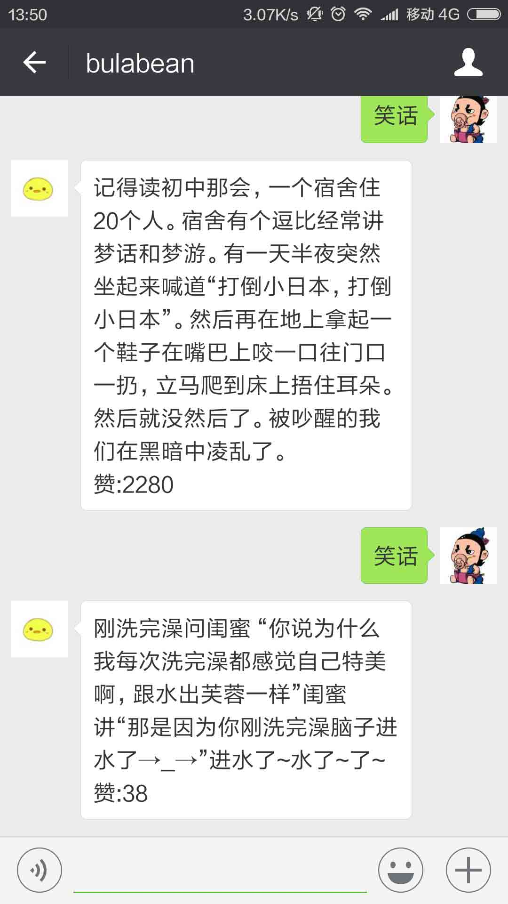

# 第 3 节 实现笑话爬虫并自动回复

## 一、课程介绍

目前，我们的微信公众号只支持文本接收和倒序回复，略单调。本节课将糗百网站的笑话爬取过来，自动回复给用户。因此本节首先需要实现一个爬虫，并把爬取的数据按照上一节实现的方式回复给用户。

## 二、实现爬虫

我们选择爬取的目标是糗事百科的纯文本内容，地址为 [糗事百科-纯文](http://www.qiushibaike.com/text/)，下面这个是这个链接的纯文内容页面，一页共 20 条记录，注意中间会有一段广告：



然后呢，放上对应的爬虫代码，这里用到的库是 lxml，lxml 是解析 XML 的库。XML 和 HTML 是极其类似的，所以这样是可以用。

代码中的实现原理比较简单，从 URL 获取页面内容，使用 lxml 的 etree 提取页面信息，详细步骤可以见代码注释：

```py
import requests
from random import randint
from lxml import etree

r = requests.get(url)
tree = etree.HTML(r.text)
contentlist = tree.xpath('//div[contains(@id, "qiushi_tag_")]')
#匹配 div 的标签，如果 id 中含有'qiushi_tag_'，则存入 list 列表中，最后返回【从该页的 HTML 中能拿到包含 20 个结果的 List 列表】
jokes = []#最后存储结果的列表

for i in contentlist:
#这个 for 循环呢，就是从每个含有笑话的代码块，提出我们需要的笑话的具体内容
    content = i.xpath('div[@class="content"]/text()')
    #因为 content 和 number 得到的是 list 列表，只含有一个元素的 list 列表，join 提出，明白了吧
    contentstring = ''.join(content)
    #然后就是去掉两端的换行符，就得到了我们需要的笑话内容了
    contentstring = contentstring.strip('\n')
    jokes.append(contentstring)
    #最后插入到 jokes 列表中，就得到了我们需要的笑话集合

return jokes[randint(0,len(jokes))]
#最后呢返回 jokes 的其中一条内容，返回就可以了 
```

爬虫抓取笑话的整个过程，就是这些，现在可以准备回复微信消息了。

回复消息的方法请参考上一节的实现内容。

## 三、可运行的代码

附上本节可运行代码 `wechat.py`，一起运行试试，运行不成功，检查错误报告，查看是否未安装需要的库。

实验楼的环境中需要安装下面的库后才可以运行：

```py
$ sudo apt-get install python-lxml
$ sudo pip install flask 
```

详细的代码如下：

```py
import requests
from random import randint
from lxml import etree
from flask import Flask, request, make_response
import hashlib

app = Flask(__name__)

@app.route('/shiyanlou')
def hello():
    return "Python Say: Hello Shiyanlou"

@app.route('/',methods=['GET','POST'])
def wechat_auth():
    if request.method == 'GET':
        print 'coming Get'
        data = request.args
        token = '*******************'
        signature = data.get('signature','')
        timestamp = data.get('timestamp','')
        nonce = data.get('nonce','')
        echostr = data.get('echostr','')
        s = [timestamp,nonce,token]
        s.sort()
        s = ''.join(s)
        if (hashlib.sha1(s).hexdigest() == signature):
            return make_response(echostr)
    if request.method == 'POST':
        xml_str = request.stream.read()
        xml = ET.fromstring(xml_str)
        toUserName=xml.find('ToUserName').text
        fromUserName = xml.find('FromUserName').text
        createTime = xml.find('CreateTime').text
        msgType = xml.find('MsgType').text
        if msgType != 'text':
            reply = '''
            <xml>
            <ToUserName><![CDATA[%s]]></ToUserName>
            <FromUserName><![CDATA[%s]]></FromUserName>
            <CreateTime>%s</CreateTime>
            <MsgType><![CDATA[%s]]></MsgType>
            <Content><![CDATA[%s]]></Content>
            </xml>
            ''' % (
                fromUserName, 
                toUserName, 
                createTime, 
                'text', 
                'Unknow Format, Please check out'
                )
            return reply
        content = xml.find('Content').text
        msgId = xml.find('MsgId').text
        if u'笑话' in content:
            r = requests.get(url)
            tree = etree.HTML(r.text)
            contentlist = tree.xpath('//div[contains(@id, "qiushi_tag_")]')
            jokes = []

            for i in contentlist:
                content = i.xpath('div[@class="content"]/text()')
                contentstring = ''.join(content)
                contentstring = contentstring.strip('\n')
                jokes.append(contentstring)

            joke =  jokes[randint(0,len(jokes))]
            reply = '''
                    <xml>
                    <ToUserName><![CDATA[%s]]></ToUserName>
                    <FromUserName><![CDATA[%s]]></FromUserName>
                    <CreateTime>%s</CreateTime>
                    <MsgType><![CDATA[%s]]></MsgType>
                    <Content><![CDATA[%s]]></Content>
                    </xml>
                    ''' % (fromUserName, toUserName, createTime, msgType, joke)
            return reply
        else:
            if type(content).__name__ == "unicode":
                content = content[::-1]
                content = content.encode('UTF-8')
            elif type(content).__name__ == "str":
                print type(content).__name__
                content = content.decode('utf-8')
                content = content[::-1]
            reply = '''
                    <xml>
                    <ToUserName><![CDATA[%s]]></ToUserName>
                    <FromUserName><![CDATA[%s]]></FromUserName>
                    <CreateTime>%s</CreateTime>
                    <MsgType><![CDATA[%s]]></MsgType>
                    <Content><![CDATA[%s]]></Content>
                    </xml>
                    ''' % (fromUserName, toUserName, createTime, msgType, content)
            return reply
if __name__ == "__main__":
    app.run(host='0.0.0.0', port=8080) 
```

微信公众平台的开发，已经完成

程序在实验楼中的运行截图：



对话效果截图：



## 四、总结

本次实验课，主要是对微信公众平台进行一个简单开发，并添上了逆序回复和回复笑话等功能。涉及到的知识点有 Python、flask，爬虫等知识点，较难的有第一节的服务通信、第二节的编码，第三节的正则匹配爬虫。

> 一个完整的项目，难得不仅仅是深度，更是广度 --Hello World

这节课只是打了个地基，房子怎么盖还是看自己的爱好，可以发挥你的想象力扩展出更有趣的功能。