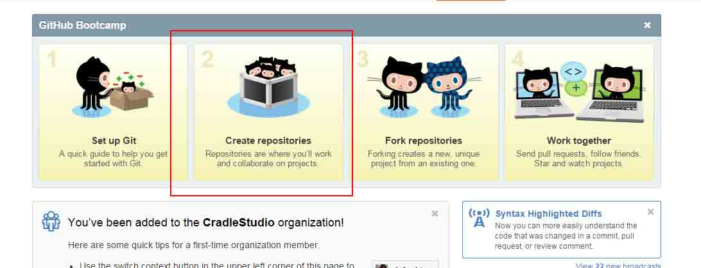

# 第 1 节 项目和 APP

## 一、课程说明

### 1\. 课程来源

本课程来自 Andrew Liu 制作的教程《Django 制作简易博客》，感谢作者授权实验楼基于该教程制作实验课程，作者主页及课程项目地址如下：

*   作者主页：[`andrewliu.in`](http://andrewliu.in)
*   项目地址：[`github.com/Andrew-liu/my*blog*tutorial`](https://github.com/Andrew-liu/my_blog_tutorial)

### 2\. 环境使用

使用 GVim 编辑器输入实验所需的代码及文件，使用 LX 终端（LXTerminal）运行所需命令进行操作。

实验报告可以在个人主页中查看，其中含有每次实验的截图及笔记，以及每次实验的有效学习时间（指的是在实验桌面内操作的时间，如果没有操作，系统会记录为发呆时间）。这些都是您学习的真实性证明。

## 二、开发环境和 Django 安装

>实验楼已搭建好开发环境，这里仅作为大家在本地搭建的参考

### 1.开发环境

下面仅仅是我的项目开发环境, 没有必要追求完全一致...

```py
Mac OS X 10.10.1  #非必要
Python3.4.1
Django1.7.1 
Bootstrap3.3.0 or Pure(临时决定使用的, @游逸 推荐) #非必要
Sublime Text 3  #非必要
virtualenv  1.11.6 
```

虚拟环境配置 使用 virtualenv 创建虚拟环境, Ubuntun 和 Mac 安装程序基本一致

```py
#安装 virtualenv
$ pip install virtualenv  
#创建虚拟环境
$ virtualenv -p /usr/local/bin/python3.4 ENV3.4  

Running virtualenv with interpreter /usr/local/bin/python3.4
Using base prefix '/Library/Frameworks/Python.framework/Versions/3.4'
New python executable in ENV3.4/bin/python3.4
Also creating executable in ENV3.4/bin/python
Installing setuptools, pip...done.

#激活虚拟环境
$ source /ENV3.4/bin/activate  
#查看当前环境下的安装包
$ pip list  
pip (1.5.6)
setuptools (3.6) 
```

更多 virtualenv 使用可以参考 Virtualenv 简明教程

### 2.Git 安装

Git 是目前世界上最先进的分布式版本控制系统

Mac 下 git 安装

```py
$ brew install git 
```

Ubuntu 下 git 安装

```py
$ sudo apt-get install git 
```

Windows 就不说了, 没怎么用过 Windows 做开发, 坑太多了

### 3.Github 创建

在 Github 中创建一个属于自己的帐号 新建帐号后, 请点击 New repository 或者下图地方  Github 仓库创建

并通过 Install-SSH-Use-Github 学习简单的 Github 与 git 的协作以及 SSH 的创建

>Github 和 git 的协作我们会在使用的时候重复提示, 但最好先进行 SSH 的安装和配置

### 4.Django 安装

安装最新版的 Django 版本

```py
#安装最新版本的 Django
$ pip install  django 
#或者指定安装版本
pip install -v django==1.7.1 
```

### 5.Bootstrap 安装

Bootstrap 简洁、直观、强悍的前端开发框架，让 web 开发更迅速、简单 bootstrap 已经有较为完善的中文文档, 可以在[bootstrap 中文网](http://v3.bootcss.com/getting-started/#download)查看

推荐下载其中的 Bootstrap 源码

>到目前为止, 基本环境已经搭建好了

## 三、项目和 APP

### 1.项目创建

创建一个名为 my_blog 的 Django 项目

创建项目的指令如下:

```py
$ django-admin.py startproject my_blog 
```

现在来看一下整个项目的文件结构

```py
$ sudo apt-get install tree
$ tree my_blog   #打印树形文件结构
my_blog
├── manage.py
└── my_blog
    ├── __init__.py
    ├── settings.py
    ├── urls.py
    └── wsgi.py

1 directory, 5 files 
```

### 2.建立 Django app

>在 Django 中的 app 我认为就是一个功能模块, 与其他的 web 框架可能有很大的区别, 将不能功能放在不同的 app 中, 方便代码的复用

建立一个 article app

```py
$ cd my_blog
$ python manage.py startapp article 
```

现在让我们重新看一下整个项目的结构


并在 my*blog/my*blog/setting.py 下添加新建 app

```py
INSTALLED_APPS = (
    ...
    'article',  #这里填写的是 app 的名称
) 
```


### 3.运行程序

```py
$ python manage.py runserver localhost:9000  #启动 Django 中的开发服务器
#如果运行上面命令出现以下提示
You have unapplied migrations; your app may not work properly until they are applied.
Run 'python manage.py migrate' to apply them.
#请先使用下面命令
python manage.py migrate
#输出如下信息
Operations to perform:
  Apply all migrations: contenttypes, sessions, admin, auth
Running migrations:
  Applying contenttypes.0001_initial... OK
  Applying auth.0001_initial... OK
  Applying admin.0001_initial... OK
  Applying sessions.0001_initial... OK 
```

运行成功后,会显示如下信息

```py
#重新运行启动 Django 中的开发服务器
$ python manage.py runserver localhost:9000

#运行成功显示如下信息
System check identified no issues (0 silenced).
December 21, 2014 - 08:56:00
Django version 1.7.1, using settings 'my_blog.settings'
Starting development server at http://localhost:9000/
Quit the server with CONTROL-C. 
```

现在可以启动浏览器, 输入`http://localhost:9000`, 当出现


成功

说明你成功走出了第一步!

命令梳理:

```py
python manage.py <command> [options]  #Django Command python manange.py -h 帮助文档
django-admin.py startproject my_blog  #创建项目
python manage.py startapp article  #创建 app 
```