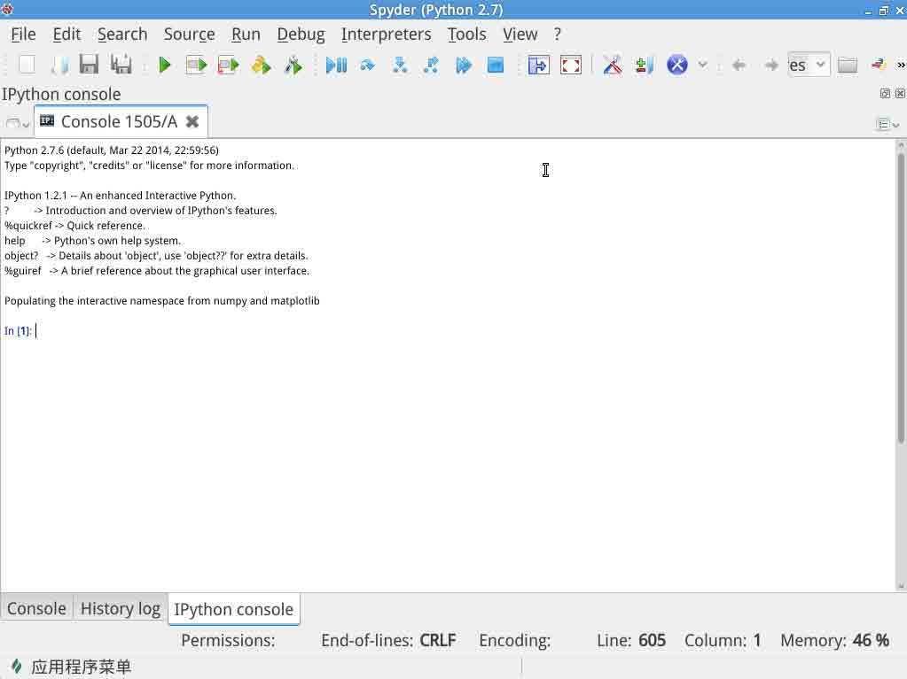
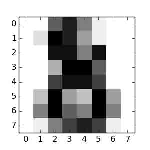
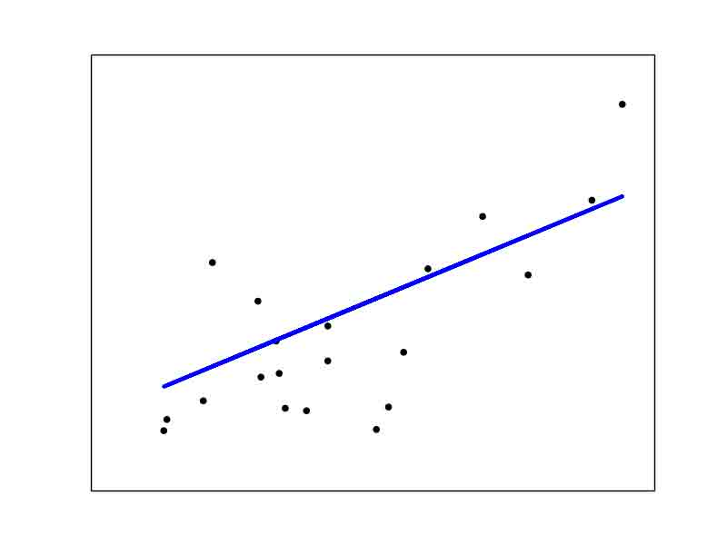
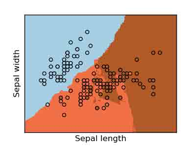
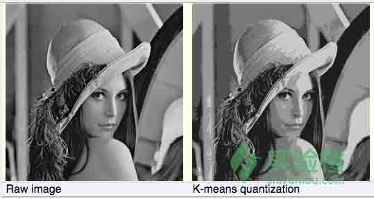
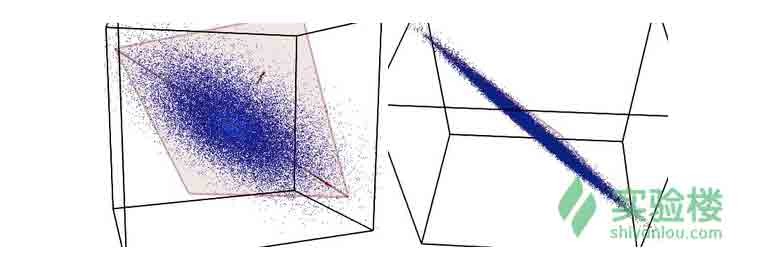
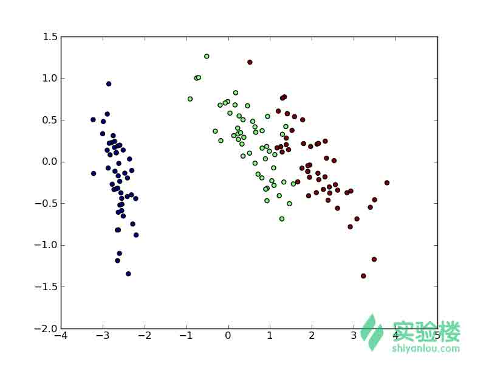

# 第 3 节 scikit-learn 机器学习

## 一、实验说明

scikit-learn 是一个比较流行的开源机器学习库。它支持许多分类，回归，聚类算法，包括支持向量机，逻辑回归，朴素贝叶斯，随机森林，梯度 boosting，k-means 和 DBSCAN，并且可以与 Numpy 与 SciPy 库进行交互。

本实验修改自[官方文档](http://scikit-learn.org/stable/tutorial/basic/tutorial.html)与[这篇笔记](http://scipy-lectures.github.io/packages/scikit-learn/index.html)

### 1\. 环境登录

无需密码自动登录，系统用户名 shiyanlou

### 2\. 环境介绍

本课程实验环境使用 Spyder。首先打开 terminal，然后输入以下命令：

```py
spyder -w scientific-python-lectures   (-w 参数指定工作目录) 
```

关于 Spyder 的使用可参考文档：https://pythonhosted.org/spyder/

本实验基本在控制台下进行，可关闭 spyder 中的其余窗口，只保留控制台。如需要调出窗口，可以通过 view->windows and toolbar 调出。比如希望在 py 文件中编写代码，可以 view->windows and toolbar->Editor 调出编辑器窗口。



## 二、实验内容

### 机器学习问题

机器学习问题通常是考虑如何通过一组数据的样本来预测未知数据的一些特性。如果每个样本自身含有多个变量，我们管变量叫做特征。

可以将机器学习问题分成下面几个大类：

*   监督学习：数据样本自身带有我们希望预测的部分。监督学习又可以分为下面两类：
    *   分类：样本属于两个或多个类别，我们通过学习已知类别的样本来预测未知类别的数据的类别，数字识别就是分类算法的一个典型应用。
    *   回归：如果希望得到的输出是连续变量那么就得用到回归算法，举个例子，我们通过大马哈鱼的年龄与重量来推测它的长度。
*   无监督学习：无监督学习的数据样本不包含目标值，它的目的是从数据中挖掘出相似的部分做不同的分组，这就是聚类。亦或是找出数据在输入空间的密度分布，这就是密度估计。亦或是为了数据可视化对数据进行降维。

> **训练集与测试集**

> 机器学习将从数据集学习到的内容应用到新数据上，这也是为什么评估一个算法的常见做法是将数据集一分为二，一个作为训练集供我们学习，一个作为测试集供我们预测。

### 加载示例数据集

我们可以很方便得从 sklearn 加载一些数据集来进行机器学习方面的练习，比如著名的鸢尾花卉数据集。

#### 鸢尾花卉数据集

> 安德森鸢尾花卉数据集是一类多重变量分析的数据集，其数据集包含了 150 个样本，都属于鸢尾属下的三个亚属，分别是山鸢尾、变色鸢尾和维吉尼亚鸢尾。四个特征被用作样本的定量分析，它们分别是花萼和花瓣的长度和宽度。


加载数据集

```py
from sklearn import datasets
iris = datasets.load_iris() 
```

数据存储在 `.data` 成员中，它是一个 `(n_samples, n_features)` numpy 数组

```py
iris.data.shape 
```

输出：

```py
(150, 4) 
```

每一个样本的类别存储在 `.target` 属性中，它是一个一维数组

```py
iris.target.shape 
```

输出：

```py
(150,) 
```

显示数据集中有哪些类别

```py
import numpy as np
np.unique(iris.target) 
```

输出：

```py
array([0, 1, 2]) 
```

现在来尝试一下别的数据集，比如手写数字数据集

#### 手写数字数据集

> 手写数字数据集包含了来自 44 个作者的 250 个样本，通常被用作手写数字预测。

加载数据集

```py
digits = datasets.load_digits() 
```

查看底层数据

```py
print(digits.data) 
```

输出：

```py
[[  0\.   0\.   5\. ...,   0\.   0\.   0.]
 [  0\.   0\.   0\. ...,  10\.   0\.   0.]
 [  0\.   0\.   0\. ...,  16\.   9\.   0.]
 ...,
 [  0\.   0\.   1\. ...,   6\.   0\.   0.]
 [  0\.   0\.   2\. ...,  12\.   0\.   0.]
 [  0\.   0\.  10\. ...,  12\.   1\.   0.]] 
```

查看数据集目标值

```py
digits.target 
```

输出：

```py
array([0, 1, 2, ..., 8, 9, 8]) 
```

### 学习与预测

这里我们使用手写数字数据集做数字识别。我们需要将评估函数与数据进行拟合来进行预测。

在 scikit-learn 中，评估函数（estimator）是一个 Python 对象，它实现了 `fit(X, y)` 与 `predict(T)` 方法。

类 `sklearn.svm.SVC` 就是一个实现了支持向量分类的评估函数，这里仅是做一个简单的例子，不深究算法的细节与参数的选择，我们仅把它当作一个黑盒：

```py
from sklearn import svm
clf = svm.SVC(gamma=0.001, C=100.) 
```

> 关于模型参数的选择

> 这里我们手动地设置了 gamma 的值，使用格点搜索与交叉验证的方法可以自动帮我们找到较好的参数。

评估函数实例的变量名取作 `clf` ，说明它是一个分类器（classifier）。将训练集传递给 `fit` 方法进行数据拟合之后就可以做预测了。这里我们取数据集的最后一张图最为预测图，前面的数据都作为训练数据。

```py
clf.fit(digits.data[:-1], digits.target[:-1]) 
```

输出：

```py
SVC(C=100.0, cache_size=200, class_weight=None, coef0=0.0, degree=3,
  gamma=0.001, kernel='rbf', max_iter=-1, probability=False,
  random_state=None, shrinking=True, tol=0.001, verbose=False) 
```

我们需要预测的图： 

感觉它。。好像是个 8！用排除法看！

```py
clf.predict(digits.data[-1]) 
```

输出：

```py
array([8]) 
```

以上就是一个基本的问题学习过程。

下面分别讲几类机器学习算法的使用。

### 回归

在回归的模型中，目标值是输入值的线性组合，假设是预测值，那么


其中 `w = (w_1,..., w_p)` 作为 `coef_`(因数)，`w_0` 作为 `intercept_`(截距)

线性回归拟合一个线性模型，根据最小二乘法最小化样本与模型的残差。



```py
from sklearn import linear_model
clf = linear_model.LinearRegression()
clf.fit ([[0, 0], [1, 1], [2, 2]], [0, 1, 2])
clf.coef_ 
```

输出：

```py
array([ 0.5,  0.5]) 
```

### 分类

最简单的分类算法就是最近邻居算法：给一个新的数据，取在 n 维空间中离它最近的样本的标签作为它的标签，这里的 n 由样本的特征数量决定。



knn 分类器（k-nearest neighbors)示例：

```py
from sklearn import neighbors
knn = neighbors.KNeighborsClassifier()
knn.fit(iris.data, iris.target) 
knn.predict([[0.1, 0.2, 0.3, 0.4]]) 
```

输出：

```py
array([0]) 
```

### 聚类

如果鸢尾花卉数据样本并没有包括它的目标值在里面，而我们只知道有三种鸢尾花而已，那么就可以使用无监督算法来对样本进行聚类分组。


最简单的聚类算法是 **k-means** 算法，它将数据分成 k 类，将一个样本分配到一个类中时，分配依据是该样本与所分配类中已有样本的均值（可以想象该类中已分配样本的质心的位置）的距离。同时因为新加入了一个样本，均值也会更新（质心的位置发生变化）。这类操作会持续几轮直至类收敛，持续的轮数由 `max_iter` 决定。

http://www.naftaliharris.com/blog/visualizing-k-means-clustering/ 这里有一个演示，能直观地感受 k-means 算法

```py
from sklearn import cluster, datasets
iris = datasets.load_iris()
k_means = cluster.KMeans(k=3)
k_means.fit(iris.data) 
```

输出：

```py
KMeans(copy_x=True, init='k-means++', k=3, ... 
```

分别抽取打印 k-means 的分类结果与数据的实际结果：

```py
print k_means.labels_[::10]
=> [1 1 1 1 1 0 0 0 0 0 2 2 2 2 2]

print iris.target[::10]
=> [0 0 0 0 0 1 1 1 1 1 2 2 2 2 2] 
```

效果还不错。

#### 图像压缩

聚类的一个典型应用就是对图片进行色调分离

```py
from scipy import misc
lena = misc.lena().astype(np.float32)
X = lena.reshape((-1, 1)) # We need an (n_sample, n_feature) array
k_means = cluster.KMeans(n_clusters=5)
k_means.fit(X) 
values = k_means.cluster_centers_.squeeze()
labels = k_means.labels_
lena_compressed = np.choose(labels, values)
lena_compressed.shape = lena.shape 
```



### 降维

 注意到空间中的数据点看上去几乎就在一个平面上，这意味着数据的某一个特征几乎可以由另两个特征计算得到，这种时候我们就可以进行数据降维了。这里使用主成分分析（PCA：Principal Component Analysis）。

```py
from sklearn import decomposition
pca = decomposition.PCA(n_components=2)
pca.fit(iris.data) 
```

输出：

```py
PCA(copy=True, n_components=2, whiten=False) 
```

数据可视化：

```py
import pylab as pl
X = pca.transform(iris.data)
pl.scatter(X[:, 0], X[:, 1], c=iris.target) 
```



降维除了可以用在数据可视化上，还可以通过对数据进行预处理提高监督学习处理数据的效率。

## License

本作品在 [知识共享协议 3.0](http://creativecommons.org/licenses/by/3.0/cn/) 下授权发布