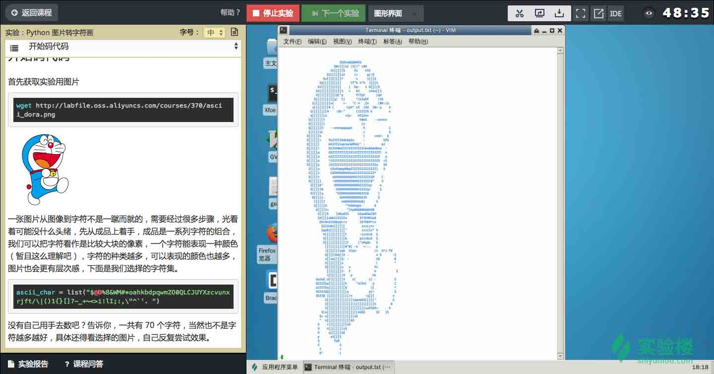

# 第 1 节 Python 图片转字符画

## 一、课程介绍

### 1\. 课程来源

原创

### 2\. 内容简介

本课程讲述怎样使用 Python 将图片转为字符画

### 3\. 前置课程

[Python 快速教程](https://www.shiyanlou.com/courses/214)

[Linux 基础入门（新版）](https://www.shiyanlou.com/courses/1)

[Vim 编辑器](https://www.shiyanlou.com/courses/2)

### 4\. 课程知识点

本节实验中我们将实践以下知识：

1.  Linux 命令行操作
2.  Python 基础
3.  pillow 库的使用
4.  argparse 库的使用（[参考教程](http://blog.ixxoo.me/argparse.html)）

## 二、实验原理

字符画是一系列字符的组合，我们可以把字符看作是比较大块的像素，一个字符能表现一种颜色（暂且这么理解吧），字符的种类越多，可以表现的颜色也越多，图片也会更有层次感。

问题来了，我们是要转换一张彩色的图片，这么这么多的颜色，要怎么对应到单色的字符画上去？这里就要介绍灰度值的概念了。

> 灰度值：指黑白图像中点的颜色深度，范围一般从 0 到 255，白色为 255，黑色为 0，故黑白图片也称灰度图像

我们可以使用灰度值公式将像素的 RGB 值映射到灰度值：

```py
gray ＝ 0.2126 * r + 0.7152 * g + 0.0722 * b 
```

这样就好办了，我们可以创建一个不重复的字符列表，灰度值小（暗）的用列表开头的符号，灰度值大（亮）的用列表末尾的符号。

## 三、实验步骤

PIL 是一个 Python 图像处理库，是本课程使用的重要工具，安装 pillow（PIL）库：

```py
$ sudo apt-get update
$ sudo apt-get install python-dev
$ sudo apt-get install libtiff5-dev libjpeg8-dev zlib1g-dev \
libfreetype6-dev liblcms2-dev libwebp-dev tcl8.6-dev tk8.6-dev python-tk
$ sudo pip install pillow 
```

首先获取实验用图片

```py
$ wget http://labfile.oss.aliyuncs.com/courses/370/ascii_dora.jpg 
```


创建 ascii.py 文件进行编辑

```py
$ vi ascii.py 
```

首先导入必要的库，argparse 库是用来管理命令行参数输入的

```py
from PIL import Image
import argparse 
```

下面是我们的字符画所使用的字符集，一共有 70 个字符，字符的种类与数量可以自己根据字符画的效果反复调试

```py
ascii_char = list("$@B%8&WM#*oahkbdpqwmZO0QLCJUYXzcvunxrjft/\|()1{}[]?-_+~<>i!lI;:,\"^`'. ") 
```

下面是 RGB 值转字符的函数：

```py
def get_char(r,g,b,alpha = 256):
    if alpha == 0:
        return ' '
    length = len(ascii_char)
    gray = int(0.2126 * r + 0.7152 * g + 0.0722 * b)

    unit = (256.0 + 1)/length
    return ascii_char[int(gray/unit)] 
```

完整参考代码：

```py
from PIL import Image
import argparse

#命令行输入参数处理
parser = argparse.ArgumentParser()

parser.add_argument('file')     #输入文件
parser.add_argument('-o', '--output')   #输出文件
parser.add_argument('--width', type = int, default = 80) #输出字符画宽
parser.add_argument('--height', type = int, default = 80) #输出字符画高

#获取参数
args = parser.parse_args()

IMG = args.file
WIDTH = args.width
HEIGHT = args.height
OUTPUT = args.output

ascii_char = list("$@B%8&WM#*oahkbdpqwmZO0QLCJUYXzcvunxrjft/\|()1{}[]?-_+~<>i!lI;:,\"^`'. ")

# 将 256 灰度映射到 70 个字符上
def get_char(r,g,b,alpha = 256):
    if alpha == 0:
        return ' '
    length = len(ascii_char)
    gray = int(0.2126 * r + 0.7152 * g + 0.0722 * b)

    unit = (256.0 + 1)/length
    return ascii_char[int(gray/unit)]

if __name__ == '__main__':

    im = Image.open(IMG)
    im = im.resize((WIDTH,HEIGHT), Image.NEAREST)

    txt = ""

    for i in range(HEIGHT):
        for j in range(WIDTH):
            txt += get_char(*im.getpixel((j,i)))
        txt += '\n'

    print txt

    #字符画输出到文件
    if OUTPUT:
        with open(OUTPUT,'w') as f:
            f.write(txt)
    else:
        with open("output.txt",'w') as f:
            f.write(txt) 
```

输入以下命令运行脚本查看实验效果

```py
$ python ascii.py ascii_dora.jpg 
```



**注意，不同的环境中显示的效果可能不尽相同**

**终端显示的字体是不是等宽字体，终端显示的行高和行宽，输入输出的图像宽高等等，这些都会影响显示效果**