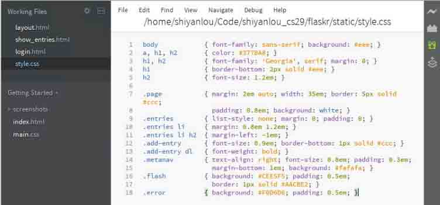

# Python Flask Web 框架

Flask 是一个用于 Python 的微型网络开发框架。基于 WerkzeugWSGI 工具箱和 Jinja2 模板引擎。本实验课程基于 Flask 0.10.1 文档制作。

## 一、实验说明

### 1\. 环境登录

无需密码自动登录，系统用户名 shiyanlou

### 2\. 环境介绍

本实验环境采用带桌面的 Ubuntu Linux 环境，实验中会用到桌面上的程序：

1.  LX 终端（LXTerminal）: Linux 命令行终端，打开后会进入 Bash 环境，可以使用 Linux 命令

2.  Firefox：浏览器，可以用在需要前端界面的课程里，只需要打开环境里写的 HTML/JS 页面即可

3.  GVim：非常好用的编辑器，最简单的用法可以参考课程[Vim 编辑器](http://www.shiyanlou.com/courses/2)

### 3\. 环境使用

使用 GVim 编辑器输入实验所需的代码及文件，使用 LX 终端（LXTerminal）运行所需命令进行操作。

实验报告可以在个人主页中查看，其中含有每次实验的截图及笔记，以及每次实验的有效学习时间（指的是在实验桌面内操作的时间，如果没有操作，系统会记录为发呆时间）。这些都是您学习的真实性证明。

本课程中的所有源码可以通过访问 https://github.com/mitsuhiko/flask/tree/master/examples/flaskr 下载。

### 4\. 课程来源

本实验课程基于 Flask 0.10.1 文档制作，可查看原版链接：[`www.pythondoc.com/flask/index.html`](http://www.pythondoc.com/flask/index.html)

## 二、引言

### 1\. 课程概述

Flask 是一个轻量级的 Web 应用框架, 使用 Python 编写。基于 WerkzeugWSGI 工具箱和 Jinja2 模板引擎。使用 BSD 授权。Flask 也被称为 `“microframework”` ，因为它使用简单的核心，用 extension 增加其他功能。Flask 没有默认使用的数据库、窗体验证工具。然而，Flask 保留了扩增的弹性，可以用 Flask-extension 加入这些功能：ORM、窗体验证工具、文件上传、各种开放式身份验证技术。

### 2.预备知识

首先需要掌握 Python 基础知识，然后需要熟悉基本的数据库操作，最好也了解点 WEB 前端（`HTML+CSS+JavaScript`）。如果有 WEB 应用的开发经验，上手回很快哦。

## 三、安装

### 1\. virtualenv

也许 Virtualenv 是你在开发中最愿意使用的，如果你在生产机器上有 shell 权限的时候，你也会愿意用上 virtualenv。

virtualenv 解决了什么问题？如果你像我一样喜欢 Python 的话，有很多机会在基于 Flask 的 web 应用外的其它项目上使用 Python。 然而项目越多，越有可能在不同版本的 python，或者至少在不同 python 库的版本上工作。 我们需要面对这样的事实：库破坏向后兼容性的情况相当常见，而且零依赖的正式应用也不大可能存在。 如此，当你的项目中的两个 或更多出现依赖性冲突，你会怎么做？

Virtualenv 的出现解决这一切！Virtualenv 能够允许多个不同版本的 Python 安装，每一个服务于各自的项目。 它实际上并没有安装独立的 Python 副本，只是提供了一种方式使得环境保持独立。让我们见识下 virtualenv 怎么工作的。

如果你在 Mac OS X 或 Linux 下，下面两条命令可能会适用:

```py
$ sudo easy_install virtualenv 
```


或者更好的:

```py
$ sudo pip install -i http://mirrors.aliyuncs.com/pypi/simple virtualenv 
```

上述的命令会在你的系统中安装 virtualenv。它甚至可能会出现在包管理器中。如果你使用 Ubuntu ，请尝试:

```py
$ sudo apt-get install python-virtualenv 
```

如果是在 Windows 下并且没有安装 easy*install 命令，你首先必须安装 easy*install 。 要想获取更多的安装信息，请查看 Windows 下的 pip 和 distribute 。一旦安装好 easy_install ， 运行上述的命令，但是要去掉 sudo 前缀。

一旦成功安装 virtualenv，运行 shell 创建自己的环境。我通常会创建一个项目文件夹`myproject`，其下创建 venv 文件夹，该文件夹就是一个虚拟的 Python 环境:

```py
$ mkdir myproject
$ cd myproject
$ virtualenv venv
New python executable in venv/bin/python
Installing distribute............done. 
```

现在，只要你想要在某个项目上工作，只要激活相应的环境。在 OS X 和 Linux 下，按如下做:

```py
$ . venv/bin/activate 
```

如果你是个 Windows 用户，下面的命令行是为你而准备:

```py
$ venv\scripts\activate 
```

无论哪种方式，你现在能够使用你的 virtualenv (注意你的 shell 提示符显示的是活动的环境)。

现在你只需要键入以下的命令来激活你的 virtualenv 中的 flask:

```py
$ pip install -i http://mirrors.aliyuncs.com/pypi/simple flask 
```

几秒后，一切就为你准备就绪。

### 2\. 全局安装

以下命令安装环境也是可行的，尽管我不推荐。只需要以 root 权限运行 pip:

```py
$ sudo pip install -i http://mirrors.aliyuncs.com/pypi/simple flask 
```

(在 Windows 系统上，在管理员权限的命令提示符中运行这条命令，不需要 sudo。)

### 3\. 体验最新的 Flask (Living on the Edge)

如果你想要用最新版的 Flask 干活，这里有两种方式：你可以使用 pip 拉取开发版本， 或让它操作一个 git checkout。无论哪种方式，依然推荐使用 virtualenv。

在一个新的 virtualenv 上获取一个 git checkout，在开发模式下运行:

```py
$ git clone http://git.shiyanlou.com/shiyanlou/flask
Initialized empty Git repository in ~/dev/flask/.git/
$ cd flask
$ virtualenv venv --distribute
New python executable in venv/bin/python
Installing distribute............done.
$ . venv/bin/activate
$ python setup.py develop
...
Finished processing dependencies for Flask 
```

这会拉取依赖关系并激活 git head 作为 virtualenv 中的当前版本。然后你只需要执行 git pull origin 来升级到最新版本。

没有 git 下获取最新的开发版本，需要这样做:

```py
$ mkdir flask
$ cd flask
$ virtualenv venv --distribute
$ . venv/bin/activate
New python executable in venv/bin/python
Installing distribute............done.
$ pip install -i http://mirrors.aliyuncs.com/pypi/simple Flask==dev
...
Finished processing dependencies for Flask==dev 
```

## 四、小结

本节讲了 virtualenv 和 flask 的安装，推荐在 virtualenv 下进行开发。

## 五、练习

请试着在自己的电脑上安装 Flask 。

## 一、一个最小的应用

一个最小的应用看起来像这样:

```py
from flask import Flask
app = Flask(__name__)

@app.route('/')
def hello_world():
    return 'Hello World!'

if __name__ == '__main__':
    app.run() 
```

把它保存成 hello.py (或者类似的文件)，然后用 Python 解释器运行它。确保你的应用不叫做`flask.py`， 因为这会与 Flask 本身冲突。

```py
$ python hello.py
 * Running on http://127.0.0.1:5000/ 
```

现在使用浏览器浏览`http://127.0.0.1:5000/`，你会看到你的 `hello world`问候。


那么这段代码做了什么？

1.  首先我们导入了类 Flask 。这个类的实例化将会是我们的 WSGI 应用。第一个参数是应用模块的名称。 如果你使用的是单一的模块（就如本例），第一个参数应该使用 `__name__`。因为如果它以单独应用启动或作为模块导入， 名称将会不同 （ `__main__` 对应于实际导入的名称）。获取更多的信息，请阅读 Flask 的文档。
2.  接着，我们创建一个该类的实例。我们传递给它模块或包的名称。这样 Flask 才会知道去哪里寻找模板、静态文件等等。
3.  我们使用装饰器`route()`告诉 Flask 哪个`URL`才能触发我们的函数。
4.  定义一个函数，该函数名也是用来给特定函数生成 URLs，并且返回我们想要显示在用户浏览器上的信息。
5.  最后我们用函数`run()`启动本地服务器来运行我们的应用。`if __name__ == '__main__'`: 确保服务器只会在该脚本被 Python 解释器直接执行的时候才会运行，而不是作为模块导入的时候。

请按`Ctrl+c`来停止服务器。

## 二、外部可见服务器

当你运行服务器，你会注意到它只能从你自己的计算机上访问，网络中其它任何的地方都不能访问。 这是因为默认情况，调试模式，只有应用中的一个用户可以执行你计算机上的任意 Python 代码。

如果你关闭 debug 或者信任你所在网络上的用户，你可以让你的服务器对外可用，只要简单地改变脚本`hello.py`中方法`run()`的调用像如下这样:

```py
app.run(host='0.0.0.0') 
```

这让你的操作系统去监听所有公开的 IP。

## 三、调试模式

`run()`方法是十分适用于启动一个本地开发服务器，但是你需要在修改代码后手动重启服务器。 这样做并不好，Flask 能做得更好。如果启用了调试支持，在代码修改的时候服务器能够自动加载， 并且如果发生错误，它会提供一个有用的调试器。

有两种方式开启调式模式。一种是在应用对象上设置标志位:

```py
app.debug = True
app.run() 
```

或者作为`run`的一个参数传入:

```py
app.run(debug=True) 
```

两种方法效果是一样的。

**Attention:**

尽管交互式调试器不能在分叉( forking )环境上工作(这使得它几乎不可能在生产服务器上使用)， 它依然允许执行任意代码。这使它成为一个巨大的安全风险，因此它绝对不能用于生产环境。

运行中的调试器的截图:


## 四、小结

本节讲了 flask 的一个小例子，可以通过设置 flask 实例的 debug 属性来开启或者关闭调试模式。

## 五、练习

请开发一个小应用，URL 地址输入`http://127.0.0.1:5000/shiyanlou`，输出你自己的姓名。

## 一、路由

现代 Web 应用程序有优雅的 URLs。这能够帮助人们记住 URLs，这点在面向使用慢网络连接的移动设备的应用上非常有用。 如果用户不必通过点击首页而直接访问想要的页面，很可能他们会喜欢这个页面而且下次再次访问。

正如上面所说，`route`装饰器是用于把一个函数绑定到一个 URL 上。这有些基本的例子（上一节的课后习题可以参考以下代码）:

```py
@app.route('/')
def index():
    return 'Index Page'

@app.route('/hello')
def hello():
    return 'Hello World' 
```

但是不仅如此！你可以动态地构造 URL 的特定部分，也可以在一个函数上附加多个规则。

### 1\. 变量规则

为了给 URL 增加变量的部分，你需要把一些特定的字段标记成`<variable_name>`。这些特定的字段将作为参数传入到你的函数中。当然也可以指定一个可选的转换器通过规则`<converter:variable_name>`将变量值转换为特定的数据类型。 这里有一些不错的例子:

```py
@app.route('/user/<username>')
def show_user_profile(username):
    # 显示用户的名称
    return 'User %s' % username

@app.route('/post/<int:post_id>')
def show_post(post_id):
    # 显示提交整型的用户"id"的结果，注意"int"是将输入的字符串形式转换为整型数据
    return 'Post %d' % post_id 
```

示例代码以及显示部分结果：


存在如下转换器:


**唯一 URLs / 重定向行为:**

Flask 的 URL 规则是基于 Werkzeug 的 routing 模块。 该模块背后的想法是基于 Apache 和早期的 HTTP 服务器定下先例确保美丽和唯一的 URL。

以这两个规则为例:

```py
@app.route('/projects/')
def projects():
    return 'The project page'

@app.route('/about')
def about():
    return 'The about page' 
```

虽然它们看起来确实相似，但它们结尾斜线的使用在 URL 定义 中不同。 第一种情况中，规范的 URL 指向 projects 尾端有一个斜线`\`。 这种感觉很像在文件系统中的文件夹。访问一个结尾不带斜线的 URL 会被 Flask 重定向到带斜线的规范 URL 去。

然而，第二种情况的 URL 结尾不带斜线，类似 UNIX-like 系统下的文件的路径名。此时如果访问结尾带斜线的 URL 会产生一个`404 “Not Found”`错误。

当用户访问页面时忘记结尾斜线时，这个行为允许关联的 URL 继续工作， 并且与 Apache 和其它的服务器的行为一致， 反之则不行，因此斜线只可少写不可多写；另外，URL 会保持唯一，有助于避免搜索引擎索引同一个页面两次。

### 2\. 构建 URL

如果它可以匹配 URL ，那么 Flask 能够生成它们吗？当然 Flask 能够做到。你可以使用函数`url_for()`来针对一个特定的函数构建一个 URL 。它能够接受函数名作为第一参数，以及一些关键字参数， 每一个关键字参数对应于 URL 规则的变量部分。未知变量部分被插入到 URL 中作为查询参数。这里有些例子需要在 Python 的交互式环境下运行：

```py
$ python
>>> from flask import Flask, url_for
>>> app = Flask(__name__)
>>> @app.route('/')
... def index(): pass
...
>>> @app.route('/login')
... def login(): pass
...
>>> @app.route('/user/<username>')
... def profile(username): pass
...
>>> with app.test_request_context():
...     print url_for('index')
...     print url_for('login')
...     print url_for('login', next='/')
...     print url_for('profile', username='John Doe')
...
/
/login
/login?next=%2F
/user/John%20Doe 
```

(这里使用了`test_request_context()`方法，后面会给出解释。这个方法告诉 Flask 表现得像是在处理一个请求，即使我们正在通过 Python 的 shell 交互，大家可以仔细分析一下该函数的打印结果)。

为什么你要构建 URLs 而不是在模版中[硬编码](http://baike.baidu.com/link?url=n_z_TKp-zXEZf8H-D9-5YMLbNnhbezKXe-FsiWMwMjLMz2bl3bAJBL1s40yHihwnc0T1EXTYMmoZUVvrgf6yV_)？这里有三个好的理由：

1.  反向构建通常比硬编码更具备描述性。更重要的是，它允许你一次性修改 URL， 而不是到处找 URL 修改。
2.  构建 URL 能够显式地处理特殊字符和`Unicode`转义，因此你不必去处理这些。
3.  如果你的应用不在 URL 根目录下(比如，在 /myapplication 而不在 /)，`url_for()`将会适当地替你处理好。

### 3\. HTTP 方法

HTTP (也就是 web 应用协议)有不同的方法来访问 URLs 。默认情况下，路由只会响应 GET 请求， 但是能够通过给 route() 装饰器提供 methods 参数来改变。这里是一个例子:

```py
@app.route('/login', methods=['GET', 'POST'])
def login():
    if request.method == 'POST':
        do_the_login()
    else:
        show_the_login_form() 
```

如果使用`GET`方法，`HEAD`方法 将会自动添加进来。你不必处理它们。也能确保`HEAD`请求 会按照 HTTP RFC (文档在 HTTP 协议里面描述) 要求来处理， 因此你完全可以忽略这部分 HTTP 规范。 同样地，自从 Flask 0.6 后，OPTIONS 也能自动为你处理。

也许你并不清楚 HTTP 方法是什么？别担心，这里有一个 HTTP 方法的快速入门以及为什么它们重要：

`HTTP`方法（通常也称为“谓词”）告诉服务器客户端想要对请求的页面做什么。下面这些方法是比较常见的：

*   GET 浏览器通知服务器只获取页面上的信息并且发送回来。这可能是最常用的方法。
*   HEAD 浏览器告诉服务器获取信息，但是只对头信息感兴趣，不需要整个页面的内容。 应用应该处理起来像接收到一个 GET 请求但是不传递实际内容。在 Flask 中你完全不需要处理它， 底层的 Werkzeug 库会为你处理的。
*   POST 浏览器通知服务器它要在 URL 上提交一些信息，服务器必须保证数据被存储且只存储一次。 这是 HTML 表单通常发送数据到服务器的方法。
*   PUT 同 POST 类似，但是服务器可能触发了多次存储过程，多次覆盖掉旧值。现在你就会问这有什么用，有许多理由需要如此去做。考虑下在传输过程中连接丢失：在这种情况下浏览器和服务器之间的系统可能安全地第二次接收请求，而不破坏其它东西。该过程操作 POST 是不可能实现的，因为它只会被触发一次。
*   DELETE 移除给定位置的信息。
*   OPTIONS 给客户端提供一个快速的途径来指出这个 URL 支持哪些 HTTP 方法。从 Flask 0.6 开始，自动实现了该功能。

现在在 HTML4 和 XHTML1 中，表单只能以 GET 和 POST 方法来提交到服务器。在 JavaScript 和以后的 HTML 标准中也能使用其它的方法。同时，HTTP 最近变得十分流行，浏览器不再是唯一使用 HTTP 的客户端。比如，许多版本控制系统使用 HTTP。

## 四、小结

本节讲了 flask 的路由，我们可以给 URL 添加规则，也可以动态地构建 URL 。

## 五、练习

请完成一个应用，当 URL 是`http://127.0.0.1/sum/a/b`时，其中`a`和`b`都是数字，服务器返回它们的和。

## 一、静态文件

动态的 web 应用同样需要静态文件。`CSS`和`JavaScript`文件通常来源于此。理想情况下， 你的 web 服务器已经配置好为它们服务，然而在开发过程中 Flask 就能够做到。 只要在你的包中或模块旁边创建一个名为`static` 的文件夹，在应用中使用`/static`即可访问。

给静态文件生成 URL ，使用特殊的`static`端点名:

```py
url_for('static', filename='style.css') 
```

这个文件是应该存储在文件系统上的`static/style.css`。

## 二、渲染模板

在 Python 中生成 HTML 并不好玩，实际上是相当繁琐的，因为你必须自行做好 HTML 转义以保持应用程序的安全。 由于这个原因，Flask 自动为你配置好 Jinja2 模版。

你可以使用方法`render_template()`来渲染模版。所有你需要做的就是提供模版的名称以及你想要作为关键字参数传入模板的变量。这里有个渲染模版的简单例子， 修改`hello.py`文件:

```py
from flask import render_template

@app.route('/hello/')
@app.route('/hello/<name>')
def hello(name=None):
    return render_template('hello.html', name=name) 
```

Flask 将会在`templates`文件夹中寻找模版。因此如果你的应用是个模块，这个文件夹在模块的旁边，如果它是一个包，那么这个文件夹在你的包里面:

**Case 1**:应用是模块（本系列实验的应用结构都是模块型）:

```py
/application.py
/templates
    /hello.html 
```

**Case 2**: 应用是包:

```py
/application
    /__init__.py
    /templates
        /hello.html 
```

对于模板，你可以使用 Jinja2 模板的全部能力。详细信息查看官方的 [Jinja2 Template Documentation](http://jinja.pocoo.org/2/documentation/templates) 。

这里是一个模版的例子，在这之前需要建立文件结构如下图所示：


然后编写`hello.html`模板文件：

```py
<!doctype html>
<title>Hello from Flask</title>

  <h1>Hello {{ name }}!</h1>

  <h1>Hello World!</h1>
 
```

效果如下（这里建议在图形界面下开启两个终端，一个用来启动服务器，一个用来编写代码）：


在模版中你也可以使用[request](http://www.pythondoc.com/flask/api.html#flask.request)，[session](http://www.pythondoc.com/flask/api.html#flask.session)和[g](http://www.pythondoc.com/flask/api.html#flask.g)对象，也能使用函数[get*flashed*messages()](http://www.pythondoc.com/flask/api.html#flask.get_flashed_messages) 。

模版继承是十分有用的。如果想要知道模版继承如何工作的话，请阅读文档[模板继承](http://www.pythondoc.com/flask/patterns/templateinheritance.html#template-inheritance)。基本的模版继承使得某些特定元素（如标题，导航和页脚）在每一页成为可能。

自动转义默认是开启的，因此如`name`包含 HTML，它将会自动转义。如果你信任一个变量，并且你知道它是安全的（例如一个模块把 wiki 标记转换到 HTML ），你可以用`Markup`类或`|safe`过滤器在模板中标记它是安全的。 在 Jinja 2 文档中，你会见到更多例子。

下面一个`Markup`类如何工作的基本介绍：

```py
$ python
>>> from flask import Markup
>>> Markup('<strong>Hello %s!</strong>') % '<blink>hacker</blink>'
Markup(u'<strong>Hello &lt;blink&gt;hacker&lt;/blink&gt;!</strong>')
>>> Markup.escape('<blink>hacker</blink>')
Markup(u'&lt;blink&gt;hacker&lt;/blink&gt;')
>>> Markup('<em>Marked up</em> &raquo; HTML').striptags()
u'Marked up \xbb HTML' 
```

**注意：**在后面的 0.5 版本以上:

自动转义不再在所有模版中启用。模板中下列后缀的文件会触发自动转义：`.html, .htm, .xml,.xhtml`。从字符串加载的模板会禁用自动转义。

## 三、小结

本节讲了 flask 的静态文件和模板的基本知识，静态文件放在 `static`目录中，模板文件放在`templates`目录下。

## 四、练习

请创建一个模板和`CSS`文件，并在模板引入`CSS`文件，显示一个绿色的`Hello ShiYanLou`字样。关于`HTML`以及`CSS`的学习请参考[在线教程](http://www.w3school.com.cn/html/html_css.asp)

## 一、接受请求数据

对于 web 应用来说，对客户端发送给服务器的数据做出反应至关重要。在 Flask 中由全局对象`request`来提供这些信息。如果你有一定的 Python 经验，你会好奇这个对象怎么可能是全局的，并且 Flask 是怎么还能保证线程安全。 答案是上下文作用域:

### 1\. 局部上下文

Flask 中的某些对象是全局对象，但不是通常的类型。这些对象实际上是给定上下文的局部对象的代理。虽然很拗口，但实际上很容易理解。

想象下线程处理的上下文。一个请求传入，web 服务器决定产生一个新线程(或者其它东西，底层对象比线程更有能力处理并发系统)。当 Flask 开始它内部请求处理时，它认定当前线程是活动的上下文并绑定当前的应用和 WSGI 环境到那个上下文（线程）。它以一种智能的方法来实现，以致一个应用可以调用另一个应用而不会中断。

所以这对你意味着什么呢？除非你是在做一些类似单元测试的事情，否则基本上你可以完全忽略这种情况。你会发现依赖于请求对象的代码会突然中断，因为没有请求对象。解决方案就是自己创建一个请求并把它跟上下文绑定。

针对单元测试最早的解决方案是使用`test_request_context()`上下文管理器。结合`with`声明，它将绑定一个测试请求来进行交互。这里是一个例子:

```py
from flask import request

with app.test_request_context('/hello', method='POST'):
    # 现在你可以做出请求，比如基本的断言
    assert request.path == '/hello'
    assert request.method == 'POST' 
```

另一个可能性就是传入整个 WSGI 环境到`request_context()`方法:

```py
from flask import request

with app.request_context(environ):
    assert request.method == 'POST' 
```

### 2\. 请求对象

首先你需要从 flask 模块中导入`request`:

```py
from flask import request 
```

当前请求的方法可以用`method`属性来访问。你可以用`form`属性来访问表单数据 (数据在 `POST` 或者`PUT`中传输)。这里是上面提及到的两种属性的完整的例子，请重新修改`hello.py`文件为:

```py
@app.route('/login', methods=['POST', 'GET'])
def login():
    error = None
    if request.method == 'POST':
        if valid_login(request.form['username'],
                       request.form['password']):
            return log_the_user_in(request.form['username'])
        else:
            error = 'Invalid username/password'
    # 当请求形式为“GET”或者认证失败则执行以下代码
    return render_template('login.html', error=error) 
```

如果在`form`属性中不存在上述键值会发生些什么？在这种情况下会触发一个特别的`KeyError`。你可以像捕获标准的`KeyError`一样来捕获它，如果你不这样去做，会显示一个`HTTP 400 Bad Request`错误页面。所以很多情况下你不需要处理这个问题。

你可以用`args`属性来接收在`URL ( ?key=value )`中提交的参数:

```py
searchword = request.args.get('key', '') 
```

我们推荐使用`get`来访问 URL 参数或捕获`KeyError`，因为用户可能会修改 URL， 向他们显示一个`400 bad request`页面不是用户友好的。

### 3\. 文件上传

你能够很容易地用 Flask 处理文件上传。只要确保在你的 HTML 表单中不要忘记设置属性`enctype="multipart/form-data"`，否则浏览器将不会传送文件。

上传的文件是存储在内存或者文件系统上一个临时位置。你可以通过请求对象中`files`属性访问这些文件。每个上传的文件都会存储在这个属性字典里。它表现得像一个标准的 Python `file`对象，但是它同样具有`save()`方法，该方法允许你存储文件在服务器的文件系统上。

下面是一个简单的例子用来演示提交文件到服务器上:

```py
from flask import request

@app.route('/upload', methods=['GET', 'POST'])
def upload_file():
    if request.method == 'POST':
        f = request.files['the_file']
        f.save('/var/www/uploads/uploaded_file.txt')
    ... 
```

如果你想要知道在上传到你的应用之前在客户端的文件名称，你可以访问`filename`属性。但请记住永远不要信任这个值，因为这个值可以伪造。如果你想要使用客户端的文件名来在服务器上存储文件，把它传递到`Werkzeug`提供给你的`secure_filename()`函数:

```py
from flask import request
from werkzeug import secure_filename

@app.route('/upload', methods=['GET', 'POST'])
def upload_file():
    if request.method == 'POST':
        f = request.files['the_file']
        f.save('/var/www/uploads/' + secure_filename(f.filename))
    ... 
```

### 4\. [Cookies](http://baike.baidu.com/link?url=qqNODHYRG7RhXXhQtFZUJpYUE8kX2vd3kkG-s641Obx9cwa8nHspmzUYpZJRfHXo5YKKY6jsEH9Yxa9da8BcP_)

你可以用`cookies`属性来访问`cookies`。你能够用响应对象的`set_cookie`来设置`cookies`。请求对象中的`cookies`属性是一个客户端发送所有的`cookies`的字典。

如果你要使用会话(`sessions`)，请不要直接使用`cookies`，相反，请用 Flask 中的会话，Flask 已经在`cookies`上增加了一些安全细节；关于更多`seesions`和`cookies`的区别于联系，请参见[施杨出品的博客](http://www.cnblogs.com/shiyangxt/archive/2008/10/07/1305506.html)。

读取 cookies:

```py
from flask import request

@app.route('/')
def index():
    username = request.cookies.get('username')
    # 注意这里引用 cookies 字典的键值对是使用 cookies.get(key)
    # 而不是 cookies[key]，这是防止该字典不存在时报错"keyerror" 
```

存储 cookies:

```py
from flask import make_response

@app.route('/')
def index():
    resp = make_response(render_template(...))
    resp.set_cookie('username', 'the username')
    return resp 
```

注意`cookies`是在响应对象中被设置。由于通常只是从视图函数返回字符串， Flask 会将其转换为响应对象。如果你要显式地这么做，你可以使用 `make_response()`函数接着修改它。

有时候你可能要在响应对象不存在的地方设置`cookie`。利用 延迟请求回调模式使得这种情况成为可能。

## 二、小结

本节讲解了 flask 的请求，如果想在没有请求的情况下获取上下文，可以使用`test_request_context()`或者`request_context()`，从`request`对象的`form`中可以获取表单的数据，`args`中可以获取 URL 中的参数，`files`可以获取上传的文件，`cookies`可以操作`cookie`。

## 三、练习

请实现一个上传图片到服务器的功能，实现以后对照[教程](http://www.pythondoc.com/flask/patterns/fileuploads.html#uploading-files)发现更多惊喜！

## 一、重定向和错误

你能够用`redirect()`函数重定向用户到其它地方。能够用`abort()`函数提前中断一个请求并带有一个错误代码。

下面是一个演示它们如何工作的例子:

```py
from flask import abort, redirect, url_for

@app.route('/')
def index():
    return redirect(url_for('login'))

@app.route('/login')
def login():
    abort(401)
    this_is_never_executed() 
```

这是一个相当无意义的例子因为用户会从主页`/`重定向到一个不能访问的页面`/login`（ 401 意味着禁止访问），但是它说明了重定向如何工作。

默认情况下，每个错误代码会显示一个黑白错误页面。如果你想定制错误页面，可以使用`errorhandler()`装饰器:

```py
from flask import render_template

@app.errorhandler(404)
def page_not_found(error):
    return render_template('page_not_found.html'), 404 
```

注意到 404 是在`render_template()`调用之后。告诉 Flask 该页的错误代码应是 404 ，即没有找到。默认的 200 被假定为：一切正常。

## 二、关于响应

一个视图函数的返回值会被自动转换为一个响应对象。如果返回值是一个字符串，它被转换成一个响应主体是该字符串，错误代码为 `200 OK` ，媒体类型为`text/html`的响应对象。 Flask 把返回值转换成响应对象的逻辑如下：

1.  如果返回的是一个合法的响应对象，它会被从视图直接返回。
2.  如果返回的是一个字符串，响应对象会用字符串数据和默认参数创建。
3.  如果返回的是一个元组而且元组中元素能够提供额外的信息。这样的元组必须是(`response, status, headers`) 形式且至少含有其中的一个元素。`status`值将会覆盖状态代码，`headers`可以是一个列表或额外的消息头值字典。
4.  如果上述条件均不满足，Flask 会假设返回值是一个合法的 WSGI 应用程序，并转换为一个请求对象。

如果你想要获取在视图中得到的响应对象，你可以用函数`make_response()`。

想象你有这样一个视图:

```py
@app.errorhandler(404)
def not_found(error):
    return render_template('error.html'), 404 
```

你只需要用`make_response()`封装返回表达式，获取结果对象并修改，然后返回它：

```py
@app.errorhandler(404)
def not_found(error):
    resp = make_response(render_template('error.html'), 404)
    resp.headers['X-Something'] = 'A value'
    return resp 
```

## 三、会话

除了请求对象，还有第二个称为`session`对象允许你在不同请求间存储特定用户的信息。 这是在 cookies 的基础上实现的，并且在 cookies 中使用加密的签名。这意味着用户可以查看 cookie 的内容， 但是不能修改它，除非它知道签名的密钥。

要使用会话，你需要设置一个密钥。这里介绍会话如何工作:

```py
from flask import Flask, session, redirect, url_for, escape, request

app = Flask(__name__)

@app.route('/')
def index():
    if 'username' in session:
        return 'Logged in as %s' % escape(session['username'])
    return 'You are not logged in'

@app.route('/login', methods=['GET', 'POST'])
def login():
    if request.method == 'POST':
        session['username'] = request.form['username']
        return redirect(url_for('index'))
    return '''
        <form action="" method="post">
            <p><input type=text name=username>
            <p><input type=submit value=Login>
        </form>
    '''

@app.route('/logout')
def logout():
    # 如果用户名存在，则从会话中移除该用户名
    session.pop('username', None)
    return redirect(url_for('index'))

# 设置密钥，保证会话安全
app.secret_key = 'wing1995 is a very good girl' 
```

这里提到的`escape()`可以在你不使用模板引擎的时候做转义（如同本例）。其中，`login`函数中返回的网页源代码可以单独存储在`templates`文件夹中作为模板文件`html`，然后使用 return `render_template()`更方便。

**怎样产生一个好的密钥：**

随机的问题在于很难判断什么是真随机。一个密钥应该足够随机。你的操作系统可以基于一个密码随机生成器来生成漂亮的随机值，这个值可以用来做密钥:

```py
>>> import os
>>> os.urandom(24)
'\xfd{H\xe5<\x95\xf9\xe3\x96.5\xd1\x01O<!\xd5\xa2\xa0\x9fR"\xa1\xa8' 
```

把这个值复制粘贴到你的代码，你就搞定了密钥，当然你也可以跟我一样设置一些有趣的句子～

使用基于 cookie 的会话需注意: Flask 会将你放进会话对象的值序列化到 cookie 。如果你试图寻找一个跨请求不能存留的值， cookies 确实是启用的，并且你不会获得明确的错误信息，检查你页面请求中 cookie 的大小，并与 web 浏览器所支持的大小对比。

效果截图：


## 四、消息闪烁

好的应用和用户界面全部是关于反馈。如果用户得不到足够的反馈，他们可能会变得讨厌这个应用。Flask 提供了一个真正的简单的方式来通过消息闪现系统给用户反馈。消息闪现系统基本上使得在请求结束时记录信息并在下一个 （且仅在下一个）请求中访问。通常结合模板布局来显示消息。

使用`flash()`方法来闪现一个消息，使用`get_flashed_messages()`能够获取消息，`get_flashed_messages()`也能用于模版中。针对一个完整的例子请查阅[消息闪现](http://www.pythondoc.com/flask/patterns/flashing.html#message-flashing-pattern)。

## 五、日志

*在 Flask 0.3 中新增的功能*

有时候你会处于一种你处理的数据应该是正确的，然而实际上并不正确的状况。比如你可能有一些客户端代码，代码向服务器发送一个 HTTP 请求但是显然它是畸形的。这可能是由于用户篡改数据，或客户端代码失败。 大部分时候针对这一情况返回`400 Bad Request`就可以了，但是有时候不能因为代码停止，必须继续工作。

你可能仍然想要记录发生什么不正常事情。这时候日志就派上用处。从 Flask 0.3 开始日志记录是预先配置好的。

这里有一些日志调用的例子:

```py
app.logger.debug('A value for debugging')
app.logger.warning('A warning occurred (%d apples)', 42)
app.logger.error('An error occurred') 
```

附带的 logger 是一个标准的日志类 Logger ，因此更多的信息请 查阅官方文档 [logging documentation](http://docs.python.org/library/logging.html)。

## 六、整合 WSGI 中间件

如果你想给你的应用添加 WSGI 中间件，你可以封装内部 WSGI 应用。例如如果你想使用 Werkzeug 包中的某个中间件来应付 lighttpd 中的 bugs，你可以这样做:

```py
from werkzeug.contrib.fixers import LighttpdCGIRootFix
app.wsgi_app = LighttpdCGIRootFix(app.wsgi_app) 
```

## 七、小结

本节讲了 flask 的重地向、响应、会话和扩展，重定向可以使用`redirect()`，错误处理可以使用`errorhander`装饰器，`session`对象保存会话的信息，要使用会话需要设置`secret_key`，可以用`make_response`函数生成响应，`flash`可以用于消息闪现，flask 也能够整合 WSGI 中间件。

## 八、练习

请完整的实现一个用户登录的功能，如果用户名和密码都为`shiyanlou`，那么就把数据放到`session`中，并显示`Hello shiyanlou`，如果用户名和密码不对，那么就重定向到一个页面显示用户名和密码错误。

## 一、Flaskr 介绍

这里我们将称我们的博客应用为`flaskr`，也可以取一个不那么 web 2.0 的名字。基本上我们想要它做如下的事情：

1.  根据配置文件中的认证允许用户登录以及注销。仅仅支持一个用户。
2.  当用户登录后，他们可以添加新的条目，这些条目是由纯文本的标题和 HTML 的正文构成。因为我们信任 用户这里的 HTML 是安全的。
3.  页面倒序显示所有条目（新的条目在前），并且用户登入后可以在此添加新条目。

我们将在这个应用中直接使用 SQLite 3 因为它足够应付这种规模的应用。对更大的应用使用 SQLAlchemy 是十分有意义的，它以一种更智能方式处理数据库连接，允许你一次连接多个不用的关系数据库。 你也可以考虑流行的 NoSQL 数据库，前提是你的数据更适合它们。

这是最终应用的一个截图:


## 二、创建文件夹

在我们开始之前，让我们为这个应用创建需要的文件夹:

```py
/flaskr
    /static
    /templates 
```

使用如何命令创建以上文件夹：

```py
cd /home/shiyanlou/Code/shiyanlou_cs29
mkdir flaskr
cd flaskr
mkdir static
mkdir templates 
```

flaskr 文件夹不是一个 Python 的包，只是我们放置文件的地方。 在接下来的步骤中我们会直接把数据库模式和主模块放在这个文件夹中。应用的用户可以通过 HTTP 访问`static`文件夹中的文件。这里也是`css`和`javascript`文件的存放位置。Flask 将会在`templates`文件夹中寻找[Jinja2](http://jinja.pocoo.org/2/) 模版。在本教程后面创建的模板将会在这个文件夹中。

## 三、数据库模式

首先我们要创建数据库模式。对于这个应用仅一张表就足够了，而且我们只想支持 SQLite ，所以很简单。 只要把下面的内容放入一个名为`schema.sql`的文件，文件置于刚才创建的 flaskr 文件夹中：

```py
drop table if exists entries;
create table entries (
  id integer primary key autoincrement,
  title string not null,
  text string not null
); 
```

这个模式由一个称为`entries`的单表构成，在这个表中每行包含一个`id`，一个`title`和一个`text`。`id`是一个自增的整数而且是主键，其余两个为非空的字符串。

## 四、应用设置代码

现在我们已经有了数据库模式了，我们可以创建应用的模块了。让我们新建文件名为`flaskr.py`，并放置于`flaskr`文件夹中。对于小应用，直接把配置放在主模块里，正如我们现在要做的一样，是可行的。然而一个更干净的解决方案就是单独创建`.ini`或者`.py`文件接着加载或者导入里面的值。

在 flaskr.py 中:

```py
# 导入所有的模块
import sqlite3
from flask import Flask, request, session, g, redirect, url_for, abort, render_template, flash

# 配置文件
DATABASE = '/tmp/flaskr.db'
DEBUG = True
SECRET_KEY = 'development key'
USERNAME = 'admin'
PASSWORD = 'default' 
```

下一步我们能够创建真正的应用，接着用同一文件(在`flaskr.py` 中)中的配置初始化:

```py
# 创建应用
app = Flask(__name__)
app.config.from_object(__name__) 
```

`from_object()`将会寻找给定的对象(如果它是一个字符串，则会导入它)， 搜寻里面定义的全部大写的变量。在我们的这种情况中，配置文件就是我们上面写的几行代码。 你也可以将他们分别存储到多个文件。

通常，从配置文件中加载配置是一个好的主意。这是可以用`from_envvar()`所实现的， 可以用它替换上面的`from_object()`

```py
app.config.from_envvar('FLASKR_SETTINGS', silent=True) 
```

这种方法我们可以设置一个名为`FLASKR_SETTINGS`的环境变量来设定一个配置文件载入后是否覆盖默认值。 静默开关`silent=True`告诉 Flask 不去关心这个环境变量键值是否存在。

`secret_key`是需要为了保持客户端的会话安全。明智地选择该键，使得它难以猜测，最好是尽可能复杂。

调试标志启用或禁用交互式调试。决不让调试模式在生产系统中启动，因为它将允许用户在服务器上执行代码！

我们还添加了一个轻松地连接到指定数据库的方法，这个方法用于在请求时打开一个连接，并且在交互式 Python shell 和脚本中也能使用。这对以后很方便。

```py
def connect_db():
    return sqlite3.connect(app.config['DATABASE']) 
```

最后如果我们想要把那个文件当做独立应用来运行，我们只需在服务器启动文件的末尾添加这一行:

```py
if __name__ == '__main__':
    app.run() 
```

如此我们便可以顺利开始运行这个应用，通过使用如下命令:

```py
python flaskr.py 
```

你将会看到一个信息，信息提示你服务器启动的地址，这个地址你能够访问到的。

当你在浏览器中访问服务器获得一个 404 页面无法找到的错误时，是因为我们还没有任何视图。我们之后再来关注这些。首先我们应该让数据库工作起来。

## 五、小结

本节讲解了一个简单 flask 项目的搭建，下一节中将创建数据库。

## 六、练习

请参照文档所讲搭建好项目。

## 一、创建数据库

如前面所述，Flaskr 是一个数据库驱动的应用程序，准确地来说，Flaskr 是一个使用关系数据库系统的应用程序。 这样的系统需要一个模式告诉它们如何存储信息。因此在首次启动服务器之前，创建数据库模式是很重要的。

可以通过管道把 schema.sql 作为 sqlite 3 命令的输入来创建这个模式，命令如下:

```py
sqlite3 /tmp/flaskr.db < schema.sql 
```

这种方法的缺点是需要安装 sqlite 3 命令，而并不是每个系统都有安装（实验楼的系统就没有安装）。而且你必须提供数据库的路径，否则将报错。添加一个函数来对初始化数据库是个不错的想法。

如果你想要这么做，首先你必须从`contextlib`包中导入`contextlib.closing()`函数。如果你要使用 Python 2.5 有必要先启用 `with`声明( `__future__`导入必须先于其它的导入)，修改`flaskr`文件如下:

```py
from __future__ import with_statement
from contextlib import closing 
```

接着我们可以创建一个称为 init*db 函数，该函数用来初始化数据库。为此我们可以使用之前定义的 connect*db 函数。 只要在 connect_db 函数下添加这样的函数:

```py
def init_db():
    with closing(connect_db()) as db:
        with app.open_resource('schema.sql') as f:
            db.cursor().executescript(f.read())
        db.commit() 
```

`closing()`函数允许我们在`with`块中保持数据库连接可用。应用对象的`open_resource()`方法在其方框外也支持这个功能，因此可以在`with`块中直接使用。这个函数从当前位置（你的 flaskr 文件夹）中打开一个文件，并且允许你读取它。我们在这里用它在数据库连接上执行一个脚本。

当我们连接到数据库时会得到一个数据库连接对象（这里命名它为 `db`），这个对象提供给我们一个数据库指针。指针上有一个可以执行完整脚本的方法。最后我们不显式地提交更改， SQLite 3 或者其它事务数据库不会这么做。

现在可以在 Python shell 里创建数据库，导入并调用刚才的函数:

```py
>>> from flaskr import init_db
>>> init_db() 
```

**注意:**

如果你后面得到一个表不能找到的异常，请检查你是否调用了 init_db 函数以及你的表名是否正确 (例如： singular vs. plural)。

## 二、请求数据库连接

现在我们知道了怎样建立数据库连接以及在脚本中使用这些连接，但是我们如何能优雅地在请求中这么做？

所有我们的函数中需要数据库连接，因此在请求之前初始化它们，在请求结束后自动关闭他们就很有意义。

Flask 允许我们使用`before_request()`，`after_request()`和 `teardown_request()`装饰器来实现这个功能:

```py
@app.before_request
def before_request():
    g.db = connect_db()

@app.teardown_request
def teardown_request(exception):
    g.db.close() 
```

使用`before_request()`装饰器的函数会在请求之前被调用而且不带参数。使用`after_request()`装饰器的函数会在请求之后被调用且传入将要发给客户端的响应。

它们必须返回那个响应对象或是不同的响应对象。但当异常抛出时，它们不一定会被执行，这时可以使用`teardown_request()`装饰器。它装饰的函数将在响应构造后执行，并不允许修改请求，返回的值会被忽略。如果在请求已经被处理的时候抛出异常，它会被传递到每个函数，否则会传入一个`None`。

我们把当前的数据库连接保存在 Flask 提供的 g 特殊对象中。这个对象只能保存一次请求的信息， 并且在每个函数里都可用。不要用其它对象来保存信息，因为在多线程环境下将不可行。特殊的对象 g 在后台有一些神奇的机制来保证它在做正确的事情。

## 二、小结

本节创建项目所需要的数据库，并了解`before_request`、`after_request`和`teardown_request`装饰器。

## 三、练习

请参照本文创建好数据库，并测试是否成功。

## 一、视图函数

现在数据库连接已经正常工作，我们可以开始编写视图函数。我们需要四个视图函数：

**显示条目**

这个视图显示所有存储在数据库中的条目。它监听着应用的根地址以及将会从数据库中查询标题和内容。`id`值最大的条目（最新的条目）将在最前面。从游标返回的行是按`select`语句中声明的列组织的元组。对于像我们这样的小应用是足够的，但是你可能要把它们转换成字典，如果你对如何转换成字典感兴趣的话，请查阅[简化查询](http://www.pythondoc.com/flask/patterns/sqlite3.html#easy-querying)例子。

视图函数将会把条目作为字典传入`show_entries.html`模版并返回渲染结果:

```py
@app.route('/')
def show_entries():
    cur = g.db.execute('select title, text from entries order by id desc')
    entries = [dict(title=row[0], text=row[1]) for row in cur.fetchall()]
    return render_template('show_entries.html', entries=entries) 
```

### 1\. 添加新条目

这个视图允许登录的用户添加新的条目。它只回应`POST`请求，实际的表单是显示在`show_entries`页面。如果工作正常的话，我们用`flash()`向下一个请求闪现一条信息并且跳转回`show_entries`页:

```py
@app.route('/add', methods=['POST'])
def add_entry():
    if not session.get('logged_in'):
        abort(401)
    g.db.execute('insert into entries (title, text) values (?, ?)',[request.form['title'], request.form['text']])
    g.db.commit()
    flash('New entry was successfully posted')
    return redirect(url_for('show_entries')) 
```

注意我们这里检查用户登录情况(`logged_in`键存在会话中，并且为`True`)。

**安全提示:**

确保像上面例子中一样，使用问号标记来构建 SQL 语句。否则，当你使用格式化字符串构建 SQL 语句时， 你的应用容易遭受 SQL 注入。

### 3\. 登录和注销

这些函数是用于用户登录以及注销。登录时依据在配置中的值检查用户名和密码并且在会话中设置`logged_in`键值。如果用户成功登录，`logged_in`键值被设置成`True`，并跳转回`show_entries`页。此外，会有消息闪现来提示用户登入成功。

如果发生错误，模板会通知，并提示重新登录:

```py
@app.route('/login', methods=['GET', 'POST'])
def login():
    error = None
    if request.method == 'POST':
        if request.form['username'] != app.config['USERNAME']:
            error = 'Invalid username'
        elif request.form['password'] != app.config['PASSWORD']:
            error = 'Invalid password'
        else:
            session['logged_in'] = True
            flash('You were logged in')
            return redirect(url_for('show_entries'))
    return render_template('login.html', error=error) 
```

另一方面，注销函数从会话中移除了`logged_in`键值。这里我们使用一个大绝招：如果你使用字典的`pop()`方法并传入第二个参数（默认）， 这个方法会从字典中删除这个键，如果这个键不存在则什么都不做。这很有用，因为我们不需要检查用户是否已经登入。

```py
@app.route('/logout')
def logout():
    session.pop('logged_in', None)
    flash('You were logged out')
    return redirect(url_for('show_entries')) 
```

## 二、模版

现在我们应该开始编写模版。如果我们现在请求 URLs ，我们将会得到一个 Flask 无法找到模版的异常。 模版使用 [Jinja2](http://jinja.pocoo.org/2/documentation/templates) 语言以及默认开启自动转义。这就意味着除非你使用`Markup`标记或在模板中使用`|safe`过滤器， 否则 Jinja2 会确保特殊字符比如`<`或`>`被转义成等价的`XML`实体。

我们使用模版继承使得在网站的所有页面中重用布局成为可能。

请把如下的模版放入`templates`文件夹（当模板文件比较多的时候，推荐使用实验楼的桌面上的应用`Brackets`编写模板文件）：

### 1\. layout.html

这个模板包含 HTML 主体结构，标题和一个登录链接（或者当用户已登入则提供注销）。如果有闪现信息的话它也将显示闪现信息。`` 块能够被子模版中的同样名字(`body`)的块替代。

`session`字典在模版中同样可用的，你能用它检查用户是否登录。注意在 Jinja 中你可以访问不存在的对象/字典属性或成员， 如同下面的代码， 即便 'logged_in' 键不存在，仍然可以正常工作：

```py
<!doctype html>
<title>Flaskr</title>
<link rel=stylesheet type=text/css href="{{ url_for('static', filename='style.css') }}">
<div class=page>
  <h1>Flaskr</h1>
  <div class=metanav>
  
    <a href="{{ url_for('login') }}">log in</a>
  
    <a href="{{ url_for('logout') }}">log out</a>
  
  </div>
  
    <div class=flash>{{ message }}</div>
  
  
</div> 
```

### 2\. show_entries.html

这个模版继承了上面的`layout.html`模版用来显示信息。注意`for`遍历了所有我们用`render_template()`函数传入的信息。我们同样告诉表单提交到`add_entry`函数通过使用 HTTP 的`POST`方法：

```py


  
    <form action="{{ url_for('add_entry') }}" method=post class=add-entry>
      <dl>
        <dt>Title:
        <dd><input type=text size=30 name=title>
        <dt>Text:
        <dd><textarea name=text rows=5 cols=40></textarea>
        <dd><input type=submit value=Share>
      </dl>
    </form>
  
  <ul class=entries>
  
    <li><h2>{{ entry.title }}</h2>{{ entry.text|safe }}
  
    <li><em>Unbelievable.  No entries here so far</em>
  
  </ul>
 
```

### 3\. login.html

最后是登录模板，基本上只显示一个允许用户登录的表单：

```py


  <h2>Login</h2>
  <p class=error><strong>Error:</strong> {{ error }}
  <form action="{{ url_for('login') }}" method=post>
    <dl>
      <dt>Username:
      <dd><input type=text name=username>
      <dt>Password:
      <dd><input type=password name=password>
      <dd><input type=submit value=Login>
    </dl>
  </form>
 
```

## 三、添加样式

现在其他一切都正常工作，是时候给应用添加些样式。只要在我们之前创建的`static`文件夹中新建一个称为`style.css`的样式表:

```py
body            { font-family: sans-serif; background: #eee; }
a, h1, h2       { color: #377BA8; }
h1, h2          { font-family: 'Georgia', serif; margin: 0; }
h1              { border-bottom: 2px solid #eee; }
h2              { font-size: 1.2em; }

.page           { margin: 2em auto; width: 35em; border: 5px solid #ccc;
                  padding: 0.8em; background: white; }
.entries        { list-style: none; margin: 0; padding: 0; }
.entries li     { margin: 0.8em 1.2em; }
.entries li h2  { margin-left: -1em; }
.add-entry      { font-size: 0.9em; border-bottom: 1px solid #ccc; }
.add-entry dl   { font-weight: bold; }
.metanav        { text-align: right; font-size: 0.8em; padding: 0.3em;
                  margin-bottom: 1em; background: #fafafa; }
.flash          { background: #CEE5F5; padding: 0.5em;
                  border: 1px solid #AACBE2; }
.error          { background: #F0D6D6; padding: 0.5em; } 
```



## 四、测试

最后运行 flaskr.py，运行结果：


## 五、小结

本节中我们完成了最后的视图和模板，并加了`css`样式表。

## 六、练习

有了这个简单的例子，请实现自己的一个小型博客吧！