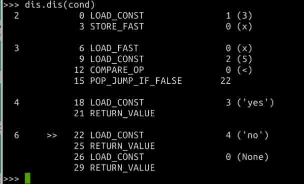
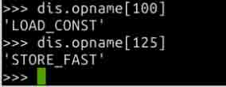
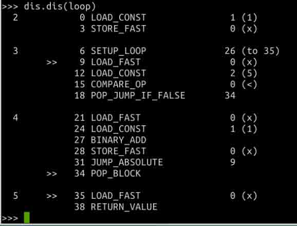

# 第 2 节 真实的 Python 字节码

## 一、Python 字节码

本节课开始我们要接触真实的 Python 字节码了！Python 字节码与我们之前自己定义的指令的不同之处在于它并不是用一个长长的名字来表示一个指令而是用一个字节。

让我们实地观察一下它，打开 python 交互环境，先定义一个方法：

```py
>>> def cond():
...     x = 3
...     if x < 5:
...         return 'yes'
...     else:
...         return 'no' 
```

Python 会在运行时暴露大量的内部信息，拿定义的 cond 方法举例，`cond.__code__`是其`code object`，`cond.__code__.co_code` 是其字节码，它们也许对你写代码一点用都没有，但这里我们可以通过它们了解 Python 的运行机制。

```py
>>> cond.__code__.co_code  # 字节码组成的字节串
b'd\x01\x00}\x00\x00|\x00\x00d\x02\x00k\x00\x00r\x16\x00d\x03\x00Sd\x04\x00Sd\x00
   \x00S'
>>> list(bytearray(cond.__code__.co_code))  # 将每个字节转换成数字
[100, 1, 0, 125, 0, 0, 124, 0, 0, 100, 2, 0, 107, 0, 0, 114, 22, 0, 100, 3, 0, 83, 
 100, 4, 0, 83, 100, 0, 0, 83] 
```

 嗯，好像什么端倪都看不出来，还是借助别的工具吧，标准库中的`dis`模块常常用来查看字节码。

`dis`是一个字节码反汇编器，它可以将字节码以人类可读的方式进行输出。

查看输出：



可以看出输出分成 5 列。这 5 列分别指：

1.  字节码对应的在源代码中的行号
2.  该字节码在字节码串中的第几个字节，也就是该字节码的序号。
3.  字节码的人类可读的名字
4.  字节码参数
5.  字节码参数的内容提示

通过前两个指令的序号 0 跟 3，你想到可能一个指令加上它的参数一共占 3 个字节，我们取前两个指令的内容考察一下：[100, 1, 0, 125, 0, 0]。这 100 与 125 大概就是指令了吧，通过 `dis.opname`验证一下我们的猜想：



猜的没错, 但是为什么参数会占两个字节呢？以第一个解释器举例，如果只占一个字节，那常量列表最多只能装下 256 个常量，如果我们是在处理字符串，这就很可能不够用了。

我想你也发现了`LOAD_CONST`就像之前的`LOAD_VALUE`, `STORE_FAST`就像之前的`STORE_NAME`，它们合在一起就是一次赋值操作，正对应源代码第二行的`x = 3`。

## 二、条件判断与循环

代码遇到条件判断与循环就会出现跳转执行的情况，这部分字节码又是怎么处理的呢？

源代码的第三行`if x < 5:`就是做判断跳转的位置，查看第三行的字节码展开：

```py
 3           6 LOAD_FAST                0 (x)
              9 LOAD_CONST               2 (5)
             12 COMPARE_OP               0 (<)
             15 POP_JUMP_IF_FALSE       22 
```

前两句分别是将 x 的值与常量 5 压栈，第三句弹出栈顶的两个值进行比较，小于则为真，否则为假，再将结果压栈。最后一句弹出栈顶的值，如果该值为假则跳转到序号为 22 的指令上去，否则继续执行。

查看 22 所在的位置：

```py
 6     >>   22 LOAD_CONST               4 ('no')
             25 RETURN_VALUE
             26 LOAD_CONST               0 (None)
             29 RETURN_VALUE 
```

这里对应源代码的第六行，正是条件判断为假后需要跳转的位置。

考察完了条件判断再来看一下循环结构代码的字节码展开：

```py
>>> def loop():
...      x = 1
...      while x < 5:
...          x = x + 1
...      return x 
```



查看源代码第三行`while x < 5:`的字节码展开：

```py
 3           6 SETUP_LOOP              26 (to 35)
        >>    9 LOAD_FAST                0 (x)
             12 LOAD_CONST               2 (5)
             15 COMPARE_OP               0 (<)
             18 POP_JUMP_IF_FALSE       34 
```

除了第一句，其它四句跟之前条件判断跳转的字节码差不多，如果条件为假则跳到循环结束的位置。第一句无疑标志了循环的开始位置，同时它的参数指明了循环结束之后代码开始的位置。

查看循环将近结束的位置：

```py
 31 JUMP_ABSOLUTE            9 
```

`JUMP_ABSOLUTE` 使解释器跳转到循环开始的位置继续执行。

### 小练习

尝试使用 `dis.dis` 反汇编你写的程序，回答下面几个问题：

*   `for`循环与`while`循环生成的字节码是否有区别，什么区别？
*   如何写出两段不同的代码却能够生成相同的字节码？
*   `elif` 是如何工作的？列表推导呢？

## 三、帧(Frame)

到现在，我们知道了一个函数内的代码是如何被编译运行的，那函数外呢，`RETURN_VALUE` 之后又是什么呢？为了回答这个问题，需要再引入一个概念：帧。帧包含了一段代码运行所需要的信息与上下文环境。帧在代码执行时被动态地创建与销毁，每一个帧的创建对应一次函数调用，所以每一个帧都有一个`code object`与其关联，同时一个`code object`可以拥有多个帧，因为一个函数可以递归调用自己多次。

帧存在于调用栈中,你在程序异常时所看到的`Traceback`就是调用栈中的信息。调用栈顾名思义就是每当你在当前函数内调用一次函数就在当前调用栈上压入所调用的函数的帧，在所调用函数返回时再将该帧弹出。这里再说下解释器用到的另外两个栈，第一个我们已经接触过了，就是数据栈，执行字节码操作时使用的栈。还有一个叫作块栈，用于特定的控制流，比如循环与异常处理。每一个帧都拥有自己的数据栈与块栈。

举个具体例子来说明一下，以下代码的调用顺序是 main(模块)->foo()->bar()

```py
>>> def bar(y):
...     z = y + 3     # <--- (3) ... 现在解释器执行到这里
...     return z
...
>>> def foo():
...     a = 1
...     b = 2
...     return a + bar(b) # <--- (2) ... 调用 bar 函数
...
>>> foo()             # <--- (1) 我们在 foo()中 
```

下图显示当前调用栈中的内容：


我们现在在`bar()`中，在该函数返回后,`bar Frame`就会被弹出，`foo Frame`也是同理。

`RETURN_VALUE`令解释器在帧之间传递一个值，首先调用栈的栈顶帧的数据栈的栈顶值会被弹出，之后丢弃栈顶帧，将之前弹出的值压到下一个帧的数据栈中。这样就完成了一次`RETURN_VALUE`。

本节课到这里结束啦，这节课就是考察了一下字节码的特征与解释器的栈结构，需要编码的部分几乎没有吧，但是掌握了很多新知识呀。下节课我们就要运用学到的新知识实现 python 解释器啦，下节课见～