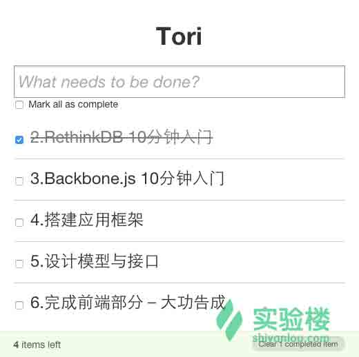

# 第 2 节 RethinkDB 10 分钟入门

## 安装 Server

**（注：实验楼环境已同时安装了 RethinkDB server 与 client driver，所以这步直接跳过）**

### Ubuntu

1.通过 `apt-get` 安装，但首先要将 RethinkDB 仓库加入到源中：

```py
$ source /etc/lsb-release && echo "deb http://download.rethinkdb.com/apt $DISTRIB_CODENAME main" | sudo tee /etc/apt/sources.list.d/rethinkdb.list
$ wget -qO- http://download.rethinkdb.com/apt/pubkey.gpg | sudo apt-key add -
$ sudo apt-get update
$ sudo apt-get install rethinkdb 
```

2.通过源代码安装：

安装依赖包：

```py
$ sudo apt-get install build-essential protobuf-compiler python \
                       libprotobuf-dev libcurl4-openssl-dev \
                       libboost-all-dev libncurses5-dev \
                       libjemalloc-dev wget 
```

获得源码&编译安装：

```py
$ wget http://download.rethinkdb.com/dist/rethinkdb-2.0.3.tgz
$ tar xf rethinkdb-2.0.3.tgz

$ cd rethinkdb-2.0.3
$ ./configure --allow-fetch
$ make
$ sudo make install 
```

### Mac OSX

1.homebrew 安装：

```py
brew update && brew install rethinkdb 
```

2.通过源代码安装：

```py
$ wget http://download.rethinkdb.com/dist/rethinkdb-2.0.3.tgz
$ tar xf rethinkdb-2.0.3.tgz

$ cd rethinkdb-2.0.3
$ ./configure --allow-fetch
$ make
$ sudo make install 
```

## 安装 Client Driver

本课程使用 python 作为客户端语言

```py
$ sudo pip install rethinkdb 
```

关于安装其他语言的客户端驱动，访问：

http://www.rethinkdb.com/docs/install-drivers/

## 10 分钟入门

首先让我们开启 RethinkDB server

```py
$ rethinkdb 
```

打开 python shell

```py
$ python 
```

导入 rethinkdb 库

```py
import rethinkdb as r 
```

### 建立连接

RethinkDB 服务端的默认端口是 `28015`

```py
r.connect( "localhost", 28015).repl() 
```

`repl` 命令是方便你在 shell 中运行查询命令的，有了它你就不需要调用 `run` 来显示地运行查询命令了，当然在 app 中还是需要显式地调用 `run` 的。

### 创建新的数据表

RethinkDB 默认创建数据库 `test`， 在 `test` 中创建表 `authors`：

```py
r.db("test").table_create("authors").run() 
```

显示结果：

```py
{
    "config_changes": [
        <table configuration data>
    ],
    "tables_created": 1
} 
```

对于上面这条命令我们注意到以下 3 点：

*   `db` 命令选择数据库 `test`
*   `table_create` 命令创建数据表
*   最后 `run` 命令将查询发送到了服务端

RethinkDB 的所有的查询命令都依照以上形式。

### 插入数据

让我们插入三条新数据到 `authors` 表中：

```py
r.table("authors").insert([
    { "name": "William Adama", "tv_show": "Battlestar Galactica",
      "posts": [
        {"title": "Decommissioning speech", "content": "The Cylon War is long over..."},
        {"title": "We are at war", "content": "Moments ago, this ship received..."},
        {"title": "The new Earth", "content": "The discoveries of the past few days..."}
      ]
    },
    { "name": "Laura Roslin", "tv_show": "Battlestar Galactica",
      "posts": [
        {"title": "The oath of office", "content": "I, Laura Roslin, ..."},
        {"title": "They look like us", "content": "The Cylons have the ability..."}
      ]
    },
    { "name": "Jean-Luc Picard", "tv_show": "Star Trek TNG",
      "posts": [
        {"title": "Civil rights", "content": "There are some words I've known since..."}
      ]
    }
]).run() 
```

返回了一个对象，看上去是 JSON 格式，像这样：

```py
{
    "unchanged": 0,
    "skipped": 0,
    "replaced": 0,
    "inserted": 3,
    "generated_keys": [
        "7644aaf2-9928-4231-aa68-4e65e31bf219",
        "064058b6-cea9-4117-b92d-c911027a725a",
        "543ad9c8-1744-4001-bb5e-450b2565d02c"
    ],
    "errors": 0,
    "deleted": 0
} 
```

注意到我们没有指定主键 `id`，RethinkDB 帮助我们生成了，可以通过`generated_keys` 得到。

### 检索数据项

#### 得到数据表中的所有数据项

运行 `r.table('authors')` 查询就可以得到表 `authors` 中的所有数据项：

```py
cursor = r.table("authors").run()
for document in cursor:
    print(document) 
```

#### 过滤数据项

通过 `filter` 方法可以根据条件进行数据过滤，让我们查询名字是 `William Adama` 的数据项：

```py
cursor = r.table("authors").filter(r.row["name"] == "William Adama").run()
for document in cursor:
    print(document) 
```

查询发表超过两篇文章的作者：

```py
cursor = r.table("authors").filter(r.row["posts"].count() > 2).run()
for document in cursor:
    print(document) 
```

#### 通过主键查询数据项

```py
r.db('test').table('authors').get('7644aaf2-9928-4231-aa68-4e65e31bf219').run() 
```

### 更新数据

更新 `authors` 表，添加新字段 `type` 并设置为 fictional，注意到所有数据项的 `type` 字段的值都变成了 "fuctional"：

```py
r.table("authors").update({"type": "fictional"}).run() 
```

返回的 JSON 对象：

```py
{
    "unchanged": 0,
    "skipped": 0,
    "replaced": 3,
    "inserted": 0,
    "errors": 0,
    "deleted":0
} 
```

只更新名字为 `William Adama` 的数据项：

```py
r.table("authors").filter(r.row['name'] == "William Adama").update({"rank": "Admiral"}).run() 
```

返回的 JSON 对象：

```py
{
    "unchanged": 0,
    "skipped": 0,
    "replaced": 1,
    "inserted": 0,
    "errors": 0,
    "deleted": 0
} 
```

`Jean-Luc Picard` 新发表了一篇文章：

```py
r.table('authors').filter(r.row["name"] == "Jean-Luc Picard").
    update({"posts": r.row["posts"].append({
        "title": "Shakespeare",
        "content": "What a piece of work is man..."})
    }).run() 
```

### 删除数据

删除文章数小于 3 的数据项，抱歉了 Laura 与 Jean-Luc：

```py
r.table("authors").
    filter( r.row["posts"].count() < 3 ).
    delete().run() 
```

返回的 JSON 对象

```py
{
    "unchanged": 0,
    "skipped": 0,
    "replaced": 0,
    "inserted": 0,
    "errors": 0,
    "deleted": 2
} 
```

### 实时反馈

RethinkDB 最让人喜欢的一点就是它的实时反馈特性了。

让我们再开启一个终端，并在连接到 server 之后输入以下命令：

```py
cursor = r.table("authors").changes().run()
for document in cursor:
    print(document) 
```

切换回之前的终端，对数据库进行任意操作，再切换过去看看：

会得到以下结构的 JSON 数据：

```py
{
  "new_val": {
    "id": "1d854219-85c6-4e6c-8259-dbda0ab386d4",
    "name": "Laura Roslin",
    "posts": [...],
    "tv_show": "Battlestar Galactica",
    "type": "fictional"
  },
  "old_val": {
    "id": "1d854219-85c6-4e6c-8259-dbda0ab386d4",
    "name": "Laura Roslin",
    "posts": [...],
    "tv_show": "Battlestar Galactica"
  }
} 
```

查看 http://www.rethinkdb.com/docs/changefeeds/ruby/ 了解更多实时反馈的用法

原文链接：http://www.rethinkdb.com/docs/guide/python/

更多使用请查询：http://www.rethinkdb.com/api/python/

下课：）

