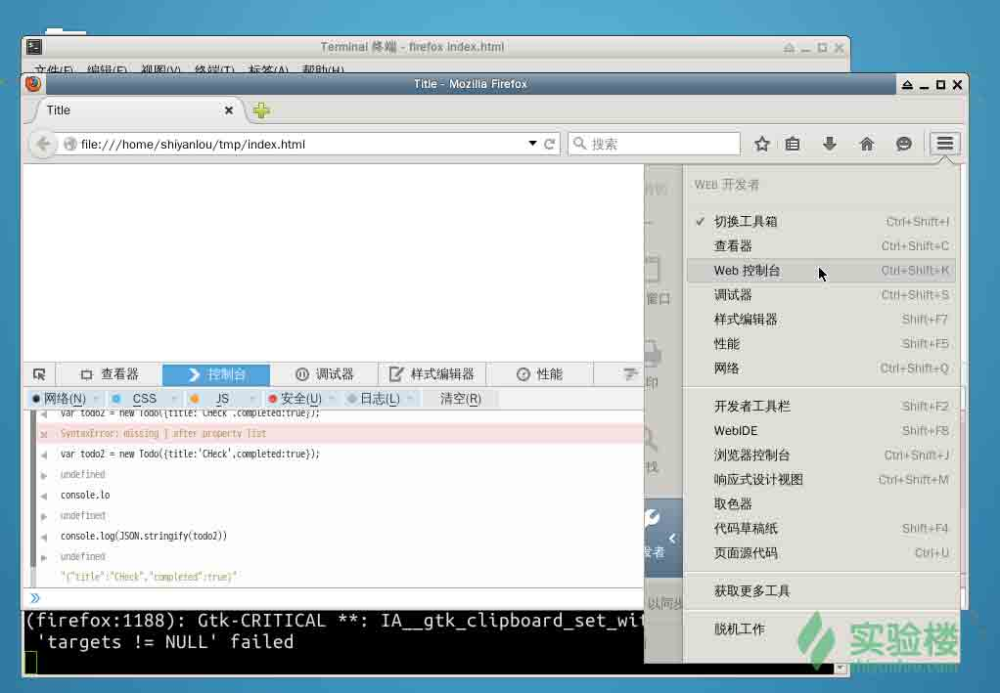
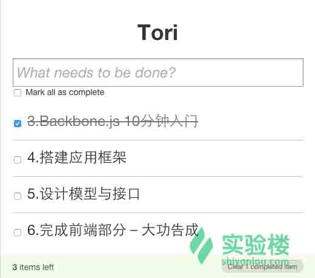

# 第 3 节 Backbone.js 10 分钟入门

## 基础概念

Backbone.js 提供了一套 web 开发的框架，通过 Models 进行 key-value 绑定及自定义事件处理，通过 Collections 提供一套丰富的 API 用于枚举功能，通过 Views 来进行事件处理及与现有的 Application 通过 RESTful JSON 接口进行交互.它是基于 jQuery 和 underscore 的一个前端 js 框架。

在 Backbonejs 有几个重要的概念，先介绍一下:Model，Collection，View，Router。其中 Model 是根据现实数据建立的抽象，比如人（People）；Collection 是 Model 的一个集合，比如一群人；View 是对 Model 和 Collection 中数据的展示，把数据渲染（Render）到页面上；Router 是对路由的处理，就像传统网站通过 url 现实不同的页面，在单页面应用（SPA）中通过 Router 来控制前面说的 View 的展示。

通过 Backbone，你可以把你的数据当作 Models，通过 Models 你可以创建数据，进行数据验证，销毁或者保存到服务器上。当界面上的操作引起 model 中属性的变化时，model 会触发 change 的事件。那些用来显示 model 状态的 views 会接受到 model 触发 change 的消息，进而发出对应的响应，并且重新渲染新的数据到界面。在一个完整的 Backbone 应用中，你不需要写那些胶水代码来从 DOM 中通过特殊的 id 来获取节点，或者手工的更新 HTML 页面，因为在 model 发生变化时，views 会很简单的进行自我更新。


## 实例操作

创建 index.html 文件，复制下列代码作为我们的基础模版：

```py
<!DOCTYPE HTML>
<html>
<head>
    <meta charset="UTF-8">
    <title>Title</title>
</head>
<body>

<script src="../Images/58b89f0a1c66c0bf5c3403aeb2ff2747.jpg"></script>
<script src="../Images/38f5a7dd1ae78c0153f44927148bfc02.jpg"></script>
<script src="../Images/3a73cb0d8249ab0ca94492318923a153.jpg"></script>
<script>
  // Your code goes here
</script>
</body>
</html> 
```

用 firefox 打开 index.html

```py
$ firefox index.html 
```

打开控制台方便下面的调试。



可以直接在控制台中输入代码，也可将代码粘贴到

```py
 <script>
        // Your code goes here
    </script> 
```

刷新查看效果。

## 模型（Model）

Backbone 模型包含了数据与与之相关的逻辑。举个例子，todo 项的模型可以包含 todo 的内容 `title` 与它的完成与否状态 `completed`。

扩展 `Backbone.Model` 创建 Todo 模型：

```py
var Todo = Backbone.Model.extend({});

// 我们可以创建一个不带参数的 Todo 实例
var todo1 = new Todo();
// log 会在浏览器的控制台 console 中打印
console.log(JSON.stringify(todo1));

// 创建时加上属性参数
var todo2 = new Todo({
  title: 'Check the attributes of both model instances in the console.',
  completed: true
});

// log 输出: {"title":"Check the attributes of both model instances in the console.","completed":true}
console.log(JSON.stringify(todo2)); 
```

#### 初始化

`initialize()` 方法会在模型实例被创建的时候调用。

```py
var Todo = Backbone.Model.extend({
  initialize: function(){
      console.log('This model has been initialized.');
  }
});

var myTodo = new Todo();
// Logs: This model has been initialized. 
```

**默认值**

有时候你希望你的模型有默认属性，就可以使用 `defaults` 方法。

```py
var Todo = Backbone.Model.extend({
  defaults: {
    title: '',
    completed: false
  }
});

// 现在我们的模型有了默认属性
var todo1 = new Todo();

// log 输出: {"title":"","completed":false}
console.log(JSON.stringify(todo1));

// 可以初始化默认的属性:
var todo2 = new Todo({
  title: 'Check attributes of the logged models in the console.'
});

// log 输出: {"title":"Check attributes of the logged models in the console.","completed":false}
console.log(JSON.stringify(todo2)); 
```

#### 监听模型的 `change` 事件

如果你想在模型被改变时收到通知，可以绑定监听器，一般都在 `initialize()` 中绑定监听器：

```py
var Todo = Backbone.Model.extend({
  defaults: {
    title: '',
    completed: false
  },
  initialize: function(){
    console.log('This model has been initialized.');
    this.on('change', function(){
        console.log('- Values for this model have changed.');
    });
  }
});

var myTodo = new Todo();

myTodo.set('title', 'The listener is triggered whenever an attribute value changes.');
console.log('Title has changed: ' + myTodo.get('title'));

myTodo.set('completed', true);
console.log('Completed has changed: ' + myTodo.get('completed'));

myTodo.set({
  title: 'Changing more than one attribute at the same time only triggers the listener once.',
  completed: true
}); 
```

## 集合（Collections）

集合是模型的有序组合，我们可以在集合上绑定 "change" 事件，从而当集合中的模型发生变化时 fetch（获得）通知，集合也可以监听 "add" 和 "remove" 事件， 从服务器更新，并能使用 Underscore.js 提供的方法。

集合中的模型触发的任何事件都可以在集合身上直接触发，所以我们可以监听集合中模型的变化： documents.on("change:selected", ...)

在下面的集合中，我们创建 TodoCollection ，它会包含 todo 模型:

```py
var Todo = Backbone.Model.extend({
  defaults: {
    title: '',
    completed: false
  }
});

var TodosCollection = Backbone.Collection.extend({
  model: Todo
});

var myTodo = new Todo({title:'Read the whole book', id: 2});

var todos = new TodosCollection([myTodo]);
console.log("Collection size: " + todos.length); // Collection size: 1 
```

### 使用 fetch 从 Server 端获取数据

`Collections.fetch()` 方法通过向指定的 URL 发送 GET 请求来从服务器端获取模型数据，一旦接收到数据，就会自动调用 `set()` 更新集合。

```py
var Todo = Backbone.Model.extend({
  defaults: {
    title: '',
    completed: false
  }
});

var TodosCollection = Backbone.Collection.extend({
  model: Todo,
  url: '/todos'
});

var todos = new TodosCollection();
todos.fetch(); // sends HTTP GET to /todos 
```

### 发送数据到 Server 端

`save()` 方法会 POST 对应的 Model 对象（json 数据）到配置好的 url 上。

```py
var Todo = Backbone.Model.extend({
  defaults: {
    title: '',
    completed: false
  }
});

var TodosCollection = Backbone.Collection.extend({
  model: Todo,
  url: '/todos'
});

var todos = new TodosCollection();
todos.fetch();

var todo2 = todos.get(2);
todo2.set('title', 'go fishing');
todo2.save(); // sends HTTP PUT to /todos/2

todos.create({title: 'Try out code samples'}); // sends HTTP POST to /todos and adds to collection 
```

### 从 Server 端删除模型

```py
var Todo = Backbone.Model.extend({
  defaults: {
    title: '',
    completed: false
  }
});

var TodosCollection = Backbone.Collection.extend({
  model: Todo,
  url: '/todos'
});

var todos = new TodosCollection();
todos.fetch();

var todo2 = todos.get(2);
todo2.destroy(); // sends HTTP DELETE to /todos/2 and removes from collection 
```

## 视图（Views）

#### 创建一个新的视图

扩展 `Backbone.View` 创建视图：

```py
var TodoView = Backbone.View.extend({

  tagName:  'li',

  // 缓存单个项的模版函数
  todoTpl: _.template( "An example template" ),

  events: {
    'dblclick label': 'edit',
    'keypress .edit': 'updateOnEnter',
    'blur .edit':   'close'
  },

  initialize: function (options) {
    this.options = options || {};
  },

  // 重新渲染 todo 的 title
  render: function() {
    this.$el.html( this.todoTpl( this.model.attributes ) );
    this.input = this.$('.edit');
    return this;
  },

  edit: function() {
  },

  close: function() {
  },

  updateOnEnter: function( e ) {
  }
});

var todoView = new TodoView();

// log view 实例相对应的 Dom 元素
console.log(todoView.el); // log 输出 <li></li> 
```

#### 什么是 `el`?

视图的关键属性是 `el` 。`el` 是什么？它是怎么被定义的？

`el` 是 DOM 元素的一个引用，所有的视图都需要它。视图使用 `el` 组织元素的内容然后一次性插入到 DOM 中，这样就能减少浏览器重新绘制的次数。

有两种方法可以将 DOM 与视图关联起来：在视图中创建新元素随后再加入到 DOM 中或者引用已存在的 DOM 元素。

如果你想创建新元素，可以设置以下任意属性： `tagName`， `id` 与 `className`。`el` 会引用到你创建的元素。当没有指定 `tagName` 内容的时候，其值默认为 `div` 。在上面的例子中，将 `tagName` 设置成 'li' 就能创建 li 元素了。

下面的例子中创建了带有 id 与 class 属性的 ul 元素：

```py
var TodosView = Backbone.View.extend({
  tagName: 'ul', 
  className: 'container',                               
  id: 'todos'
});

var todosView = new TodosView();
console.log(todosView.el); // log 输出 <ul id="todos" class="container"></ul> 
```

上述代码创建了 DOM 元素，但还没有将它加入到 DOM 中去。

你也可以像设置 CSS 选择器一样设置 `el` 来引用页面中的 DOM：

```py
el: '#footer' 
```

可以在创建实例的时候就这么做：

```py
var todosView = new TodosView({el: $('#footer')}); 
```

### events hash

Backbone events hash 可以允许我们添加事件监听到 el——用户自定义的选择器，或者未指定选择器的时直接监听到 el。事件以{"事件名称 选择器": "回调函数"}的格式表示，支持大量的 DOM 事件，包括 click, submit, mouseover, dblclick 还有更多。

```py
// A sample view
var TodoView = Backbone.View.extend({
  tagName:  'li',

  // with an events hash containing DOM events
  // specific to an item:
  events: {
    'click .toggle': 'toggleCompleted',
    'dblclick label': 'edit',
    'click .destroy': 'clear',
    'blur .edit': 'close' 
```

## },

以上已包含制作我们的 app 所需要的所有要点，更多内容可以参考：

*   [Backbone.js 入门教程第二版](https://github.com/the5fire/backbonejs-learning-note)
*   [Developing Backbone.js Applications](http://addyosmani.github.io/backbone-fundamentals/)

下课～

