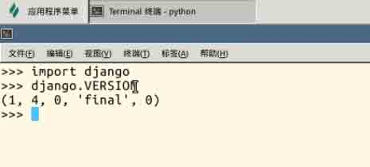
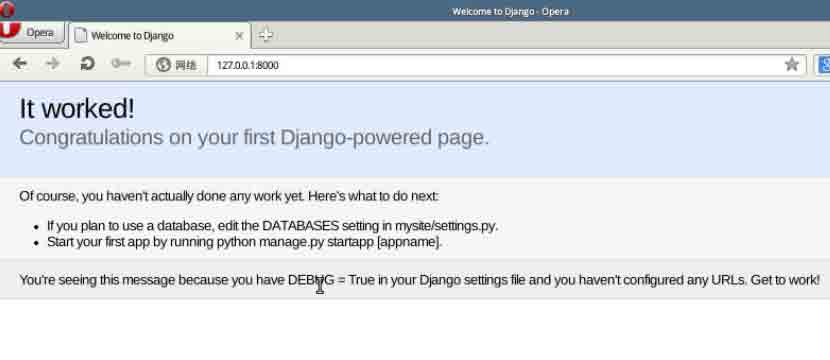
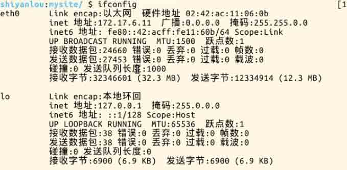
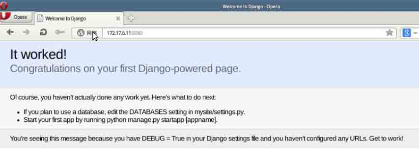

# 第 2 节 Django 入门

## 实验简介

虽然平台上已经搭建好了 Django 的环境，但是我们必须知道在自己的 Linux 上怎么搭建 Django。

## 一、Python 的版本选择

Django 的核心(1.4+)可以运行在从 2.5 到 2.7 之间的任何 Python 版本。Django 的可选 GIS(地理信息系统) 支持则需要 Python 2.5 到 2.7 的版本。

如果你不确定要安装哪个 Python 版本，并且你也可以随意选择的话，我们建议选择 2.x 系列中的最新版本： 2.7。

虽然 Django 在 2.5 到 2.7 的版本之间都一样运行良好，但是新版本的 Python 会有一些性能提升和新增的语言特性，你可以将其用到你 的程序中。另外，一些你可能会用到 Django 的三方插件可能会要求比 2.5 更新的 Python 版本，所以选择较新 的 Python 版本可以让你由更多选择。

> Python3.3 已经发布，但是 Django 对 Python3 的支持还只是实验性的(django1.5.x)。 因为 Python3.x 引入了相当多的不向后兼容的更新，目前很多主要的 Python 类库和框架(包括 Python1.4)都还没能跟上。

## 二、安装 Django

任何时候，都有两个不同版本的 Django 可供您选择：最新的正式发行版和最前沿的开发版本。安装哪个版本 取决于你。你是想要一个稳定的经过测试的 Django 还是一个包括最新功能，但是可能不那么稳定的 Django (也许你可以对 Django 本身做贡献)。

### 1\. 在 Ubuntu 下:

```py
$ sudo apt-get install python-pip
$ sudo apt-get install python-virtualenv
$ mkdir ~/django
$ cd ~/django
$ virtualenv env
$ source env/bin/activate
$ pip install -i http://mirrors.aliyuncs.com/pypi/simple django==1.4 
```

**第 1 行**：我们准备通过 python pip 来安装 django，所以先安装 pip

**第 2 行**：安装 python-virtualenv 是为了在本地创建一个独立的 python 环境，我们就算出错了也不会对本机的 python 造成影响。

**第 3-6 行**：创建一个用于工作的 python 的独立目录(名字任意)，运行命令`virtualenv env`创建一个名叫 env（名字任意）的 pyhton 独立环境，这个环境和本机的 python 环境是不会相互影响的。第 6 行启用 env 环境。

**第 7 行**：pip 会安装最新版的 django(本课程写作时为 1.7)，所以要指定`django==1.4`。

[详细了解 virtualenv](http://www.nowamagic.net/academy/detail/1330228)

[详细了解 python pip](http://hxl2009.blog.51cto.com/779549/1334664)

### 2\. 在 Unix 系统中安装的方法:

```py
tar xzvf Django-1.4.2.tar.gz
cd Django-*
sudo python setup.py install 
```

如果你好奇的话，Django 会被安装到 Python 安装目录中的 site-packages 目录中(Python 从该目录中 寻找三方库)。通常情况下，这个目录的绝对路径是 /usr/lib/python2.7/site-packages.

### 3\. 检查 Django 的安装

让我们花点时间检查一下 Django 是否已经安装成功，并工作良好。在一个命令提示符窗口中，切换到另外一个目录 （确保不是包含 Django 的目录），然后输入 python 来打开 Python 的交互解释器(interactive interpreter) 。如果安装是成功的，你现在应该可以导入 django 模块了： 

## 三、数据库

实验楼平台已经安装了 mysql 和 sqlite3 作为默认数据库， 大可不必自行安装。

Django 支持四种数据库:

PostgreSQL (http://www.postgresql.org/) SQLite 3 (http://www.sqlite.org/) MySQL (http://www.mysql.com/) Oracle (http://www.oracle.com/)

### 1\. 设置数据库

首先，你需要安装和配置数据库本身。这个过程已经超出了本课程的内容。这四种数据库的网站上都可以找到丰富的文档。

然后，你需要为你的数据库后端安装必要的 Python 库。这是一些允许 Python 连接数据库的第三方代码。马上，我们会为每种数据库单独列出需要安装的东西。

**在 Django 使用 PostgreSQL** 如果你要使用 PostgreSQL 的话，你需要从 http://www.djangoproject.com/r/python-pgsql/ 下载 psycopg 或者 psycopg2 包。我们推荐使用 psycopg2 ,因为它更新一些，开发也活跃一些，也更 容易安装。安装哪个都行，只是要注意记着你用的到底是那个版本，1 还是 2，后面会用到。

如果用 Linux 的话，查看你的发行版是否提供了“python-psycopg2”, “psycopg2-python”或类似名字的包。

**在 Django 使用 SQLite 3** 如果你用 SQLite 3 的话，你很幸运，你不需要去安装一个特定的数据库了，因为 Python 自带 SQLite 支持。直接跳到下一节吧。

**在 Django 使用 MySQL** Django 要求 MySQL4.0 或更新的版本。3.x 版本不支持嵌套子查询和其他一些相当标准的 SQL 语句。

你还需要从 http://labfile.oss.aliyuncs.com/files0422/MySQL-python-1.2.4b4.tar.gz 下载安装 MySQLdb 包。

如果你使用 Linux，查看一下你的包管理器是否提供了叫做“python-mysql”, “python-mysqldb”, “mysql-python” 或者 类似名字的包。

**在 Django 使用 Oracle** Django 要求 Oracle9i 或者更高的版本。

如果你使用 Oracle，你需要安装 cx_Oracle 库，可以在 http://cx-oracle.sourceforge.net/ 获得。 请使用 4.3.1 或更高的版本，但是要避免使用 5.0 这个版本，这个版本的驱动有 Bug。5.0.1 版本就修复了这个 bug 了，你可以使用 它以上的版本。

## 四、创建一个项目(project)

安装好 Python，Django，配置好数据库(这一步不是必须的)之后。你就可以迈出开发的第一步： 创建一个 project。

Django 的 project 是一个 Django 的示例，包括一系列的设置，如数据库的设置，Django 特定的选项以及你的程序的一些配置。 如果第一次使用 Django，你需要做一些初始化工作。新建一个工作目录：`mkdir ~/work`

> 这个目录应该放在哪儿？ > 如果你有过 PHP 背景的话，你可能习惯于把代码放到 Web 服务器的根目录(比如 /var/www )。 但是在 Django 中 不要这样做，这样你的源代码有可能被人通过网络查看到，这可不好。 > 把代码放在文档根目录 之外 的目录中。

进到你刚刚创建的目录，运行`django-admin.py startproject mysite`。 这条命令会在当前目录下创建一个 mysite 子目录（如果 tree 命令找到安装可以通过下列命令安装）。

```py
$ sudo apt-get install tree 
```


> 如果你运行 django-admin.py startproject 碰到“permission denied”这样的错误。你需要修改这个文件的权限。 进入到存放 django-admin.py 的目录(如 cd /usr/local/bin)，运行 chmod +x django-admin.py 。

startproject 命令会创建一个目录，里面包括 5 个文件：

**mysite/**: 外面这个 mysite/ 目录只是你包含你的项目的目录， Django 并不在意它的名字，你可以将它重命名成你任何你喜欢的名字。

**manage.py**: 命令行工具集，供你去操作本 Django 项目。输入 python manage.py help 可以查看 它到底提供了哪些功能。注意，千万不要去修改这个文件，我们在这里生成它纯粹是为了方便。

**mysite/mysite/**: 项目内部的这个 mysite/ 目录是你的项目的一个 Python 包(package)。他的名字就是 package 的名字，你需要通过这个名字导入包里面的内容(比如， import mysite.settings)。

**__init__.py**: 让 Python 把 mysite 目录当作一个包(一组 Python 模块)所必须的文件。这是一个空文件，通常情况下，不要往里面添加内容。

**settings.py**: 该 Django 项目的设置/配置。你可以先过目一下这个文件，可以了解到可以进行哪些配置和已有的默认值。

**urls.py**: Django 项目的 URL 设置。这个文件相当于你的 Django 网站的目录。

**wsgi.py**: 是兼容 WSGI 的 Web 服务器伺服你的项目的入口文件。更多细节请查阅“如何通过 WSGI 部署”(https://docs.djangoproject.com/en/1.4/howto/deployment/wsgi/)。

尽管这些文件很小，但是这些文件已经构成了一个可运行的 Django 程序。

## 五、运行开发服务器

为了让你对 Django 有更多的体验，我们来运行一个 Django 的开发服务器，来看看我们的已经有了些什么。

Django 的开发服务器是（也被叫做“runserver”，这是来自于运行这个 server 的命令）一个用在你开发期间的内建的轻量的 Web 服务器。我们提供这个服务器是为了让你能快速开发你的 Web 程序，在准备发布到生产环境前，你都不需要去配置你生产环境的服务器。开发服务器会自动的检测代码的改变，并且自动加载它，这样，你修改代码后， 不需要去重启服务器。

切换到你项目的目录，运行这个命令就可以启动开发服务器了：


这样，你的计算机上就有了一个监听 8000 端口，只接受从从你自己电脑上发出本地连接的服务器。服务器有了， 现在就可以用浏览器访问 http://127.0.0.1:8000/ 。你会看到一个令人赏心悦目的淡蓝色的 Django 欢迎 页面，不同的 Django 版本可能会有些差别，不过你会在页面上看到“Welcome to Django”的字样。It worked！



最后还要多提以下这个开发服务器。虽然 Django 自带的这个 Web 服务器对于开发很方便，但是，千万不要在生产环境用它。 这个服务器同一时间只能可靠地处理一个连接，而且也没有任何的安全检查。在发布你的站点前，请了解 如何部署 Django。

> **更改开发服务器的主机地址或者端口** > 默认情况下， runserver 命令会在 8000 端口启动一个开发服务器，仅仅监听本地连接。如果遇到端口冲突，你想要更改服务器的端口，可以在命令行中指定端口： > `python manage.py runserver 8080`

> 完成这些设置后，你局域网内的其他电脑就可以在浏览器中通过你的 IP 访问你的 Django 站点了，比如： http://192.168.1.103:8000/ 。（注意，你要检查以下你的网络配置，来查看你的 IP 地址。Unix 用户可以在命令提示符中输入 ifconfig 来获取。Windows 用户用 ipconfig 命令。）






好了，我们已经安装好了所有的东西，开发服务器也跑起来了。我们就可以开始学习基础知识，用 Django 来开发自己的站点了。

## 六、小结

本节讲解了 Django 的安装，推荐使用 pip 和 virtualenv，创建项目可以使用`django-admin.py startproject`命令，启动服务器可以使用`python manage.py runserver`命令。

## 作业

请搭建一个名称为 shiyanlou 的 Django 项目，并使用 8888 监听端口启动开发服务器。