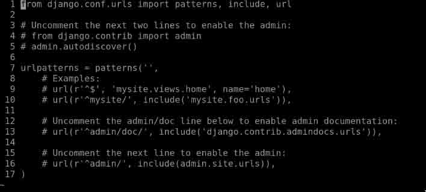
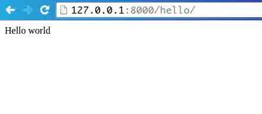
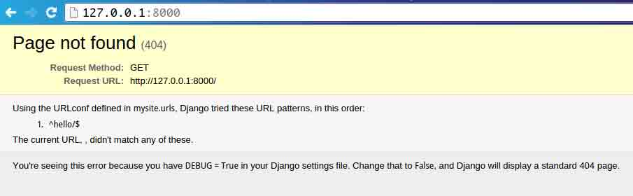
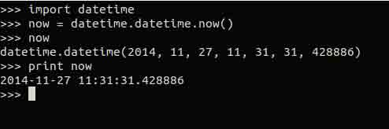
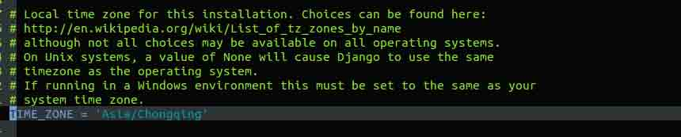
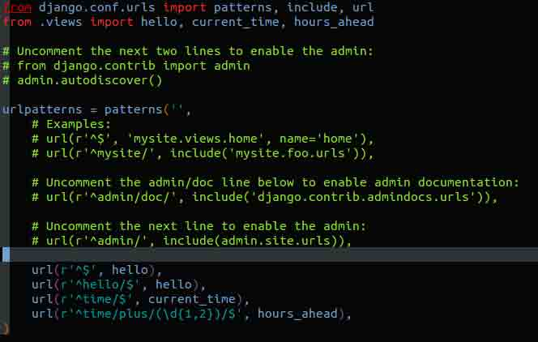

# 第 3 节 视图和 URL 配置

## 实验简介

上一章里我们介绍了如何创建一个 Django 项目并启动 Django 的开发服务器。本章你将学到用 Django 创建动态网页的基本知识。 同时，也教会大家怎么在本地机器上建立一个独立的 python 运行环境，记得每次开始工作之前要使用以下命令切换到 virtualenv 环境哦：）

```py
source env/bin/activate 
```

> 注意 > 以上命令中的 env 是自己命名的，来自这个命令`virtualenv env`, env 可以用任何你喜欢的命名替代。

## 一、第一个 Django 页面：Hello World

我们的第一个目标，创建一个网页，输出那个最著名的例子：“Hello world.”。

如果你曾经在没有 Web 框架的情况编写过一个简单的“Hello world”页面，你只要简单地在一个文本文件中输入“Hello world” ，将文件保存为 hello.html ，然后上传到你的 Web 服务器的一个目录中即可。

不过注意，在这个过程中，你已经 指定了这个网页的两个关键信息：它的内容(字符串： Hello world )和它的 URL(`http://www.example.com/hello.html`， 如果你吧文件放在一个子目录中，也可能是`http://www.example.com/files/hello.html`)。

在 Django 中，你也需要指定这两个信息，只不过得用不同的方法。网页的内容是靠视图函数(view function)来生成的， URL 则专门配置在 URL 配置中(URLconf)。首先，让我们来写我们的“Hello World” view function 吧。

### 1\. 第一个视图(views.py)

进入到上一章我们用 django-admin.py startproject 创建的 mysite 目录(包含 _*init*_.py)中。创建一个叫做 views.py 的空文件。这个 Python 模块(module)将包含这一章我们将要编写的视图。这个 views.py 的名字 并没有特别的要求，Django 并不要求它叫什么名字，不过根据惯例，把它叫做 views.py 会让其他开发者更容易读懂 你的代码。

我们的“Hello world”视图很简单，完全是写定义函数，和导入包的语句。在 views.py 中输入这些内容：

```py
from django.http import HttpResponse

def hello(request):
    return HttpResponse("Hello world") 
```

**让我们来逐句分析这段代码：**

首先，我们从 django.http 中导入了 HttpResponse 这个类。我们会在接下来用到这个类。

接着，我们定义了一个叫做 hello 的视图函数(view function)。

每个 view function 至少要有一个参数，通常被叫做 request 。这是一个对象，包含了触发这个 view function 的 Web 请求的信息， 它是 django.http.HttpRequest 的一个实例(instance)。 在这个例子中，虽然我们不对这个 request 做任何处理，但是我们还必须要把它作为视图的第一个参数。

view function 的名字并不重要；Django 并不需要它以某种特定的方式命名。这里我们叫它 hello 是因为 hello 清晰地表明这个视图的用意。你当然也可以叫它 hello*wonderful*beautiful_world 或者其他差不多恶心的名字。下一小节“第一个 URLconf”将会介绍 Django 如何找到这个函数。

这个函数只有一行简单的代码：它仅仅返回一个 HttpResponse 对象，这个对象包含了文本“Hello world”。

记住，一个视图本身就是一个 Python 的函数，这个函数接受一个 HttpRequest 作为它的第一个参数，并返回 一个 HttpResponse 的实例。要想让一个 Python 函数成为一个 Django 的视图，你需要让它满足这两个条件。 （也有例外，我们稍后会讲到。）

## 二、第一个 URLconf

现在，如果你再运行`python manage.py runserver`，你还是会看到“Weclome to Django”的欢迎页面， 而看不到我们刚刚写的“Hello world”视图。因为我们的项目 mysite 还不知道有 hello 这个视图； 我们需要显式地告诉 Django 要让哪个 URL 来激活这个视图。 (这就像上面那个发布静态 HTML 的例子中，我们已经 创建了 HTML 文件，但是还没有把它上传到服务器上。) 在 Django 里，要关联 view function 到一个 URL，需要用到 URLconf。

URLconf 就像是你的 Django 站点的目录。本质上，它是一个 URL 和这个 URL 将调用的 view function 之间的映射关系。 通过这种方式，你就可以告诉 Django：“对于这个 URL，调用这段代码，对于那个 URL，调用那段代码。”例如，当用户访问 /foo/ 时，调用 view function foo_view() ， 这个 view function 在 views.py 中。

在前一章，你执行 django-admin.py startproject 时，Django 已经自动为你创建了一个 URLconf，就是 urls.py 那个文件。默认的 urls.py 会是下面这个样子：



URLconf 中带了一些被注释的功能，这些在 Django 中经常会被用到，所有你只要去掉那些功能的注释就可以 开启这些功能。下面是忽略掉被注释掉的内容后，`urls.py` 中实际的内容：

```py
from django.conf.urls.defaults import patterns, include, url

urlpatterns = patterns('',
) 
```

照例，我们来逐行分析这些代码：

第一行从 django.conf.urls.defaults 中导入了三个函数。这三个函数是 Django URLconf 的基本构造： patterns, include 和 url。 第二行调用 patterns 这个函数，并把结果保存在一个叫做 urlpatterns 的变量中。 patterns 函数接受一个空字符串作为参数。(这个字符串被用作一个视图函数的通用前缀，我们会在 Chapter 8: Advanced Views and URLconfs 深入介绍。) 这里要注意的是 urlpatterns 这个变量，Django 会在你的 URLconf 模块中寻找它。这个变量定义了 URL 和处理这个 URL 请求的代码的映射关系。默认情况下，URLconf 是空白的，你的 Django 程序还是白板一块。 (如果你的 URLconf 是空的，Django 就会认为这个项目是刚刚创建的，所以它会显示那个欢迎页面。)

要在 URLconf 中增加一个 URL 和 view，只需要添加一个 URL 模式和 view function 的映射即可。这里演示如果 将我们的 hello 视图关联起来：

```py
from django.conf.urls.defaults import patterns, include, url
from mysite.views import hello

urlpatterns = patterns('',
    url(r'^hello/$', hello),
) 
```

> 注意，为了简洁，我们移除了注释代码。如果你喜欢的话，你也可以保留那些行。

**我们做了两处修改：**

首先，我们从模块**mysite/views.py**中导入了 hello 这个 view function。Python 的导入语法用**mysite.views**表示 mysite/views.py 。(这段代码假设了**mysite/views.py**在 Python 的搜索路径中，下面的注释中会有详细介绍。) 接着，我们添加了**url(r'^hello/$', hello)**, 到 urlpatterns 中。这一行被叫做一个**URLpattern**。 url() 函数会告诉 Django 如何处理你配置的 url。 url() 的第一个参数是一个模式匹配字符串( 正则表达式，稍后会有详细介绍)，第二个参数处理这个 URLpattern 的 view function。 url() 还接受第三个参数，我们以后再详细介绍。

> 注意 > 另一个值得注意的地方是，我们在正则表达式字符串前面加了一个 r 。在 Python 中，这表示一个原始字符串(raw string)，Python 不会去转义那些反斜杠(\)。在普通的 Python 字符串中，反斜杠会被用来转义特殊字符，比如字符串 '\n' 会被解释成换行符。当你加上 r 之后，Python 就不会转义那些字符了， r'\n' 就是一个包括了一个反斜杠和一个小写字母“n”的字符串。正则表达式中反斜杠的用法和 Python 字符串中反斜杠的用法刚好冲突了。所以在 Python 中使用正则表达式的时候最好都加上 r 。本书中所有的 URLpattern 都会用这种形式。

**简单来说，我们只是告诉了 Django 所有对 URL /hello/ 的请求都由 hello 这个 view function 来处理。**

> **Python 的搜索路径(Python path)** > Python 的搜索路径是指你用 import 导入语句时，Python 所查找的系统目录清单。

> 举例来说，如果你的 Python 路径设为**['', '/usr/lib/python2.7/site-packages', '/home/username/djcode']**。如果你执行语句 **from foo import bar**时，Python 先在当前目录寻找叫**foo.py**的模块(Python 路径中的第一个目录，用空字符串表示当前目录)。如果文件不存在，Python 会继续查找**/usr/lib/python2.7/site-packages/foo.py**。如果还是找不到，Python 会接着寻找**/home/username/djcode/foo.py**。最后，如果这个文件真的不存在是，Python 会抛出异常 ImportError 。

> 要检查你的 Python 路径，只需要在 Python 的交互解释器中输入： >

```py
>>> import sys
>>> print sys.path 
```

通常你都不需要去关心 Python 路径的设置，Python 和 Django 会帮你处理好。 (Django 项目中 Python 路径的的设置是由 manage.py 控制的)。

讨论一下 URLpattern 的语法也是很有必要的，因为它并不那么直观。我们是想要匹配地址 /hello ， 但是 URLpattern 里面的匹配模式(pattern)却有些不一样。下面我们来详细介绍一下：

*   Django 在检查 URL 模式之前，会移除每个 URL 最开始的斜杠。这意味着 URLpattern 并不包括 /hello 开头那个斜杠。(一开始，这可能不太直观，但是这样做简化了很多事情。)

*   匹配模式里面包括了一个脱字符( ^ )和一个美元符( \$ )。这两个符号在正则表达式里面的有特别的意义： ^ 要求从字符串开头开始匹配， \$ 则是要求对字符串尾部进行匹配。

最好还是用实例来说明。如果我们不用尾部匹配符 \$ ，所有以 /hello/ 开头的 URL 都可以匹配，比如 /hello/foo 或者 /hello/bar 和 /hello 。类似的，如果我们省掉头部匹配符 ^ ，Django 会匹配所有以 hello/ 结尾的 URL，比如 /foo/bar/hello/ 。如果我们同时省掉 这两个字符的话，只要包含了 hello/ 的 URL 都将会匹配， 比如 /foo/hello/bar 。所以，加上 ^ 和 \$ 是为了保证只有 /hello/ 匹配，不多也不少。

大多数的 URLpattern 都会以一个脱字符( ^ )开头，以一个美元符( \$ )结尾。 但是拥有匹配复杂 URL 的灵活性也会很好。

你也许会问，如果有人访问 /hello (尾部没有斜杠)会怎样，因为我们的 URL 模式要求结尾 有一个斜杠，这样这个 URL 并不匹配我们定义的模式。不过，默认情况下，一个没有以斜杠结尾的 URL 找不到匹配的 URLpattern 的话，会被重定向(redirect)到一个添加了斜杠的相同 URL 去。

如果你是喜欢所有的 URL 都以 / 结尾的人(Django 开发者都喜欢这样)。你只需要在每个 URL 后添加斜杠并且设置 APPEND*SLASH 为 True 。如果你更愿意不要结尾的那个斜杠， 或者根据每个 URL 的情况来决定的话，那么需要将 APPEND*SLASH 设置为 False ， 然后根据你的意愿来添加结尾的斜杠到你想要添加的 URL 上。

另一个要注意的地方是。这个 URLconf 中我们是把 hello 这个 view function 直接作为一个对象传递的，而不是去调用它。 这是 Pyhton(作为动态语言)的一个重要特征，函数是一级对象(first-class objects)，你可以像 传递其它变量一样传递一个函数。很酷吧？

要检查我们配置的 URLconf 的话，如同第二章一样， 用`python manage.py runserver`启动 Django 的开发服务器。(如果你还没有关掉之前启动的那个，就不用再启动一个了。Django 开发 服务器会自动检测到你做的更改，然后自动加载它们，不需要你去重启它。) 开发服务器会运行在 `http://127.0.0.1:8000/` ，打开一个浏览器，访问`http://127.0.0.1:8000/hello/`。你应该会看到你的 Django 视图输出"Hello world”。



关于更多的正则表达式：

[正则表达式 30 分钟入门教程](http://deerchao.net/tutorials/regex/regex.htm)

## 三、网站根目录简介

现在，我们试着访问网站根目录`http://127.0.0.1:8000/`，会得到什么呢？



Django 不会在你的网站根目录下增加任何东西，Django 不会区别对待这个 URL。这需要你到 URLconf 中 为它指定一个 URLpattern，和 URLconf 中其他条目完全一样。

要去匹配网站根目录可能不是那么直观，所以这里专门列出来一下。当你写好你的网站根目录的视图之后， 用 '^\$' 这个模式去匹配，因为它会匹配一个空字符串。如下面的例子所示：

```py
from mysite.views import hello, my_homepage_view

urlpatterns = patterns('',
    url(r'^$', my_homepage_view),
    # ...
) 
```

### 1\. Django 如何处理一个请求

在开始我们的第二个视图之前，我想暂停一下，先去了解一点 Django 的原理。当你通过浏览器访问 http://127.0.0.1:8000/hello/ ，你会看到你的“Hello world”信息。Django 在后台 都做了哪些事情呢？

所有均开始于 settings 文件。当你运行 python manage.py runserver 时，这个脚本会去 内层那个 mysite 文件夹内查找一个 settings.py 的文件。这个文件包裹了当前这个 Django 项目的各种各样的配置。这些配置信息都是大写的，如： TEMPLATE*DIRS ，`DATABASES` 等等。 最重要的一个配置是 ROOT*URLCONF 。 ROOT_URLCONF 定义了哪个 Python 模块被用做这个网站 的 URLconf。

还记得运行 django-admin.py startproject 的时候创建了 settings.py 和 urls.py 这两个文件吧？这个自动创建的 settings.py 包括了 ROOT_URLCONF ，并且将其指向了自动生产的 urls.py 。打开这个 setting.py ，你会看到：

```py
ROOT_URLCONF = 'mysite.urls' 
```

其对应的文件就是 mysite/urls.py 。

当你访问一个特定的 URL 时，比如 /hello/ ， Django 会加载 ROOT_URLCONF 指向的 URLconf， 然后按顺序逐个检查里面的 URLpattern，直到找到和请求的 URL 匹配的 URLpattern。当找到匹配的 URLpattern 后， Django 会调用和这个 URLpattern 相关联的 view function，并把当前的请求作为一个 HttpRequest 对象 传到 view function 的第一个参数。(稍后我们会介绍 HttpRequest 的标准。)

正如我们的第一个例子一样，一个 view function 必须返回一个 HttpResponse 对象。剩下的事情就由 Django 来完成，Django 会把这个 Python 对象转换成合适的 Web 响应，设置合适的 HTTP 头部以及内容(比如网页的内容)。

**总结一下**：

一个请求进来，请求 /hello/ 。 Django 通过 ROOT_URLCONF 找到根 URLconf。 Django 在 URLconf 中找到第一个匹配 /hello/ 的 URLpattern。 如果找到匹配项，Django 调用对应的视图函数。 视图函数返回一个 HttpResponse 。 Django 将 HttpResponse 转换成正确的 HTTP 响应，就是浏览器中显示的网页了。 你现在知道怎么做一个 Django 页面了。真的很简单，只需要编写一些 view function，然后通过 URLconf 将他们和 URL 一一对应起来。

## 四、第二个视图： 动态内容

我们的“Hello world”视图是用来演示 Django 的工作方式，它还不是一个 动态 的网页，因为 它的内容总是一样的。每次你访问 /hello/ 都会看到一样的内容，这还是和一个静态 HTML 文件 一样。

那让我们的第二个视图更动态一点儿吧，我们做一个显示当前日期和时间的页面。这个例子足够简单， 不涉及数据库或者用户输入，仅仅是将服务器上的时间显示到页面上。这个例子只是比上面那个稍微有 意思一点，不过它也能用来展示几个概念。

这个视图需要做两件事：计算当前的日期和时间，以及返回一个包含这个值的 HttpResponse。如果你有过 Python 的经验，你也许知道 Python 有一个 datetime 模块可以用来计算日期。 下面我们来看看如何用它：



很简单，也并没有涉及到 Django。它仅仅是 Python 的代码。(我们希望你注意哪些是纯 Python 代码，哪些 是有 Django 特性的代码，这样，在你学习 Django 的过程中，你也可以学到一些 Python 的知识，并用到其他的 不用 Django 的 Python 项目中。)

要想我们的 Django 视图显示当前的日期和时间，我们仅需把语句 datetime.datetime.now() 放到 视图函数里面，然后返回一个 HttpResponse 。代码如下：

```py
import datetime
from django.http import HttpResponse

def current_datetime(request):
    now = datetime.datetime.now()
    html = "<html><body>It is now %s.</body></html>" % now
    return HttpResponse(html) 
```

> 如果没有必要，我们就不再重复列出先前的代码。你应该能识别出哪些是先前的代码，哪些是新的代码。

**我们来回顾一下刚刚添加 current_datetime 时做的更改。**

*   首先，我们在文件顶端添加了一条语句 import datetime , 这样我们就可以计算日期了。

*   current_datetime 函数计算当前的日期和时间，以 datetime.datetime 的形式 保存在 now 这个局部变量中。

*   函数的第二行，我们用 Python 的格式化字符串(format-string)构造了一段 HTML。 字符串中的 %s 是一个占位符，字符串后面的百分号(%)表示用变量 now 的值代替前面 字符串中的 %s 。`now` 是一个 datetime.datetime 而不是一个字符 串， %s (格式化字符)会把它转换 "2014-11-27 17:28:31.002425" 这样的字符串表现形式。所以，最后会输出 "<html><body>It is now 2014-11-27 17:28:31.002425.</body></html>" 这样的 HTML 字符串。

*   我们现在的 HTML 是有错误的，我们这样做是为了保持例子的简短。

*   最后，我们的视图和刚刚的 hello 视图一样返回一个 HttpResponse 对象，包含了刚刚生成的响应。

在 views.py 中添加视图之后，我们还要在 urls.py 中添加 URLpattern 来告诉 Django 由哪个 URL 来处理 这个视图。用 /time 之类的字眼会比较容易理解：

```py
from django.conf.urls.defaults import patterns, include, url
from mysite.views import hello, current_datetime

urlpatterns = patterns('',
    url(r'^hello/$', hello),
    url(r'^time/$', current_datetime),
) 
```

这里，我们修改了两个地方，首先，在顶部导入了 current_datetime 函数。 然后，更重要的一步是我们 添加了一个 URL /time 关联到这个新视图。理解了吗？

写好了视图，添加了 URLpattern，现在运行 runserver 并访问在浏览器里面访问 `http://127.0.0.1:8000/time/` ，你将会看到当前的时间和日期。

但是你会发现时间和现在的时间对不上， 这是因为 django 的默认时区是 django 的诞生地`merica/Chicago`，所以我们可以在**settings.py**文件中修改时区:



更多时区选择： http://en.wikipedia.org/wiki/List*of*tz*database*time_zones

## 五、第三个视图：动态 URL

在我们的上一个视图 current_datetime ，尽管内容是动态的，但是 URL (/time/) 是静态的。 在大多数动态的 Web 应用程序中，URL 通常可以包含一些参数可以控制页面的输出。比如一个在线书店会 给每本书分配一个 URL，如 /books/243/ ， /books/81196/ 这样。

那让我们来创建我们的第三个视图，显示当前时间加上一个偏移量的时间。我们的目标是 /time/plus/1/ 显示当前时间+1 个小时的页面， /time/plus/2/ 显示当前时间+2 个小时的 页面， /time/plus/3/ 显示+3 个小时的页面，以此类推。

> 关于漂亮 URL 的一点建议

> 如果你有其他 Web 平台的开发经验(比如 PHP 或 Java)， 你可能会想：嘿！让我们用查询字符串参数 吧！像 /time/plus?hours=3 这样，里面的小时应该在查询字符串中被参数 hours 指定(问号后面的部分)。

> 你可以这样做，但是 Django 的一个核心理念是 URL 看起来必须漂亮。像 /time/plus/3/ 这样的 URL 更清晰，更简单，也更具可读性，可以很容易被大声念出来。 漂亮的 URL 就是高质量的 Web 应用的一个标志。

> Django 的 URL 配置可以使你很容易配置出漂亮的 URL。

那么，我们要怎样来处理任意小时的偏差呢？我们要用到通配符。我们前面有提到，一个 URL 模式就是一 个正则表达式，因此，我们可以在这里用 **\d+**来匹配一个以上的数字。

```py
urlpatterns = patterns('',
    # ...
    url(r'^time/plus/\d+/$', hours_ahead),
    # ...
) 
```

这个 URLpattern 可以匹配任意类似 /time/plus/2/ ， /time/plus/25/ 甚至是 /time/plus/100000000000/ 这样的 URL。更进一步，让我们把它限制在最大允许 99 个小时，这样 我们就只允许一个或两个数字，正则表达式的语法是 \d{1,2}:

```py
url(r'^time/plus/\d{1,2}/$', hours_ahead), 
```

> 注意 当我们编写 Web 应用的时候，尽可能考虑可能的数据输入是很重要的，然后决定哪些我们可以接受， 这里，我们就显示了 99 个小时的时间差。

我们已经为我们的 URL 配置好了通配符，我们还需要把它的值传到 view function 里去，这样我们才能只用一个 view function 去处理任意的时间偏移数。我们要做的是在 URLpattern 里用括号把我们需要的数据括起来。 我们这个例子里，我们需要那个数字作为参数，所以我们把 \d{1,2} 括起来：

```py
url(r'^time/plus/(\d{1,2})/$', hours_ahead), 
```



搞定这些后，让我们来写 hours_ahead 视图了。

hours*ahead 和前面那个 current*datetime 很相似。只有一点不同：它还接受一个参数， 即偏移的小时数 offset 。 代码如下：

```py
from django.http import Http404, HttpResponse
import datetime

def hours_ahead(request, offset):
    try:
        offset = int(offset)
    except ValueError:
        raise Http404()
    dt = datetime.datetime.now() + datetime.timedelta(hours=offset)
    html = "<html><body>In %s hour(s), it will be %s.</body></html>" % (offset, dt)
    return HttpResponse(html) 
```

**我们来逐行分析一下代码：**

**view function**：hours_ahead 接受两个参数， request 和 offset。

**request** 是一个 HttpRequest 对象，和前面的 hello 和 current_datetime 一样。 再强调一次，一个 view function 必须以一个 HttpRequest 对象作为它的第一个参数。

**offset** 是从 URL 中匹配出来的。如果请求的 URL 是 /time/plus/3/ ，那么 offset 就会是字符串 '3' ；如果请求的 URL 是 /time/plus/21/ ，那么 offset 就会是字符串 '21' 。请注意，这个捕获值永远是字符串类型，而不是整数类型，即便是这个字符串全部由数字构成（比如 '21' ）。

(更准确的讲，捕获值会是一个 Unicode 对象，而不是简单的 Python 字符串。但是目前我们不需要在意这点差别)

这里，我们把这个变量叫做 offset ，你也可以叫它任何名字。变量的名字是无关紧要的，只要 它符合 Python 的语法，只要它是这个 view function 的第二个参数，在 request 之后。（这里不用位置，而是用 关键字来定义它也是可以的，会在第八章介绍。）

在这个函数中，我们做的第一件是是在 offset 上调用 int() ，将它从字符串转换为一个整数。

如果这个值不能被转换成整数，Python 会抛出一个 ValueError 异常。（比如 int(foo)）。 在本例中，如果我们遇到 ValueError 我们会抛出一个 django.http.Http404 的异常， 最终得到一个 404“Page not found”错误。

> 精明的读者可能会问：我们在 URLpattern 的正则表达式中已经用了 (\d{1,2}) 来约束它仅接受 数字了，怎么可能还会有出现 ValueError 的情况呢？ 捕获值不是只可能是由数字组成的吗？ 答案是: 我们不会这么做，因为 URLpattern 提供的是“适度但有用”级别的输入校验。万一这个视图 函数被其它方式调用，我们仍需自行检查 ValueError。 实践证明，在实现视图函数时，**不臆测参数值**的做法是比较好的。 松散耦合，还记得么？

下一行，计算当前日期/时间，然后加上适当的小时数。 在 current_datetime 视图中，我们 已经见过 datetime.datetime.now() 。这里新的概念是执行日期/时间的算术操作。我们需要 创建一个 datetime.timedelta 对象和增加一个 datetime.datetime 对象。 结果保存在变量 dt 中。

接着，我们构建这个 view function 的 HTML 输出。和我们在 current_datetime 里差不多，只是 这个格式化字符串中有两个变量了。因此，在字符串中有两个 %s 占位符，`%` 号后面是一个要插入 的值的元组(tuple)。

最后，返回一个 HTML 的 HttpResponse 。现在，这行代码已经毫不稀奇了。

在完成视图函数和 URL 配置编写后，启动 Django 开发服务器，用浏览器访问 `http://127.0.0.1:8000/time/plus/3/` 来确认它工作正常。 然后是 `http://127.0.0.1:8000/time/plus/5/` 。再然后是 `http://127.0.0.1:8000/time/plus/24/` 。最后，访问 `http://127.0.0.1:8000/time/plus/100/` 来检验 URL 配置里设置的模式是否只 接受一个或两个数字；Django 会显示一个 Page not found error 页面, 和以前看到的 404 错误一样。 访问 URL `http://127.0.0.1:8000/time/plus/` (没有 定义时间差) 也会抛 出 404 错误。

> **编码顺序** > 这个例子中，我们先写了 URLpattern，然后才写视图，但是上一个例子中我们是先写视图，才是 URLpattern。 哪一种方式更好呢？

> 如果你是一个喜欢从总体上来把握的人，你应该更喜欢在项目开始的时候就写下所有的 URL 配置。 然后再去编写每个对应的视图。这种方式的一个好处是它会给你一个很清晰的列表，一个 to-do list， 还明确地定义了你需要编写的视图函数的参数。

> 如果你更像一个自底向上的开发者，你可能更喜欢先写视图，然后把他们和 URL 联系起来。这样也是没问题的。

## 六、总结

本章里，我们编写了 view function，了解了 url 跟 view 的联系，但是我们把 HTML 直接 hard-code 在 Python 代码里了。我们这样做是为了 演示方便，但是在实际情况中，一般这样的方式都不好。

Djano 提供了一个简单但强大的模板引擎，可以让你将页面的设计和底层的代码分隔开来，下一章我们就将深入 Django 的模板引擎。

## 作业

请实现当 url 是`http://127.0.0.1/sum/n/`（n 是数字）时，返回的页面显示 1-n 的累加和的结果。