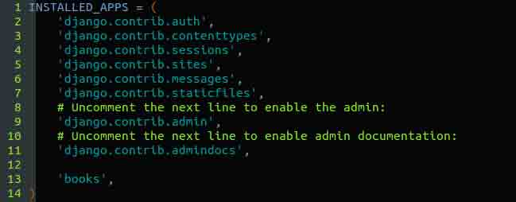
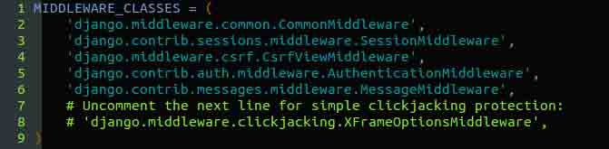
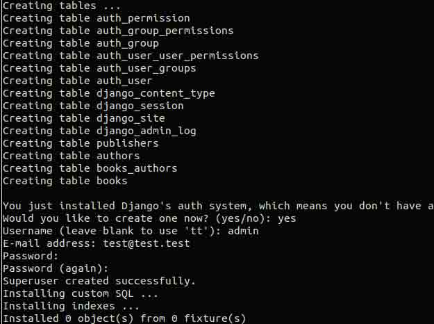
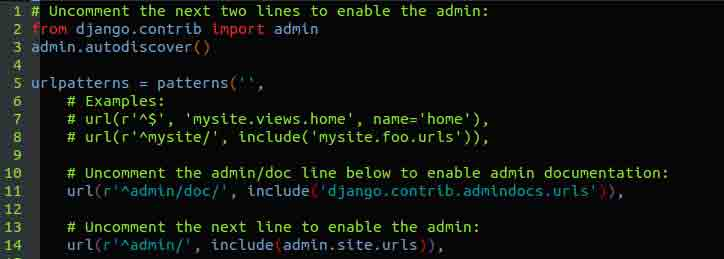
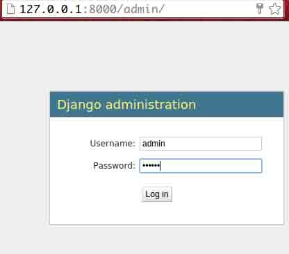
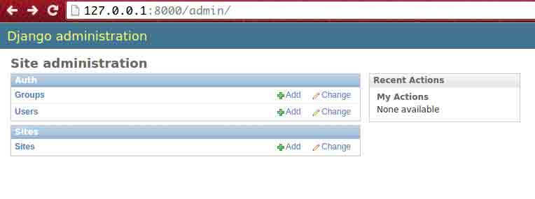

# 第 9 节 Django 网站管理（Admin）

## 实验简介

Django admin 也就是 django 自带的站点管理工具。我们的网站不仅仅要有普通的展示页面，同时，一个体验良好的网站后台管理界面是必不可少的。比如，一个 blog 的后台，你可以在那里编写自己的 blog 并发布；一个论坛，你可以管理各种权限，帖子的审核，人员的进出等等。对于一个内容为主的网站，admin 页面就显得特别的重要。

但是管理界面有一问题： 创建它太繁琐。 当你开发对公众的功能时，网页开发是有趣的，但是创建管理界面通常是千篇一律的。 你必须认证用户，显示并管理表格，验证输入的有效性诸如此类。 这很繁琐而且是重复劳动。使用 Django admin 就能减少这些问题。

> django admin 基本的样式、管理方式是千篇一律的，django 也提供了丰富的接口去让开发人员 DIY。

> 当然，你也可以不用 django admin，自己编写符合本网站需求的后台管理， openstack horizon 就是基于 django 编写的一套**开源**的管理后台，有兴趣可以[去学习 openstack horizon](http://docs.openstack.org/developer/horizon/)。

## django.contrib 包

Django 自动管理工具是 django.contrib 的一部分。django.contrib 是一套庞大的功能集，它是 Django 基本代码的组成部分，Django 框架就是由众多包含附加组件(add-on)的基本代码构成的。 你可以把 django.contrib 看作是可选的 Python 标准库或普遍模式的实际实现。 它们与 Django 捆绑在一起，这样你在一些特定的开发中就不用重复发明轮子了。

从技术层面上讲，它被称作 django.contrib.admin。django.contrib 中其它可用的特性，如用户鉴别系统(django.contrib.auth)、支持匿名会话(django.contrib.sessioins)以及用户评注系统(django.contrib.comments)。 目前，你只需要知道 Django 自带很多优秀的附加组件，它们都存在于 django.contrib 包里。

## 一、Django admin 的安装和配置

Django 管理站点完全是可选择的，因为仅仅某些特殊类型的站点才需要这些功能。 这意味着你需要在你的项目中花费几个步骤去激活它。

### 1\. 安装

**第一步**，对你的`settings.py`文件做如下这些改变：

1.  将**django.contrib.admin**加入 setting 的**INSTALLED*APPS***配置中 （INSTALLEDAPPS 中的配置顺序是没有关系的, 但是我们喜欢保持一定顺序以方便人来阅读）

2.  保证 INSTALLED_APPS 中含 **django.contrib.auth**， **django.contrib.contenttypes**， **django.contrib.sessions**，Django 的管理工具需要这 3 个包。 

3.  确保**MIDDLEWARE_CLASSES** 包含 **django.middleware.common.CommonMiddleware**， **django.contrib.sessions.middleware.SessionMiddleware**， **django.contrib.auth.middleware.AuthenticationMiddleware** 。 

4.  启动 mysql 服务并创建数据库

```py
$ service mysql start
$ mysql -uroot
> create database admin 
```

5.在 settings.py 配置数据库

```py
DATABASES = {
    'default': {
        'ENGINE': 'django.db.backends.mysql', # Add 'postgresql_psycopg2', 'mysql', 'sqlite3' or 'oracle'.
        'NAME': 'admin',                      # Or path to database file if using sqlite3.
        'USER': 'root',                      # Not used with sqlite3.
        'PASSWORD': '',                  # Not used with sqlite3.
        'HOST': 'localhos',                      # Set to empty string for localhost. Not used with sqlite3.
        'PORT': '3306',                      # Set to empty string for default. Not used with sqlite3.
    }
} 
```

运行`python manage.py syncdb` 。这一步将生成管理界面使用的额外数据库表，当你把`django.contrib.auth`加进 INSTALLED*APPS 后，第一次运行 syncdb 命令时, 系统会请你创建一个超级用户。 如果你不这么做，你需要运行`python manage.py createsuperuser`来另外创建一个 admin 的用户帐号，否则你将不能登入 admin (提醒一句: 只有当 INSTALLED*APPS 包含'django.contrib.auth'时，python manage.py createsuperuser 这个命令才可用.)



上图中在创建完 models 里面定义好的数据表后，会要求输入 superuser 的 name，email，password。完整无错的话，说明创建成功，我们进入下一步。

将 admin 访问配置在 URLconf(记住，在 urls.py 中). 默认情况下，命令`django-admin.py startproject`生成的文件 urls.py 是将 Django admin 的路径注释掉的，你所要做的就是取消注释。 请注意，以下内容是必须确保存在的：



当这一切都配置好后，现在你将发现 Django 管理工具可以运行了。 启动开发服务器(`python manage.py runserver` )，然后在浏览器中访问：`http://127.0.0.1:8000/admin/`



### 2\. admin 管理

**登陆之后的界面**



你要使用你原来设置的超级用户的用户名和密码。 如果无法登录，请运行`python manage.py createsuperuser`，确保你已经创建了一个超级用户。

**语言问题**


如果你的母语不是英语，而你不想用它来配置你的浏览器，你可以做一个快速更改来观察 Django 管理工具是否被翻译成你想要的语言。 仅需添加`'django.middleware.locale.LocaleMiddleware'` 到`MIDDLEWARE_CLASSES`设置中，并确保它在**'django.contrib.sessions.middleware.SessionMiddleware'之后** 。

> 注意，这里的用户，组，站点，是 django admin 提供的默认管理，默认情况下是和我们自定义的数据表没有任何关系；这些 django 默认的用户表和组表，用于管理后台登陆和涉及后台操作权限用的。

## 二、将 Models 加入到 Admin 管理中

我们之前定义了名叫 books 的 app，包含了 3 个 models(publisher，author，book)，我们将这三个 models 添加到 admin 中来一起管理，这也是我们使用 admin 的初衷。

在**books**目录下(mysite/books)，创建一个文件：**admin.py**，然后输入以下代码：

```py
from django.contrib import admin
from books.models import Publisher, Author, Book

admin.site.register(Publisher)
admin.site.register(Author)
admin.site.register(Book) 
```

这些代码通知管理工具为这些模块逐一提供界面。

完成后，打开页面 `http://127.0.0.1:8000/admin/`，你会看到一个 Books 区域，其中包含 Authors、Books 和 Publishers。 （你可能需要先停止，然后再启动服务(`runserver` )，才能使其生效。）

现在你拥有一个功能完整的管理界面来管理这三个模块了。 很简单吧！

花点时间添加和修改记录，以填充数据库。 如果你跟着前面的例子一起创建 Publisher 对象的话（并且没有删除），你会在列表中看到那些记录。

这里需要提到的一个特性是，管理工具处理外键和多对多关系（这两种关系可以在`Book`模块中找到）的方法。 作为提醒，这里有个`Book`模块的例子：

```py
class Book(models.Model):
    title = models.CharField(max_length=100)
    authors = models.ManyToManyField(Author)
    publisher = models.ForeignKey(Publisher)
    publication_date = models.DateField()

    def __unicode__(self):
        return self.title 
```

在 Add book 页面中（`http://127.0.0.1:8000/admin/books/book/add/`）， **外键** publisher 用一个选择框显示，`多对多`字段 author 用一个多选框显示。 点击两个字段后面的绿色加号，可以让你添加相关的记录。 举个例子，如果你点击 Publisher 后面的加号，你将会得到一个弹出窗口来添加一个 publisher。 当你在那个窗口中成功创建了一个 publisher 后，Add book 表单会自动把它更新到字段上去。

### 1\. Admin 是如何工作的

在幕后，管理工具是如何工作的呢？ 其实很简单。

当服务启动时，Django 从`url.py`引导 URLconf，然后执行`admin.autodiscover()`语句。 这个函数遍历 INSTALLED_APPS 配置，并且寻找相关的 admin.py 文件。 如果在指定的 app 目录下找到 admin.py，它就执行其中的代码。

在`books`应用程序目录下的`admin.py`文件中，每次调用`admin.site.register()`都将那个模块注册到管理工具中。 管理工具只为那些明确注册了的模块显示一个编辑/修改的界面。

应用程序`django.contrib.auth`包含自身的`admin.py`，所以 Users 和 Groups 能在管理工具中自动显示。 其它的 django.contrib 应用程序，如 django.contrib.redirects，其它从网上下载的第三方 Django 应用程序一样，都会自行添加到管理工具。

综上所述，管理工具其实就是一个 Django 应用程序，包含自己的模块、模板、视图和 URLpatterns。 你要像添加自己的视图一样，把它添加到 URLconf 里面。 你可以在 Django 基本代码中的 django/contrib/admin 目录下，检查它的模板、视图和 URLpatterns，但你不要尝试直接修改其中的任何代码，因为里面有很多地方可以让你自定义管理工具的工作方式。 （如果你确实想浏览 Django 管理工具的代码，请谨记它在读取关于模块的元数据过程中做了些不简单的工作，因此最好花些时间阅读和理解那些代码。）

**设置字段可选**

在摆弄了一会之后，你或许会发现管理工具有个限制：编辑表单需要你填写每一个字段，然而在有些情况下，你想要某些字段是可选的。 举个例子，我们想要 Author 模块中的 email 字段成为可选，即允许不填。 在现实世界中，你可能没有为每个作者登记邮箱地址。

为了指定 email 字段为可选，你只要编辑 Book 模块（它在`mysite/books/models.py`文件里），在 email 字段上加上**blank=True**。代码如下：

```py
class Author(models.Model):
    first_name = models.CharField(max_length=30)
    last_name = models.CharField(max_length=40)
    email = models.EmailField(blank=True) 
```

这些代码告诉 Django，作者的邮箱地址允许输入一个空值。 所有字段都默认 blank=False，这使得它们不允许输入空值。

这里会发生一些有趣的事情。 直到现在，除了`__unicode__()`方法，我们的模块充当数据库中表定义的角色，即本质上是用 Python 的语法来写 CREATE TABLE 语句。 在添加 blank=True 过程中，我们已经开始在简单的定义数据表上扩展我们的模块了。 现在，我们的模块类开始成为一个富含 Author 对象属性和行为的集合了。 email 不但展现为一个数据库中的 VARCHAR 类型的字段，它还是页面中可选的字段，就像在管理工具中看到的那样。

当你添加 blank=True 以后，刷新页面 Add author edit form (`http://127.0.0.1:8000/admin/books/author/add/`)，将会发现 Email 的标签不再是粗体了。 这意味它不是一个必填字段。 现在你可以添加一个作者而不必输入邮箱地址，即使你为这个字段提交了一个空值，也再不会得到那刺眼的红色信息“This field is required”。

**设置日期型和数字型字段可选**

虽然 blank=True 同样适用于日期型和数字型字段，但是这里需要详细讲解一些背景知识。

SQL 有指定空值的独特方式，它把空值叫做 NULL。NULL 可以表示为未知的、非法的、或其它程序指定的含义。

在 SQL 中， NULL 的值不同于空字符串，就像 Python 中 None 不同于空字符串（""）一样。这意味着某个字符型字段（如 VARCHAR）的值不可能同时包含 NULL 和空字符串。

这会引起不必要的歧义或疑惑。 为什么这条记录有个 NULL，而那条记录却有个空字符串？ 它们之间有区别，还是数据输入不一致？ 还有： 我怎样才能得到全部拥有空值的记录，应该按 NULL 和空字符串查找么？还是仅按字符串查找？

为了消除歧义，Django 生成 CREATE TABLE 语句自动为每个字段显式加上 NOT NULL。 这里有个生成 Author 模块的例子：

```py
CREATE TABLE "books_author" (
    "id" serial NOT NULL PRIMARY KEY,
    "first_name" varchar(30) NOT NULL,
    "last_name" varchar(40) NOT NULL,
    "email" varchar(75) NOT NULL
)
; 
```

在大多数情况下，这种默认的行为对你的应用程序来说是最佳的，因为它可以使你不再因数据一致性而头痛。 而且它可以和 Django 的其它部分工作得很好。如在管理工具中，如果你留空一个字符型字段，它会为此插入一个空字符串（而*不是* NULL）。

但是，其它数据类型有例外：日期型、时间型和数字型字段不接受空字符串。 如果你尝试将一个空字符串插入日期型或整数型字段，你可能会得到数据库返回的错误，这取决于那个数据库的类型。 （PostgreSQL 比较严禁，会抛出一个异常；MySQL 可能会也可能不会接受，这取决于你使用的版本和运气了。）在这种情况下，NULL 是唯一指定空值的方法。 在 Django 模块中，你可以通过添加 null=True 来指定一个字段允许为 NULL。

因此，这说起来有点复杂： 如果你想允许一个日期型（DateField、TimeField、DateTimeField）或数字型（IntegerField、DecimalField、FloatField）字段为空，你需要使用 null=True *和* blank=True。

为了举例说明，让我们把 Book 模块修改成允许 publication_date 为空。修改后的代码如下：

```py
class Book(models.Model):
    title = models.CharField(max_length=100)
    authors = models.ManyToManyField(Author)
    publisher = models.ForeignKey(Publisher)
    publication_date = models.DateField(blank=True, null=True) 
```

添加 null=True 比添加 blank=True 复杂。因为 null=True 改变了数据的语义，即改变了 CREATE TABLE 语句，把 publication_date 字段上的 NOT NULL 删除了。 要完成这些改动，我们还需要更新数据库。

出于某种原因，Django 不会尝试自动更新数据库结构。所以你必须执行 ALTER TABLE 语句将模块的改动更新至数据库。 像先前那样，你可以使用 manage.py dbshell 进入数据库服务环境。 以下是在这个特殊情况下如何删除 NOT NULL

```py
ALTER TABLE books MODIFY publication_date date null; 
```

（注意：以上 SQL 语法是 MYSQL 特有的。）

现在让我们回到管理工具，添加 book 的编辑页面允许输入一个空的 publication date。

## 三、自定义字段标签

在编辑页面中，每个字段的标签都是从模块的字段名称生成的。 规则很简单： 用空格替换下划线；首字母大写。例如：Book 模块中 publication_date 的标签是 Publication date。

然而，字段名称并不总是贴切的。有些情况下，你可能想自定义一个标签。 你只需在模块中指定**verbose_name**。

举个例子，说明如何将 Author.email 的标签改为 e-mail，中间有个横线。

```py
class Author(models.Model):
    first_name = models.CharField(max_length=30)
    last_name = models.CharField(max_length=40)
    email = models.EmailField(blank=True, verbose_name='e-mail') 
```

修改后重启服务器，你会在 author 编辑页面中看到这个新标签。

> 请注意，你不必把 verbose*name 的首字母大写，除非是连续大写（如："USA state"）。Django 会自动适时将首字母大写，并且在其它不需要大写的地方使用 verbose*name 的精确值。

最后还需注意的是，为了使语法简洁，你可以把它当作固定位置的参数传递。 这个例子与上面那个的效果相同。

```py
class Author(models.Model):
    first_name = models.CharField(max_length=30)
    last_name = models.CharField(max_length=40)
    email = models.EmailField('e-mail', blank=True) 
```

> 但这不适用于 ManyToManyField 和 ForeignKey 字段，因为它们第一个参数必须是模块类。 那种情形，必须显式使用 verbose_name 这个参数名称。

### 1\. 自定义 ModelAdmin 类

迄今为止，我们做的 blank=True、null=True 和 verbose_name 修改其实是模块级别，而不是管理级别的。 也就是说，这些修改实质上是构成模块的一部分，并且正好被管理工具使用，而不是专门针对管理工具的。

除了这些，Django 还提供了大量选项让你针对特别的模块自定义管理工具。 这些选项都在 ModelAdmin classes 里面，这些类包含了管理工具中针对特别模块的配置。

**自定义列表**

让我们更深一步：自定义 Author 模块的列表中的显示字段。 列表默认地显示查询结果中对象的`__unicode__()`。 在前面一节中，我们定义 Author 对象的 _*unicode*_()方法，用以同时显示作者的姓和名。

```py
class Author(models.Model):
    first_name = models.CharField(max_length=30)
    last_name = models.CharField(max_length=40)
    email = models.EmailField(blank=True, verbose_name='e-mail')

    def __unicode__(self):
        return u'%s %s' % (self.first_name, self.last_name) 
```

我们可以在这基础上改进，添加其它字段，从而改变列表的显示。 这个页面应该提供便利，比如说：在这个列表中可以看到作者的邮箱地址。如果能按照姓氏或名字来排序，那就更好了。

为了达到这个目的，我们将为 Author 模块定义一个 ModelAdmin 类。 这个类是自定义管理工具的关键，其中最基本的一件事情是允许你指定列表中的字段。 打开 admin.py 并修改：

```py
from django.contrib import admin
from mysite.books.models import Publisher, Author, Book

class AuthorAdmin(admin.ModelAdmin):
    list_display = ('first_name', 'last_name', 'email')

admin.site.register(Publisher)
admin.site.register(Author, AuthorAdmin)
admin.site.register(Book) 
```

解释一下代码：

> 我们新建了一个类 AuthorAdmin，它是从 django.contrib.admin.ModelAdmin 派生出来的子类，保存着一个类的自定义配置，以供管理工具使用。 我们只自定义了一项：**list_display**， 它是一个字段名称的元组，用于列表显示。 当然，这些字段名称必须是模块中有的。

> 我们修改了 admin.site.register()调用，在 Author 后面添加了 AuthorAdmin。你可以这样理解： 用 AuthorAdmin 选项注册 Author 模块。

> admin.site.register()函数接受一个 ModelAdmin 子类作为第二个参数。 如果你忽略第二个参数，Django 将使用默认的选项。Publisher 和 Book 的注册就属于这种情况。

> 弄好了这个东东，再刷新 author 列表页面，你会看到列表中有三列：姓氏、名字和邮箱地址。 另外，点击每个列的列头可以对那列进行排序。

接下来，让我们添加一个快速查询栏。 向 AuthorAdmin 追加 search_fields，如：

```py
class AuthorAdmin(admin.ModelAdmin):
    list_display = ('first_name', 'last_name', 'email')
    search_fields = ('first_name', 'last_name') 
```

刷新浏览器，你会在页面顶端看到一个查询栏。 我们刚才所作的修改列表页面，添加了一个根据姓名查询的查询框。 正如用户所希望的那样，它是大小写敏感，并且对两个字段检索的查询框。如果查询"bar"，那么名字中含有 Barney 和姓氏中含有 Hobarson 的作者记录将被检索出来。

接下来，让我们为 Book 列表页添加一些过滤器。

```py
from django.contrib import admin
from mysite.books.models import Publisher, Author, Book

class AuthorAdmin(admin.ModelAdmin):
    list_display = ('first_name', 'last_name', 'email')
    search_fields = ('first_name', 'last_name')

class BookAdmin(admin.ModelAdmin):
    list_display = ('title', 'publisher', 'publication_date')
    list_filter = ('publication_date',)

admin.site.register(Publisher)
admin.site.register(Author, AuthorAdmin)
admin.site.register(Book, BookAdmin) 
```

由于我们要处理一系列选项，因此我们创建了一个单独的 ModelAdmin 类：BookAdmin。首先，我们定义一个 list*display，以使得页面好看些。 然后，我们用 list*filter 这个字段元组创建过滤器，它位于列表页面的右边。 Django 为日期型字段提供了快捷过滤方式，它包含：今天、过往七天、当月和今年。这些是开发人员经常用到的。

`过滤器`同样适用于其它类型的字段，而不单是`日期型`（请在`布尔型`和`外键`字段上试试）。当有两个以上值时，过滤器就会显示。

另外一种过滤日期的方式是使用 date_hierarchy 选项，如：

```py
class BookAdmin(admin.ModelAdmin):
    list_display = ('title', 'publisher', 'publication_date')
    list_filter = ('publication_date',)
    date_hierarchy = 'publication_date' 
```

修改好后，页面中的列表顶端会有一个逐层深入的导航条， 它从可用的年份开始，然后逐层细分到月乃至日。

请注意，date_hierarchy 接受的是*字符串* ，而不是元组。因为只能对一个日期型字段进行层次划分。

最后，让我们改变默认的排序方式，按 publication date 降序排列。 列表页面默认按照模块 class Meta 中的 ordering 所指的列排序。但目前没有指定 ordering 值，所以当前排序是没有定义的。

```py
class BookAdmin(admin.ModelAdmin):
    list_display = ('title', 'publisher', 'publication_date')
    list_filter = ('publication_date',)
    date_hierarchy = 'publication_date'
    ordering = ('-publication_date',) 
```

这个 ordering 选项基本像模块中 class Meta 的 ordering 那样工作，除了它只用列表中的第一个字段名。 如果要实现降序，仅需在传入的列表或元组的字段前加上一个减号(-)。

刷新 book 列表页面观看实际效果。 注意 Publication date 列头现在有一个小箭头显示排序。

我们已经学习了主要的选项。 通过使用它们，你可以仅需几行代码就能创建一个功能强大、随时上线的数据编辑界面。

**自定义编辑表单**

正如自定义列表那样，编辑表单方面也能自定义。

首先，我们先自定义字段顺序。 默认地，表单中的字段顺序是与模块中定义是一致的。 我们可以通过使用 ModelAdmin 子类中的 fields 选项来改变它：

```py
class BookAdmin(admin.ModelAdmin):
    list_display = ('title', 'publisher', 'publication_date')
    list_filter = ('publication_date',)
    date_hierarchy = 'publication_date'
    ordering = ('-publication_date',)
    fields = ('title', 'authors', 'publisher', 'publication_date') 
```

完成之后，编辑表单将按照指定的顺序显示各字段。 它看起来自然多了——作者排在书名之后。 字段顺序当然是与数据条目录入顺序有关， 每个表单都不一样。

通过 fields 这个选项，你可以排除一些不想被其他人编辑的 fields 只要不选上不想被编辑的 field(s)即可。 当你的 admin 用户只是被信任可以更改你的某一部分数据时，或者，你的数据被一些外部的程序自动处理而改变了，你就可以用这个功能。 例如，在 book 数据库中，我们可以隐藏 publication_date，以防止它被编辑。

```py
class BookAdmin(admin.ModelAdmin):
    list_display = ('title', 'publisher', 'publication_date')
    list_filter = ('publication_date',)
    date_hierarchy = 'publication_date'
    ordering = ('-publication_date',)
    fields = ('title', 'authors', 'publisher') 
```

这样，在编辑页面就无法对 publication date 进行改动。 如果你是一个编辑，不希望作者推迟出版日期的话，这个功能就很有用。 （当然，这纯粹是一个假设的例子。）

当一个用户用这个不包含完整信息的表单添加一本新书时，Django 会简单地将 publication_date 设置为 None，以确保这个字段满足 null=True 的条件。

另一个常用的编辑页面自定义是针对多对多字段的。 如我们在 book 编辑页面看到的那样，`多对多字段` 被展现成多选框。虽然多选框在逻辑上是最适合的 HTML 控件，但它却不那么好用。 如果你想选择多项，你必须还要按下 Ctrl 键（苹果机是 command 键）。 虽然管理工具因此添加了注释（help_text），但是当它有几百个选项时，它依然显得笨拙。

更好的办法是使用 filter_horizontal。让我们把它添加到 BookAdmin 中，然后看看它的效果。

```py
class BookAdmin(admin.ModelAdmin):
    list_display = ('title', 'publisher', 'publication_date')
    list_filter = ('publication_date',)
    date_hierarchy = 'publication_date'
    ordering = ('-publication_date',)
    filter_horizontal = ('authors',) 
```

（如果你一直跟着做练习，请注意移除 fields 选项，以使得编辑页面包含所有字段。）

刷新 book 编辑页面，你会看到 Author 区中有一个精巧的 JavaScript 过滤器，它允许你检索选项，然后将选中的 authors 从 Available 框移到 Chosen 框，还可以移回来。

我们强烈建议针对那些拥有十个以上选项的`多对多字段`使用 filter*horizontal。 这比多选框好用多了。 你可以在多个字段上使用 filter*horizontal，只需在这个元组中指定每个字段的名字。

ModelAdmin 类还支持 filter*vertical 选项。 它像 filter*horizontal 那样工作，除了控件都是垂直排列，而不是水平排列的。 至于使用哪个，只是个人喜好问题。

filter*horizontal 和 filter*vertical 选项只能用在多对多字段 上, 而不能用于 ForeignKey 字段。 默认地，管理工具使用`下拉框`来展现`外键`字段。但是，正如`多对多字段`那样，有时候你不想忍受因装载并显示这些选项而产生的大量开销。 例如，我们的 book 数据库膨胀到拥有数千条 publishers 的记录，以致于 book 的添加页面装载时间较久，因为它必须把每一个 publishe 都装载并显示在`下拉框`中。

解决这个问题的办法是使用`raw_id_fields`选项。它是一个包含外键字段名称的元组，它包含的字段将被展现成`文本框`，而不再是`下拉框` 。

```py
class BookAdmin(admin.ModelAdmin):
    list_display = ('title', 'publisher', 'publication_date')
    list_filter = ('publication_date',)
    date_hierarchy = 'publication_date'
    ordering = ('-publication_date',)
    filter_horizontal = ('authors',)
    raw_id_fields = ('publisher',) 
```

在这个输入框中，你输入什么呢？ publisher 的数据库 ID 号。 考虑到人们通常不会记住这些数据库 ID，管理工具提供了一个放大镜图标方便你输入。点击那个图标将会弹出一个窗口，在那里你可以选择想要添加的 publishe。

## 四、小结

本节讲解了 django-admin 的使用，它可以快速地开发后台管理系统，并且也可以对它进行自定义。

在本课程的最后一个阶段，我们将学到 django 表单的使用从而使让我们可以自己搭建一个完整的网站。

## 作业

请新建一个 score app，其中有学生，课程和成绩三个模型，加入到 django-admin 中，最后在后台系统进行添加查询等操作。