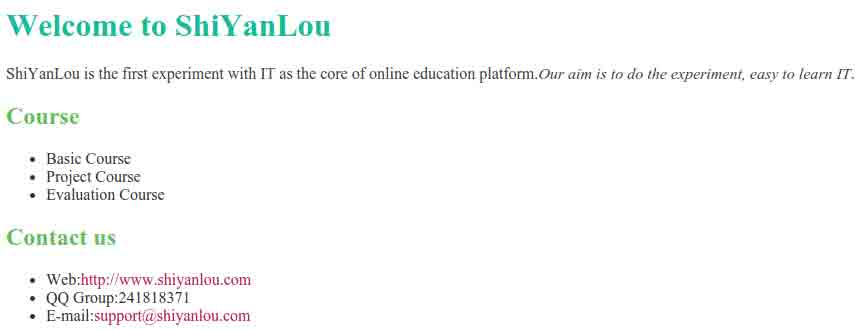

# 第 1 节 Python 文本解析器

## 一、课程介绍

本课程讲解一个使用 Python 来解析纯文本生成一个 HTML 页面的小程序。

本节实验中将学习和实践以下知识点：

1.  Python 基本语法
2.  HTML 标记语言

## 二、相关技术

Python：一种面向对象、解释型计算机程序设计语言，用它可以做 Web 开发、图形处理、文本处理和数学处理等等。

HTML：超文本标记语言，主要用来实现网页。

## 三、项目截图

纯文本文件：

```py
Welcome to ShiYanLou

ShiYanLou is the first experiment with IT as the core of online education platform.*Our aim is to do the experiment, easy to learn IT*.

Course

-Basic Course

-Project Course

-Evaluation Course

Contact us

-Web:http://www.shiyanlou.com

-QQ Group:241818371

-E-mail:support@shiyanlou.com 
```

解析后生成的 HTML 页面如下图



## 四、项目讲解

### 1\. 文本块生成器

首先我们需要有一个文本块生成器把纯文本分成一个一个的文本块，以便接下来对每一个文本快进行解析，util.py 代码如下：

```py
#!/usr/bin/python
# encoding: utf-8

def lines(file):
    """
    生成器,在文本最后加一空行
    """
    for line in file: yield line
    yield '\n'

def blocks(file):
    """
    生成器,生成单独的文本块
    """
    block = []
    for line in lines(file):
        if line.strip():
            block.append(line)
        elif block:
            yield ''.join(block).strip()
            block = [] 
```

### 2\. 处理程序

通过文本生成器我们得到了一个一个的文本块，然后需要有处理程序对不同的文本块加相应的 HTML 标记，handlers.py 代码如下：

```py
#!/usr/bin/python
# encoding: utf-8

class Handler:
    """
    处理程序父类
    """
    def callback(self, prefix, name, *args):
        method = getattr(self, prefix + name, None)
        if callable(method): return method(*args)

    def start(self, name):
        self.callback('start_', name)

    def end(self, name):
        self.callback('end_', name)

    def sub(self, name):
        def substitution(match):
            result = self.callback('sub_', name, match)
            if result is None: result = match.group(0)
            return result
        return substitution

class HTMLRenderer(Handler):
    """
    HTML 处理程序,给文本块加相应的 HTML 标记
    """
    def start_document(self):
        print '<html><head><title>ShiYanLou</title></head><body>'

    def end_document(self):
        print '</body></html>'

    def start_paragraph(self):
        print '<p style="color: #444;">'

    def end_paragraph(self):
        print '</p>'

    def start_heading(self):
        print '<h2 style="color: #68BE5D;">'

    def end_heading(self):
        print '</h2>'

    def start_list(self):
        print '<ul style="color: #363736;">'

    def end_list(self):
        print '</ul>'

    def start_listitem(self):
        print '<li>'

    def end_listitem(self):
        print '</li>'

    def start_title(self):
        print '<h1 style="color: #1ABC9C;">'

    def end_title(self):
        print '</h1>'

    def sub_emphasis(self, match):
        return '<em>%s</em>' % match.group(1)

    def sub_url(self, match):
        return '<a target="_blank" style="text-decoration: none;color: #BC1A4B;" href="%s">%s</a>' % (match.group(1), match.group(1))

    def sub_mail(self, match):
        return '<a style="text-decoration: none;color: #BC1A4B;" href="mailto:%s">%s</a>' % (match.group(1), match.group(1))

    def feed(self, data):
        print data 
```

### 3\. 规则

有了处理程序和文本块生成器，接下来就需要一定的规则来判断每个文本块交给处理程序将要加什么标记，rules.py 代码如下：

```py
#!/usr/bin/python
# encoding: utf-8

class Rule:
    """
    规则父类
    """
    def action(self, block, handler):
        """
        加标记
        """
        handler.start(self.type)
        handler.feed(block)
        handler.end(self.type)
        return True

class HeadingRule(Rule):
    """
    一号标题规则
    """
    type = 'heading'
    def condition(self, block):
        """
        判断文本块是否符合规则
        """
        return not '\n' in block and len(block) <= 70 and not block[-1] == ':'

class TitleRule(HeadingRule):
    """
    二号标题规则
    """
    type = 'title'
    first = True

    def condition(self, block):
        if not self.first: return False
        self.first = False
        return HeadingRule.condition(self, block);

class ListItemRule(Rule):
    """
    列表项规则
    """
    type = 'listitem'
    def condition(self, block):
        return block[0] == '-'

    def action(self, block, handler):
        handler.start(self.type)
        handler.feed(block[1:].strip())
        handler.end(self.type)
        return True

class ListRule(ListItemRule):
    """
    列表规则
    """
    type = 'list'
    inside = False
    def condition(self, block):
        return True

    def action(self, block, handler):
        if not self.inside and ListItemRule.condition(self, block):
            handler.start(self.type)
            self.inside = True
        elif self.inside and not ListItemRule.condition(self, block):
            handler.end(self.type)
            self.inside = False
        return False

class ParagraphRule(Rule):
    """
    段落规则
    """
    type = 'paragraph'

    def condition(self, block):
        return True 
```

## 4\. 解析

最后我们就可以进行解析了，markup.py 代码如下：

```py
#!/usr/bin/python
# encoding: utf-8

import sys, re
from handlers import *
from util import *
from rules import *

class Parser:
    """
    解析器父类
    """
    def __init__(self, handler):
        self.handler = handler
        self.rules = []
        self.filters = []

    def addRule(self, rule):
        """
        添加规则
        """
        self.rules.append(rule)

    def addFilter(self, pattern, name):
        """
        添加过滤器
        """
        def filter(block, handler):
            return re.sub(pattern, handler.sub(name), block)
        self.filters.append(filter)

    def parse(self, file):
        """
        解析
        """
        self.handler.start('document')
        for block in blocks(file):
            for filter in self.filters:
                block = filter(block, self.handler)
            for rule in self.rules:
                if rule.condition(block):
                    last = rule.action(block, self.handler)
                    if last: break
        self.handler.end('document')

class BasicTextParser(Parser):
    """
    纯文本解析器
    """
    def __init__(self, handler):
        Parser.__init__(self, handler)
        self.addRule(ListRule())
        self.addRule(ListItemRule())
        self.addRule(TitleRule())
        self.addRule(HeadingRule())
        self.addRule(ParagraphRule())

        self.addFilter(r'\*(.+?)\*', 'emphasis')
        self.addFilter(r'(http://[\.a-zA-Z/]+)', 'url')
        self.addFilter(r'([\.a-zA-Z]+@[\.a-zA-Z]+[a-zA-Z]+)', 'mail')

"""
运行程序
"""
handler = HTMLRenderer()
parser = BasicTextParser(handler)
parser.parse(sys.stdin) 
```

运行程序（纯文本文件为 test.txt，生成 HTML 文件为 test.html）

```py
python markup.py < test.txt > test.html 
```

## 五、代码下载

可以使用下列命令下载本课程相关代码：

```py
$ git clone http://git.shiyanlou.com/shiyanlou/python_markup 
```

## 六、小结

在这个小程序中，我们使用了 Python 来解析纯文本文件并生成 HTML 文件，这个只是简单实现，通过这个案例大家可以动手试试解析 Markdown 文件。