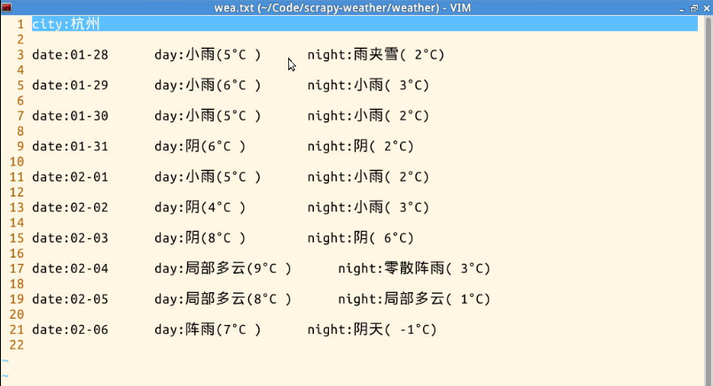
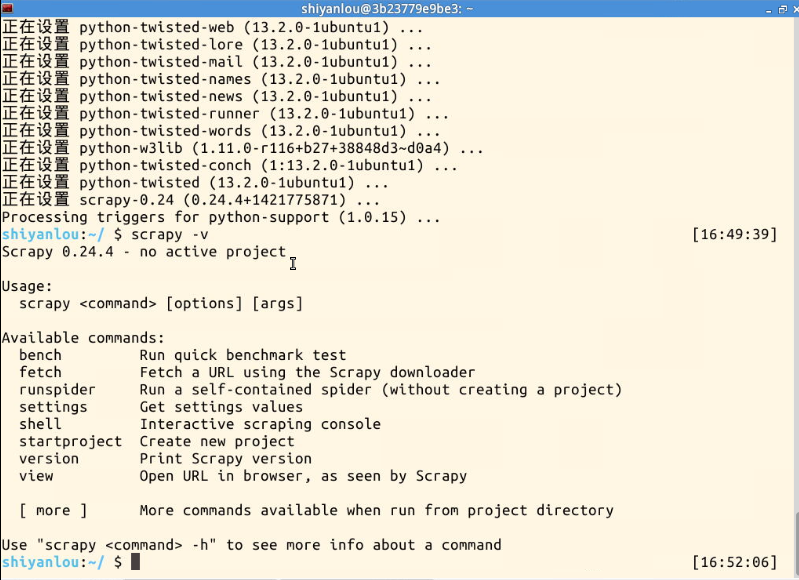
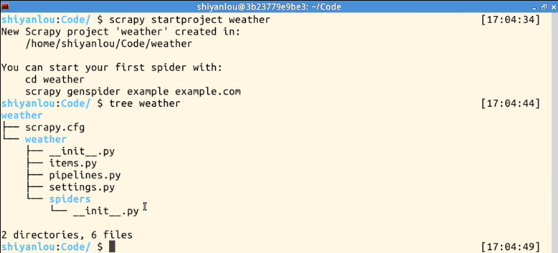
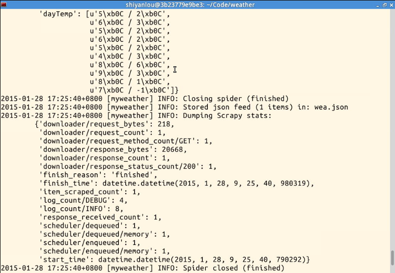
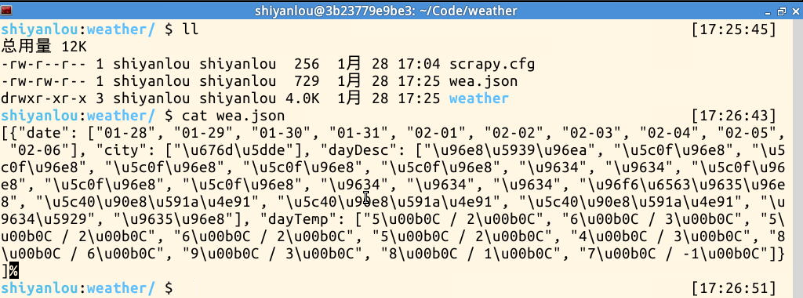
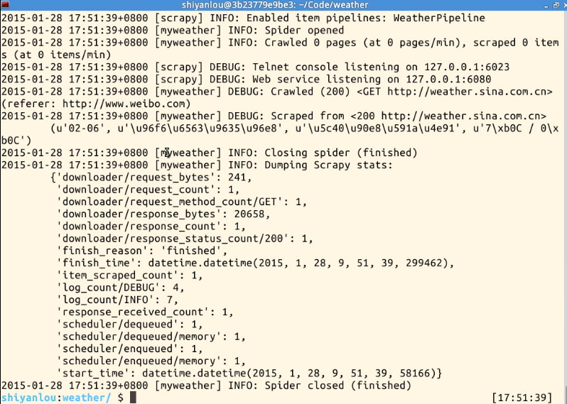
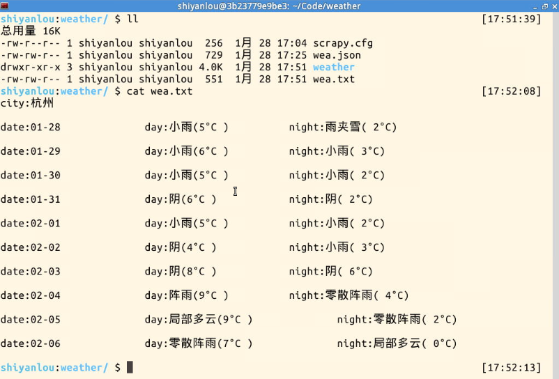
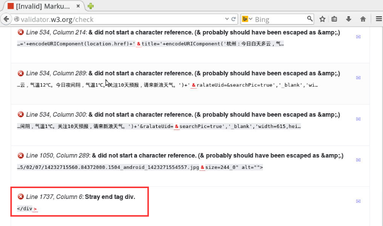
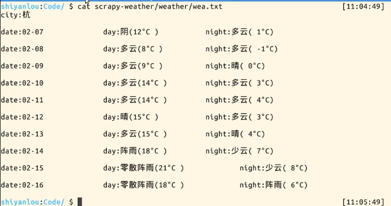

# 基于 scrapy 爬虫的天气数据采集(python)

本项目介绍如何用 Scrapy 来采集天气信息（从新浪天气频道采集），完成本项目后能对 Python Scrapy 有个初步的认识，能进行简单的数据采集需求开发。

## 一、实验说明

### 1\. 环境登录

无需密码自动登录，系统用户名 shiyanlou

### 2\. 环境介绍

本实验环境采用带桌面的 Ubuntu Linux 环境，实验中会用到桌面上的程序：

1.  LX 终端（LXTerminal）: Linux 命令行终端，打开后会进入 Bash 环境，可以使用 Linux 命令

2.  Scrapy：Scrapy 是一个为了爬取网站数据，提取结构性数据而用 Python 编写的应用框架。 可以应用在包括数据挖掘，信息处理或存储历史数据等一系列的程序中。

3.  GVim：非常好用的编辑器，最简单的用法可以参考课程[Vim 编辑器](http://www.shiyanlou.com/courses/2)

### 3\. 环境使用

使用 GVim 编辑器输入实验所需的代码及文件，使用 LX 终端（LXTerminal）运行所需命令进行操作。

实验报告可以在个人主页中查看，其中含有每次实验的截图及笔记，以及每次实验的有效学习时间（指的是在实验桌面内操作的时间，如果没有操作，系统会记录为发呆时间）。这些都是您学习的真实性证明。

本课程中的所有源码可以通过以下方式下载:

```py
http://git.shiyanlou.com/shiyanlou/scrapy-weather 
```

### 4\. 知识点

本节实验中将学习和实践以下知识点：

1.  Python 基本语法
2.  Scrapy 框架
3.  爬虫的概念

## 二、项目介绍

很多网站都提供了浏览者本地的天气信息，这些信息是如何获取到的呢，方法有很多种，大多是利用某些网站提供的天气 api 获取的，也有利用爬虫采集的。本项目就介绍如何用 Scrapy 来采集天气信息（从新浪天气频道采集: http://weather.sina.com.cn/ ），学完本项目后大家能对 Scrapy 有个初步的认识，能进行简单的采集需求开发。

先上一张最终的效果截图：



大家看了截图，是不是马上就想动手完成它，下面我们就来开始。

## 三、项目实战

### 1\. 安装 Scrapy

安装 scrapy-0.24：

```py
# 安装依赖的包
$ sudo apt-get update
$ sudo apt-get install python-lxml python-dev libffi-dev

# 安装指定版本的 scrapy
$ sudo pip install scrapy==0.24.4 
```

完成这步后，可以用下面的命令测试一下安装是否正确：

```py
$ scrapy -v 
```

如果正常，效果如图所示：



### 2\. 创建项目

在开始爬取之前，必须创建一个新的 Scrapy 项目。进入您打算存储代码的目录中，运行下列命令：

```py
$ scrapy startproject weather 
```

如果正常，效果如图所示：



这些文件分别是:

*   scrapy.cfg: 项目的配置文件
*   weather/: 该项目的 python 模块。之后将在此加入代码。
*   weather/items.py: 项目中的 item 文件.
*   weather/pipelines.py: 项目中的 pipelines 文件.
*   weather/settings.py: 项目的设置文件.
*   weather/spiders/: 放置 spider 代码的目录.

### 3\. 定义 Item

Item 是保存爬取到的数据的容器；其使用方法和 python 字典类似，并且提供了额外保护机制来避免拼写错误导致的未定义字段错误。

首先根据需要从 weather.sina.com.cn 获取到的数据对 item 进行建模。 我们需要从 weather.sina.com.cn 中获取当前城市名，后续 9 天的日期，天气描述和温度等信息。对此，在 item 中定义相应的字段。编辑 weather 目录中的 items.py 文件:

```py
# -*- coding: utf-8 -*-

# Define here the models for your scraped items
#
# See documentation in:
# http://doc.scrapy.org/en/latest/topics/items.html

import scrapy

class WeatherItem(scrapy.Item):
    # define the fields for your item here like:
    # name = scrapy.Field()
    # demo 1
    city = scrapy.Field()
    date = scrapy.Field()
    dayDesc = scrapy.Field()
    dayTemp = scrapy.Field()
    pass 
```

### 4\. 编写获取天气数据的爬虫(Spider)

Spider 是用户编写用于从单个网站(或者一些网站)爬取数据的类。

其包含了一个用于下载的初始 URL，如何跟进网页中的链接以及如何分析页面中的内容， 提取生成 item 的方法。

为了创建一个 Spider，必须继承 scrapy.Spider 类， 且定义以下三个属性:

*   name: 用于区别 Spider。该名字必须是唯一的，您不可以为不同的 Spider 设定相同的名字。

*   start_urls: 包含了 Spider 在启动时进行爬取的 url 列表。因此，第一个被获取到的页面将是其中之一。后续的 URL 则从初始的 URL 获取到的数据中提取。

*   parse() 是 spider 的一个方法。 被调用时，每个初始 URL 完成下载后生成的 Response 对象将会作为唯一的参数传递给该函数。 该方法负责解析返回的数据(response data)，提取数据(生成 item)以及生成需要进一步处理的 URL 的 Request 对象。

我们通过浏览器的查看源码工具先来分析一下需要获取的数据网源代码：

```py
<h4 class="slider_ct_name" id="slider_ct_name">武汉</h4>
...
<div class="blk_fc_c0_scroll" id="blk_fc_c0_scroll" style="width: 1700px;">
    <div class="blk_fc_c0_i">
        <p class="wt_fc_c0_i_date">01-28</p>
        <p class="wt_fc_c0_i_day wt_fc_c0_i_today">今天</p>
        <p class="wt_fc_c0_i_icons clearfix">
            
            
        </p>
        <p class="wt_fc_c0_i_times">
            <span class="wt_fc_c0_i_time">白天</span>
            <span class="wt_fc_c0_i_time">夜间</span>
        </p>
        <p class="wt_fc_c0_i_temp">1°C / -2°C</p>
        <p class="wt_fc_c0_i_tip">北风 3～4 级</p>
        <p class="wt_fc_c0_i_tip">无持续风向 小于 3 级</p>
    </div>
    <div class="blk_fc_c0_i">
        <p class="wt_fc_c0_i_date">01-29</p>
        <p class="wt_fc_c0_i_day ">星期四</p>
        <p class="wt_fc_c0_i_icons clearfix">
            
            
        </p>
        <p class="wt_fc_c0_i_times">
            <span class="wt_fc_c0_i_time">白天</span>
            <span class="wt_fc_c0_i_time">夜间</span>
        </p>
        <p class="wt_fc_c0_i_temp">1°C / -2°C</p>
        <p class="wt_fc_c0_i_tip">无持续风向 小于 3 级</p>
    </div>
    ...
</div> 
```

我们可以看到：

*   城市名可以通过获取 id 为 slider*ct*name 的 h4 元素获取
*   日期可以通过获取 id 为 blk*fc*c0*scroll 下的 class 为 wt*fc*c0*i_date 的 p 元素获取
*   天气描述可以通过获取 id 为 blk*fc*c0*scroll 下的 class 为 icons0*wt 的 img 元素获取
*   温度可以通过获取 id 为 blk*fc*c0*scroll 下的 class 为 wt*fc*c0*i_temp 的 p 元素获取

因此，我们的 Spider 代码如下，保存在 weather/spiders 目录下的 localweather.py 文件中:

```py
# -*- coding: utf-8 -*-
import scrapy
from weather.items import WeatherItem

class WeatherSpider(scrapy.Spider):
    name = "myweather"
    allowed_domains = ["sina.com.cn"]
    start_urls = ['http://weather.sina.com.cn']

    def parse(self, response):
        item = WeatherItem()
        item['city'] = response.xpath('//*[@id="slider_ct_name"]/text()').extract()
        tenDay = response.xpath('//*[@id="blk_fc_c0_scroll"]');
        item['date'] = tenDay.css('p.wt_fc_c0_i_date::text').extract()
        item['dayDesc'] = tenDay.css('img.icons0_wt::attr(title)').extract()
        item['dayTemp'] = tenDay.css('p.wt_fc_c0_i_temp::text').extract()
        return item 
```

代码中的 xpath 和 css 后面括号的内容为选择器，关于 xpath 和 css 选择器的内容可参考官方教程：http://doc.scrapy.org/en/0.24/topics/selectors.html

### 5\. 运行爬虫，对数据进行验证

到这里为止，我们需要验证一下爬虫是否能正常工作（即能否取到我们想要的数据），验证的方法就是在命令行（**重要：在项目的 scrapy.cfg 文件同级目录运行命令，下同**）中运行下面的代码：

```py
$ scrapy crawl myweather -o wea.json 
```

这行命令的意思是，运行名字为 myweather 的爬虫（我们在上一步中定义的），然后把结果以 json 格式保存在 wea.json 文件中。命令运行结果如下：



然后，我们查看当前目录下的 wea.json 文件，正常情况下效果如下：



我们看到，wea.json 中已经有数据了，只是数据是以 unicode 方式编码的。

### 6\. 保存爬取到的数据

上面只是把数据保存在 json 文件中了，如果我们想自己保存在文件或数据库中，如何操作呢？

这里就要用到 Item Pipeline 了，那么 Item Pipeline 是什么呢？

当 Item 在 Spider 中被收集之后，它将会被传递到 Item Pipeline 中，一些组件会按照一定的顺序执行对 Item 的处理。

每个 item pipeline 组件(有时称之为“Item Pipeline”)是实现了简单方法的 Python 类。他们接收到 Item 并通过它执行一些行为，同时也决定此 Item 是否继续通过 pipeline，或是被丢弃而不再进行处理。

item pipeline 的典型应用有：

*   清理 HTML 数据
*   验证爬取的数据(检查 item 包含某些字段)
*   查重(并丢弃)
*   将爬取结果保存到文件或数据库中

每个 item pipeline 组件都需要调用 process_item 方法，这个方法必须返回一个 Item (或任何继承类)对象， 或是抛出 DropItem 异常，被丢弃的 item 将不会被之后的 pipeline 组件所处理。

我们这里把数据转码后保存在 wea.txt 文本中。

pipelines.py 文件在创建项目时已经自动被创建好了，我们在其中加上保存到文件的代码：

```py
# -*- coding: utf-8 -*-

# Define your item pipelines here
#
# Don't forget to add your pipeline to the ITEM_PIPELINES setting
# See: http://doc.scrapy.org/en/latest/topics/item-pipeline.html

class WeatherPipeline(object):
    def __init__(self):
        pass

    def process_item(self, item, spider):
        with open('wea.txt', 'w+') as file:
            city = item['city'][0].encode('utf-8')
            file.write('city:' + str(city) + '\n\n')

            date = item['date']

            desc = item['dayDesc']
            dayDesc = desc[1::2]
            nightDesc = desc[0::2]

            dayTemp = item['dayTemp']

            weaitem = zip(date, dayDesc, nightDesc, dayTemp)

            for i in range(len(weaitem)):
                item = weaitem[i]
                d = item[0]
                dd = item[1]
                nd = item[2]
                ta = item[3].split('/')
                dt = ta[0]
                nt = ta[1]
                txt = 'date:{0}\t\tday:{1}({2})\t\tnight:{3}({4})\n\n'.format(
                    d,
                    dd.encode('utf-8'),
                    dt.encode('utf-8'),
                    nd.encode('utf-8'),
                    nt.encode('utf-8')
                )
                file.write(txt)
        return item 
```

代码比较简单，都是 python 比较基础的语法，如果您感觉比较吃力，建议先去学一下 python 基础课。

### 7\. 把 ITEM_PIPELINES 添加到设置中

写好 ITEM*PIPELINES 后，还有很重要的一步，就是把 ITEM*PIPELINES 添加到设置文件 settings.py 中。

```py
ITEM_PIPELINES = {
    'weather.pipelines.WeatherPipeline': 1
} 
```

另外，有些网站对网络爬虫进行了阻止（注：本项目仅从技术角度处理此问题，个人强烈不建议您用爬虫爬取有版权信息的数据），我们可以在设置中修改一下爬虫的 USER_AGENT 和 Referer 信息，增加爬虫请求的时间间隔。

整个 settings.py 文件内容如下：

```py
# -*- coding: utf-8 -*-

# Scrapy settings for weather project
#
# For simplicity, this file contains only the most important settings by
# default. All the other settings are documented here:
#
#     http://doc.scrapy.org/en/latest/topics/settings.html
#

BOT_NAME = 'Googlebot'

SPIDER_MODULES = ['weather.spiders']
NEWSPIDER_MODULE = 'weather.spiders'

# Crawl responsibly by identifying yourself (and your website) on the user-agent
#USER_AGENT = 'weather (+http://www.yourdomain.com)'
USER_AGENT = 'User-Agent: Mozilla/5.0 (Windows NT 6.1; WOW64) AppleWebKit/537.36 (KHTML, like Gecko) Chrome/39.0.2171.95 Safari/537.36'

DEFAULT_REQUEST_HEADERS = {
    'Referer': 'http://www.weibo.com'
}

ITEM_PIPELINES = {
    'weather.pipelines.WeatherPipeline': 1
}

DOWNLOAD_DELAY = 0.5 
```

到现在为止，代码主要部分已经写完了。

### 8\. 运行爬虫

在**项目的 scrapy.cfg 同级目录下**用下面的命令运行爬虫：

```py
$ scrapy crawl myweather 
```

正常情况下，效果如下：



然后，在当前目录下会多一个 wea.txt 文件，内容如下：



到此我们基于 scrapy 的天气数据采集就完成了。

## 四、答疑

### 1、关于结果只出现城市的问题

最近看到有同学反馈代码按课程运行后，最后的数据中只有城市数据，没有天气数据，我检查了一下代码，找到了问题存在的原因。

scrapy 内置的 html 解析是基于 lxml 库的，这个库对 html 的解析的容错性不是很好，通过检查虚拟机中获取到的网页源码，发现有部分标签是不匹配的（地区和浏览器不同取到的源码可能不同），检查结果如图：



所以导致在 spider 中取到的日期数据(item['date'])为空，然后在 pilepine 代码中做 zip 操作后，整个 weaitem 为空，所以最终只有城市数据了。

既然找到了原因，我们换个 html 代码解析器就可以了，这里建议用 BeautifulSoup （官网： http://www.crummy.com/software/BeautifulSoup/bs4/doc/index.html ），这个解析器有比较好的容错能力，具体用法可以参考上面的文档。

BeautifulSoup 安装：

```py
#下载 BeautifulSoup
$ wget http://labfile.oss.aliyuncs.com/beautifulsoup4-4.3.2.tar.gz

#解压
$ tar -zxvf beautifulsoup4-4.3.2.tar.gz

#安装
$ cd beautifulsoup4-4.3.2
$ sudo python setup.py install 
```

安装成功后，优化 WeatherSpider 代码，改进后的代码如下：

```py
# -*- coding: utf-8 -*-
import scrapy
from bs4 import BeautifulSoup
from weather.items import WeatherItem

class WeatherSpider(scrapy.Spider):
    name = "myweather"
    allowed_domains = ["sina.com.cn"]
    start_urls = ['http://weather.sina.com.cn']

    def parse(self, response):
        html_doc = response.body
        #html_doc = html_doc.decode('utf-8')
        soup = BeautifulSoup(html_doc)
        itemTemp = {}
        itemTemp['city'] = soup.find(id='slider_ct_name')
        tenDay = soup.find(id='blk_fc_c0_scroll')
        itemTemp['date'] = tenDay.findAll("p", {"class": 'wt_fc_c0_i_date'})
        itemTemp['dayDesc'] = tenDay.findAll("img", {"class": 'icons0_wt'})
        itemTemp['dayTemp'] = tenDay.findAll('p', {"class": 'wt_fc_c0_i_temp'})
        item = WeatherItem()
        for att in itemTemp:
            item[att] = []
            if att == 'city':
                item[att] = itemTemp.get(att).text
                continue
            for obj in itemTemp.get(att):
                if att == 'dayDesc':
                    item[att].append(obj['title'])
                else:
                    item[att].append(obj.text)
        return item 
```

然后再次运行爬虫:

```py
$ scrapy crawl myweather 
```

然后查看 wea.txt，数据如下：



### 2、 关于只取到了 9 天的数据问题

如果是晚上运行爬虫，当天的白天天气是没有的（已经过去了），针对这部分建议自己优化。