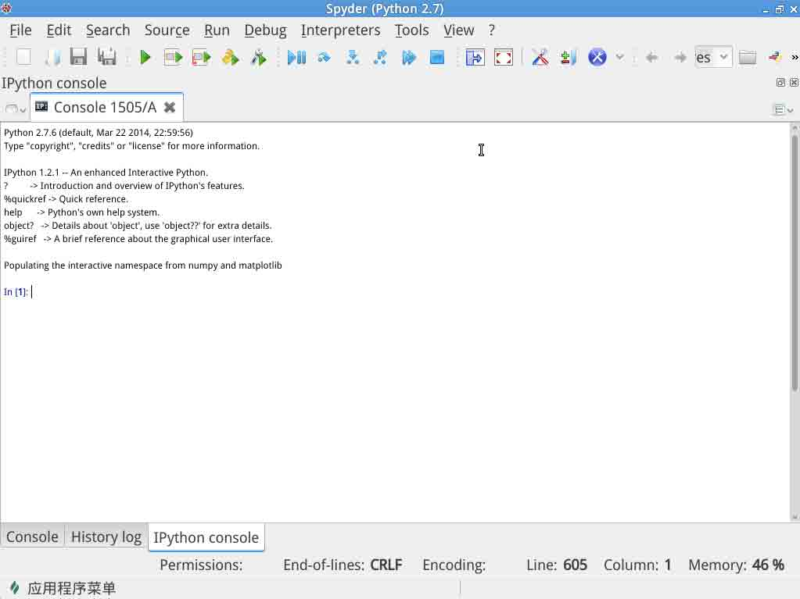

# 第 2 节 Numpy - 多维数组（上）

## 一、实验说明

`numpy` 包为 Python 提供了高性能的向量，矩阵以及高阶数据结构。由于它们是由 C 和 Fortran 实现的，所以在操作向量与矩阵时性能非常优越。

### 1\. 环境登录

无需密码自动登录，系统用户名 shiyanlou

### 2\. 环境介绍

本课程实验环境使用 Spyder。首先打开 terminal，然后输入以下命令：

```py
spyder -w scientific-python-lectures   (-w 参数指定工作目录) 
```

关于 Spyder 的使用可参考文档：https://pythonhosted.org/spyder/

本实验基本在控制台下进行，可关闭 spyder 中的其余窗口，只保留控制台。如需要调出窗口，可以通过 view->windows and toolbar 调出。比如希望在 py 文件中编写代码，可以 view->windows and toolbar->Editor 调出编辑器窗口。



## 二、实验内容

让我们首先加载包

```py
from numpy import * 
```

在 `numpy` 包中我们用数组来表示向量，矩阵和高阶数据结构。

## 创建 `numpy` 数组

初始化 numpy 数组有多种方式，比如说：

*   使用 Python 列表或元祖
*   使用 `arange`, `linspace` 等函数
*   从文件中读取数据

### 列表生成`numpy`数组

我们使用 `numpy.array` 来创建数组

```py
# a vector: the argument to the array function is a Python list
v = array([1,2,3,4])
v 

=> array([1, 2, 3, 4]) 
```

（注：=> 后为控制台输出结果）

```py
# a matrix: the argument to the array function is a nested Python list
M = array([[1, 2], [3, 4]])
M 

=> array([[1, 2], 
          [3, 4]]) 
```

v 与 M 对象都是 numpy 模块提供的 ndarray 类型

```py
type(v), type(M)

=> (<type 'numpy.ndarray'>,<type 'numpy.ndarray'>) 
```

`v` 与 `M` 数组的不同之处在于它们的维度。 我们可以通过 `ndarray.shape` 获得它的维度属性：

```py
v.shape

=> (4,)

M.shape

=> (2, 2) 
```

数组的元素数量可以通过 `ndarray.size` 得到：

```py
M.size

=> 4 
```

同样的，我们可以使用 `numpy.shape` 与 `numpy.size` 函数获取对应属性值：

```py
shape(M)

=> (2, 2)

size(M)

=> 4 
```

到目前为止 `numpy.ndarray` 看上去与 list 差不多。 为什么不直接使用 list 呢？

原因有以下几点:

*   Python 的 list 是动态类型，可以包含不同类型的元素，所以没有支持诸如点乘等数学函数，因为要为 list 实现这些操作会牺牲性能。
*   Numpy 数组是 **静态类型** 并且 **齐次**。 元素类型在数组创建的时候就已经确定了。
*   Numpy 数组节约内存。
*   由于是静态类型，对其数学操作函数（如矩阵乘法，矩阵加法）的实现可以使用 C 或者 Fortran 完成。

使用 `ndarray` 的 `dtype` 属性我们能获得数组元素的类型：

```py
M.dtype

=> dtype('int64') 
```

当我们试图为一个 numpy 数组赋错误类型的值的时候会报错：

```py
M[0,0] = "hello"

=> Traceback (most recent call last):

       File "<ipython-input-4-a09d72434238>", line 1, in <module>
           M[0,0] = "hello"

   ValueError: invalid literal for long() with base 10: 'hello' 
```

我们可以显示地定义元素类型通过在创建数组时使用 `dtype` 关键字参数：

```py
M = array([[1, 2], [3, 4]], dtype=complex)    
M

=> array([[ 1.+0.j,  2.+0.j],
          [ 3.+0.j,  4.+0.j]]) 
```

`dtype` 的常用值有：`int`, `float`, `complex`, `bool`, `object` 等。

我们也可以显示的定义数据类型的大小，比如：`int64`, `int16`, `float128`, `complex128`.

### 使用数组生成函数

当需要生产大数组时，手动创建显然是不明智的，我们可以使用函数来生成数组，最常用的有如下几个函数：

#### arange

```py
# create a range
x = arange(0, 10, 1) # arguments: start, stop, step    
x

=> array([0, 1, 2, 3, 4, 5, 6, 7, 8, 9])

x = arange(-1, 1, 0.1)
x

=>array([ -1.00000000e+00,  -9.00000000e-01,  -8.00000000e-01,
          -7.00000000e-01,  -6.00000000e-01,  -5.00000000e-01,
          -4.00000000e-01,  -3.00000000e-01,  -2.00000000e-01,
          -1.00000000e-01,  -2.22044605e-16,   1.00000000e-01,
           2.00000000e-01,   3.00000000e-01,   4.00000000e-01,
           5.00000000e-01,   6.00000000e-01,   7.00000000e-01,
           8.00000000e-01,   9.00000000e-01]) 
```

#### linspace 与 logspace

```py
# using linspace, both end points ARE included
linspace(0, 10, 25)

=> array([  0\.        ,   0.41666667,   0.83333333,   1.25      ,
            1.66666667,   2.08333333,   2.5       ,   2.91666667,
            3.33333333,   3.75      ,   4.16666667,   4.58333333,
            5\.        ,   5.41666667,   5.83333333,   6.25      ,
            6.66666667,   7.08333333,   7.5       ,   7.91666667,
            8.33333333,   8.75      ,   9.16666667,   9.58333333,  10\.        ])

logspace(0, 10, 10, base=e)

=> array([  1.00000000e+00,   3.03773178e+00,   9.22781435e+00,
            2.80316249e+01,   8.51525577e+01,   2.58670631e+02,
            7.85771994e+02,   2.38696456e+03,   7.25095809e+03,
            2.20264658e+04]) 
```

#### mgrid

```py
x, y = mgrid[0:5, 0:5] # similar to meshgrid in MATLAB
x

=> array([[0, 0, 0, 0, 0],
          [1, 1, 1, 1, 1],
          [2, 2, 2, 2, 2],
          [3, 3, 3, 3, 3],
          [4, 4, 4, 4, 4]])

y

=> array([[0, 1, 2, 3, 4],
          [0, 1, 2, 3, 4],
          [0, 1, 2, 3, 4],
          [0, 1, 2, 3, 4],
          [0, 1, 2, 3, 4]]) 
```

#### random data

```py
from numpy import random

# uniform random numbers in [0,1]
random.rand(5,5)

=> array([[ 0.30550798,  0.91803791,  0.93239421,  0.28751598,  0.04860825],
          [ 0.45066196,  0.76661561,  0.52674476,  0.8059357 ,  0.1117966 ],
          [ 0.05369232,  0.48848972,  0.74334693,  0.71935866,  0.35233569],
          [ 0.13872424,  0.58346613,  0.37483754,  0.59727255,  0.38859949],
          [ 0.29037136,  0.8360109 ,  0.63105782,  0.58906755,  0.64758577]])

# standard normal distributed random numbers
random.randn(5,5)

=> array([[ 0.28795069, -0.35938689, -0.31555872,  0.48542156,  0.26751156],
          [ 2.13568908,  0.85288911, -0.70587016,  0.98492216, -0.99610179],
          [ 0.49670578, -0.08179433,  0.58322716, -0.21797477, -1.16777687],
          [-0.3343575 ,  0.20369114, -0.31390896,  0.3598063 ,  0.36981814],
          [ 0.4876012 ,  1.9979494 ,  0.75177876, -1.80697478,  1.64068423]]) 
```

#### diag

```py
# a diagonal matrix
diag([1,2,3])

=> array([[1, 0, 0],
          [0, 2, 0],
          [0, 0, 3]])

# diagonal with offset from the main diagonal
diag([1,2,3], k=1) 

=> array([[0, 1, 0, 0],
          [0, 0, 2, 0],
          [0, 0, 0, 3],
          [0, 0, 0, 0]]) 
```

#### zeros 与 ones

```py
zeros((3,3))

=> array([[ 0.,  0.,  0.],
          [ 0.,  0.,  0.],
          [ 0.,  0.,  0.]])

ones((3,3))

=> array([[ 1.,  1.,  1.],
          [ 1.,  1.,  1.],
          [ 1.,  1.,  1.]]) 
```

## 文件 I/O 创建数组

### CSV

CSV 是一种常用的数据格式化文件类型，为了从中读取数据，我们使用 `numpy.genfromtxt` 函数。

数据文件 stockholm*td*adj.dat 就在工作目录下，文件格式如下：

```py
!head stockholm_td_adj.dat

1800  1  1    -6.1    -6.1    -6.1 1
1800  1  2   -15.4   -15.4   -15.4 1
1800  1  3   -15.0   -15.0   -15.0 1
1800  1  4   -19.3   -19.3   -19.3 1
1800  1  5   -16.8   -16.8   -16.8 1
1800  1  6   -11.4   -11.4   -11.4 1
1800  1  7    -7.6    -7.6    -7.6 1
1800  1  8    -7.1    -7.1    -7.1 1
1800  1  9   -10.1   -10.1   -10.1 1
1800  1 10    -9.5    -9.5    -9.5 1 
```

可视化数据（可视化的内容在 matplotlib 章节中，这里先小小演示下）：

```py
%matplotlib inline
import matplotlib.pyplot as plt
data = genfromtxt('stockholm_td_adj.dat')
data.shape

=> (77431, 7)

fig, ax = plt.subplots(figsize=(14,4))

ax.plot(data[:,0]+data[:,1]/12.0+data[:,2]/365, data[:,5])
ax.axis('tight')
ax.set_title('temperatures in Stockholm')
ax.set_xlabel('year')
ax.set_ylabel('temperature (C)')
fig 
```


使用 `numpy.savetxt` 我们可以将 Numpy 数组保存到 csv 文件中:

```py
M = random.rand(3,3)
M

=> array([[ 0.70506801,  0.54618952,  0.31039856],
          [ 0.26640475,  0.10358152,  0.73231132],
          [ 0.07987128,  0.34462854,  0.91114433]])

savetxt("random-matrix.csv", M)

!cat random-matrix.csv

=> 7.050680113576863750e-01 5.461895177867910345e-01 3.103985627238065037e-01
   2.664047486311884594e-01 1.035815249084012235e-01 7.323113219935466489e-01
   7.987128326702574999e-02 3.446285401590922781e-01 9.111443300153220237e-01

savetxt("random-matrix.csv", M, fmt='%.5f') # fmt specifies the format

!cat random-matrix.csv

=> 0.70507 0.54619 0.31040
   0.26640 0.10358 0.73231
   0.07987 0.34463 0.91114 
```

### Numpy 原生文件类型

使用 `numpy.save` 与 `numpy.load` 保存和读取：

```py
save("random-matrix.npy", M)

!file random-matrix.npy

=> random-matrix.npy: data

load("random-matrix.npy")

=> array([[ 0.70506801,  0.54618952,  0.31039856],
          [ 0.26640475,  0.10358152,  0.73231132],
          [ 0.07987128,  0.34462854,  0.91114433]]) 
```

## numpy 数组的常用属性

```py
M.itemsize # bytes per element

=> 8

M.nbytes # number of bytes

=> 72

M.ndim # number of dimensions

=> 2 
```

## 操作数组

### 索引

最基本的，我们用方括号进行检索：

```py
# v is a vector, and has only one dimension, taking one index
v[0]

=> 1

# M is a matrix, or a 2 dimensional array, taking two indices 
M[1,1]

=> 0.10358152490840122 
```

如果是 N(N > 1)维数列，而我们在检索时省略了一个索引值则会返回一整行((N-1)维数列)：

```py
M
=> array([[ 0.70506801,  0.54618952,  0.31039856],
          [ 0.26640475,  0.10358152,  0.73231132],
          [ 0.07987128,  0.34462854,  0.91114433]])

M[1]
=> array([ 0.26640475,  0.10358152,  0.73231132]) 
```

使用 `:` 能达到同样的效果:

```py
M[1,:] # row 1

=> array([ 0.26640475,  0.10358152,  0.73231132])

M[:,1] # column 1

=> array([ 0.54618952,  0.10358152,  0.34462854]) 
```

我们可以利用索引进行赋值：

```py
M[0,0] = 1
M

=> array([[ 1\.        ,  0.54618952,  0.31039856],
          [ 0.26640475,  0.10358152,  0.73231132],
          [ 0.07987128,  0.34462854,  0.91114433]])

# also works for rows and columns
M[1,:] = 0
M[:,2] = -1
M

=> array([[ 1\.        ,  0.54618952, -1\.        ],
          [ 0\.        ,  0\.        , -1\.        ],
          [ 0.07987128,  0.34462854, -1\.        ]]) 
```

### 切片索引

切片索引语法：`M[lower:upper:step]`

```py
A = array([1,2,3,4,5])
A

=> array([1, 2, 3, 4, 5])

A[1:3]

=> array([2, 3]) 
```

进行切片赋值时，原数组会被修改：

```py
A[1:3] = [-2,-3]
A

=> array([ 1, -2, -3,  4,  5]) 
```

我们可以省略 `M[lower:upper:step]` 中的任意参数:

```py
A[::] # lower, upper, step all take the default values

=> array([ 1, -2, -3,  4,  5])

A[::2] # step is 2, lower and upper defaults to the beginning and end of the array

=> array([ 1, -3,  5])

A[:3] # first three elements

=> array([ 1, -2, -3])

A[3:] # elements from index 3

=> array([4, 5]) 
```

负值索引从数组尾开始计算：

```py
A = array([1,2,3,4,5])
A[-1] # the last element in the array

=> 5

A[-3:] # the last three elements

=> array([3, 4, 5]) 
```

索引切片在多维数组的应用也是一样的:

```py
A = array([[n+m*10 for n in range(5)] for m in range(5)])
A

=> array([[ 0,  1,  2,  3,  4],
          [10, 11, 12, 13, 14],
          [20, 21, 22, 23, 24],
          [30, 31, 32, 33, 34],
          [40, 41, 42, 43, 44]])

# a block from the original array
A[1:4, 1:4]

=> array([[11, 12, 13],
          [21, 22, 23],
          [31, 32, 33]])

# strides
A[::2, ::2]

=> array([[ 0,  2,  4],
          [20, 22, 24],
          [40, 42, 44]]) 
```

### 高级索引（Fancy indexing）

指使用列表或者数组进行索引:

```py
row_indices = [1, 2, 3]
A[row_indices]

=> array([[10, 11, 12, 13, 14],
          [20, 21, 22, 23, 24],
          [30, 31, 32, 33, 34]])

col_indices = [1, 2, -1] # remember, index -1 means the last element
A[row_indices, col_indices]

=> array([11, 22, 34]) 
```

我们也可以使用索引掩码:

```py
B = array([n for n in range(5)])
B

=> array([0, 1, 2, 3, 4])

row_mask = array([True, False, True, False, False])
B[row_mask]

=> array([0, 2])

# same thing
row_mask = array([1,0,1,0,0], dtype=bool)
B[row_mask]

=> array([0, 2]) 
```

使用比较操作符生成掩码:

```py
x = arange(0, 10, 0.5)
x

=> array([ 0\. ,  0.5,  1\. ,  1.5,  2\. ,  2.5,  3\. ,  3.5,  4\. ,  4.5,  5\. ,
           5.5,  6\. ,  6.5,  7\. ,  7.5,  8\. ,  8.5,  9\. ,  9.5])

mask = (5 < x) * (x < 7.5)
mask

=> array([False, False, False, False, False, False, False, False, False,
          False, False,  True,  True,  True,  True, False, False, False,
          False, False], dtype=bool)

x[mask]

=> array([ 5.5,  6\. ,  6.5,  7\. ]) 
```

## 操作 numpy 数组的常用函数

### where

使用 `where` 函数能将索引掩码转换成索引位置：

```py
indices = where(mask)
indices

=> (array([11, 12, 13, 14]),)

x[indices] # this indexing is equivalent to the fancy indexing x[mask]

=> array([ 5.5,  6\. ,  6.5,  7\. ]) 
```

### diag

使用 `diag` 函数能够提取出数组的对角线：

```py
diag(A)

=> array([ 0, 11, 22, 33, 44])

diag(A, -1)

array([10, 21, 32, 43]) 
```

### take

`take` 函数与高级索引（fancy indexing）用法相似：

```py
v2 = arange(-3,3)
v2

=> array([-3, -2, -1,  0,  1,  2])

row_indices = [1, 3, 5]
v2[row_indices] # fancy indexing

=> array([-2,  0,  2])

v2.take(row_indices)
=> array([-2,  0,  2]) 
```

但是 `take` 也可以用在 list 和其它对象上：

```py
take([-3, -2, -1,  0,  1,  2], row_indices)

=> array([-2,  0,  2]) 
```

### choose

选取多个数组的部分组成新的数组：

```py
which = [1, 0, 1, 0]
choices = [[-2,-2,-2,-2], [5,5,5,5]]
choose(which, choices)

=> array([ 5, -2,  5, -2]) 
```

## 线性代数

矢量化是用 Python/Numpy 编写高效数值计算代码的关键，这意味着在程序中尽量选择使用矩阵或者向量进行运算，比如矩阵乘法等。

### 标量运算

我们可以使用一般的算数运算符，比如加减乘除，对数组进行标量运算。

```py
v1 = arange(0, 5)
v1 * 2

=> array([0, 2, 4, 6, 8])

v1 + 2

=> array([2, 3, 4, 5, 6])

A * 2, A + 2

=> (array([[ 0,  2,  4,  6,  8],
           [20, 22, 24, 26, 28],
           [40, 42, 44, 46, 48],
           [60, 62, 64, 66, 68],
           [80, 82, 84, 86, 88]]),
    array([[ 2,  3,  4,  5,  6],
           [12, 13, 14, 15, 16],
           [22, 23, 24, 25, 26],
           [32, 33, 34, 35, 36],
           [42, 43, 44, 45, 46]])) 
```

### Element-wise(逐项乘) 数组-数组 运算

当我们在矩阵间进行加减乘除时，它的默认行为是 **element-wise(逐项乘)** 的:

```py
A * A # element-wise multiplication

=> array([[   0,    1,    4,    9,   16],
          [ 100,  121,  144,  169,  196],
          [ 400,  441,  484,  529,  576],
          [ 900,  961, 1024, 1089, 1156],
          [1600, 1681, 1764, 1849, 1936]])

v1 * v1

=> array([ 0,  1,  4,  9, 16])

A.shape, v1.shape

=> ((5, 5), (5,))

A * v1

=> array([[  0,   1,   4,   9,  16],
          [  0,  11,  24,  39,  56],
          [  0,  21,  44,  69,  96],
          [  0,  31,  64,  99, 136],
          [  0,  41,  84, 129, 176]]) 
```

### 矩阵代数

矩阵乘法要怎么办? 有两种方法。

1.使用 `dot` 函数进行 矩阵－矩阵，矩阵－向量，数量积乘法：

```py
dot(A, A)

=> array([[ 300,  310,  320,  330,  340],
          [1300, 1360, 1420, 1480, 1540],
          [2300, 2410, 2520, 2630, 2740],
          [3300, 3460, 3620, 3780, 3940],
          [4300, 4510, 4720, 4930, 5140]])

dot(A, v1)

=> array([ 30, 130, 230, 330, 430])

dot(v1, v1)

=> 30 
```

2.将数组对象映射到 `matrix` 类型。

```py
M = matrix(A)
v = matrix(v1).T # make it a column vector
v

=> matrix([[0],
           [1],
           [2],
           [3],
           [4]])

M * M

=> matrix([[ 300,  310,  320,  330,  340],
           [1300, 1360, 1420, 1480, 1540],
           [2300, 2410, 2520, 2630, 2740],
           [3300, 3460, 3620, 3780, 3940],
           [4300, 4510, 4720, 4930, 5140]])

M * v

=> matrix([[ 30],
           [130],
           [230],
           [330],
           [430]])

# inner product
v.T * v

=> matrix([[30]])

# with matrix objects, standard matrix algebra applies
v + M*v

=> matrix([[ 30],
           [131],
           [232],
           [333],
           [434]]) 
```

加减乘除不兼容的维度时会报错：

```py
v = matrix([1,2,3,4,5,6]).T
shape(M), shape(v)

=> ((5, 5), (6, 1))

M * v

  => Traceback (most recent call last):

       File "<ipython-input-9-995fb48ad0cc>", line 1, in <module>
         M * v

       File "/Applications/Spyder-Py2.app/Contents/Resources/lib/python2.7/numpy/matrixlib/defmatrix.py", line 341, in __mul__
         return N.dot(self, asmatrix(other))

     ValueError: shapes (5,5) and (6,1) not aligned: 5 (dim 1) != 6 (dim 0) 
```

查看其它运算函数: `inner`, `outer`, `cross`, `kron`, `tensordot`。 可以使用 `help(kron)`。

### 数组/矩阵 变换

之前我们使用 `.T` 对 `v` 进行了转置。 我们也可以使用 `transpose` 函数完成同样的事情。

让我们看看其它变换函数：

```py
C = matrix([[1j, 2j], [3j, 4j]])
C

=> matrix([[ 0.+1.j,  0.+2.j],
           [ 0.+3.j,  0.+4.j]]) 
```

共轭：

```py
conjugate(C)

=> matrix([[ 0.-1.j,  0.-2.j],
           [ 0.-3.j,  0.-4.j]]) 
```

共轭转置：

```py
C.H

=> matrix([[ 0.-1.j,  0.-3.j],
           [ 0.-2.j,  0.-4.j]]) 
```

`real` 与 `imag` 能够分别得到复数的实部与虚部：

```py
real(C) # same as: C.real

=> matrix([[ 0.,  0.],
           [ 0.,  0.]])

imag(C) # same as: C.imag

=> matrix([[ 1.,  2.],
           [ 3.,  4.]]) 
```

`angle` 与 `abs` 可以分别得到幅角和绝对值：

```py
angle(C+1) # heads up MATLAB Users, angle is used instead of arg

=> array([[ 0.78539816,  1.10714872],
          [ 1.24904577,  1.32581766]])

abs(C)

=> matrix([[ 1.,  2.],
           [ 3.,  4.]]) 
```

### 矩阵计算

#### 矩阵求逆

```py
from scipy.linalg import *
inv(C) # equivalent to C.I 

=> matrix([[ 0.+2.j ,  0.-1.j ],
           [ 0.-1.5j,  0.+0.5j]])

C.I * C

=> matrix([[  1.00000000e+00+0.j,   4.44089210e-16+0.j],
           [  0.00000000e+00+0.j,   1.00000000e+00+0.j]]) 
```

#### 行列式

```py
linalg.det(C)

=> (2.0000000000000004+0j)

linalg.det(C.I)

=> (0.50000000000000011+0j) 
```

### 数据处理

将数据集存储在 Numpy 数组中能很方便地得到统计数据。为了有个感性地认识，让我们用 numpy 来处理斯德哥尔摩天气的数据。

```py
# reminder, the tempeature dataset is stored in the data variable:
shape(data)

=> (77431, 7) 
```

#### 平均值

```py
# the temperature data is in column 3
mean(data[:,3])

=> 6.1971096847515925 
```

过去 200 年里斯德哥尔摩的日均温度大约是 6.2 C。

#### 标准差 与 方差

```py
std(data[:,3]), var(data[:,3])

=> (8.2822716213405663, 68.596023209663286) 
```

#### 最小值 与 最大值

```py
# lowest daily average temperature
data[:,3].min()

=> -25.800000000000001

# highest daily average temperature
data[:,3].max()

=> 28.300000000000001 
```

#### 总和, 总乘积 与 对角线和

```py
d = arange(0, 10)
d

=> array([0, 1, 2, 3, 4, 5, 6, 7, 8, 9])

# sum up all elements
sum(d)

=> 45

# product of all elements
prod(d+1)

=> 3628800

# cummulative sum
cumsum(d)

=> array([ 0,  1,  3,  6, 10, 15, 21, 28, 36, 45])

# cummulative product
cumprod(d+1)

=> array([      1,       2,       6,      24,     120,     720,    5040,
            40320,  362880, 3628800])

# same as: diag(A).sum()
trace(A)

=> 110 
```

### 对子数组的操作

我们能够通过在数组中使用索引，高级索引，和其它从数组提取数据的方法来对数据集的子集进行操作。

举个例子，我们会再次用到温度数据集：

```py
!head -n 3 stockholm_td_adj.dat

1800  1  1    -6.1    -6.1    -6.1 1
1800  1  2   -15.4   -15.4   -15.4 1
1800  1  3   -15.0   -15.0   -15.0 1 
```

该数据集的格式是：年，月，日，日均温度，最低温度，最高温度，地点。

如果我们只是关注一个特定月份的平均温度，比如说 2 月份，那么我们可以创建一个索引掩码，只选取出我们需要的数据进行操作：

```py
unique(data[:,1]) # the month column takes values from 1 to 12

=> array([  1.,   2.,   3.,   4.,   5.,   6.,   7.,   8.,   9.,  10.,  11.,
        12.])

mask_feb = data[:,1] == 2

# the temperature data is in column 3
mean(data[mask_feb,3])

=> -3.2121095707366085 
```

拥有了这些工具我们就拥有了非常强大的数据处理能力。 像是计算每个月的平均温度只需要几行代码：

```py
months = arange(1,13)
monthly_mean = [mean(data[data[:,1] == month, 3]) for month in months]

fig, ax = subplots()
ax.bar(months, monthly_mean)
ax.set_xlabel("Month")
ax.set_ylabel("Monthly avg. temp."); 
```


### 对高维数组的操作

当诸如 `min`, `max` 等函数对高维数组进行操作时，有时我们希望是对整个数组进行该操作，有时则希望是对每一行进行该操作。使用 `axis` 参数我们可以指定函数的行为：

```py
m = rand(3,3)
m

=> array([[ 0.09260423,  0.73349712,  0.43306604],
          [ 0.65890098,  0.4972126 ,  0.83049668],
          [ 0.80428551,  0.0817173 ,  0.57833117]])

# global max
m.max()

=> 0.83049668273782951

# max in each column
m.max(axis=0)

=> array([ 0.80428551,  0.73349712,  0.83049668])

# max in each row
m.max(axis=1)

=> array([ 0.73349712,  0.83049668,  0.80428551]) 
```

## 改变形状与大小

Numpy 数组的维度可以在底层数据不用复制的情况下进行修改，所以 `reshape` 操作的速度非常快，即使是操作大数组。

```py
A

=> array([[ 0,  1,  2,  3,  4],
          [10, 11, 12, 13, 14],
          [20, 21, 22, 23, 24],
          [30, 31, 32, 33, 34],
          [40, 41, 42, 43, 44]])

n, m = A.shape
B = A.reshape((1,n*m))
B

=> array([[ 0,  1,  2,  3,  4, 10, 11, 12, 13, 14, 20, 21, 22, 23, 24, 30, 31,
           32, 33, 34, 40, 41, 42, 43, 44]])

B[0,0:5] = 5 # modify the array    
B

=> array([[ 5,  5,  5,  5,  5, 10, 11, 12, 13, 14, 20, 21, 22, 23, 24, 30, 31,
           32, 33, 34, 40, 41, 42, 43, 44]])

A # and the original variable is also changed. B is only a different view of the same data

=> array([[ 5,  5,  5,  5,  5],
          [10, 11, 12, 13, 14],
          [20, 21, 22, 23, 24],
          [30, 31, 32, 33, 34],
          [40, 41, 42, 43, 44]]) 
```

我们也可以使用 `flatten` 函数创建一个高阶数组的向量版本，但是它会将数据做一份拷贝。

```py
B = A.flatten()
B

=> array([ 5,  5,  5,  5,  5, 10, 11, 12, 13, 14, 20, 21, 22, 23, 24, 30, 31,
          32, 33, 34, 40, 41, 42, 43, 44])

B[0:5] = 10    
B

=> array([10, 10, 10, 10, 10, 10, 11, 12, 13, 14, 20, 21, 22, 23, 24, 30, 31,
          32, 33, 34, 40, 41, 42, 43, 44])

A # now A has not changed, because B's data is a copy of A's, not refering to the same data

=> array([[ 5,  5,  5,  5,  5],
          [10, 11, 12, 13, 14],
          [20, 21, 22, 23, 24],
          [30, 31, 32, 33, 34],
          [40, 41, 42, 43, 44]]) 
```

## 增加一个新维度: newaxis

`newaxis` 可以帮助我们为数组增加一个新维度，比如说，将一个向量转换成列矩阵和行矩阵：

```py
v = array([1,2,3])
shape(v)

=> (3,)

# make a column matrix of the vector v
v[:, newaxis]

=> array([[1],
          [2],
          [3]])

# column matrix
v[:,newaxis].shape

=> (3, 1)

# row matrix
v[newaxis,:].shape

=> (1, 3) 
```

## 叠加与重复数组

函数 `repeat`, `tile`, `vstack`, `hstack`, 与 `concatenate`能帮助我们以已有的矩阵为基础创建规模更大的矩阵。

### `tile` 与 `repeat`

```py
a = array([[1, 2], [3, 4]])
# repeat each element 3 times
repeat(a, 3)

=> array([1, 1, 1, 2, 2, 2, 3, 3, 3, 4, 4, 4])

# tile the matrix 3 times 
tile(a, 3)

=> array([[1, 2, 1, 2, 1, 2],
          [3, 4, 3, 4, 3, 4]]) 
```

### `concatenate`

```py
b = array([[5, 6]])
concatenate((a, b), axis=0)

=> array([[1, 2],
          [3, 4],
          [5, 6]])

concatenate((a, b.T), axis=1)

=> array([[1, 2, 5],
          [3, 4, 6]]) 
```

### `hstack` 与 `vstack`

```py
vstack((a,b))

=> array([[1, 2],
          [3, 4],
          [5, 6]])

hstack((a,b.T))

=> array([[1, 2, 5],
          [3, 4, 6]]) 
```

## 浅拷贝与深拷贝

为了获得高性能，Python 中的赋值常常不拷贝底层对象，这被称作浅拷贝。

```py
A = array([[1, 2], [3, 4]])    
A

=> array([[1, 2],
          [3, 4]])

# now B is referring to the same array data as A 
B = A 
# changing B affects A
B[0,0] = 10

B

=> array([[10,  2],
          [ 3,  4]])

A

=> array([[10,  2],
          [ 3,  4]]) 
```

如果我们希望避免改变原数组数据的这种情况，那么我们需要使用 `copy` 函数进行深拷贝：

```py
B = copy(A)
# now, if we modify B, A is not affected
B[0,0] = -5

B

=> array([[-5,  2],
          [ 3,  4]])

A

=> array([[10,  2],
          [ 3,  4]]) 
```

## 遍历数组元素

通常情况下，我们是希望尽可能避免遍历数组元素的。因为迭代相比向量运算要慢的多。

但是有些时候迭代又是不可避免的，这种情况下用 Python 的 `for` 是最方便的：

```py
v = array([1,2,3,4])

for element in v:
    print(element)

=> 1
   2
   3
   4

M = array([[1,2], [3,4]])

for row in M:
    print("row", row)

    for element in row:
        print(element)

=> row [1 2]
   1
   2
   row [3 4]
   3
   4 
```

当我们需要遍历数组并且更改元素内容的时候，可以使用 `enumerate` 函数同时获取元素与对应的序号：

```py
for row_idx, row in enumerate(M):
    print("row_idx", row_idx, "row", row)

    for col_idx, element in enumerate(row):
        print("col_idx", col_idx, "element", element)

        # update the matrix M: square each element
        M[row_idx, col_idx] = element ** 2

row_idx 0 row [1 2]
col_idx 0 element 1
col_idx 1 element 2
row_idx 1 row [3 4]
col_idx 0 element 3
col_idx 1 element 4

# each element in M is now squared
M

array([[ 1,  4],
       [ 9, 16]]) 
```

## 矢量化函数

像之前提到的，为了获得更好的性能我们最好尽可能避免遍历我们的向量和矩阵，有时可以用矢量算法代替。首先要做的就是将标量算法转换为矢量算法：

```py
def Theta(x):
    """
    Scalar implemenation of the Heaviside step function.
    """
    if x >= 0:
        return 1
    else:
        return 0

Theta(array([-3,-2,-1,0,1,2,3]))

=> Traceback (most recent call last):

     File "<ipython-input-11-1f7d89baf696>", line 1, in <module>
       Theta(array([-3, -2, -1, 0, 1, 2, 3]))

     File "<ipython-input-10-fbb0379ab8cb>", line 2, in Theta
       if x >= 0:

   ValueError: The truth value of an array with more than one element is ambiguous. Use a.any() or a.all() 
```

很显然 `Theta` 函数不是矢量函数所以无法处理向量。

为了得到 `Theta` 函数的矢量化版本我们可以使用 `vectorize` 函数：

```py
Theta_vec = vectorize(Theta)
Theta_vec(array([-3,-2,-1,0,1,2,3]))

=> array([0, 0, 0, 1, 1, 1, 1]) 
```

我们也可以自己实现矢量函数:

```py
def Theta(x):
    """
    Vector-aware implemenation of the Heaviside step function.
    """
    return 1 * (x >= 0)

Theta(array([-3,-2,-1,0,1,2,3]))

=> array([0, 0, 0, 1, 1, 1, 1])

# still works for scalars as well
Theta(-1.2), Theta(2.6)

=> (0, 1) 
```

## 数组与条件判断

```py
M

=> array([[ 1,  4],
          [ 9, 16]])

if (M > 5).any():
    print("at least one element in M is larger than 5")
else:
    print("no element in M is larger than 5")

=> at least one element in M is larger than 5

if (M > 5).all():
    print("all elements in M are larger than 5")
else:
    print("all elements in M are not larger than 5")

=> all elements in M are not larger than 5 
```

## 类型转换

既然 Numpy 数组是*静态类型*，数组一旦生成类型就无法改变。但是我们可以显示地对某些元素数据类型进行转换生成新的数组，使用 `astype` 函数（可查看功能相似的 `asarray` 函数）：

```py
M.dtype

=> dtype('int64')

M2 = M.astype(float)    
M2

=> array([[  1.,   4.],
         [  9.,  16.]])

M2.dtype

=> dtype('float64')

M3 = M.astype(bool)
M3

=> array([[ True,  True],
          [ True,  True]], dtype=bool) 
```

## 延伸阅读

*   http://numpy.scipy.org
*   http://scipy.org/Tentative*NumPy*Tutorial
*   http://scipy.org/NumPy*for*Matlab_Users - MATLAB 用户的 Numpy 教程。

## License

本作品在 [知识共享许可协议 3.0](https://creativecommons.org/licenses/by/3.0/) 下许可授权。