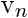

# 第 4 节 SciPy - 科学计算库（上）

## 一、实验说明

SciPy 库建立在 Numpy 库之上，提供了大量科学算法，主要包括这些主题：

*   特殊函数 ([scipy.special](http://docs.scipy.org/doc/scipy/reference/special.html))
*   积分 ([scipy.integrate](http://docs.scipy.org/doc/scipy/reference/integrate.html))
*   最优化 ([scipy.optimize](http://docs.scipy.org/doc/scipy/reference/optimize.html))
*   插值 ([scipy.interpolate](http://docs.scipy.org/doc/scipy/reference/interpolate.html))
*   傅立叶变换 ([scipy.fftpack](http://docs.scipy.org/doc/scipy/reference/fftpack.html))
*   信号处理 ([scipy.signal](http://docs.scipy.org/doc/scipy/reference/signal.html))
*   线性代数 ([scipy.linalg](http://docs.scipy.org/doc/scipy/reference/linalg.html))
*   稀疏特征值 ([scipy.sparse](http://docs.scipy.org/doc/scipy/reference/sparse.html))
*   统计 ([scipy.stats](http://docs.scipy.org/doc/scipy/reference/stats.html))
*   多维图像处理 ([scipy.ndimage](http://docs.scipy.org/doc/scipy/reference/ndimage.html))
*   文件 IO ([scipy.io](http://docs.scipy.org/doc/scipy/reference/io.html))

在本实验中我们将了解其中一些包的使用方法。

（ps：因本节只讲工具的用法，对这些科学主题不展开讨论，所以根据自己所学的知识挑选食用就好了，强迫症不要纠结哈～）

### 1\. 环境登录

无需密码自动登录，系统用户名 shiyanlou

### 2\. 环境介绍

本课程实验环境使用 Spyder。首先打开 terminal，然后输入以下命令：

```py
spyder -w scientific-python-lectures 
```

关于 Spyder 的使用可参考文档：https://pythonhosted.org/spyder/

本实验基本在控制台下进行，可关闭其余窗口，只保留控制台。如需要调出窗口，可以通过 view->windows and toolbar 调出。比如希望在 py 文件中编写代码，可以 view->windows and toolbar->Editor 调出编辑器窗口。


## 二、实验内容

让我们先导入必要的库

```py
from numpy import *
from scipy import * 
```

## 特定函数

在计算科学问题时，常常会用到很多特定的函数，SciPy 提供了一个非常广泛的特定函数集合。函数列表可参考： http://docs.scipy.org/doc/scipy/reference/special.html#module-scipy.special

为了演示特定函数的一般用法我们拿贝塞尔函数举例：

```py
#
# The scipy.special module includes a large number of Bessel-functions
# Here we will use the functions jn and yn, which are the Bessel functions 
# of the first and second kind and real-valued order. We also include the 
# function jn_zeros and yn_zeros that gives the zeroes of the functions jn
# and yn.
#
%matplotlib qt
from scipy.special import jn, yn, jn_zeros, yn_zeros
import matplotlib.pyplot as plt

n = 0    # order
x = 0.0

# Bessel function of first kind
print "J_%d(%f) = %f" % (n, x, jn(n, x))

x = 1.0
# Bessel function of second kind
print "Y_%d(%f) = %f" % (n, x, yn(n, x))

=> J_0(0.000000) = 1.000000
   Y_0(1.000000) = 0.088257

x = linspace(0, 10, 100)

fig, ax = plt.subplots()
for n in range(4):
    ax.plot(x, jn(n, x), label=r"$J_%d(x)$" % n)
ax.legend();

fig 
```


```py
# zeros of Bessel functions
n = 0 # order
m = 4 # number of roots to compute
jn_zeros(n, m)

=> array([  2.40482556,   5.52007811,   8.65372791,  11.79153444]) 
```

## 积分

### 数值积分: 求积

 被称作 *数值求积*，Scipy 提供了一些列不同类型的求积函数，像是 `quad`, `dblquad` 还有 `tplquad` 分别对应单积分，双重积分，三重积分。

```py
from scipy.integrate import quad, dblquad, tplquad 
```

`quad` 函数有许多参数选项来调整该函数的行为（详情见`help(quad)`）。

一般用法如下:

```py
# define a simple function for the integrand
def f(x):
    return x

x_lower = 0 # the lower limit of x
x_upper = 1 # the upper limit of x

val, abserr = quad(f, x_lower, x_upper)

print "integral value =", val, ", absolute error =", abserr 

=> integral value = 0.5 , absolute error = 5.55111512313e-15 
```

如果我们需要传递额外的参数，可以使用 `args` 关键字：

```py
def integrand(x, n):
    """
    Bessel function of first kind and order n. 
    """
    return jn(n, x)

x_lower = 0  # the lower limit of x
x_upper = 10 # the upper limit of x

val, abserr = quad(integrand, x_lower, x_upper, args=(3,))

print val, abserr 

=> 0.736675137081 9.38925687719e-13 
```

对于简单的函数我们可以直接使用匿名函数：

```py
val, abserr = quad(lambda x: exp(-x ** 2), -Inf, Inf)

print "numerical  =", val, abserr

analytical = sqrt(pi)
print "analytical =", analytical

=> numerical  = 1.77245385091 1.42026367809e-08
   analytical = 1.77245385091 
```

如例子所示，'Inf' 与 '-Inf' 可以表示数值极限。

高阶积分用法类似:

```py
def integrand(x, y):
    return exp(-x**2-y**2)

x_lower = 0  
x_upper = 10
y_lower = 0
y_upper = 10

val, abserr = dblquad(integrand, x_lower, x_upper, lambda x : y_lower, lambda x: y_upper)

print val, abserr 

=> 0.785398163397 1.63822994214e-13 
```

注意到我们为 y 积分的边界传参的方式，这样写是因为 y 可能是关于 x 的函数。

## 常微分方程 (ODEs)

SciPy 提供了两种方式来求解常微分方程：基于函数 `odeint` 的 API 与基于 `ode` 类的面相对象的 API。通常 `odeint` 更好上手一些，而 `ode` 类更灵活一些。

这里我们将使用 `odeint` 函数，首先让我们载入它：

```py
from scipy.integrate import odeint, ode 
```

常微分方程组的标准形式如下:


当


为了求解常微分方程我们需要知道方程  与初始条件 注意到高阶常微分方程常常写成引入新的变量作为中间导数的形式。 一旦我们定义了函数 `f` 与数组 `y_0` 我们可以使用 `odeint` 函数：

```py
y_t = odeint(f, y_0, t) 
```

我们将会在下面的例子中看到 Python 代码是如何实现 `f` 与 `y_0` 。

#### 示例: 双摆

让我们思考一个物理学上的例子：双摆

关于双摆，参考：http://en.wikipedia.org/wiki/Double_pendulum

```py
Image(url='http://upload.wikimedia.org/wikipedia/commons/c/c9/Double-compound-pendulum-dimensioned.svg') 
```


维基上已给出双摆的运动方程:


为了使 Python 代码更容易实现，让我们介绍新的变量名与向量表示法： 


```py
g = 9.82
L = 0.5
m = 0.1

def dx(x, t):
    """
    The right-hand side of the pendulum ODE
    """
    x1, x2, x3, x4 = x[0], x[1], x[2], x[3]

    dx1 = 6.0/(m*L**2) * (2 * x3 - 3 * cos(x1-x2) * x4)/(16 - 9 * cos(x1-x2)**2)
    dx2 = 6.0/(m*L**2) * (8 * x4 - 3 * cos(x1-x2) * x3)/(16 - 9 * cos(x1-x2)**2)
    dx3 = -0.5 * m * L**2 * ( dx1 * dx2 * sin(x1-x2) + 3 * (g/L) * sin(x1))
    dx4 = -0.5 * m * L**2 * (-dx1 * dx2 * sin(x1-x2) + (g/L) * sin(x2))

    return [dx1, dx2, dx3, dx4]

# choose an initial state
x0 = [pi/4, pi/2, 0, 0]

# time coodinate to solve the ODE for: from 0 to 10 seconds
t = linspace(0, 10, 250)

# solve the ODE problem
x = odeint(dx, x0, t)

# plot the angles as a function of time

fig, axes = plt.subplots(1,2, figsize=(12,4))
axes[0].plot(t, x[:, 0], 'r', label="theta1")
axes[0].plot(t, x[:, 1], 'b', label="theta2")

x1 = + L * sin(x[:, 0])
y1 = - L * cos(x[:, 0])

x2 = x1 + L * sin(x[:, 1])
y2 = y1 - L * cos(x[:, 1])

axes[1].plot(x1, y1, 'r', label="pendulum1")
axes[1].plot(x2, y2, 'b', label="pendulum2")
axes[1].set_ylim([-1, 0])
axes[1].set_xlim([1, -1]);

fig 
```


我们将在第四节课看到如何做出更好的演示动画。

```py
from IPython.display import clear_output
import time

fig, ax = plt.subplots(figsize=(4,4))

for t_idx, tt in enumerate(t[:200]):

    x1 = + L * sin(x[t_idx, 0])
    y1 = - L * cos(x[t_idx, 0])

    x2 = x1 + L * sin(x[t_idx, 1])
    y2 = y1 - L * cos(x[t_idx, 1])

    ax.cla()    
    ax.plot([0, x1], [0, y1], 'r.-')
    ax.plot([x1, x2], [y1, y2], 'b.-')
    ax.set_ylim([-1.5, 0.5])
    ax.set_xlim([1, -1])

    display(fig)
    clear_output()

    time.sleep(0.1)

fig 
```


#### 示例：阻尼谐震子

常微分方程问题在计算物理学中非常重要，所以我们接下来要看另一个例子：阻尼谐震子。wiki 地址：http://en.wikipedia.org/wiki/Damping

阻尼震子的运动公式：


其中  是震子的位置,  是频率,  是阻尼系数. 为了写二阶标准行事的 ODE 我们引入变量：

:


在这个例子的实现中，我们会加上额外的参数到 RHS 方程中：

```py
def dy(y, t, zeta, w0):
    """
    The right-hand side of the damped oscillator ODE
    """
    x, p = y[0], y[1]

    dx = p
    dp = -2 * zeta * w0 * p - w0**2 * x

    return [dx, dp]

# initial state: 
y0 = [1.0, 0.0]

# time coodinate to solve the ODE for
t = linspace(0, 10, 1000)
w0 = 2*pi*1.0

# solve the ODE problem for three different values of the damping ratio

y1 = odeint(dy, y0, t, args=(0.0, w0)) # undamped
y2 = odeint(dy, y0, t, args=(0.2, w0)) # under damped
y3 = odeint(dy, y0, t, args=(1.0, w0)) # critial damping
y4 = odeint(dy, y0, t, args=(5.0, w0)) # over damped

fig, ax = plt.subplots()
ax.plot(t, y1[:,0], 'k', label="undamped", linewidth=0.25)
ax.plot(t, y2[:,0], 'r', label="under damped")
ax.plot(t, y3[:,0], 'b', label=r"critical damping")
ax.plot(t, y4[:,0], 'g', label="over damped")
ax.legend();

fig 
```


## 傅立叶变换

傅立叶变换是计算物理学所用到的通用工具之一。Scipy 提供了使用 NetLib [FFTPACK](http://www.netlib.org/fftpack/) 库的接口，它是用 FORTRAN 写的。Scipy 还另外提供了很多便捷的函数。不过大致上接口都与 NetLib 的接口差不多。

让我们加载它：

```py
from scipy.fftpack import * 
```

下面演示快速傅立叶变换，例子使用上节阻尼谐震子的例子：

```py
N = len(t)
dt = t[1]-t[0]

# calculate the fast fourier transform
# y2 is the solution to the under-damped oscillator from the previous section
F = fft(y2[:,0]) 

# calculate the frequencies for the components in F
w = fftfreq(N, dt)

fig, ax = plt.subplots(figsize=(9,3))
ax.plot(w, abs(F));

fig 
```


既然信号是实数，同时频谱是对称的。那么我们只需要画出正频率所对应部分的图：

```py
indices = where(w > 0) # select only indices for elements that corresponds to positive frequencies
w_pos = w[indices]
F_pos = F[indices]

fig, ax = subplots(figsize=(9,3))
ax.plot(w_pos, abs(F_pos))
ax.set_xlim(0, 5);

fig 
```


正如预期的那样，我们可以看到频谱的峰值在 1 处。1 就是我们在上节例子中所选的频率。

## 线性代数

线性代数模块包含了大量矩阵相关的函数，包括线性方程求解，特征值求解，矩阵函数，分解函数（SVD, LU, cholesky）等等。 详情见：http://docs.scipy.org/doc/scipy/reference/linalg.html

### 线性方程组

线性方程组的矩阵形式：


 是矩阵，是向量，代码如下：

```py
from scipy.linalg import *
from numpy.random import *

A = array([[1,2,3], [4,5,6], [7,8,9]])
b = array([1,2,3])

x = solve(A, b)

x

=> array([-0.33333333,  0.66666667,  0\.        ])

# check
dot(A, x) - b

=> array([ -1.11022302e-16,   0.00000000e+00,   0.00000000e+00]) 
```

对于

 都是矩阵，我们也可以这么做:

```py
A = rand(3,3)
B = rand(3,3)

X = solve(A, B)

X

=> array([[ 2.28587973,  5.88845235,  1.6750663 ],
          [-4.88205838, -5.26531274, -1.37990347],
          [ 1.75135926, -2.05969998, -0.09859636]])

# check
norm(dot(A, X) - B)

=> 6.2803698347351007e-16 
```

### 特征值 与 特征向量

矩阵  的特征值问题:


 是第  个特征向量，  是第  个特征值。

使用 `eigvals` 计算矩阵的特征值，使用 `eig` 同时计算矩阵的特征值与特征向量：

```py
evals = eigvals(A)
evals

=> array([ 1.06633891+0.j        , -0.12420467+0.10106325j,
          -0.12420467-0.10106325j])

evals, evecs = eig(A)
evals

=> array([ 1.06633891+0.j        , -0.12420467+0.10106325j,
          -0.12420467-0.10106325j])

evecs
=> array([[ 0.89677688+0.j        , -0.30219843-0.30724366j, -0.30219843+0.30724366j],
          [ 0.35446145+0.j        ,  0.79483507+0.j        ,  0.79483507+0.j        ],
          [ 0.26485526+0.j        , -0.20767208+0.37334563j, -0.20767208-0.37334563j]]) 
```

第  个特征值(存储在 `evals[n]`)所对应的特征向量是`evecs` 的第 n 列, 比如, `evecs[:,n]`。为了验证这点， 让我们将特征向量乘上矩阵，比较乘积与特征值：

```py
n = 1    
norm(dot(A, evecs[:,n]) - evals[n] * evecs[:,n])

=> 1.3964254612015911e-16 
```

### 矩阵运算

```py
# the matrix inverse
inv(A)

=> array([[-1.38585633,  1.36837431,  6.03633364],
          [ 3.80855289, -4.76960426, -5.2571037 ],
          [ 0.0689213 ,  2.4652602 , -2.5948838 ]])

# determinant
det(A)

=> 0.027341548212627968

# norms of various orders
norm(A, ord=2), norm(A, ord=Inf)

=> (1.1657807164173386, 1.7872032588446576) 
```

### 稀疏矩阵

稀疏矩阵对于数值模拟一个大的方程组是很有帮助的。SciPy 对稀疏矩阵有着很好的支持，可以对其进行基本的线性代数运算（比如方程求解，特征值计算等）。

有很多种存储稀疏矩阵的方式。一般常用的有坐标形式（COO），列表嵌套列表的形式（LIL）,压缩列（CSC），压缩行（CSR）等。

每一种形式都有它的优缺点。CSR 与 CSC 在大部分算法下都有着不错的性能，但是它们不够直观，也不容易初始化。所以一般情况下我们都会先在 COO 活着 LIL 下进行初始化，再转换成 CSC 活着 CSR 形式使用。

当我们创建一个稀疏矩阵的时候，我们需要选择它的存储形式：

```py
from scipy.sparse import *

# dense matrix
M = array([[1,0,0,0], [0,3,0,0], [0,1,1,0], [1,0,0,1]]); M

=> array([[1, 0, 0, 0],
          [0, 3, 0, 0],
          [0, 1, 1, 0],
          [1, 0, 0, 1]])

# convert from dense to sparse
A = csr_matrix(M); A

=> <4x4 sparse matrix of type '<type 'numpy.int64'>'
       with 6 stored elements in Compressed Sparse Row format>

# convert from sparse to dense
A.todense()

=> matrix([[1, 0, 0, 0],
           [0, 3, 0, 0],
           [0, 1, 1, 0],
           [1, 0, 0, 1]]) 
```

创建稀疏矩阵更有效率的方法是：先创建一个空矩阵，再按索引进行填充：

```py
A = lil_matrix((4,4)) # empty 4x4 sparse matrix
A[0,0] = 1
A[1,1] = 3
A[2,2] = A[2,1] = 1
A[3,3] = A[3,0] = 1
A

=> <4x4 sparse matrix of type '<type 'numpy.float64'>'
       with 6 stored elements in LInked List format>

A.todense()

matrix([[ 1.,  0.,  0.,  0.],
        [ 0.,  3.,  0.,  0.],
        [ 0.,  1.,  1.,  0.],
        [ 1.,  0.,  0.,  1.]]) 
```

在两种不同的稀疏矩阵格式间转换：

```py
A

=> <4x4 sparse matrix of type '<type 'numpy.float64'>'
       with 6 stored elements in LInked List format>

A = csr_matrix(A); A

=> <4x4 sparse matrix of type '<type 'numpy.float64'>'
       with 6 stored elements in Compressed Sparse Row format>

A = csc_matrix(A); A

=> <4x4 sparse matrix of type '<type 'numpy.float64'>'
       with 6 stored elements in Compressed Sparse Column format> 
```

可以像计算稠密矩阵一样计算稀疏矩阵:

```py
A.todense()

=> matrix([[ 1.,  0.,  0.,  0.],
           [ 0.,  3.,  0.,  0.],
           [ 0.,  1.,  1.,  0.],
           [ 1.,  0.,  0.,  1.]])

(A * A).todense()

=> matrix([[ 1.,  0.,  0.,  0.],
           [ 0.,  9.,  0.,  0.],
           [ 0.,  4.,  1.,  0.],
           [ 2.,  0.,  0.,  1.]])

dot(A, A).todense()

=> matrix([[ 1.,  0.,  0.,  0.],
           [ 0.,  9.,  0.,  0.],
           [ 0.,  4.,  1.,  0.],
           [ 2.,  0.,  0.,  1.]])

v = array([1,2,3,4])[:,newaxis]; v

=> array([[1],
          [2],
          [3],
          [4]])

# sparse matrix - dense vector multiplication
A * v

=> array([[ 1.],
          [ 6.],
          [ 5.],
          [ 5.]])

# same result with dense matrix - dense vector multiplcation
A.todense() * v

=> matrix([[ 1.],
           [ 6.],
           [ 5.],
           [ 5.]]) 
```

## 最优化

最优化 (找到函数的最大值或最小值) 问题是数学中比较大的话题, 复杂的函数与变量的增加会使问题变得更加困难。这里我们只看一些简单的例子。

想知道更多，详情见： http://scipy- lectures.github.com/advanced/mathematical_optimization/index.html

让我们首先载入模块：

```py
from scipy import optimize 
```

### 找到一个最小值

首先看一下单变量简单函数的最优化解法：

```py
def f(x):
    return 4*x**3 + (x-2)**2 + x**4

fig, ax  = subplots()
x = linspace(-5, 3, 100)
ax.plot(x, f(x)); 
```


可以使用 `fmin_bfgs` 找到函数的最小值：

```py
x_min = optimize.fmin_bfgs(f, -2)
x_min 

=> Optimization terminated successfully.
            Current function value: -3.506641
            Iterations: 6
            Function evaluations: 30
            Gradient evaluations: 10

   array([-2.67298167])

optimize.fmin_bfgs(f, 0.5) 

=> Optimization terminated successfully.
            Current function value: 2.804988
            Iterations: 3
            Function evaluations: 15
            Gradient evaluations: 5

   array([ 0.46961745]) 
```

也可以使用 `brent` 或者 `fminbound`函数，区别就是一点语法和实现所用的算法。

```py
optimize.brent(f)

=> 0.46961743402759754

optimize.fminbound(f, -4, 2)

=> -2.6729822917513886 
```

### 找到方程的解

为了找到  方程的根，我们可以使用 `fsolve`。它需要一个初始的猜测值：

```py
omega_c = 3.0
def f(omega):
    # a transcendental equation: resonance frequencies of a low-Q SQUID terminated microwave resonator
    return tan(2*pi*omega) - omega_c/omega

fig, ax  = subplots(figsize=(10,4))
x = linspace(0, 3, 1000)
y = f(x)
mask = where(abs(y) > 50)
x[mask] = y[mask] = NaN # get rid of vertical line when the function flip sign
ax.plot(x, y)
ax.plot([0, 3], [0, 0], 'k')
ax.set_ylim(-5,5); 
```


```py
optimize.fsolve(f, 0.1)

=> array([ 0.23743014])

optimize.fsolve(f, 0.6)

=> array([ 0.71286972])

optimize.fsolve(f, 1.1)

=> array([ 1.18990285]) 
```

## 插值

scipy 插值是很方便的：`interp1d` 函数以一组 X，Y 数据为输入数据，返回一个类似于函数的对象，输入任意 x 值给该对象，返回对应的内插值 y：

```py
from scipy.interpolate import *

def f(x):
    return sin(x)

n = arange(0, 10)  
x = linspace(0, 9, 100)

y_meas = f(n) + 0.1 * randn(len(n)) # simulate measurement with noise
y_real = f(x)

linear_interpolation = interp1d(n, y_meas)
y_interp1 = linear_interpolation(x)

cubic_interpolation = interp1d(n, y_meas, kind='cubic')
y_interp2 = cubic_interpolation(x)

fig, ax = subplots(figsize=(10,4))
ax.plot(n, y_meas, 'bs', label='noisy data')
ax.plot(x, y_real, 'k', lw=2, label='true function')
ax.plot(x, y_interp1, 'r', label='linear interp')
ax.plot(x, y_interp2, 'g', label='cubic interp')
ax.legend(loc=3); 
```


## 统计学

`scipy.stats` 模块包含了大量的统计分布，统计函数与测试。

完整的文档请查看：http://docs.scipy.org/doc/scipy/reference/stats.html

```py
from scipy import stats

# create a (discreet) random variable with poissionian distribution

X = stats.poisson(3.5) # photon distribution for a coherent state with n=3.5 photons

n = arange(0,15)

fig, axes = subplots(3,1, sharex=True)

# plot the probability mass function (PMF)
axes[0].step(n, X.pmf(n))

# plot the commulative distribution function (CDF)
axes[1].step(n, X.cdf(n))

# plot histogram of 1000 random realizations of the stochastic variable X
axes[2].hist(X.rvs(size=1000)); 
```


```py
# create a (continous) random variable with normal distribution
Y = stats.norm()

x = linspace(-5,5,100)

fig, axes = subplots(3,1, sharex=True)

# plot the probability distribution function (PDF)
axes[0].plot(x, Y.pdf(x))

# plot the commulative distributin function (CDF)
axes[1].plot(x, Y.cdf(x));

# plot histogram of 1000 random realizations of the stochastic variable Y
axes[2].hist(Y.rvs(size=1000), bins=50); 
```


统计值:

```py
X.mean(), X.std(), X.var() # poission distribution

=> (3.5, 1.8708286933869707, 3.5)

Y.mean(), Y.std(), Y.var() # normal distribution

=> (0.0, 1.0, 1.0) 
```

### 统计检验

检验两组独立的随机数据是否来组同一个分布：

```py
t_statistic, p_value = stats.ttest_ind(X.rvs(size=1000), X.rvs(size=1000))

print "t-statistic =", t_statistic
print "p-value =", p_value

=> t-statistic = -0.244622880865
   p-value = 0.806773564698 
```

既然 P 值很大，我们就不能拒绝两组数据拥有不同的平均值的假设：

检验一组随机数据的平均值是否为 0.1（实际均值为 0.1）：

```py
stats.ttest_1samp(Y.rvs(size=1000), 0.1)

=> (-4.4661322772225356, 8.8726783620609218e-06) 
```

低 p 值意味着我们可以拒绝 y 的均值为 0.1 这个假设。

```py
Y.mean()

=> 0.0

stats.ttest_1samp(Y.rvs(size=1000), Y.mean())

=> (0.51679431628006112, 0.60541413382728715) 
```

## 延伸阅读

*   http://www.scipy.org - The official web page for the SciPy project.
*   http://docs.scipy.org/doc/scipy/reference/tutorial/index.html - A tutorial on how to get started using SciPy.
*   https://github.com/scipy/scipy/ - The SciPy source code.

## License

该作品在 [知识共享许可协议 3.0](https://creativecommons.org/licenses/by/3.0/) 下许可授权。