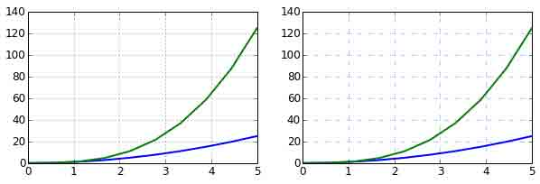

# 第 6 节 matplotlib - 2D 与 3D 图的绘制（上）

## 一、实验说明

Matplotlib 是一个优秀的 2D&3D 图形库， 主要功能是生成科学用图，它的优点包括：

*   上手容易
*   支持 LaTeX 格式的标签与文本
*   能够很好地控制图中的每一样元素，包括图的大小与 DPI
*   高质量保存，支持多种格式, 包括 PNG, PDF, SVG, EPS, 与 PGF。
*   可交互的图形界面，支持生成无头部信息的图表文件（方便批处理）

多亏了 matplotlib，我们可以通过编程来控制图表的方方面面，这样如果想要改变图表，只要改改代码就可以了。

更多信息参考: http://matplotlib.org/

### 1\. 环境登录

无需密码自动登录，系统用户名 shiyanlou

### 2\. 环境介绍

本课程实验环境使用 Spyder。首先打开 terminal，然后输入以下命令：

```py
spyder -w scientific-python-lectures 
```

关于 Spyder 的使用可参考文档：https://pythonhosted.org/spyder/

本实验基本在控制台下进行，可关闭其余窗口，只保留控制台。如需要调出窗口，可以通过 view->windows and toolbar 调出。比如希望在 py 文件中编写代码，可以 view->windows and toolbar->Editor 调出编辑器窗口。


## 二、实验内容

## 类 MATLAB API

最简单的入门是从类 MATLAB API 开始，它被设计成兼容 MATLAB 绘图函数。

让我们加载它：

```py
from pylab import * 
```

使用 qt 作为图形后端：

```py
%matplotlib qt 
```

### 示例

类 MATLAB API 绘图的简单例子:

```py
from numpy import *
x = linspace(0, 5, 10)
y = x ** 2

figure()
plot(x, y, 'r')
xlabel('x')
ylabel('y')
title('title')
show() 
```


创建子图，选择绘图用的颜色与描点符号:

```py
subplot(1,2,1)
plot(x, y, 'r--')
subplot(1,2,2)
plot(y, x, 'g*-'); 
```


此类 API 的好处是可以节省你的代码量，但是我们并不鼓励使用它处理复杂的图表。处理复杂图表时， matplotlib 面向对象 API 是一个更好的选择。

## matplotlib 面向对象 API

首先让我们加载它：

```py
import matplotlib.pyplot as plt 
```

使用面向对象 API 的方法和之前例子里的看起来很类似，不同的是，我们并不创建一个全局实例，而是将新建实例的引用保存在 `fig` 变量中,如果我们想在图中新建一个坐标轴实例，只需要 调用 `fig` 实例的 `add_axes` 方法：

```py
fig = plt.figure()

axes = fig.add_axes([0.1, 0.1, 0.8, 0.8]) # left, bottom, width, height (range 0 to 1)

axes.plot(x, y, 'r')

axes.set_xlabel('x')
axes.set_ylabel('y')
axes.set_title('title')

fig 
```


尽管会写更多的代码，好处在于我们对于图表的绘制有了完全的控制权，可以很容易地多加一个坐标轴到图中：

```py
fig = plt.figure()

axes1 = fig.add_axes([0.1, 0.1, 0.8, 0.8]) # main axes
axes2 = fig.add_axes([0.2, 0.5, 0.4, 0.3]) # inset axes

# main figure
axes1.plot(x, y, 'r')
axes1.set_xlabel('x')
axes1.set_ylabel('y')
axes1.set_title('title')

# insert
axes2.plot(y, x, 'g')
axes2.set_xlabel('y')
axes2.set_ylabel('x')
axes2.set_title('insert title');

fig 
```


如果我们不在意坐标轴在图中的排放位置️，那么就可以使用 matplotlib 的布局管理器了，我最喜欢的是 subplots，使用方式如下：

```py
fig, axes = plt.subplots()

axes.plot(x, y, 'r')
axes.set_xlabel('x')
axes.set_ylabel('y')
axes.set_title('title');

fig 
```


```py
fig, axes = plt.subplots(nrows=1, ncols=2)

for ax in axes:
    ax.plot(x, y, 'r')
    ax.set_xlabel('x')
    ax.set_ylabel('y')
    ax.set_title('title')

fig 
```


很简单吧，但是标签重叠就不好看了。可以使用 `fig.tight_layout` 解决这个问题，它会自动调整标签的位置：

```py
fig, axes = plt.subplots(nrows=1, ncols=2)

for ax in axes:
    ax.plot(x, y, 'r')
    ax.set_xlabel('x')
    ax.set_ylabel('y')
    ax.set_title('title')

fig.tight_layout()
fig 
```


### 图表尺寸，长宽比 与 DPI

在创建 `Figure` 对象的时候，使用`figsize` 与 `dpi` 参数能够设置图表尺寸与 DPI， 创建一个 800*400 像素，每英寸 100 像素的图就可以这么做：

```py
fig = plt.figure(figsize=(8,4), dpi=100)

<matplotlib.figure.Figure at 0x4cbd390> 
```

同样的参数也可以用在布局管理器上:

```py
fig, axes = plt.subplots(figsize=(12,3))

axes.plot(x, y, 'r')
axes.set_xlabel('x')
axes.set_ylabel('y')
axes.set_title('title'); 
```


### 保存图表

可以使用 `savefig` 保存图表

```py
fig.savefig("filename.jpg") 
```

这里我们也可以有选择地指定 DPI，并且选择不同的输出格式：

```py
fig.savefig("filename.jpg", dpi=200) 
```

#### 有哪些格式？哪种格式能获得最佳质量？

Matplotlib 可以生成多种格式的高质量图像，包括 PNG，JPG，EPS，SVG，PGF 和 PDF。如果是科学论文的话，我建议尽量使用 pdf 格式。 (`pdflatex` 编译的 LaTeX 文档使用 `includegraphics` 命令就能包含 PDF 文件)。 一些情况下，PGF 也是一个很好的选择。

### 图例，轴标 与 标题

现在我们已经介绍了如何创建图表画布以及如何添加新的坐标轴实例，让我们看一看如何加上标题，轴标和图例

**标题**

每一个坐标轴实例都可以加上一个标题，只需调用坐标轴实例的 `set_title` 方法:

```py
ax.set_title("title"); 
```

**轴标**

类似的， `set_xlabel` 与 `set_ylabel` 可以设置坐标轴的 x 轴与 y 轴的标签。

```py
ax.set_xlabel("x")
ax.set_ylabel("y"); 
```

**图例**

有两种方法在图中加入图例。一种是调用坐标轴对象的 `legend` 方法，传入与之前定义的几条曲线相对应地图例文字的 列表/元组：

```py
ax.legend(["curve1", "curve2", "curve3"]); 
```

不过这种方式容易出错，比如增加了新的曲线或者移除了某条曲线。更好的方式是在调用 `plot`方法时使用 `label="label text"` 参数，再调用 `legend` 方法加入图例：

```py
ax.plot(x, x**2, label="curve1")
ax.plot(x, x**3, label="curve2")
ax.legend(); 
```

`legend` 还有一个可选参数 `loc` 决定画出图例的位置，详情见：http://matplotlib.org/users/legend_guide.html#legend-location

最常用的值如下：

```py
ax.legend(loc=0) # let matplotlib decide the optimal location
ax.legend(loc=1) # upper right corner
ax.legend(loc=2) # upper left corner
ax.legend(loc=3) # lower left corner
ax.legend(loc=4) # lower right corner
# .. many more options are available

=> <matplotlib.legend.Legend at 0x4c863d0> 
```

下面这个例子同时包含了标题，轴标，与图例的用法：

```py
fig, ax = plt.subplots()

ax.plot(x, x**2, label="y = x**2")
ax.plot(x, x**3, label="y = x**3")
ax.legend(loc=2); # upper left corner
ax.set_xlabel('x')
ax.set_ylabel('y')
ax.set_title('title');

fig 
```


### 格式化文本，LaTeX，字体大小，字体类型

Matplotlib 对 LaTeX 提供了很好的支持。我们只需要将 LaTeX 表达式封装在 `$` 符号内，就可以在图的任何文本中显示了，比如 `"$y=x³$"` 。

不过这里我们会遇到一些小问题，在 LaTeX 中我们常常会用到反斜杠，比如 `\alpha` 来产生符号 $\alpha$ 。但反斜杠在 python 字符串中是有特殊含义的。为了不出错，我们需要使用原始文本，只需要在字符串的前面加个 r 就行了，像是 `r"\alpha"` 或者 `r'\alpha'`：

```py
fig, ax = plt.subplots()

ax.plot(x, x**2, label=r"$y = \alpha²$")
ax.plot(x, x**3, label=r"$y = \alpha³$")
ax.legend(loc=2) # upper left corner
ax.set_xlabel(r'$\alpha$', fontsize=18)
ax.set_ylabel(r'$y$', fontsize=18)
ax.set_title('title');

fig 
```


我们可以更改全局字体大小或者类型:

```py
# Update the matplotlib configuration parameters:
from matplotlib import rcParams
rcParams.update({'font.size': 18, 'font.family': 'serif'})

fig, ax = plt.subplots()

ax.plot(x, x**2, label=r"$y = \alpha²$")
ax.plot(x, x**3, label=r"$y = \alpha³$")
ax.legend(loc=2) # upper left corner
ax.set_xlabel(r'$\alpha$')
ax.set_ylabel(r'$y$')
ax.set_title('title');

fig 
```


STIX 字体是一种好选择：

```py
# Update the matplotlib configuration parameters:
matplotlib.rcParams.update({'font.size': 18, 'font.family': 'STIXGeneral', 'mathtext.fontset': 'stix'})

fig, ax = plt.subplots()

ax.plot(x, x**2, label=r"$y = \alpha²$")
ax.plot(x, x**3, label=r"$y = \alpha³$")
ax.legend(loc=2) # upper left corner
ax.set_xlabel(r'$\alpha$')
ax.set_ylabel(r'$y$')
ax.set_title('title');

fig 
```


我们也可以将图中的文本全用 Latex 渲染：

```py
matplotlib.rcParams.update({'font.size': 18, 'text.usetex': True})

fig, ax = plt.subplots()

ax.plot(x, x**2, label=r"$y = \alpha²$")
ax.plot(x, x**3, label=r"$y = \alpha³$")
ax.legend(loc=2) # upper left corner
ax.set_xlabel(r'$\alpha$')
ax.set_ylabel(r'$y$')
ax.set_title('title');

fig 
```


```py
# 重置
matplotlib.rcParams.update({'font.size': 12, 'font.family': 'sans', 'text.usetex': False}) 
```

### 设置颜色，线宽 与 线型

#### 颜色

有了 matplotlib，我们就有很多方法能够定义线的颜色和很多其他图形元素。首先，我们可以使用类 MATLAB 语法，`'b'` 代表蓝色，`'g'` 代表绿色，依此类推。matplotlib 同时也支持 MATLAB API 选择线型所使用的方式：比如 'b.-' 意味着蓝线标着点：

```py
# MATLAB style line color and style 
ax.plot(x, x**2, 'b.-') # blue line with dots
ax.plot(x, x**3, 'g--') # green dashed line

fig

=> [<matplotlib.lines.Line2D at 0x4985810>] 
```

我们也可以以颜色的名字或者 RGB 值选择颜色，alpha 参数决定了颜色的透明度：

```py
fig, ax = plt.subplots()

ax.plot(x, x+1, color="red", alpha=0.5) # half-transparant red
ax.plot(x, x+2, color="#1155dd")        # RGB hex code for a bluish color
ax.plot(x, x+3, color="#15cc55")        # RGB hex code for a greenish color

fig

=> [<matplotlib.lines.Line2D at 0x4edbd10>] 
```


#### 线与描点风格

`linewidth` 或是 `lw` 参数改变线宽。 `linestyle` 或是 `ls` 参数改变线的风格。

```py
fig, ax = plt.subplots(figsize=(12,6))

ax.plot(x, x+1, color="blue", linewidth=0.25)
ax.plot(x, x+2, color="blue", linewidth=0.50)
ax.plot(x, x+3, color="blue", linewidth=1.00)
ax.plot(x, x+4, color="blue", linewidth=2.00)

# possible linestype options ‘-‘, ‘–’, ‘-.’, ‘:’, ‘steps’
ax.plot(x, x+5, color="red", lw=2, linestyle='-')
ax.plot(x, x+6, color="red", lw=2, ls='-.')
ax.plot(x, x+7, color="red", lw=2, ls=':')

# custom dash
line, = ax.plot(x, x+8, color="black", lw=1.50)
line.set_dashes([5, 10, 15, 10]) # format: line length, space length, ...

# possible marker symbols: marker = '+', 'o', '*', 's', ',', '.', '1', '2', '3', '4', ...
ax.plot(x, x+ 9, color="green", lw=2, ls='*', marker='+')
ax.plot(x, x+10, color="green", lw=2, ls='*', marker='o')
ax.plot(x, x+11, color="green", lw=2, ls='*', marker='s')
ax.plot(x, x+12, color="green", lw=2, ls='*', marker='1')

# marker size and color
ax.plot(x, x+13, color="purple", lw=1, ls='-', marker='o', markersize=2)
ax.plot(x, x+14, color="purple", lw=1, ls='-', marker='o', markersize=4)
ax.plot(x, x+15, color="purple", lw=1, ls='-', marker='o', markersize=8, markerfacecolor="red")
ax.plot(x, x+16, color="purple", lw=1, ls='-', marker='s', markersize=8, 
        markerfacecolor="yellow", markeredgewidth=2, markeredgecolor="blue")

fig 
```


### 控制坐标轴的样式

坐标轴样式也是通常需要自定义的地方，像是标号或是标签的位置或是字体的大小等。

#### 图的范围

我们想做的第一件事也许是设置坐标轴的范围，可以使用 `set_ylim` 或是 `set_xlim` 方法或者 `axis('tight')` 自动将坐标轴调整的紧凑 The first thing we might want to configure is the ranges of the axes. We can do this using the `set_ylim` and `set_xlim` methods in the axis object, or `axis('tight')` for automatrically getting "tightly fitted" axes ranges:

```py
fig, axes = plt.subplots(1, 3, figsize=(12, 4))

axes[0].plot(x, x**2, x, x**3)
axes[0].set_title("default axes ranges")

axes[1].plot(x, x**2, x, x**3)
axes[1].axis('tight')
axes[1].set_title("tight axes")

axes[2].plot(x, x**2, x, x**3)
axes[2].set_ylim([0, 60])
axes[2].set_xlim([2, 5])
axes[2].set_title("custom axes range");

fig 
```


#### 对数刻度

也可以将轴的刻度设置成对数刻度，调用 `set_xscale` 与 `set_yscale` 设置刻度，参数选择 "log" ：

```py
fig, axes = plt.subplots(1, 2, figsize=(10,4))

axes[0].plot(x, x**2, x, exp(x))
axes[0].set_title("Normal scale")

axes[1].plot(x, x**2, x, exp(x))
axes[1].set_yscale("log")
axes[1].set_title("Logarithmic scale (y)");

fig 
```


### 自定义标号位置与符号

`set_xticks` 与 `set_yticks` 方法可以显示地设置标号的位置， `set_xticklabels` 与 `set_yticklabels` 为每一个标号设置符号：

```py
fig, ax = plt.subplots(figsize=(10, 4))

ax.plot(x, x**2, x, x**3, lw=2)

ax.set_xticks([1, 2, 3, 4, 5])
ax.set_xticklabels([r'$\alpha$', r'$\beta$', r'$\gamma$', r'$\delta$', r'$\epsilon$'], fontsize=18)

yticks = [0, 50, 100, 150]
ax.set_yticks(yticks)
ax.set_yticklabels(["$%.1f$" % y for y in yticks], fontsize=18); # use LaTeX formatted labels

fig

=> [<matplotlib.text.Text at 0x5d75c90>,
    <matplotlib.text.Text at 0x585fe50>,
    <matplotlib.text.Text at 0x575c090>,
    <matplotlib.text.Text at 0x599e610>] 
```


还有许多方法可以控制主次标号，参考 http://matplotlib.org/api/ticker_api.html

#### 科学计数法

如果轴上涉及非常大的数，最好使用科学计数法：

```py
fig, ax = plt.subplots(1, 1)

ax.plot(x, x**2, x, exp(x))
ax.set_title("scientific notation")

ax.set_yticks([0, 50, 100, 150])

from matplotlib import ticker
formatter = ticker.ScalarFormatter(useMathText=True)
formatter.set_scientific(True) 
formatter.set_powerlimits((-1,1)) 
ax.yaxis.set_major_formatter(formatter) 

fig 
```


### 轴上数与标签的间距

```py
# distance between x and y axis and the numbers on the axes
rcParams['xtick.major.pad'] = 5
rcParams['ytick.major.pad'] = 5

fig, ax = plt.subplots(1, 1)

ax.plot(x, x**2, x, exp(x))
ax.set_yticks([0, 50, 100, 150])

ax.set_title("label and axis spacing")

# padding between axis label and axis numbers
ax.xaxis.labelpad = 5
ax.yaxis.labelpad = 5

ax.set_xlabel("x")
ax.set_ylabel("y");

fig 
```


```py
# restore defaults
rcParams['xtick.major.pad'] = 3
rcParams['ytick.major.pad'] = 3 
```

#### 调整坐标轴的位置：

```py
fig, ax = plt.subplots(1, 1)

ax.plot(x, x**2, x, exp(x))
ax.set_yticks([0, 50, 100, 150])

ax.set_title("title")
ax.set_xlabel("x")
ax.set_ylabel("y")

fig.subplots_adjust(left=0.15, right=.9, bottom=0.1, top=0.9);

fig 
```


### 坐标轴网格

`grid` 方法可以打开关闭网格线，也可以自定义网格的样式：

```py
fig, axes = plt.subplots(1, 2, figsize=(10,3))

# default grid appearance
axes[0].plot(x, x**2, x, x**3, lw=2)
axes[0].grid(True)

# custom grid appearance
axes[1].plot(x, x**2, x, x**3, lw=2)
axes[1].grid(color='b', alpha=0.5, linestyle='dashed', linewidth=0.5)

fig 
```



### 轴

我们也可以改变轴的属性:

```py
fig, ax = plt.subplots(figsize=(6,2))

ax.spines['bottom'].set_color('blue')
ax.spines['top'].set_color('blue')

ax.spines['left'].set_color('red')
ax.spines['left'].set_linewidth(2)

# turn off axis spine to the right
ax.spines['right'].set_color("none")
ax.yaxis.tick_left() # only ticks on the left side

fig 
```


### 双坐标轴

`twinx` 与 `twiny` 函数能设置双坐标轴：

```py
fig, ax1 = plt.subplots()

ax1.plot(x, x**2, lw=2, color="blue")
ax1.set_ylabel(r"area $(m²)$", fontsize=18, color="blue")
for label in ax1.get_yticklabels():
    label.set_color("blue")

ax2 = ax1.twinx()
ax2.plot(x, x**3, lw=2, color="red")
ax2.set_ylabel(r"volume $(m³)$", fontsize=18, color="red")
for label in ax2.get_yticklabels():
    label.set_color("red")

fig 
```


### 设置坐标原点在（0，0）点

```py
fig, ax = plt.subplots()

ax.spines['right'].set_color('none')
ax.spines['top'].set_color('none')

ax.xaxis.set_ticks_position('bottom')
ax.spines['bottom'].set_position(('data',0)) # set position of x spine to x=0

ax.yaxis.set_ticks_position('left')
ax.spines['left'].set_position(('data',0))   # set position of y spine to y=0

xx = np.linspace(-0.75, 1., 100)
ax.plot(xx, xx**3);

fig 
```


### 其他 2D 图表风格

包括一般的 `plot` 方法, 还有很多其他函数能够生成不同类型的图表，详情请见 http://matplotlib.org/gallery.html 这里列出其中几种比较常见的函数方法。

```py
n = array([0,1,2,3,4,5])

fig, axes = plt.subplots(1, 4, figsize=(12,3))

axes[0].scatter(xx, xx + 0.25*randn(len(xx)))
axes[0].set_title("scatter")

axes[1].step(n, n**2, lw=2)
axes[1].set_title("step")

axes[2].bar(n, n**2, align="center", width=0.5, alpha=0.5)
axes[2].set_title("bar")

axes[3].fill_between(x, x**2, x**3, color="green", alpha=0.5);
axes[3].set_title("fill_between");

fig 
```


```py
# polar plot using add_axes and polar projection
fig = plt.figure()
ax = fig.add_axes([0.0, 0.0, .6, .6], polar=True)
t = linspace(0, 2 * pi, 100)
ax.plot(t, t, color='blue', lw=3); 
```


```py
# A histogram
n = np.random.randn(100000)
fig, axes = plt.subplots(1, 2, figsize=(12,4))

axes[0].hist(n)
axes[0].set_title("Default histogram")
axes[0].set_xlim((min(n), max(n)))

axes[1].hist(n, cumulative=True, bins=50)
axes[1].set_title("Cumulative detailed histogram")
axes[1].set_xlim((min(n), max(n)));

fig 
```


### 文本注释

`text` 函数可以做文本注释，且支持 LaTeX 格式：

```py
fig, ax = plt.subplots()

ax.plot(xx, xx**2, xx, xx**3)

ax.text(0.15, 0.2, r"$y=x²$", fontsize=20, color="blue")
ax.text(0.65, 0.1, r"$y=x³$", fontsize=20, color="green");

fig 
```


### 带有多子图与插图的图

`fig.add_axes` 在图中加入新坐标轴

`subplots`， `subplot2grid`，`gridspec`等 子图布局管理器

#### subplots

```py
fig, ax = plt.subplots(2, 3)
fig.tight_layout()

fig 
```


#### subplot2grid

```py
fig = plt.figure()
ax1 = plt.subplot2grid((3,3), (0,0), colspan=3)
ax2 = plt.subplot2grid((3,3), (1,0), colspan=2)
ax3 = plt.subplot2grid((3,3), (1,2), rowspan=2)
ax4 = plt.subplot2grid((3,3), (2,0))
ax5 = plt.subplot2grid((3,3), (2,1))
fig.tight_layout()

fig 
```


#### gridspec

```py
import matplotlib.gridspec as gridspec

fig = plt.figure()

gs = gridspec.GridSpec(2, 3, height_ratios=[2,1], width_ratios=[1,2,1])
for g in gs:
    ax = fig.add_subplot(g)

fig.tight_layout()

fig 
```


#### add_axes

```py
fig, ax = plt.subplots()

ax.plot(xx, xx**2, xx, xx**3)
fig.tight_layout()

# inset
inset_ax = fig.add_axes([0.2, 0.55, 0.35, 0.35]) # X, Y, width, height

inset_ax.plot(xx, xx**2, xx, xx**3)
inset_ax.set_title('zoom near origin')

# set axis range
inset_ax.set_xlim(-.2, .2)
inset_ax.set_ylim(-.005, .01)

# set axis tick locations
inset_ax.set_yticks([0, 0.005, 0.01])
inset_ax.set_xticks([-0.1,0,.1]);

fig 
```


### 颜色映射图与轮廓图

颜色映射图与轮廓图适合绘制两个变量的函数。

有许多预定义的颜色映射图，参考：http://www.scipy.org/Cookbook/Matplotlib/Show_colormaps

```py
alpha = 0.7
phi_ext = 2 * pi * 0.5

def flux_qubit_potential(phi_m, phi_p):
    return 2 + alpha - 2 * cos(phi_p)*cos(phi_m) - alpha * cos(phi_ext - 2*phi_p)

phi_m = linspace(0, 2*pi, 100)
phi_p = linspace(0, 2*pi, 100)
X,Y = meshgrid(phi_p, phi_m)
Z = flux_qubit_potential(X, Y).T 
```

#### pcolor

```py
fig, ax = plt.subplots()

p = ax.pcolor(X/(2*pi), Y/(2*pi), Z, cmap=cm.RdBu, vmin=abs(Z).min(), vmax=abs(Z).max())
cb = fig.colorbar(p, ax=ax)

fig 
```


#### imshow

```py
fig, ax = plt.subplots()

im = ax.imshow(Z, cmap=cm.RdBu, vmin=abs(Z).min(), vmax=abs(Z).max(), extent=[0, 1, 0, 1])
im.set_interpolation('bilinear')

cb = fig.colorbar(im, ax=ax)

fig 
```


#### contour

```py
fig, ax = plt.subplots()

cnt = ax.contour(Z, cmap=cm.RdBu, vmin=abs(Z).min(), vmax=abs(Z).max(), extent=[0, 1, 0, 1])

fig 
```


## 3D 图

在 matploylib 中创建 3d 图，首先要做的是创建 `Axes3D` 类

```py
from mpl_toolkits.mplot3d.axes3d import Axes3D 
```

#### 绘制曲面

```py
fig = plt.figure(figsize=(14,6))

# `ax` is a 3D-aware axis instance because of the projection='3d' keyword argument to add_subplot
ax = fig.add_subplot(1, 2, 1, projection='3d')

p = ax.plot_surface(X, Y, Z, rstride=4, cstride=4, linewidth=0)

# surface_plot with color grading and color bar
ax = fig.add_subplot(1, 2, 2, projection='3d')
p = ax.plot_surface(X, Y, Z, rstride=1, cstride=1, cmap=cm.coolwarm, linewidth=0, antialiased=False)
cb = fig.colorbar(p, shrink=0.5) 
```


#### 绘制线框

```py
fig = plt.figure(figsize=(8,6))

ax = fig.add_subplot(1, 1, 1, projection='3d')

p = ax.plot_wireframe(X, Y, Z, rstride=4, cstride=4) 
```


#### 绘制投影轮廓

```py
fig = plt.figure(figsize=(8,6))

ax = fig.add_subplot(1,1,1, projection='3d')

ax.plot_surface(X, Y, Z, rstride=4, cstride=4, alpha=0.25)
cset = ax.contour(X, Y, Z, zdir='z', offset=-pi, cmap=cm.coolwarm)
cset = ax.contour(X, Y, Z, zdir='x', offset=-pi, cmap=cm.coolwarm)
cset = ax.contour(X, Y, Z, zdir='y', offset=3*pi, cmap=cm.coolwarm)

ax.set_xlim3d(-pi, 2*pi);
ax.set_ylim3d(0, 3*pi);
ax.set_zlim3d(-pi, 2*pi); 
```


#### 改变视图角度

`view_init` 可以改变视图角度，读取两个参数: `elevation` 与 `azimuth` 角度

```py
fig = plt.figure(figsize=(12,6))

ax = fig.add_subplot(1,2,1, projection='3d')
ax.plot_surface(X, Y, Z, rstride=4, cstride=4, alpha=0.25)
ax.view_init(30, 45)

ax = fig.add_subplot(1,2,2, projection='3d')
ax.plot_surface(X, Y, Z, rstride=4, cstride=4, alpha=0.25)
ax.view_init(70, 30)

fig.tight_layout() 
```


### 动画

`FuncAnimation` 函数能根据一系列图生成动画，它有以下参数：

`fig`：图的画布

`func`：更新图的函数

`init_func`：初始化图的函数

`frame`：图的数量

`blit`：告诉动画函数只更新改动的部分:

```py
def init():
    # setup figure

def update(frame_counter):
    # update figure for new frame

anim = animation.FuncAnimation(fig, update, init_func=init, frames=200, blit=True)

anim.save('animation.mp4', fps=30) # fps = frames per second 
```

为了使用动画特性，首先加载模块 `matplotlib.animation`：

```py
from matplotlib import animation

# solve the ode problem of the double compound pendulum again

from scipy.integrate import odeint

g = 9.82; L = 0.5; m = 0.1

def dx(x, t):
    x1, x2, x3, x4 = x[0], x[1], x[2], x[3]

    dx1 = 6.0/(m*L**2) * (2 * x3 - 3 * cos(x1-x2) * x4)/(16 - 9 * cos(x1-x2)**2)
    dx2 = 6.0/(m*L**2) * (8 * x4 - 3 * cos(x1-x2) * x3)/(16 - 9 * cos(x1-x2)**2)
    dx3 = -0.5 * m * L**2 * ( dx1 * dx2 * sin(x1-x2) + 3 * (g/L) * sin(x1))
    dx4 = -0.5 * m * L**2 * (-dx1 * dx2 * sin(x1-x2) + (g/L) * sin(x2))
    return [dx1, dx2, dx3, dx4]

x0 = [pi/2, pi/2, 0, 0]  # initial state
t = linspace(0, 10, 250) # time coordinates
x = odeint(dx, x0, t)    # solve the ODE problem 
```

生成双摆的运动动画：

```py
fig, ax = plt.subplots(figsize=(5,5))

ax.set_ylim([-1.5, 0.5])
ax.set_xlim([1, -1])

pendulum1, = ax.plot([], [], color="red", lw=2)
pendulum2, = ax.plot([], [], color="blue", lw=2)

def init():
    pendulum1.set_data([], [])
    pendulum2.set_data([], [])

def update(n): 
    # n = frame counter
    # calculate the positions of the pendulums
    x1 = + L * sin(x[n, 0])
    y1 = - L * cos(x[n, 0])
    x2 = x1 + L * sin(x[n, 1])
    y2 = y1 - L * cos(x[n, 1])

    # update the line data
    pendulum1.set_data([0 ,x1], [0 ,y1])
    pendulum2.set_data([x1,x2], [y1,y2])

anim = animation.FuncAnimation(fig, update, init_func=init, frames=len(t), blit=True)

# anim.save can be called in a few different ways, some which might or might not work
# on different platforms and with different versions of matplotlib and video encoders
#anim.save('animation.mp4', fps=20, extra_args=['-vcodec', 'libx264'], writer=animation.FFMpegWriter())
#anim.save('animation.mp4', fps=20, extra_args=['-vcodec', 'libx264'])
#anim.save('animation.mp4', fps=20, writer="ffmpeg", codec="libx264")
anim.save('animation.mp4', fps=20, writer="avconv", codec="libx264")

plt.close(fig) 
```

为了生成动画，首先需要安装 `libav-tools`

```py
$ sudo apt-get install libav-tools 
```

在 terminal 播放动画吧：

```py
$ avplay animation.mp4 
```


### 后端

Matplotlib 有很多用来渲染图片的后端：

```py
print(matplotlib.rcsetup.all_backends)

['GTK', 'GTKAgg', 'GTKCairo', 'MacOSX', 'Qt4Agg', 'TkAgg', 'WX', 'WXAgg', 'CocoaAgg', 'GTK3Cairo', 'GTK3Agg', 'WebAgg', 'agg', 'cairo', 'emf', 'gdk', 'pdf', 'pgf', 'ps', 'svg', 'template'] 
```

默认后端是 `agg`，适合生成光栅图，比如 PNG。

一般情况都不用切换后端，但如果希望生成高清矢量图，可以切换成 PDF 或者 GTKCairo。

#### 使用 svg 后端生成 svg 图片

```py
#
# RESTART THE NOTEBOOK: the matplotlib backend can only be selected before pylab is imported!
# (e.g. Kernel > Restart)
# 
import matplotlib
matplotlib.use('svg')
import matplotlib.pylab as plt
import numpy
from IPython.display import Image, SVG

#
# Now we are using the svg backend to produce SVG vector graphics
#
fig, ax = plt.subplots()
t = numpy.linspace(0, 10, 100)
ax.plot(t, numpy.cos(t)*numpy.sin(t))
plt.savefig("test.svg")

#
# Show the produced SVG file. 
#
SVG(filename="test.svg") 
```


#### 可交互后端

```py
#
# RESTART THE NOTEBOOK: the matplotlib backend can only be selected before pylab is imported!
# (e.g. Kernel > Restart)
# 
import matplotlib
matplotlib.use('Qt4Agg') # or for example MacOSX
import matplotlib.pylab as plt
import numpy

# Now, open an interactive plot window with the Qt4Agg backend
fig, ax = plt.subplots()
t = numpy.linspace(0, 10, 100)
ax.plot(t, numpy.cos(t)*numpy.sin(t))
plt.show() 
```

当我们使用可交互后端时，需调用 `plt.show()` 才能使图片显示出来。

## 延伸阅读

*   http://www.matplotlib.org - The project web page for matplotlib.
*   https://github.com/matplotlib/matplotlib - The source code for matplotlib.
*   http://matplotlib.org/gallery.html - A large gallery showcaseing various types of plots matplotlib can create. Highly recommended!
*   http://www.loria.fr/~rougier/teaching/matplotlib - A good matplotlib tutorial.
*   http://scipy-lectures.github.io/matplotlib/matplotlib.html - Another good matplotlib reference.

## License

该作品在 [知识共享许可协议 3.0](https://creativecommons.org/licenses/by/3.0/) 下许可授权。