# 第 8 节 Sympy - 代数系统

## 一、实验说明

Python 有两个值得注意的计算机代数系统（CAS）：

*   [SymPy](http://sympy.org/en/index.html) - 可以被任何 python 程序或者 IPython 会话使用，提供了强大的 CAS 特性。
*   [Sage](http://www.sagemath.org/) - Sage 是一个功能全面并且非常强大的 CAS 环境，旨在提供一个相比较于 Mathematica 与 Maple 来说开源的环境。Sage 不是一个 Python 模块，但是该环境将 python 用作其编程语言。

Sage 在很多方面比 SymPy 更加强大，但两者都提供了全面的 CAS 功能。SymPy 的优点在于它是 Python 的一个模块。

### 1\. 环境登录

无需密码自动登录，系统用户名 shiyanlou

### 2\. 环境介绍

本课程实验环境使用 Spyder。首先打开 terminal，然后输入以下命令：

```py
spyder -w scientific-python-lectures 
```

关于 Spyder 的使用可参考文档：https://pythonhosted.org/spyder/

本实验基本在控制台下进行，可关闭其余窗口，只保留控制台。如需要调出窗口，可以通过 view->windows and toolbar 调出。比如希望在 py 文件中编写代码，可以 view->windows and toolbar->Editor 调出编辑器窗口。


## 二、实验内容

让我们先加载需要的库:

```py
from sympy import * 
```

（注：如果有加载 numpy，请重开控制台或者 spyder 来避免名字冲突）

运行以下命令来得到 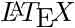 格式的输出：

```py
init_printing()

# or with older versions of sympy/ipython, load the IPython extension
#%load_ext sympy.interactive.ipythonprinting
# or
#%load_ext sympyprinting 
```

## 符号变量

在 SymPy 中我们需要为变量创建符号。:

```py
x = Symbol('x')

(pi + x)**2 
```

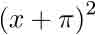

```py
# alternative way of defining symbols
a, b, c = symbols("a, b, c")

type(a)

=> sympy.core.symbol.Symbol 
```

我们可以对符号添加一些假设：

```py
x = Symbol('x', real=True)

x.is_imaginary 
```

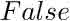

```py
x = Symbol('x', positive=True)

x > 0 
```

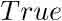

### 复数

`I` 在 Sympy 中表示虚数单位。

```py
1+1*I 
```

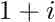

```py
I**2 
```

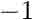

```py
(x * I + 1)**2 
```

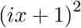

### 有理数

SymPy 中有三种不同的数值类型： `Real`， `Rational`， `Integer`：

```py
r1 = Rational(4,5)
r2 = Rational(5,4)

r1 
```

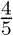

```py
r1+r2 
```

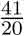

```py
r1/r2 
```

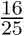

## 数值计算

Sumpy 以任意精度的数值库作为后端，预定义了一些数学常量的表达式，如 `pi`, `e`, 以及`oo` （代表极限）。

为了计算表达式的数值，可以使用 `evalf` 函数 (或者 `N` 函数)。

n 参数决定有效数位。

```py
pi.evalf(n=50) 
```

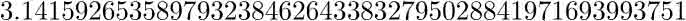

```py
y = (x + pi)**2
N(y, 5) # same as evalf 
```


当我们进行数值计算的时候，常常希望对变量符号进行数值替换，那就可以使用 `subs` 函数了：

```py
y.subs(x, 1.5) 
```

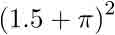

```py
N(y.subs(x, 1.5)) 
```


`subs` 当然也可以这么替换：

```py
y.subs(x, a+pi) 
```

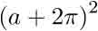

结合 Numpy 使用：

```py
import numpy

x_vec = numpy.arange(0, 10, 0.1)

y_vec = numpy.array([N(((x + pi)**2).subs(x, xx)) for xx in x_vec])

fig, ax = subplots()
ax.plot(x_vec, y_vec); 
```

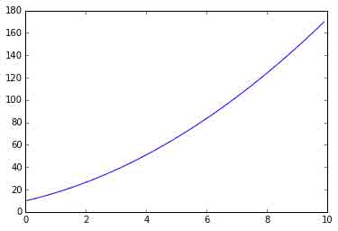

但是，这类数值计算会特别慢，有一个更高效的方法是使用 `lambdify` ：

```py
f = lambdify([x], (x + pi)**2, 'numpy')  # the first argument is a list of variables that
                                         # f will be a function of: in this case only x -> f(x)

y_vec = f(x_vec)  # now we can directly pass a numpy array and f(x) is efficiently evaluated 
```

对比一下运行时间：

```py
%%timeit

y_vec = numpy.array([N(((x + pi)**2).subs(x, xx)) for xx in x_vec])

10 loops, best of 3: 20.4 ms per loop

%%timeit

y_vec = f(x_vec)

100000 loops, best of 3: 3.67 µs per loop 
```

## 代数运算

### 展开 与 分解

代数运算的第一步：

```py
(x+1)*(x+2)*(x+3) 
```


```py
expand((x+1)*(x+2)*(x+3)) 
```

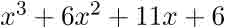

`expand` 有一系列参数能够决定式子的展开形式，`trig=True` 能展开三角公式：

```py
sin(a+b) 
```

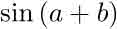

```py
expand(sin(a+b), trig=True) 
```

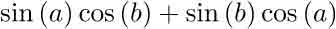

查看 `help(expand)` 了解更多参数。

与展开相对的是分解：

```py
factor(x**3 + 6 * x**2 + 11*x + 6) 
```


### 化简

`simplify` 进行化简操作，特殊的化简还有 `trigsimp`， `powsimp`， `logcombine` 等等。

```py
# simplify expands a product
simplify((x+1)*(x+2)*(x+3)) 
```


```py
# simplify uses trigonometric identities
simplify(sin(a)**2 + cos(a)**2) 
```


```py
simplify(cos(x)/sin(x)) 
```

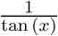

### 分式分解 与 分式展开

分式分解：

```py
f1 = 1/((a+1)*(a+2))

f1 
```

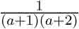

```py
apart(f1) 
```

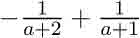

分式展开：

```py
f2 = 1/(a+2) + 1/(a+3)

f2 
```


```py
together(f2) 
```


化简通常会合并式子，但不做展开：

```py
simplify(f2) 
```

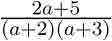

## 微积分

除了代数操作，CAS 的另一个主要用途就是做微积分

### 微分

`diff` 函数用来做微分：

```py
y 
```


```py
diff(y**2, x) 
```

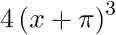

对于多重微分我们可以这么做：

```py
diff(y**2, x, x) 
```


```py
diff(y**2, x, 2) # same as above 
```

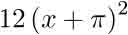

计算多变量式子的多重微分可以这么做：

```py
x, y, z = symbols("x,y,z")

f = sin(x*y) + cos(y*z) 
```

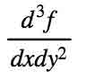

```py
diff(f, x, 1, y, 2) 
```

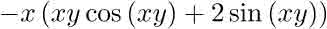

## 积分

积分的用法差不多：

```py
f 
```


```py
integrate(f, x) 
```

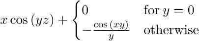

计算定积分：

```py
integrate(f, (x, -1, 1)) 
```

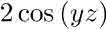

计算反常积分：

```py
integrate(exp(-x**2), (x, -oo, oo)) 
```


### 总和 与 连乘积

求总和：

```py
n = Symbol("n")

Sum(1/n**2, (n, 1, 10)) 
```

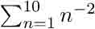

```py
Sum(1/n**2, (n,1, 10)).evalf() 
```

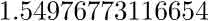

```py
Sum(1/n**2, (n, 1, oo)).evalf() 
```

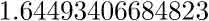

求连乘积：

```py
Product(n, (n, 1, 10)) # 10! 
```

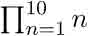

## 极限

计算极限：

```py
limit(sin(x)/x, x, 0) 
```

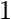

可以使用极限检查微分的结果：

```py
f 
```

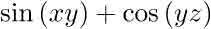

```py
diff(f, x) 
```


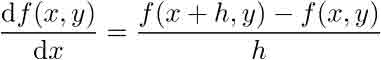

```py
h = Symbol("h")

limit((f.subs(x, x+h) - f)/h, h, 0) 
```

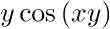

求正负极限：

```py
limit(1/x, x, 0, dir="+") 
```

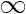

```py
limit(1/x, x, 0, dir="-") 
```


## 数列

数列展开也是 CAS 的一项重要特性，用法如下：

```py
series(exp(x), x) 
```

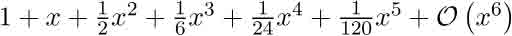

默认从 x=0 展开，不过我们也可以显示地指定 x 的值：

```py
series(exp(x), x, 1) 
```

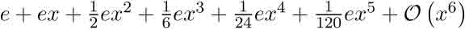

我们也可以显示地决定展开的项数：

```py
series(exp(x), x, 1, 10) 
```

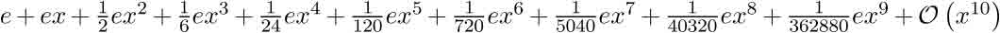

展开式包含了渐进符号，这有助于我们在处理不同渐进精度的数列的运算时记录下结果的渐进的精确度：

```py
s1 = cos(x).series(x, 0, 5)
s1 
```

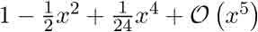

```py
s2 = sin(x).series(x, 0, 2)
s2 
```


```py
expand(s1 * s2) 
```

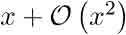

`removeO` 移除渐进符号：

```py
expand(s1.removeO() * s2.removeO()) 
```

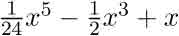

但请注意 cos(x)*sin(x) 无法展开成渐进到第五阶的样子：

```py
(cos(x)*sin(x)).series(x, 0, 6) 
```

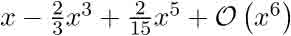

## 线性代数

### 矩阵

矩阵由 `Matrix` 类定义:

```py
m11, m12, m21, m22 = symbols("m11, m12, m21, m22")
b1, b2 = symbols("b1, b2")

A = Matrix([[m11, m12],[m21, m22]])
A 
```

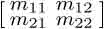

```py
b = Matrix([[b1], [b2]])
b 
```


矩阵乘法运算：

```py
A**2 
```

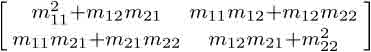

```py
A * b 
```

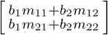

计算矩阵行列式与逆：

```py
A.det() 
```

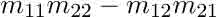

```py
A.inv() 
```

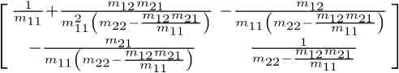

## 解方程

`solve` 能够解方程与方程组:

```py
solve(x**2 - 1, x) 
```

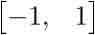

```py
solve(x**4 - x**2 - 1, x) 
```

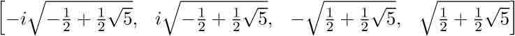

解方程组：

```py
solve([x + y - 1, x - y - 1], [x,y]) 
```


符号表达式的解：

```py
solve([x + y - a, x - y - c], [x,y]) 
```


## 延伸阅读

*   http://sympy.org/en/index.html - The SymPy projects web page.
*   https://github.com/sympy/sympy - The source code of SymPy.
*   http://live.sympy.org - Online version of SymPy for testing and demonstrations.

## License

本作品在 [知识共享许可协议 3.0](https://creativecommons.org/licenses/by/3.0/) 下许可授权。