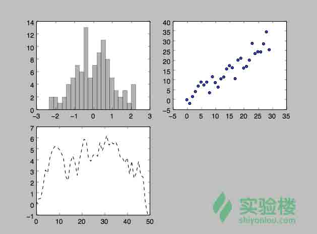
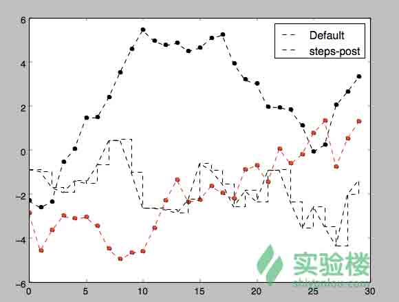
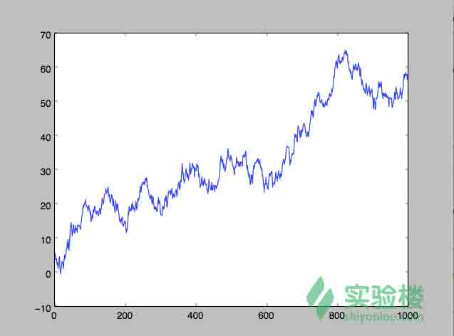
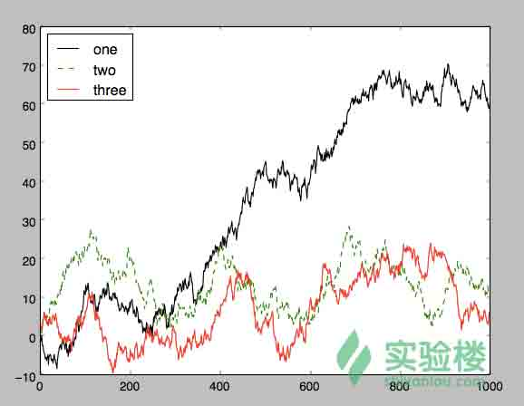
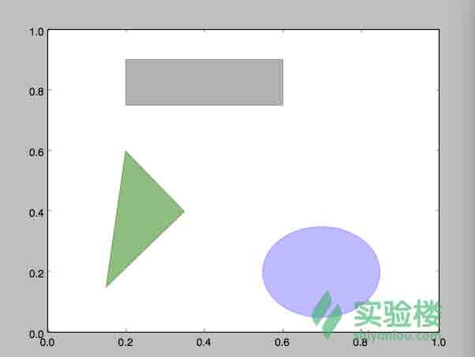
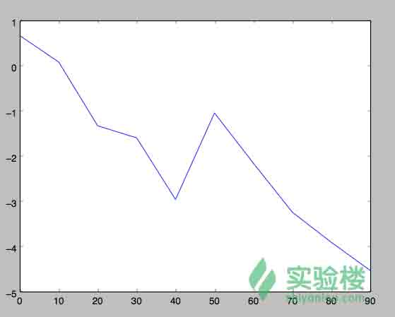
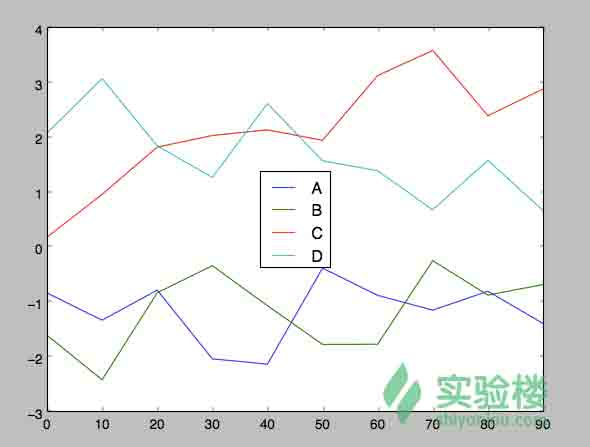
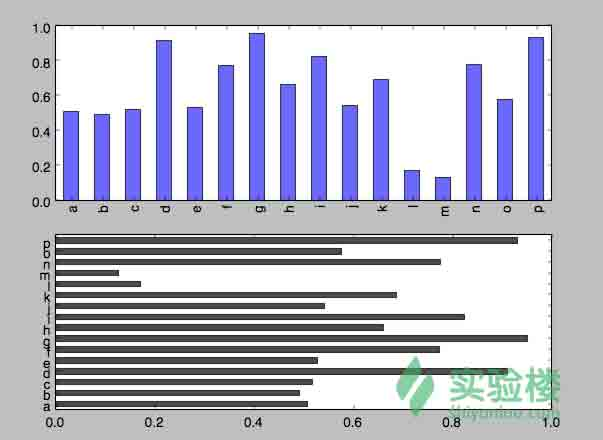
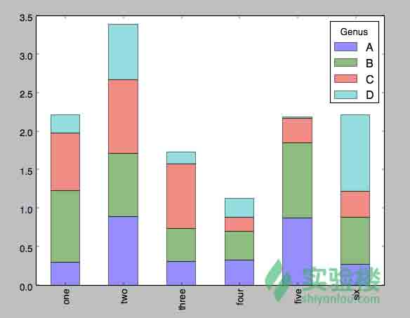

# 第 9 节 绘图和可视化

* * *

## 一、实验介绍

　　绘图是数据分析工作中最重要的任务之一，是探索过程的一部分，例如，帮我们找出异常值，必要的数据转换、得出有关模型的 idea 等。

## 二、Matplotlib API

　　matplotlib 的图像都位于 Figure 对象中。你可以使用 plt.figure 创建一个新的 Figure：

```py
In [4]: import matplotlib.pyplot as plt

In [5]: fig = plt.figure()

In [6]: fig.show() 
```

　　这时会弹出一个空窗口。plt.figure 有一些选项，特别是 figsize，它用于确保当图片保存到磁盘时具有一定的大小和纵横比。matplotlib 中的 Figure 还支持一种 MATLAB 式的编号架构（例如 plt.figure（2））。通过 plt.gcf()即可得到当前 Figure 的引用。

　　不能通过空 Figure 绘图。必须用 add_subplot 创建一个或多个 subplot 才行：

```py
In [10]: ax1 = fig.add_subplot(2,2,1)

In [11]: ax2 = fig.add_subplot(2,2,2)

In [12]: ax3 = fig.add_subplot(2,2,3) 
```

　　如果这时发出一条绘图命令（如 plt.plot([1.5, 3.5, -2, 1.6])），matplotlib 就会在最后一个用过的 subplot（如果没有则创建一个）上绘制。

```py
In [13]: plt.plot(randn(50).cumsum(),'k--')
Out[13]: [<matplotlib.lines.Line2D at 0x10830c4d0>] 
```


　　“k--”是一个线性选项，用于告诉 matplotlib 绘制黑色虚线图。上面那些由 fig.add_subplot 所返回的对象是 AxesSubplot 对象，直接调用它们的实例方法就可以在其他空着的格子里面画图了。

```py
In [14]: _ = ax1.hist(randn(100),bins = 20, color = 'k',alpha = 0.3)

In [15]: ax2.scatter(np.arange(30),np.arange(30)+3*randn(30))
Out[15]: <matplotlib.collections.PathCollection at 0x10c29fb90> 
```



　　我们可以在 matplotlib 的文档中找到各种图表类型。用于根据特定布局创建 Figure 和 subplot 是一件非常常见的任务，于是便出现了一个更为方便的方法（plt.subplots），它可以创建一个新的 Figure，并返回一个含有已创建的 subplotduixiang 的 NumPy 数组

```py
In [17]: fig, axes = plt.subplots(2,3)

In [18]: axes
Out[18]: 
array([[<matplotlib.axes.AxesSubplot object at 0x11087f610>,
        <matplotlib.axes.AxesSubplot object at 0x11090db50>,
        <matplotlib.axes.AxesSubplot object at 0x1109b89d0>],
       [<matplotlib.axes.AxesSubplot object at 0x110999d90>,
        <matplotlib.axes.AxesSubplot object at 0x110989c10>,
        <matplotlib.axes.AxesSubplot object at 0x110a1b510>]], dtype=object) 
```

　　这是非常实用的，因为可以轻松地对 axes 数组进行索引，就好像是一个二维数组一样，例如，axes[0, 1]。 我们来看看 pyplot.subplot 的选项

```py
| 参数 | 说明 |
|------|------|
| nrows | subplot 的行数 |
| ncols | subplot 的列数 |
| sharex | 所有 subplot 应该使用相同的 X 轴刻度（调节 xlim 将会影响所有 subplot） |
| sharey | 所有 subplot 应该使用相同的 Y 轴刻度（调节 ylim 将会影响所有 subplot） |
| subplot——kw | 用于创建各 subplot 的关键字典 |
| **fig_kw | 创建 figure 时的其他关键字，如 plt.subplots(2,2,figsize = (8,6)) |
```

　　matplotlib 的 plot 函数接收一组 X 和 Y 坐标，还可以接受一个颜色和线性的字符串缩写。例如，要根据 x 和 y 绘制绿色虚线：

```py
ax.plot(x, y, 'g--')
ax.plot(x, y, linestyle = '--', color = 'g') 
```

　　线型图还可以加上一些标记（mark），以强调实际的数据点。由于 matplotlib 创建的是连续的线型图（点与点之间插值），因此有时可能不太容易看出真实数据点的位置。标记也可以放到格式字符串中，但标记类型和线性必须放在颜色后面。

```py
In [30]: plt.plot(randn(30).cumsum(),'ko--')
Out[30]: [<matplotlib.lines.Line2D at 0x110411690>]

In [31]: plot(randn(30).cumsum(),color='r',linestyle='dashed',marker='o')
Out[31]: [<matplotlib.lines.Line2D at 0x11041ebd0>]

In [32]: data = randn(30).cumsum()

In [33]: plt.plot(data,'k--',label='Default')
Out[33]: [<matplotlib.lines.Line2D at 0x11042f750>]

In [34]: plt.plot(data,'k--',drawstyle = 'steps-post',label='steps-post')
Out[34]: [<matplotlib.lines.Line2D at 0x11042fe90>]

In [35]: plt.legend(loc='best')
Out[35]: <matplotlib.legend.Legend at 0x1104383d0> 
```



　　对于大多数的图表装饰项，其主要实现方式有二：使用过程型的 pyplot 接口（MATLAB 用户非常熟悉）以及更为面向对象的原生 matplotlib API。

　　pyplot 接口设计目的是交互式使用，含有诸如 xlim、xticks 和 xticklabels 之类的方法。它们分别控制图表的范围、刻度位置、刻度标签等。其使用方式有以下两种：

*   调用时不带参数，则返回当前的参数值。例如，plt.xlim()返回当前的 X 轴绘图范围

*   调用时带参数，则设置参数值。因此，plt.xlim([0,10])会将 X 轴的范围设置为 0 到 10

    　　所有这些方法都是对当前或最近创建的 AxesSubplot 起作用。它们各自对应 subplot 度持续昂的两个方法，以 xlim 为例，就是 ax.get*xlim 和 ax.set*xlim。

```py
In [40]: fig = plt.figure()

In [41]: ax = fig.add_subplot(1,1,1)

In [42]: ax.plot(randn(1000).cumsum())
Out[42]: [<matplotlib.lines.Line2D at 0x1105d6810>] 
```



　　要修改 X 轴的刻度，最简单的办法是使用 set_xticks 和 set——xticklabels。前者告诉 matplotlib 要将刻度放在数据范围中的哪些位置，默认情况下，这些位置也就是刻度标签。后者是可以将任何其他的值用作标签

```py
In [43]: ticks = ax.set_xticks([0,250,500,750,1000])

In [44]: labels = ax.set_xticklabels(['one','two','three','four','five'],
   ....:                            rotation=30, fontsize='small')

In [45]: #最后再用 set_xlabel 为 X 轴设置一个名称

In [46]: ax.set_title('My first matplotlib plot')
Out[46]: <matplotlib.text.Text at 0x1104105d0>

In [47]: ax.set_xlabel('Stages')
Out[47]: <matplotlib.text.Text at 0x1105bed50>

In [48]: #Y 轴的修改方式与此类似，只需将 x 替换为 y 即可 
```

　　图例是另一种用于标识图表元素的重要工具。添加图例的方式有二。最简单的是在添加 subplot 的时候传入 label 参数

```py
In [49]: fig = plt.figure()

In [50]: ax = fig.add_subplot(1,1,1)

In [51]: ax.plot(randn(1000).cumsum(),'k',label='one')
Out[51]: [<matplotlib.lines.Line2D at 0x105ce7190>]

In [52]: ax.plot(randn(1000).cumsum(),'g--',label='two')
Out[52]: [<matplotlib.lines.Line2D at 0x105ceaa50>]

In [53]: ax.plot(randn(1000).cumsum(),'r',label='three')
Out[53]: [<matplotlib.lines.Line2D at 0x105ceae50>]

In [54]: # 调用 ax.legend()或 plt.legend()来自动创建图例

In [55]:  ax.legend(loc = 'best')
Out[55]: <matplotlib.legend.Legend at 0x105ce66d0> 
```



　　除标准的图表对象之外，我们可能还希望绘制一些自定义的注解（比如文本，箭头或其他图形等）。注解可以通过 text、arrrow 和 annotate 等函数进行添加。

```py
In [72]: fig = plt.figure()

In [73]: ax = fig.add_subplot(1,1,1)

In [74]: rect = plt.Rectangle((0.2,0.75),0.4,0.15,color='k',alpha=0.3)

In [75]: circ = plt.Circle((0.7,0.2),0.15,color='b',alpha=0.3)

In [76]: pgon = plt.Polygon([[0.15,0.15],[0.35,0.4],[0.2,0.6]],color='g',alpha=0.5)

In [77]: ax.add_patch(rect)
Out[77]: <matplotlib.patches.Rectangle at 0x10c6105d0>

In [78]: ax.add_patch(circ)
Out[78]: <matplotlib.patches.Circle at 0x10c610750>

In [79]: ax.add_patch(pgon)
Out[79]: <matplotlib.patches.Polygon at 0x10c610a90> 
```



　　利用 plt.savefig 可以将当前图表保存到文件。该方法相当于 Figure 对象的实例方法 savefig。例如，要将图表保存为 SVG 文件：

```py
In [80]: plt.savefig('figpath.svg') 
```

　　文件类型是通过文件扩展名推断出来的，因此，如果你使用的是.pdf，就会得到一个 PDF 文件。

```py
In [85]: plt.savefig('figpath.jpg',dpi=400,bbox_inches='tight') 
```

Figure.savefig 的参数选项：

```py
|参数 | 说明 |
|-----|------|
| fname | 含有文件路径的字符串或 Python 的文件型对象。图像格式由文件扩展名推断得出 |
| dpi | 图像分辨率，默认为 100 |
| facecolor、edgecolor | 图像的背景色，默认为'w'（白色） |
| format | 显示设置文件格式（“png”、“pdf”、“svg”，“ps”，“eps”……） |
| bbox_inches | 图表需要保存的部分。如果设置为“tight”，则将尝试剪出图表周围的空白部分 |
```

## 三、pandas 中的绘图函数

　　不难看出，matplotlib 实际上是一种比较低级的工具。要组装一张图表，你得用它的各种基础组件才行：数据展示（即图表类型：线性图、柱状图、盒形图、散布图、等值线图等）、图例、标题、刻度标签以及其他注解型信息。这是因为要根据数据制作一张完整图表通常都需要用到多个对象。在 pandas 中，我们有行标签、列标签以及分组信息。这也就是说，要制作一张完整的图表，原本需要一大堆的 matplotlib 代码，现在只需要一两条简洁的语句就可以了。pandas 有许多能够利用 DataFrame 对象数据组织特点来创建标准图表的高级绘图方法（这些函数的数量还在不断增加） 。

##### 1、线性图

　　Series 和 DataFrame 都有一个用于生成各类图表的 plot 方法。默认情况下，它们所生成的是线性图：

```py
In [3]: from pandas import Series

In [4]: import numpy as np

In [5]: s = Series(np.random.randn(10).cumsum(), index=np.arange(0,100,10))

In [6]: s.plot() 
```



　　该 Series 对象的索引会被传入 matplotlib，并用以绘制 X 轴。可以通过 use_index = False 禁用该功能。X 轴的刻度和界限可以通过 xticks 和 xlim 选项进行调节，Y 轴同理。

　　pandas 的大部分绘图方法都有一个可选的 ax 参数，它可以是一个 matplotlib 的 subplot 对象。这使我们能够在网格布局中更为灵活地处理 subplot 的位置。

　　DataFrame 的 plot 方法会在一个 subplot 中为各列绘制一条线，并自动创建图例：

```py
In [10]: df = DataFrame(np.random.randn(10,4).cumsum(0),
              columns = ['A','B','C','D'],
              index = np.arange(0,100,10))

In [11]: df.plot()
Out[11]: <matplotlib.axes.AxesSubplot at 0x104b2d350> 
```



Series.plot 方法的参数

```py
| 参数 | 说明 |
|------|------|
| label | 用于图例的标签 |
| ax | 要在其上进行绘制的 matplotlib subplot 对象。如果没有设置，则使用当前 matplotlib subplot |
| style | 将要传给 matplotlib 的风格字符串 |
| alpha | 图表的填充不透明度（0 到 1 之间） |
| kind | 可以是“line”、“bar”、“barh”、“kde” |
| logy | 在 Y 轴上使用对数标尺 |
| use_index | 将对象的索引用作刻度标签 |
| rot | 旋转刻度标签（0 到 360） |
| xticks | 用作 X 轴刻度的值 |
| yticks | 用作 Y 轴刻度的值 |
| xlim | X 轴的界限（例如[0,10]） |
| ylim | Y 轴的界限 |
| grid | 显示轴网格线（默认打开） |
```

DataFrame 的 plot 的参数：

```py
| 参数 | 说明 |
|------|------|
| subplots | 将各个 DataFrame 列绘制到单独的 subplot 中 |
| sharex | 如果 subplots = True，则共用同一个 X 轴，包括刻度和界限 |
| sharey | 如果 subplots = True，则共用同一个 Y 轴 |
| figsize | 表示图像大小的元组 |
| title | 表示图像标题的字符串 |
| legend | 添加一个 subplot 图例（默认为 True） |
| sort_columns | 以字母表顺序绘制各列，默认使用当前列顺序 |
```

##### 2、柱状图

　　在生成线性图的代码中加上 `kind = 'bar'`（垂直柱状图）或 `kind = 'barh'`（水平柱状图）即可生成柱状图。

```py
In [15]: fg, axes = plt.subplots(2,1)

In [16]: data = Series(np.random.rand(16),index = list('abcdefghijklmnop'))

In [17]: data.plot(kind='bar',ax=axes[0],color='b',alpha=0.7)
Out[17]: <matplotlib.axes.AxesSubplot at 0x104c4ccd0>

In [18]: data.plot(kind='barh',ax=axes[1],color='k',alpha=0.7)
Out[18]: <matplotlib.axes.AxesSubplot at 0x10888d250> 
```



```py
In [19]: #对于 DataFrame，柱状图会将每一行的值分为一组

In [20]:  df = DataFrame(np.random.rand(6,4),
   ....:                 index=['one','two','three','four','five','six'],
   ....:                 columns=pd.Index(['A','B','C','D'],name='Genus'))

In [21]: df
Out[21]: 
Genus         A         B         C         D
one    0.299380  0.926561  0.755805  0.231251
two    0.892068  0.817717  0.958638  0.719738
three  0.309930  0.428440  0.842603  0.154400
four   0.325818  0.372899  0.189007  0.239295
five   0.878813  0.968320  0.321430  0.014846
six    0.277675  0.605484  0.339945  0.989320

In [22]: df.plot(kind='bar')
Out[22]: <matplotlib.axes.AxesSubplot at 0x103d58650> 
```


　　注意，DataFrame 各列的名称“Genus”被用作了图例的标题，设置 `stacked = True`即可为 DataFrame 生成堆积柱状图，这样每行的值就会被堆积在一起：

```py
In [23]: df.plot(kind='bar', stacked=True,alpha=0.5)
Out[23]: <matplotlib.axes.AxesSubplot at 0x1063d7310> 
```



## 四、作业

　　数据分析画图是必不可少的，所以同学们必须掌握相应的方法和参数。这里 mumu 只介绍了线性图和柱状图，今天的作业是希望同学们继续在网上查询 pandas 绘制直方图和密度图，以及散布图的相关方法。我们下一个实验课程（Python 数据分析（二））将会具体学习时间序列和金融相关的数据应用，同学们一定要打好基础哦！