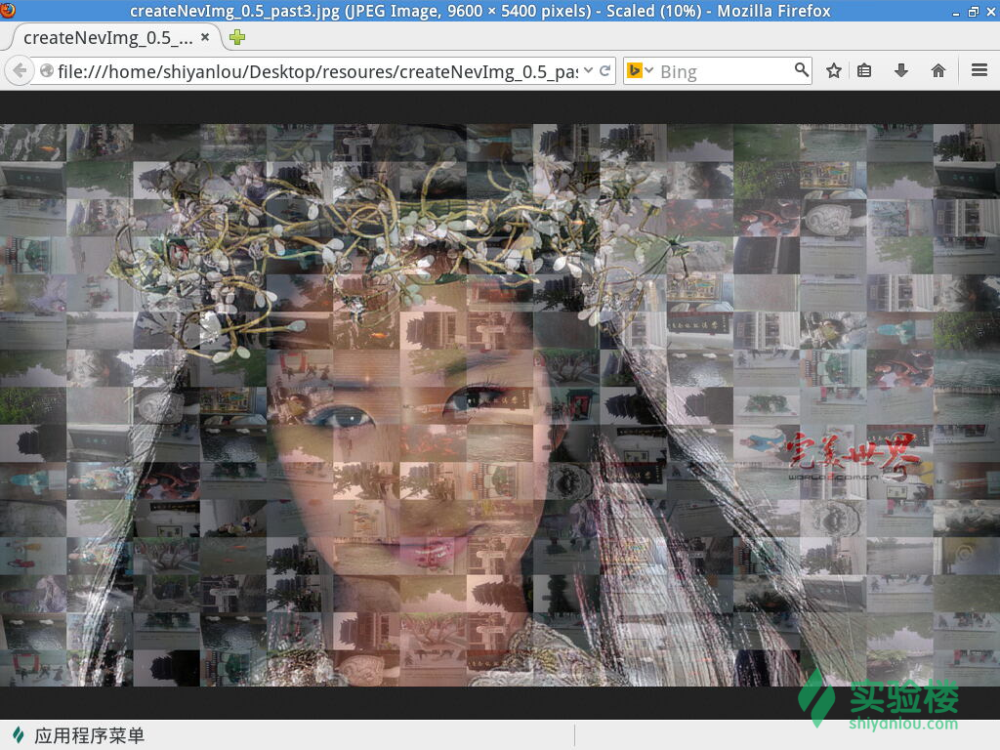

# 第 1 节 多张图片拼接与层叠

## 一、实验介绍

### 1\. 环境登陆

无需密码自动登陆，系统用户名 shiyanlou

### 2\. 环境介绍

本实验环境采用带桌面的 Ubuntu Linux 环境，实验中会用到桌面上的程序：

1.  LX 终端（LXTerminal）: Linux 命令行终端，打开后会进入 Bash 环境，可以使用 Linux 命令。
2.  GVim：非常好用的编辑器，最简单的用法可以参考课程[Vim 编辑器]。(http://www.shiyanlou.com/courses/2)
3.  Firefox：浏览器，可以用在需要前端界面的课程里，只需要打开环境里写的 HTML/JS 页面即可。

### 3\. 环境使用

使用 GVim 编辑器输入实验所需的代码及文件，使用 LX 终端（LXTerminal）运行所需命令进行操作。

实验报告可以在个人主页中查看，其中含有每次实验的截图及笔记，以及每次实验的有效学习时间（指的是在实验桌面内操作的时间，如果没有操作，系统会记录为发呆时间）。这些都是您学习的真实性证明。

本课程中的所有源码可以通过以下方式下载:

```py
https://github.com/dby/photo_joint 
```

### 4\. 知识点

本节实验将学习和实践下列知识点：

1.  Python 基本语法
2.  PIL 第三方库的使用
3.  Numexpr 库的使用
4.  图像处理相关知识

## 二、项目介绍

本项目主要是利用 Python 的第三方库 PIL、numpy 等实现数百张照片的拼接和拼接之后的照片与另外一张照片进行层叠。做完这个项目后大家能对 PIL、numpy 等第三方库有个简单的认识。 首先，先看一下最终的效果图：


看到最终的效果图，不仅感慨 Python 还是很强大的。

## 三、项目实战

### 1\. 安装 Python 第三方库

#### 1.1 安装 PIL

打开终端，输入命令：

```py
$ sudo apt-get install python-imaging 
```

#### 1.2 安装 numpy

打开终端输入

```py
$ sudo apt-get install python-numpy 
```

#### 1.3 安装 numexpr

```py
$ sudo apt-get install python-numexpr 
```

### 2\. 相关知识简介

#### 照片模式


我们这里将用到`RGB`与`RGBA`；这两者的区别是`RGBA`有个透明通道，常见的照片格式中.jpg 属于`RGBA`，而.jpg 格式属于`RGB`模式。

#### RGB

RGB 即是代表红、绿、蓝三个通道的颜色，这个标准几乎包括了人类视力所能感知的所有颜色，是目前运用最广的颜色系统之一

```py
 [0,0,0] — black
 [255,0,0] — Red
 [0,255,0] — green
 [0,0,255] — blue
 [255,255,255] — white 
```

#### numpy

Numpy 是 Pyhon 很强大的开源数字扩展库，可以用来处理大型矩阵等等。

#### PIL

PIL 是 python 与图片处理相关的第三方扩展库，可以完成图片的粘贴，拷贝，添加文字，层叠，合并，图片加强，操作像素点等等，非常强大。

### 3\. 两张照片层叠的两种方式

*   方式一：两张照片同一点的像素按照一定比例叠加。假设两张照片同一点的像素分别为 A、B，则层叠之后该点像素点（alpha 取值在 0 和 1 之间）为： `A*alpha+B*(1-alpha)`
*   方式二：正片叠底。结果色 = 混合色 * 基色 / 255，PS 中也采用这种方式； 正片叠底的特点： 明度变化：混合色不会大于 255，故结果色一定小于 1，混合模式之后必定比基色暗。0 为黑色，若混合两色中有黑色，混合之后必定是黑色。若有白色，则混合色为另外一色的原色。故正片叠底可以改变非黑即白，处于灰度区间的明度，变黑。可以采用操作像素点，提高像素点的亮度。

### 4\. 获取 resource

打开 Firefox 浏览器，输入一下网址下载 resources

```py
http://labfile.oss.aliyuncs.com/contest/resoures.zip 
```

下载之后，将`resoures.zip`拷贝到桌面并解压；同时解压 resoures 文件夹下的`photos.zip`：

*   `resoures/photos`: 文件夹，存放着 218 张照片；
*   `resoures/xindexingcao57.ttf`： 字体文件；
*   `resoures/lyf.jpg`： 一张刘亦菲（女神）的照片，看过最终的效果图，也就知道这张照片的作用了；
*   `resoures/past.py`: python 文件，本项目的所有代码；
*   `resoures/past3.py`： 这里存放着本项目用到的所有的代码；
*   注：`past.py`与`past3.py`的区别在于两张照片的层叠的算法不同，当进行照片层叠时，会有详细的说明。
*   进入 resoures 文件夹新建 python 文件。

### 5\. 常量设置

现在开始写代码，首先便是导入相关文件，如下图所示:


*   这里，我们导入 PIL，numexpr，Image 模块等。
*   同时设置了几个变量，注释详细介绍了每个常量的意思。

### 6\. 获取所有照片信息

具体代码如下图所示：


*   `os.getcwd()`是获得当前的路径，然后赋给`root`变量。
*   然后遍历 photos 中的照片，拼接每张照片的路径，并添加到 aval 中。

### 7\. 伸缩照片


*   由于每张照片的大小是不一样的，这里主要是将照片转为一样的大小。
*   由于每张照片的模式既有`RGB`，也有`RGBA`，我们直接利用 PIL 中的`convert`方法，将所有照片的模式都转为`RGBA`。然后在调用 resize 方法，将照片放缩到一样的大小。
*   这里要着重介绍一下 numpy.array 方法，numpy.array 可以创建一个数组，`numpy.array(resized_img)[:dst_height, :dst_width]`是讲`resized_img`转换为了一个(dst*height, dst*width)的两维数组，每个数组元素是有四个常数值的列表。打印出来如下图所示：


[38, 42, 45, 255]四个数字分别代表着`R G B A`，255 即代表着不透明。

### 8\. 数百张照片拼接，并且将拼接后的照片与另外一张照片进行层叠（past3.py）


*   这部分是本项目的核心，着重介绍一下这里。
*   `root+'lyf.jpg'`是要与拼接之后的照片进行层叠的照片；并利用 numpy.array 的方法将其转换成矩阵`I`; 注意：`I`的大小为`(W_num*W_size, H_num*H_size)`，是第 7 步伸缩照片生成矩阵的`W_num*H_num 倍`
*   第三行代码是调用`numexpr.evaluate`方法，将矩阵中每个元素都乘以`(1-alpha)`。
*   接下来的双重遍历便是具体拼接的实现。
*   由于矩阵`I`的规模是第六步伸缩照片生成矩阵的`W_num*H_num`倍，所以我们从左向右，从上向下依次取`(W_size, H_size)`大小的矩阵`SH`
*   `DA`是调用第 7 步方法生成的矩阵
*   然后计算`SH+DA*alpha`，并将结果放回`SH`在`I`矩阵中位置。这里是讲两张照片中相同一点的像素分别乘以(1-alpha)、alpha，然后相加，如此两个照片便层叠在一块。alpha 的取值可以自己设置，这里设置的是 0.5。不难看出，这里选择的层叠的方法是方式一，将两张照片同一点的像素按照一定比例想加，这里选择的是 alpha=0.5。
*   调用`fromarray`方法将矩阵`I`转为图片对象，并保存为`createNevImage_0.5_past3.jpg`，照片如下图所示。



### 9\. 数百张照片拼接，并且将拼接之后的照片与另外一张照片层叠（past.py）


我们看到这里代码与上面的代码是很相似的，只是`I`矩阵的计算方法是不同的。这里要简单介绍一下`I`矩阵的计算方法。

*   这里采用是两照片层叠的方式二正片叠底，利用公式： 结果色 = 混合色 * 基色 / 255，至此代码就很明了了
*   利用 PIL 库以对每个像素点进行操作。 `img.point(lambda i : i * 1.5)` 将每个像素点的亮度(不知道有没有更专业的词)增大 50%
*   保存照片为`crateNevImg_past.jpg`


### 10\. 旋转照片


*   `imName`是获取前一步中保存的照片名。
*   并调用`Image.open`打开照片，并赋给图片对象 im。
*   第五行是调用`Image.new`来创建一张新的照片 im2，第一个参数是照片模式，第二个参数是照片的宽高，用元组表示。
*   然后调用`paste`方法将`im`放到第二个图片对象 im2 中，第二个参数是放置的中心点。
*   调用`rotate`方法，旋转照片
*   调用`save`方法，保存照片为`newRoatateImage_o.5_past3.jpg`，具体照片效果如下图所示：


1.  照片中添加文字


*   PIL 功能很强大，可以向图片中添加文字
*   `font = ImageFont.truetype`: 导入字体 ，第一个参数是字体文件，第二个参数是字体的大小
*   `draw = ImageDraw(img)`: 生成画笔，参数为要再图片中写字的图片对象。
*   `draw.ink = R + G*256 + B*256*256`: 来设置画笔的颜色
*   `draw.text`: 向图片对象中写字，第一个参数为字体的位置，用元组表示，第二参数是内容，第三个参数是字体。
*   最终利用`save`方法讲图片保存为`final_0.5_past3.jpg`。到此，工作基本完成了。

### 12\. 执行程序


*   `if __name__ == "__main__":`可以理解为 C 语言的 main 函数，作为入口函数（单独执行该 module）。
*   调用各个函数即可

## 四、相关说明

1.  alpha：这个参数决定着层叠的效果，可以自由的改动这个参数，观察照片的变化，取值范围为(0--1)。
2.  这里对`PIL`，`numpy`介绍并不详细，应该在阅读相关文档。[相关文档](http://dby.github.io/2015/04/05/numpy-PIL/)
3.  这里拼接的 196 张照片都是风景照，当把风景照换成人物照时，效果更好，最终的照片也更为漂亮。
4.  由于采用了 numpy，numexpr 等库，加快了运算速度，`past.py`处理 196 张照片拼接、选择、层叠、添加文字，总共大概需要 55 秒左右，`past3.py`所需时间大概需要 23 秒左右。
5.  层叠的第一张照片很重要（即这里的`lyf.jpg`），可以使用 PS 修改一下尺寸等等。
6.  分别运行`past.py`，`past3.py`，可以得到 6 张照片，后缀名分别为`.past`和`.past3`，可以进行比较，来体会两种层叠方式的不同