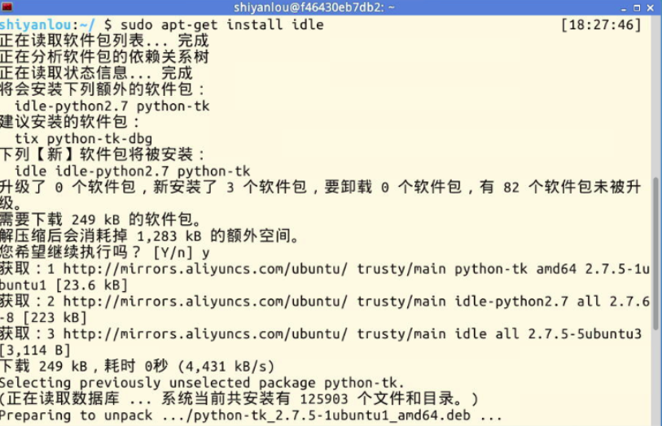
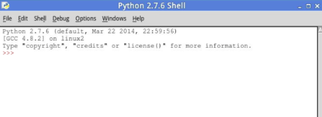

# 第 1 节 需求介绍+基础知识

## 一、实验说明

### 1\. 环境登录

无需密码自动登录，系统用户名 shiyanlou

### 2\. 环境介绍

本实验环境采用带桌面的 Ubuntu Linux 环境，实验中会用到桌面上的程序：

1.  LX 终端（LXTerminal）: Linux 命令行终端，打开后会进入 Bash 环境，可以使用 Linux 命令

2.  Firefox：浏览器，可以用在需要前端界面的课程里，只需要打开环境里写的 HTML/JS 页面即可

3.  GVim：非常好用的编辑器，最简单的用法可以参考课程[Vim 编辑器](http://www.shiyanlou.com/courses/2)

### 3\. 环境使用

使用 GVim 编辑器输入实验所需的代码及文件，使用 LX 终端（LXTerminal）运行所需命令进行操作。

实验报告可以在个人主页中查看，其中含有每次实验的截图及笔记，以及每次实验的有效学习时间（指的是在实验桌面内操作的时间，如果没有操作，系统会记录为发呆时间）。这些都是您学习的真实性证明。

### 4.环境搭建

实验楼虚拟机，自带了 python2.0 和 python3.0 版本，无需安装 该实验建议使用 python2.0 版本， 也就是默认版本

IDE 选择及安装：

```py
vim：自带编辑器，无需安装，只要你会，随你喜欢

IDLE：python 的编译器，推荐新手使用
代码：sudo apt-get install idle

spyder：需要学习学习
代码：sudo apt-get install spyder 
```

## 二、项目简介

### 1、需求介绍

系统自带的备份软件，它备份出来的文件，不符合我的逻辑思维（就是不容易看懂），所以我决定用 Python 做个简单的备份脚本程序，这样我就可以备份下我的主目录和系统文件。

这样一来，如果系统死了、坏了，我只要将我动了的文件，拷贝出来，将备份的文件填上。

### 2、基础知识

1、python 基本语法知识

2、模板 os 、time 的一点知识

3、系统的一些 API

4、安装 IDLE 

5、IDLE 界面 

请转到下节开始实验