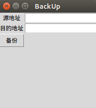

# 第 2 节 备份程序-基础

## 一、实验说明

### 1\. 环境登录

无需密码自动登录，系统用户名 shiyanlou

### 2\. 环境介绍

本实验环境采用带桌面的 Ubuntu Linux 环境，实验中会用到桌面上的程序：

1.  LX 终端（LXTerminal）: Linux 命令行终端，打开后会进入 Bash 环境，可以使用 Linux 命令

2.  Firefox：浏览器，可以用在需要前端界面的课程里，只需要打开环境里写的 HTML/JS 页面即可

3.  GVim：非常好用的编辑器，最简单的用法可以参考课程[Vim 编辑器](http://www.shiyanlou.com/courses/2)

### 3\. 环境使用

使用 GVim 编辑器输入实验所需的代码及文件，使用 LX 终端（LXTerminal）运行所需命令进行操作。

实验报告可以在个人主页中查看，其中含有每次实验的截图及笔记，以及每次实验的有效学习时间（指的是在实验桌面内操作的时间，如果没有操作，系统会记录为发呆时间）。这些都是您学习的真实性证明。

### 4.环境搭建

实验楼虚拟机，自带了 python2.0 和 python3.0 版本，无需安装 该实验建议使用 python2.0 版本， 也就是默认版本

IDE 选择及安装：

```py
vim：自带编辑器，无需安装，只要你会，随你喜欢

IDLE：python 的编译器，推荐新手使用
代码：sudo apt-get install idle

spyder：需要学习学习
代码：sudo apt-get install spyder 
```

## 二、代码实现及知识点详细讲解

### 1、代码

```py
#!/usr/bin/python
# -*- coding: utf-8 -*-
# Filename : back.py

import os
import time

source = ['/home/shiyanlou/Code/']
target_dir = '/home/shiyanlou/Desktop/'

target = target_dir + time.strftime('%Y%m%d%H%M%S') + '.zip'

zip_command = "zip -qr %s %s" %(target, ' '.join(source))

if os.system(zip_command) == 0:
    print 'Successful backup'
else :
    print 'Backup Failed' 
```

### 2、代码详解

1、先确定需要备份的目录“source”以及保存备份的目录“target_dir”,确定这两个路径中的文件夹都存在且可以操作，在虚拟机中，你可以将权限设置成 777。 例：sudo chmod 777 文件夹 1 【文件夹 2 ....】

2、zip 命令：

-q ： 选项用来表示 zip 命令安静的的工作

-r ： 选项用来标识 zip 命令对目录递归的工作，即包括对该文件和其子文件操作

3、time 模板中：

*   %Y 显示四位数年份

*   %m 会显示 01-12 中的一个

*   %d 则表示为%m 月的某一天

*   %H 表示 24 小时制的一个

*   %M 显示分钟

*   %S 显示为秒

4、' '.join(source)：这行代码，就是将 souce 列表转换为字符串。但是在这里，souce 列表只有一个元素，所以转换出来没变化。在此举个例子：

```py
sou = ['shi', 'yan', 'lou']
s = '空格'.join(sou) 
```

显示字符串 s：

```py
shi 空格 yan 空格 lou 
```

有图有证据： 

5、将 target、source 及“ zip -qr ”通过字符串连接符号相连接，得到 command 命令行，再调用 os.system()函数运行 command 命令，如果成功，返回 0，否则返回错误号

6、实验结果（实验楼平台上）： 

## 三、局限性

貌似这个只适合 Linux（我更喜欢“哩呢珂斯”），因为这是 实验楼“——国内第一家以实验为核心的 IT 在线教育平台”，先上 Linux 的，马上进入跨平台的逼格模式，Next---->

## 一、实验说明

### 1\. 环境登录

无需密码自动登录，系统用户名 shiyanlou

### 2\. 环境介绍

本实验环境采用带桌面的 Ubuntu Linux 环境，实验中会用到桌面上的程序：

1.  LX 终端（LXTerminal）: Linux 命令行终端，打开后会进入 Bash 环境，可以使用 Linux 命令

2.  Firefox：浏览器，可以用在需要前端界面的课程里，只需要打开环境里写的 HTML/JS 页面即可

3.  GVim：非常好用的编辑器，最简单的用法可以参考课程[Vim 编辑器](http://www.shiyanlou.com/courses/2)

### 3\. 环境使用

使用 GVim 编辑器输入实验所需的代码及文件，使用 LX 终端（LXTerminal）运行所需命令进行操作。

实验报告可以在个人主页中查看，其中含有每次实验的截图及笔记，以及每次实验的有效学习时间（指的是在实验桌面内操作的时间，如果没有操作，系统会记录为发呆时间）。这些都是您学习的真实性证明。

### 4.环境搭建

实验楼虚拟机，自带了 python2.0 和 python3.0 版本，无需安装 该实验建议使用 python2.0 版本， 也就是默认版本

IDE 选择及安装：

```py
vim：自带编辑器，无需安装，只要你会，随你喜欢

IDLE：python 的编译器，推荐新手使用
代码：sudo apt-get install idle

spyder：需要学习学习
代码：sudo apt-get install spyder 
```

## 二、不智能和平台问题

1、上节，我们已经做到了在 Linux 下，备份我(shiyanlou)的主页下所有文件"/home/shiyanlou/"到"/var/back_dir/"目录下，却遗留了几个问题：

1.  “晕到死”的系统文件管理，用到的符号是“\”，Linux 和 Mac 都是“/”，所以，在这里，这个程序只是在“实验楼”虚拟机上使用，如何给“晕到死”和 Mac 用？
2.  备份的文件，已时间命名，如果我们一天疯狂蹂躏，那我是不是这个文件下太杂太乱，这个保存文件的格式太不智能了。能不能用每天一个文件夹，压缩文件名为时间来标识？

2、上面提到的问题，第一个很简单，os 模板是强大的。第二个呢，也不难，就是创建压缩文件前，创建今天的日期文件夹，ok，思路没问题，现在带着你们来实现

## 三、思路实现并补全代码

### 1.先铺路

要备份的文件夹：`source = ["/home/shiyanlou/Code/"]`

保存备份信息的文件夹：`target_dir = "/home/shiyanlou/Desktop/"`

文件夹名(日期)： `today_dir = target_dir + time.strftime('%Y%m%d')`

文件名(时间)：`time_dir = time.strftime('%H%M%S')`

检查文件夹命令：`os.path.exist(today_dir)`

文件夹路径：`touch = today_dir + os.sep + time_dir + '.zip'`

创建压缩文件命令： `command_touch = "zip -qr " + touch +' '+ ' '.join(source)`

ok，基本信息以及完成了，接下来开始设计逻辑思路

### 2.逻辑思路选择判断

1、思路，当然首选 伪代码

```py
if 今天日期文件夹存在:
    创建时间压缩文件
else:
    创建今日日期文件夹
    创建时间压缩文件 
```

2、开始实现代码

```py
#!/usr/bin/python
# -*- coding: utf-8 -*-
# Filename : back_Up.py

import os
import time
#基本变量
source = ["/home/shiyanlou/Code/"]
target_dir = "/home/shiyanlou/Desktop/"

today_dir = target_dir + time.strftime('%Y%m%d')
time_dir = time.strftime("%H%M%S")

touch = today_dir + os.sep + time_dir + '.zip'
command_touch = "zip -qr " + touch +' '+ ' '.join(source)

#逻辑思路判断
if os.path.exists(today_dir)==0:
    os.mkdir(today_dir)
if os.system(command_t)==0:
    print 'Success backup Up'
else:
    print 'Failed backup' 
```

### 3.代码解析

1、这次用到了 模板 os 里面的其他一点东西：

*   os.sep：根据系统的不同，os.sep 也不同，在 Linux 和 Mac 下（也可以说是 Unix 和类 Unix 系统中），os.sep 的值为'/'，而在视窗(即“晕到死”)一系列的系统中，os.sep 的值为'\'。
*   os.path.exits()：exits()函数的功能就是检查该系统中，是否存在指定路径的文件或文件夹存在，没有返回 False(False 等于 0)，有则返回 True(True 不等于 0)

2、在跨平台中，因为 Linux 和 Mac 用了几乎同样的文件管理系统，所以这个程序可以直接在 Mac 和 Linux 中运行，如果要在 Windows 下运行，则需要改变 source 和 target_dir 两个变量的值，改成 Windows 下的文件格式，就可以了

### 4.同样有局限性

1、我只能保存我这个文件里面写好的路径文件夹吗？

2、我不能同时保存多个重要文件夹吗？

3、我每次运行这个程序，我都要打开编辑器，然后运行吗？

4、黑乎乎的框框，难看不能有个界面吗？

........

### 请进入下节实验课程环节

## 一、实验说明

### 1\. 环境登录

无需密码自动登录，系统用户名 shiyanlou

### 2\. 环境介绍

本实验环境采用带桌面的 Ubuntu Linux 环境，实验中会用到桌面上的程序：

1.  LX 终端（LXTerminal）: Linux 命令行终端，打开后会进入 Bash 环境，可以使用 Linux 命令

2.  Firefox：浏览器，可以用在需要前端界面的课程里，只需要打开环境里写的 HTML/JS 页面即可

3.  GVim：非常好用的编辑器，最简单的用法可以参考课程[Vim 编辑器](http://www.shiyanlou.com/courses/2)

### 3\. 环境使用

使用 GVim 编辑器输入实验所需的代码及文件，使用 LX 终端（LXTerminal）运行所需命令进行操作。

实验报告可以在个人主页中查看，其中含有每次实验的截图及笔记，以及每次实验的有效学习时间（指的是在实验桌面内操作的时间，如果没有操作，系统会记录为发呆时间）。这些都是您学习的真实性证明。

### 4.环境搭建

实验楼虚拟机，自带了 python2.0 和 python3.0 版本，无需安装 该实验建议使用 python2.0 版本， 也就是默认版本

IDE 选择及安装：

```py
vim：自带编辑器，无需安装，只要你会，随你喜欢

IDLE：python 的编译器，推荐新手使用
代码：sudo apt-get install idle

spyder：需要学习学习
代码：sudo apt-get install spyder 
```

## 二、Tkinter 界面编程

### 1.介绍

Tkinter 是一个 python 模块，是一个调用 Tcl/Tk 的接口，它是一个跨平台的脚本图形界面接口。Tkinter 不是唯一的 python 图形编程接口，但是是其中比较流行的一个。最大的特点是跨平台，缺点是性能不太好，执行速度慢。

另外想到界面，大家自然会想到做游戏，基于 python 的游戏模块，可以选择 pygame，有兴趣的也可以去学习。

在这里呢，比较适合我们这个小项目的图形界面开发要求，所以我们在此选择 Tkinter 模块来开发我们这个软件的界面

### 2.需求分析

做个简单界面，先上图  界面大概就这样，实现这个基本功能，然会就添加自定义的各种东西，做出来会感觉非常好的，接下来就开始动手了......

1、如果你是接着第二节实验做过来的，那你不用重新敲代码了

2、如果你接触了 Tkinter 模板，那就更棒了

3、需求就是做界面⊙﹏⊙汗

### 3.代码实现

```py
#!/usr/bin/python
# -*- coding: utf-8 -*-
#Filename : backUp.py

#导入模板
import Tkinter
import os
import time

#定义函数，这里才是精髓所在
def backup():
    global entry_source
    global entry_target
    source = entry_source.get()
    target_dir = entry_target.get()

    today_dir = target_dir + time.strftime('%Y%m%d')
    time_dir = time.strftime("%H%M%S")

    touch = today_dir + os.sep + time_dir + '.zip'
    command_touch = "zip -qr " + touch +' '+ source

    print command_touch
    print source
    print target_dir
    if os.path.exists(today_dir)==0:
        os.mkdir(today_dir)
    if os.system(command_touch)==0:
        print 'Success backup Up'
    else:
        print 'Failed backup'

#从这里开始呢，则是开始界面的编写及布局
root = Tkinter.Tk()
root.title('BackUp')
root.geometry("200x200")
#第一行的两个控件
lbl_source = Tkinter.Label(root, text='Source')
lbl_source.grid(row=0, column=0)
entry_source = Tkinter.Entry(root)
entry_source.grid(row=0,column=1)
#第二行的两个控件
lbl_target = Tkinter.Label(root, text='Target')
lbl_target.grid(row=1, column=0)
entry_target = Tkinter.Entry(root)
entry_target.grid(row=1,column=1)
#第三行的一个按钮控件
but_back = Tkinter.Button(root,text='BackUp')
but_back.grid(row=3, column=0)
but_back["command"] = backup
#界面的开始
root.mainloop() 
```

### 4.代码解析

1、学了第二节的代码，你可以发现，这里将第二节的代码，定义一个函数包裹住，便于调用

2、界面阶段

*   先调用 Tkinter 的 Tk()框架，新建 root，放我们需要的控件，代码 root=Tkinter.Tk()

*   定义 root 的标题，代码 root.title("Backup")

*   设定 root 的大小，代码 root.geometry("200x200")

*   定义第一、二行的两个控件 Label，文本控件，显示“源地址”和“目的地址” Entry，输入框控件，输入“源地址”和“目的地址”

*   顶底按钮，输入框内输入了地址信息，则点击按钮，执行函数内的语句

*   lbl_source = Tkinter.Label(root, text='源地址') 这条语句，表示定义 Label，root 指 Label 所在的一个母体框，text 就是指显示的文本

*   lbl_source.grid(row=0, column=0) 这行代码，grid()函数的功能是显示控件，row 指行，column 指列

*   but_back["command"] = backup 这行代码非常重要！看到上面，定义函数的那块，函数名为 backup，而这里，command 指的是命令，这行代码的意思就是：将命令绑定这个函数(上面定义的)，当点击这个按钮时，就调用指定的 backup()函数

3、函数内部

*   函数内部的“global”：source 和 target*dir 都没有默认值，而他们的值，由 entry*source 和 entry_target 来赋值。不在本函数内的变量或对象，可以用标识符 global 来定义，然后在函数内部使用就可以了

*   关于 get()函数：因为 entry*source 和 entry*target 都属于 Tkinter 模板中的 Entry 控件，该控件可以由 get()函数读到该控件的文本框信息，所以只要调用 get()就可以给 source 和 target_dir 赋值了

*   后面的代码，基本没变，可以参照第三节的代码解析去了解

### 5.运行结果

1.代码正常工作： 

2.程序工作正常 （备份 shiyanlou 下的 Documents 文件，打包备份压缩并放到 Desktop 桌面上） 

3.另外，你还可以自行添加代码、测试，查看你在程序界面输入的路径，在程序内部变成了哪些变量，以及变量间的传递，程序运行顺序，都可以通过 IDLE 界面查看 上张图（未输入任何路径，IDLE 报错）： 

4.好了，python 练手小项目到此就告一段落了，基本功能实现，这里面还有好多功能可以继续添加，有兴趣的自己去挖掘吧