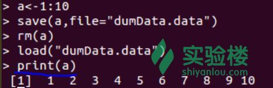
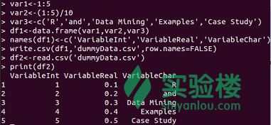
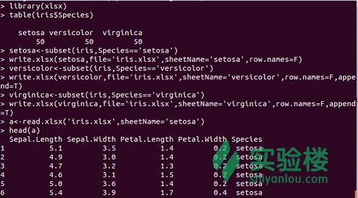

# 第 1 节 介绍

## 一、实验说明

### 1\. 环境登录

无需密码自动登录，系统用户名 shiyanlou

### 2\. 环境介绍

本实验环境采用带桌面的 Ubuntu Linux 环境，实验中会用到程序：

1.  LX 终端（LXTerminal）: Linux 命令行终端，打开后会进入 Bash 环境，可以使用 Linux 命令
2.  GVim：非常好用的编辑器，最简单的用法可以参考课程[Vim 编辑器](http://www.shiyanlou.com/courses/2)
3.  R:在命令行输入'R'进入交互式编程环境，下面的代码都是在该环境中运行。

### 3\. 环境使用

使用 R 语言交互式环境输入实验所需的代码及文件，使用 LX 终端（LXTerminal）运行所需命令进行操作。

实验报告可以在个人主页中查看，其中含有每次实验的截图及笔记，以及每次实验的有效学习时间（指的是在实验桌面内操作的时间，如果没有操作，系统会记录为发呆时间）。这些都是您学习的真实性证明。

## 二、课程介绍

本门课程翻译自《R and Data Mining: Examples and Case Studies》这本书。这一节课主要介绍一些基本的概念以及数据挖掘中的方法，包括数据挖掘的一般步骤和当前常用的数据挖掘技术。

## 三、基本概念及操作

### 1、数据挖掘

概念：数据挖掘是从大量数据中获取有用信息的一个过程。它是一门跨越许多领域的学科，涉及到的领域包括统计学，机器学习，信息检索，模式识别以及生物信息学。数据挖掘在许多领域中被广泛使用，例如零售，金融，信息交流以及社会媒体。

数据挖掘主要的技术包括分类和预测、聚类、异常点检测、关联规则、序列分析、时间序列分析以及文本挖掘，也有一些新的技术例如社交网络分析和情感分析。更多关于数据挖掘技术的细节可以下载**Data Mining: Concepts and Techniques**这本书。

### 2、R

R 为统计计算和画图提供了一个免费的软件环境。它拥有 5606 个包，里面的包可以在官网[CRAN](http://cran.r-project.org/)中下载。浏览[CRAN Task Views](http://cran.r-project.org/web/views/)找到需要使用的包。

R 语言的另一个指南是[R Reference Card for Data Mining](http://www.rdatamining.com/docs/r-reference-card-for-data-mining)，该书提供给了 R 语言用于数据挖掘逻辑包函数的全局索引。

### 3、[数据集](http://baike.baidu.com/view/262162.htm)

#### 3.1 保存和加载 R 数据

R 里面的数据可以使用 save()函数保存为.Rdata 文件，并可以使用函数 load()加载该.Rdata 文件到 R 中。也可以使用函数 rm()移除数据对象。实例如下：

```r
# 将 1-10 赋值给对象 a
> a<-1:10
# 保存文件为“dumData.Rata”
> save(a,file="dumData.Rdata")
# 移除数据对象
> rm(a)
# 重新加载数据对象
> load("dumData.Rdata")
> print(a) 
```

打印结果如下图所示：



#### 3.2 从.csv 文件中导入或者导出数据

下面的例子建立了一个[数据框](http://www.math.pku.edu.cn/teachers/lidf/docs/statsoft/html/s/06.html)df1，并使用.csv()函数将它保存为一个.csv 文件，然后使用 read.csv()函数将该数据框加载到 df2 对象中。

```r
# 初始化向量
> var1 <- 1:5
> var2 <- (1:5) / 10
> var3 <- c("R", "and", "Data Mining", "Examples", "Case Studies")
# 使用 data.frame()将三个向量组合成一个数据框
> df1 <- data.frame(var1, var2, var3)
# 命名数据框的列名
> names(df1) <- c("VariableInt", "VariableReal", "VariableChar")
> write.csv(df1, "dummmyData.csv", row.names = FALSE)
> df2 <- read.csv("dummmyData.csv")
> print(df2) 
```

输出结果如下图所示：



#### 3.3 使用包‘xlsx’读写 excel 文件

下面的例子创建了一个拥有三个表格的 excel 文件“iris.xlsx”，使用函数 write.xlsx()将鸢尾花的数据写入文件，并且每一个表格里面对应一种鸢尾花。当添加第二个表格和第三个表格的时候，为了防止第一张表格的内容被覆盖，需要使用参数 append=T 向已经存在的文件中添加新的表格。最后，使用函数 read.xlsx()从表格“setosa”中读取数据。

```r
# 加载包
> library(xlsx)
# 列表显示花的种类
> table(iris$Species)
# 将不同种类的鸢尾花数据写入对象，并将对象写入 execl 文件
> setosa <- subset(iris, Species == "setosa")
> write.xlsx(setosa, file="iris.xlsx", sheetName="setosa", row.names=F)
> versicolor <- subset(iris, Species == "versicolor")
> write.xlsx(versicolor, file="iris.xlsx", sheetName="versicolor",
+ row.names=F, append=T)
> virginica <- subset(iris, Species == "virginica")
> write.xlsx(virginica, file="iris.xlsx", sheetName="virginica",
+ row.names=F, append=T)
# 读取文件中表格里面的数据
> a <- read.xlsx("iris.xlsx", sheetName="setosa")
# 打印表格名称为‘setosa’的前 6 行数据
> head(a) 
```

如下图所示：

