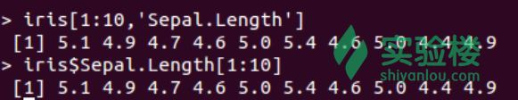
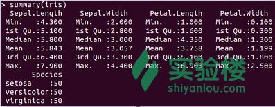
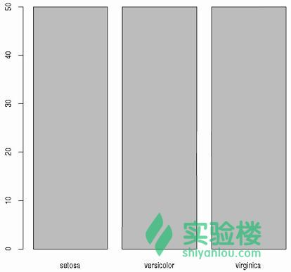
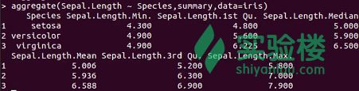
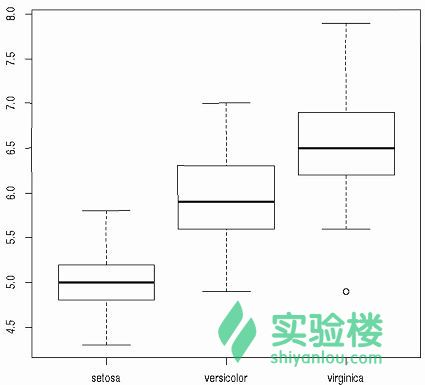
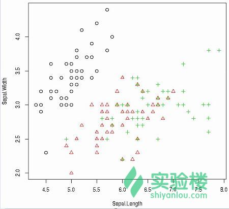

# 第 2 节 数据探索

## 一、实验说明

### 1\. 环境登录

无需密码自动登录，系统用户名 shiyanlou

### 2\. 环境介绍

本实验环境采用带桌面的 Ubuntu Linux 环境，实验中会用到程序：

1.  LX 终端（LXTerminal）: Linux 命令行终端，打开后会进入 Bash 环境，可以使用 Linux 命令
2.  GVim：非常好用的编辑器，最简单的用法可以参考课程[Vim 编辑器](http://www.shiyanlou.com/courses/2)
3.  R:在命令行输入‘R’，进入 R 语言的交互式环境，下面的代码都是在交互式环境运行。

### 3\. 环境使用

使用 R 语言交互式环境输入实验所需的代码及文件，使用 LX 终端（LXTerminal）运行所需命令进行操作。

实验报告可以在个人主页中查看，其中含有每次实验的截图及笔记，以及每次实验的有效学习时间（指的是在实验桌面内操作的时间，如果没有操作，系统会记录为发呆时间）。这些都是您学习的真实性证明。

## 二、课程介绍

这一节课主要介绍使用 R 语言探索数据。首先查看数据的维度、结构以及 R 数据对象，其次是基本的统计量和图表。接下来是多元数据的分析包括多变量分布、多变量箱型图以及散点图。在后面的例子中将会介绍绘制水平图、热图和 3D 图，并将图表保存为各种形式的文件。

## 三、课程内容

### 1、观察数据

这一章我们将会用到‘iris’（鸢尾花）数据集，这个数据集属于 R 中自带的数据，因此不需要额外的加载。首先，查看数据的维度和结构，使用函数 dim()和 names()可以分别得到数据的维度和数据的列表名称也就是变量名称。使用函数 str()和函数 attribute()可以查看数据的结构和属性。

```r
> dim(iris)  # 维度
> names(iris) # 列名
> str(iris) # 结构
> attributes(iris) # 属性 
```

接下来，查看数据的前 5 行，使用 head()查看数据的前面几行，使用 tail()可以查看数据的后面几行。

```r
> iris[1:5,]  # 查看 1-5 行数据
> head(iris)  # 查看前 6 行数据
> tail(iris)  # 查看后 6 行数据 
```

其次，我们可以通过单独的列名称检索数据，下面的代码都可以实现检索‘Sepal.Length’（萼片长度）这个属性的前面 10 个数据。

```r
> iris[1:10,'Sepal.Length']
> iris$Sepal.Length[1:10]  # 一般比较常用的检索方式 
```

结果如下图所示：



### 2、分析单个变量的分布

每一个数值变量的分布都可以使用函数 summary()查看，该函数可以得出变量的最小值、最大值、均值、中位数、第一和第三[四分位数](https://zh.wikipedia.org/wiki/%E5%9B%9B%E5%88%86%E4%BD%8D%E6%95%B0)。

```r
> summary(iris) 
```

结果显示如下：



同样，均值、中位数以及范围可以通过函数 mean()、median()以及 range()分别实现，下面的代码是通过 quantile()实现四分位数和百分位数。

```r
> quantile(iris$Sepal.Length)
# 实现 10%和 30%以及 65%的分位数
> quantile(iris$Sepal.Length,c(.1,.3,.65)) 
```

接下来，我们使用 var()查看‘Sepal.Length’的方差，并使用函数 hist()和 density()查看该属性的直方图分布和密度分布。

```r
> var(iris$Sepal.Length) # 方差
> hist(iris$Sepal.Length) # 直方图
> plot(density(iris$Sepal.Length)) # 密度分布图 
```

变量的频数可以通过函数 table()查看，使用 pie()画饼状图或使用 barplot()画条形图。

```r
> table(iris$Species)
> pie(table(iris$Species))
> barplot(table(iris$Species)) 
```

条状图如下图所示：



### 3、分析多元数据

在观察完单变量的分布之后，我们需要研究两个变量之间的关系。下面我们将会使用函数 cov()和 cor()计算变量之间的协方差和相关系数。

```r
> cov(iris$Sepal.Length, iris$Petal.Length)
# 计算 1-4 列属性之间的协方差
> cov(iris[,1:4])  
# 计算萼片长度和花瓣长度之间的相关系数
> cor(iris$Sepal.Length, iris$Petal.Length)  
> cor(iris[,1:4]) # 计算 4 个属性之间的相关系数 
```

使用 aggregate()计算每种鸢尾花的萼片长度的统计数据。

```r
# summary 这个参数表明使用的是 summary()函数查看数据分布状态
> aggregate(Sepal.Length ~ Species, summary, data=iris) 
```

结果显示如下：



使用函数 boxplot()绘制[箱线图](http://wiki.mbalib.com/wiki/%E7%AE%B1%E7%BA%BF%E5%9B%BE)也称箱须图来展示中位数、四分位数以及异常值的分布情况。

```r
> boxplot(Sepal.Length~Species, data=iris) 
```

如下图所示：



上图中，矩形盒中间的横条就是变量的中位数，矩形盒的上下两个边分别是上、下四分位数也称第一四分位数和第三四分位数，最外面的上下两条横线分别是最大值和最小值，至于在 virginica 这类鸢尾花上面的箱线图外面的一个圆圈就是[异常值](http://baike.baidu.com/view/2447561.htm)。

使用 plot()函数可以绘制两个数值变量之间的散点图，如果使用 with()函数就不需要在变量名之前添加‘iris$’，下面的代码中设置了每种鸢尾花观测值的点的颜色和形状。**（了解函数或者模块的用法可以通过输入‘?function’）**：

```r
# 参数 col 根据鸢尾花种类设置点的颜色，pch 将种类转化为数值型设置点的形状
> with(iris, plot(Sepal.Length, Sepal.Width, col=Species, pch=as.numeric(Species))) 
```

效果图如下：



当点比较多的时候就会有重叠，我们可以在绘图前使用 jitter()往数据中添加一些噪声点来减少数据的重叠：

```r
> plot(jitter(iris$Sepal.Length), jitter(iris$Sepal.Width)) 
```

通过函数 pair()绘制[散点图矩阵](http://cos.name/2009/03/scatterplot-matrix-visualization/)。

```r
> pairs(iris) 
```

### 4、拓展

这一节将会学习一些有趣的图，包括[3D 图](http://baike.baidu.com/view/732955.htm)、[热图](http://blog.qiuworld.com:8080/archives/2477)和[平行坐标图](https://docs.tibco.com/pub/spotfire_web_player/6.0.0-november-2013/zh-CN/WebHelp/GUID-24AF55A4-E1E3-4F08-B62C-842738904252.html)。

```r
> library(scatterplot3d)  # 加载包
> scatterplot3d(iris$Petal.Width, iris$Sepal.Length, iris$Sepal.Width)  # 3d 图
# dist()函数用来计算不同鸢尾花数据的相似度
> distMatrix <- as.matrix(dist(iris[,1:4]))
> heatmap(distMatrix)
# 绘制平行坐标图
> library(MASS)
> parcoord(iris[1:4], col=iris$Species)
> library(lattice)
> parallelplot(~iris[1:4] | Species, data=iris) 
```

### 5、将图标保存到文件

在数据分析中会产生很多图片，为了能够在后面的程序中用到那些图表，需要将它们保存起来。R 提供了很多保存文件的函数。下面的例子就是将图表保存为 pdf 文件。另外，可以使用函数 ps()和 postscript()将图片保存为 ps 文件，使用 bmp()、jpeg()、png()以及 tiff()可以保存为对应的图片格式文件。注意画完图以后需要使用函数 graphics.off()或者 dev.off()关闭画图设备。

```r
# 创建一个 myPlot.pdf 文件，并在里面画图，画完图后关闭图片设备
> pdf("myPlot.pdf")
> x <- 1:50
> plot(x, log(x))
> graphics.off() 
```

这里的 myPlot.pdf 可以使用浏览器打开查看。