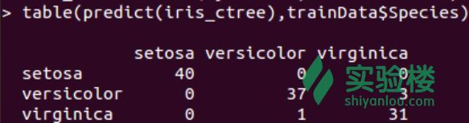
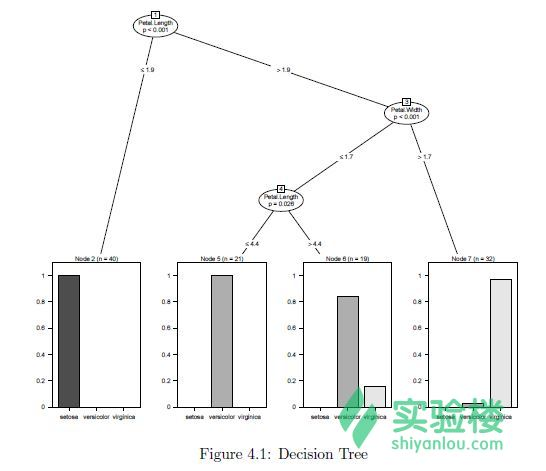
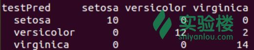
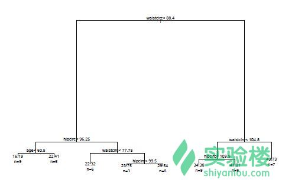
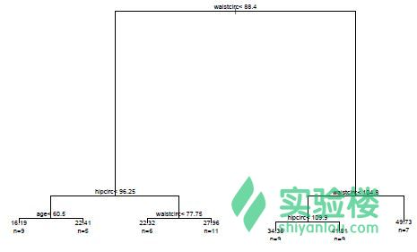
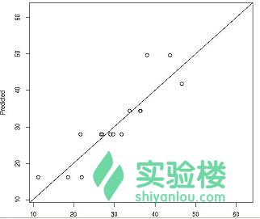
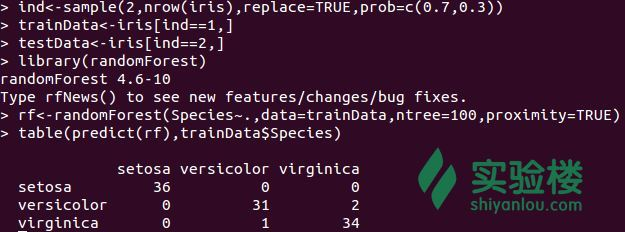
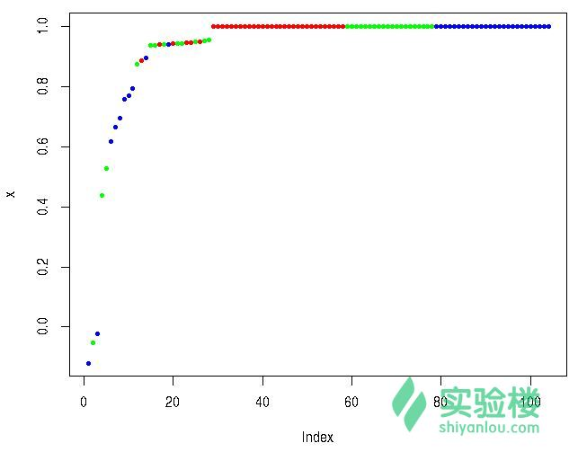

# 第 3 节 决策树和随机森林

## 一、实验说明

### 1\. 环境登录

无需密码自动登录，系统用户名 shiyanlou

### 2\. 环境介绍

本实验环境采用带桌面的 Ubuntu Linux 环境，实验中会用到程序：

1.  LX 终端（LXTerminal）: Linux 命令行终端，打开后会进入 Bash 环境，可以使用 Linux 命令
2.  GVim：非常好用的编辑器，最简单的用法可以参考课程[Vim 编辑器](http://www.shiyanlou.com/courses/2)
3.  R:在命令行终端输入‘R’,进入 R 的交互式环境，下面的代码都是在交互式环境运行。

### 3\. 环境使用

使用 R 语言交互式环境输入实验所需的代码及文件，使用 LX 终端（LXTerminal）运行所需命令进行操作。

实验报告可以在个人主页中查看，其中含有每次实验的截图及笔记，以及每次实验的有效学习时间（指的是在实验桌面内操作的时间，如果没有操作，系统会记录为发呆时间）。这些都是您学习的真实性证明。

## 二、课程介绍

这一节课学习利用包`party`、`rpart`和`randomForest`建立预测模型。首先使用包`party`建立[决策树](https://zh.wikipedia.org/wiki/%E5%86%B3%E7%AD%96%E6%A0%91)，并使用决策树分类。并使用包`rpart`再建立一次决策树，然后给出一个实例使用包`randomForest`训练出一个随机森林模型。

## 三、课程内容

### 1、使用包`party`建立决策树

这一节学习使用包`party`里面的函数 ctree()为数据集`iris`建立一个决策树。属性`Sepal.Length`（萼片长度）、`Sepal.Width`（萼片宽度）、`Petal.Length`（花瓣长度）以及`Petal.Width`（花瓣宽度）被用来预测鸢尾花的`Species`（种类）。在这个包里面，函数 ctree()建立了一个决策树，predict()预测另外一个数据集。

在建立模型之前，`iris`（鸢尾花）数据集被分为两个子集：训练集（70%）和测试集（30%）。使用[随机种子](http://baike.baidu.com/view/552838.htm)设置固定的随机数，可以使得随机选取的数据是可重复利用的。

```r
# 观察鸢尾花数据集的结构
> str(iris)
# 设置随机数起点为 1234
> set.seed(1234)
# 使用 sample 函数抽取样本，将数据集中观测值分为两个子集
> ind <- sample(2, nrow(iris), replace=TRUE, prob=c(0.7, 0.3))
# 样本的第一部分为训练集
> trainData <- iris[ind==1,]
# 样本的第二部分为测试集
> testData <- iris[ind==2,] 
```

加载包`party`建立一个决策树，并检测预测见过。函数 ctree()提供一些参数例如 MinSplit, MinBusket, MaxSurrogate 和 MaxDepth 用来控制决策树的训练。下面我们将会使用默认的参数设置去建立决策树，至于具体的参数设置可以通过`?party`查看函数文档。下面的代码中，myFormula 公式中的 Species（种类）是目标变量，其他变量是独立变量。

```r
> library(party)
# 符号'~'是连接方程或公式左右两边的符号
> myFormula <- Species ~ Sepal.Length + Sepal.Width + Petal.Length + Petal.Width
# 建立决策树
> iris_ctree <- ctree(myFormula, data=trainData)
# 检测预测值
> table(predict(iris_ctree), trainData$Species) 
```

显示结果如下：



由上图可知，setosa（山鸢尾）40 观测值全部正确预测，而 versicolor（变色鸢尾）有一个观测值被误判为 virginica（维吉尼亚鸢尾），virginica（维吉尼亚鸢尾）有 3 个观测值被误判为 versicolor（变色鸢尾）。

```r
# 打印决策树
> print(iris_ctree)
# 绘制决策树（见图 4.1）
> plot(iris_ctree)
# 绘制决策树简图（见图 4.2）
> plot(iris_ctree, type="simple") 
```



```r
 图 4.1 
```


```r
 图 4.2 
```

在图 4.1 中，每一个叶子的节点的条形图都显示了观测值落入三个品种的概率。在图 4.2 中，这些概率以每个叶子结点中的 y 值表示。例如：结点 2 里面的标签是“n=40 y=(1,0,0)”，指的是这一类中一共有 40 个观测值，并且所有的观测值的类别都属于第一类 setosa（山鸢尾）。

接下来，需要使用测试集测试决策树。

```r
# 在测试集上测试决策树
> testPred <- predict(iris_ctree, newdata = testData)
> table(testPred, testData$Species) 
```

结果如下：



从上图的结果可知，决策树对变色鸢尾和维吉尼亚鸢尾的识别仍然有误判。因此 ctree()现在的版本并不能很好的处理部分属性不明确的值，在实例中既有可能被判到左子树，有时候也会被判到右子树上。

### 2、使用包`rpart`建立决策树

`rpart`这个包在本节中被用来在'bodyfat'这个数据集的基础上建立决策树。函数 raprt()可以建立一个决策树，并且可以选择最小误差的预测。然后利用该决策树使用 predict()预测另外一个数据集。

首先，加载 bodyfat 这个数据集，并查看它的一些属性。

```r
> data("bodyfat", package = "TH.data")
> dim(bodyfat)
> attributes(bodyfat)
> bodyfat[1:5,] 
```

跟第 1 节一样，将数据集分为训练集和测试集，并根据训练集建立决策树。

```r
> set.seed(1234)
> ind <- sample(2, nrow(bodyfat), replace=TRUE, prob=c(0.7, 0.3))
> bodyfat.train <- bodyfat[ind==1,]
> bodyfat.test <- bodyfat[ind==2,]
> library(rpart)
# 编写公式 myFormula
> myFormula <- DEXfat ~ age + waistcirc + hipcirc + elbowbreadth + kneebreadth
# 训练决策树
> bodyfat_rpart <- rpart(myFormula, data = bodyfat.train,
+ control = rpart.control(minsplit = 10))
# 画决策树
> plot(bodyfat_rpart)
# 添加文本标签
> text(bodyfat_rpart, use.n=T) 
```

结果如下图所示：



```r
 图 4.3 
```

选择预测误差最小值的预测树，从而优化模型。

```r
> opt <- which.min(bodyfat_rpart$cptable[,"xerror"])
> cp <- bodyfat_rpart$cptable[opt, "CP"]
> bodyfat_prune <- prune(bodyfat_rpart, cp = cp)
> plot(bodyfat_rpart)
> text(bodyfat_rpart, use.n=T) 
```

优化后的决策树如下：



```r
 图 4.4 
```

对比图 4.3 和图 4.4 的结果就会发现，优化模型后，就是将 hipcirc<99.5 这个分层给去掉了，也许是因为这个分层没有必要，那么大家可以思考一下选择预测误差最小的结果的决策树的分层反而没有那么细。

之后，优化后的决策树将会用来预测，预测的结果会与实际的值进行对比。下面的代码中，使用函数 abline()绘制一条斜线。一个好的模型的预测值应该是约接近真实值越好，也就是说大部分的点应该落在斜线上面或者在斜线附近。

```r
# 根据测试集预测
> DEXfat_pred <- predict(bodyfat_prune, newdata=bodyfat.test)
# 预测值的极值
> xlim <- range(bodyfat$DEXfat)
> plot(DEXfat_pred ~ DEXfat, data=bodyfat.test, xlab="Observed",
+ ylab="Predicted", ylim=xlim, xlim=xlim)
> abline(a=0, b=1) 
```

绘制结果如下：



### 3、随机森林

我们使用包`randomForest`并利用鸢尾花数据建立一个预测模型。包里面的 randomForest()函数有两点不足：第一，它不能处理缺失值，使得用户必须在使用该函数之前填补这些缺失值；第二，每个分类属性的最大数量不能超过 32 个，如果属性超过 32 个，那么在使用 randomForest()之前那些属性必须被转化。

也可以通过另外一个包'cforest'建立随机森林，并且这个包里面的函数并不受属性的最大数量约束，尽管如此，高维的分类属性会使得它在建立随机森林的时候消耗大量的内存和时间。

```r
> ind <- sample(2, nrow(iris), replace=TRUE, prob=c(0.7, 0.3))
> trainData <- iris[ind==1,]
> testData <- iris[ind==2,]
> library(randomForest)
# Species ~ .指的是 Species 与其他所有属性之间的等式
> rf <- randomForest(Species ~ ., data=trainData, ntree=100, proximity=TRUE)
> table(predict(rf), trainData$Species) 
```

结果如下：



由上图的结果可知，即使在决策树中，仍然有误差，第二类和第三类话仍然会被误判，可以通过输入`print(rf)`知道误判率为 2.88%，也可以通过输入`plot(rf)`绘制每一棵树的误判率的图。

最后，在测试集上测试训练集上建立的随机森林，并使用 table()和 margin()函数检测预测结果。

```r
> irisPred <- predict(rf, newdata=testData)
> table(irisPred, testData$Species)
# 绘制每一个观测值被判断正确的概率图
> plot(margin(rf, testData$Species)) 
```

显示结果如下：



**思考：**随机森林与决策树的分类方法的优缺点。