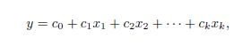
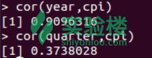
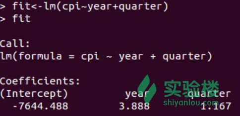
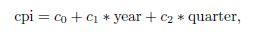
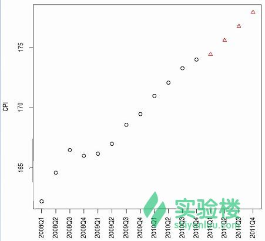
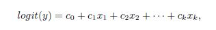
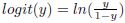
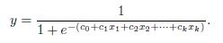
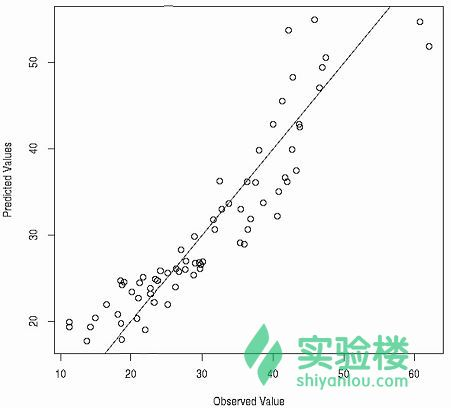

# 第 4 节 回归

## 一、实验说明

### 1\. 环境登录

无需密码自动登录，系统用户名 shiyanlou

### 2\. 环境介绍

本实验环境采用带桌面的 Ubuntu Linux 环境，实验中会用到程序：

1.  LX 终端（LXTerminal）: Linux 命令行终端，打开后会进入 Bash 环境，可以使用 Linux 命令
2.  GVim：非常好用的编辑器，最简单的用法可以参考课程[Vim 编辑器](http://www.shiyanlou.com/courses/2)
3.  R:在命令行输入‘R’进入交互式环境，下面的代码都是在交互式环境运行。

### 3\. 环境使用

使用 R 语言交互式环境输入实验所需的代码及文件，使用 LX 终端（LXTerminal）运行所需命令进行操作。

实验报告可以在个人主页中查看，其中含有每次实验的截图及笔记，以及每次实验的有效学习时间（指的是在实验桌面内操作的时间，如果没有操作，系统会记录为发呆时间）。这些都是您学习的真实性证明。

## 二、课程介绍

这一节课主要介绍回归模型中基本的概念以及不同回归模型的例子。具体内容如下：

1.  建立一个线性回归模型来预测 CPI 数据
2.  是 logistic 模型
3.  广义线性模型（GLM）
4.  非线性模型

更多关于回归分析中的 R 函数的介绍可以参考[《回归分析中的 R 函数》](http://cran.r-project.org/doc/contrib/Ricci-refcard-regression.pdf)。

## 三、课程内容

### 1、[线性回归](https://zh.wikipedia.org/wiki/%E7%B7%9A%E6%80%A7%E5%9B%9E%E6%AD%B8)

线性回归就是使用下面的预测函数预测未来观测量：



其中，x1,x2,...,xk 都是预测变量（影响预测的因素），y 是需要预测的目标变量（被预测变量）。

线性回归模型的数据来源于澳大利亚的[CPI](https://zh.wikipedia.org/wiki/%E6%B6%88%E8%B2%BB%E8%80%85%E7%89%A9%E5%83%B9%E6%8C%87%E6%95%B8)数据，选取的是 2008 年到 2011 年的[季度数据](http://www.abs.gov.au)。

```r
# rep 函数里面的第一个参数是向量的起始时间，从 2008-2010，第二个参数表示向量里面的每个元素都被 4 个小时间段。
> year <- rep(2008:2010, each=4)
> quarter <- rep(1:4, 3)
> cpi <- c(162.2, 164.6, 166.5, 166.0,
+ 166.2, 167.0, 168.6, 169.5,
+ 171.0, 172.1, 173.3, 174.0)
# plot 函数中 axat=“n”表示横坐标刻度的标注是没有的
> plot(cpi, xaxt="n", ylab="CPI", xlab="")
# 绘制横坐标轴
> axis(1, labels=paste(year,quarter,sep="Q"), at=1:12, las=3) 
```

接下来，观察 CPI 与其他变量例如‘year(年份)’和‘quarter(季度)’之间的[相关关系](http://baike.baidu.com/view/510626.htm)。

```r
> cor(year,cpi)
> cor(quarter,cpi) 
```

输出如下：



由上图可知，CPI 与年度之间的关系是正相关，并且非常紧密，相关系数接近 1；而它与季度之间的[相关系数](http://baike.baidu.com/view/172091.htm)大约为 0.37，只是有着微弱的正相关，关系并不明显。

然后使用 lm()函数建立一个线性回归模型，其中年份和季度为预测因素，CPI 为预测目标。

```r
# 建立模型 fit
> fit <- lm(cpi ~ year + quarter)
> fit 
```

输出结果如下：



由上面的输出结果可以建立以下模型公式计算 CPI：



其中，c0、c1 和 c2 都是模型 fit 的参数分别是-7644.488、3.888 和 1.167。因此 2011 年的 CPI 可以通过以下方式计算：

```r
> (cpi2011 <- fit$coefficients[[1]] + fit$coefficients[[2]]*2011 +
+ fit$coefficients[[3]]*(1:4)) 
```

输出的 2011 年的季度 CPI 数据分别是 174.4417、175.6083、176.7750 和 177.9417。

模型的具体参数可以通过以下代码查看：

```r
# 查看模型的属性
> attributes(fit)
# 模型的参数
> fit$coefficients
# 观测值与拟合的线性模型之间的误差，也称为残差
> residuals(fit) 
```

除了将数据代入建立的预测模型公式中，还可以通过使用 predict()预测未来的值。

```r
# 输入预测时间
> data2011 <- data.frame(year=2011, quarter=1:4)
> cpi2011 <- predict(fit, newdata=data2011)
# 设置散点图上的观测值和预测值对应点的风格（颜色和形状）
> style <- c(rep(1,12), rep(2,4))
> plot(c(cpi, cpi2011), xaxt="n", ylab="CPI", xlab="", pch=style, col=style)
# 标签中 sep 参数设置年份与季度之间的间隔
> axis(1, at=1:16, las=3,
+ labels=c(paste(year,quarter,sep="Q"), "2011Q1", "2011Q2", "2011Q3", "2011Q4")) 
```

预测结果如下：



上图中红色的三角形就是预测值。

### 2、[Logistic 回归](http://baike.baidu.com/view/2294104.htm)

Logistic 回归是通过将数据拟合到一条线上并根据简历的曲线模型预测事件发生的概率。可以通过以下等式来建立一个 Logistic 回归模型：



其中，x1,x2,...,xk 是预测因素，y 是预测目标。令，上面的等式被转换成：



使用函数 glm()并设置[响应变量(被解释变量)](http://wiki.pinggu.org/doc-view-31225.html)服从[二项分布](https://zh.wikipedia.org/wiki/%E4%BA%8C%E9%A0%85%E5%88%86%E4%BD%88)（family='binomial,'link='logit'）建立 Logistic 回归模型，更多关于 Logistic 回归模型的内容可以通过以下链接查阅：

*   [R Data Analysis Examples - Logit Regression](http://www.ats.ucla.edu/stat/r/dae/logit.htm)
*   [《Logistic Regression (with R)》](http://nlp.stanford.edu/~manning/courses/ling289/logistic.pdf)

### 3、[广义线性模型](https://zh.wikipedia.org/wiki/%E5%BB%A3%E7%BE%A9%E7%B7%9A%E6%80%A7%E6%A8%A1%E5%9E%8B)

广义线性模型（generalized linear model, GLM)是简单最小二乘回归（OLS)的扩展，响应变量（即模型的因变量）可以是正整数或分类数据，其分布为某指数分布族。其次响应变量期望值的函数（连接函数）与预测变量之间的关系为线性关系。因此在进行 GLM 建模时，需要指定分布类型和连接函数。这个建立模型的分布参数包括 binomaial（两项分布）、gaussian（正态分布）、gamma（伽马分布）、poisson(泊松分布)等。

广义线性模型可以通过 glm()函数建立，使用的数据是包‘TH.data’自带的 bodyfat 数据集。

```r
> data("bodyfat", package="TH.data")
> myFormula <- DEXfat ~ age + waistcirc + hipcirc + elbowbreadth + kneebreadth
# 设置响应变量服从正态分布，对应的连接函数服从对数分布
> bodyfat.glm <- glm(myFormula, family = gaussian("log"), data = bodyfat)
# 预测类型为响应变量
> pred <- predict(bodyfat.glm, type="response")
> plot(bodyfat$DEXfat, pred, xlab="Observed Values", ylab="Predicted Values")
> abline(a=0, b=1) 
```

预测结果检验如下图所示：



由上图可知，模型虽然也有离群点，但是大部分的数据都是落在直线上或者附近的，也就说明模型建立的比较好，能较好的拟合数据。

### 4、非线性回归

如果说线性模型是拟合拟合一条最靠近数据点的直线，那么非线性模型就是通过数据拟合一条曲线。在 R 中可以使用函数 nls()建立一个非线性回归模型，具体的使用方法可以通过输入'?nls()'查看该函数的文档。