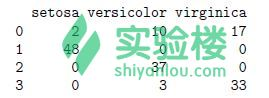

# 第 5 节 介绍

## 一、实验说明

### 1\. 环境登录

无需密码自动登录，系统用户名 shiyanlou

### 2\. 环境介绍

本实验环境采用带桌面的 Ubuntu Linux 环境，实验中会用到程序：

1.  LX 终端（LXTerminal）: Linux 命令行终端，打开后会进入 Bash 环境，可以使用 Linux 命令
2.  GVim：非常好用的编辑器，最简单的用法可以参考课程[Vim 编辑器](http://www.shiyanlou.com/courses/2)
3.  R:在命令行输入‘R’进入交互式环境，下面的代码都是在交互式环境运行。

### 3\. 环境使用

使用 R 语言交互式环境输入实验所需的代码及文件，使用 LX 终端（LXTerminal）运行所需命令进行操作。

实验报告可以在个人主页中查看，其中含有每次实验的截图及笔记，以及每次实验的有效学习时间（指的是在实验桌面内操作的时间，如果没有操作，系统会记录为发呆时间）。这些都是您学习的真实性证明。

## 二、课程介绍

这一节课主要介绍一些[聚类](http://baike.baidu.com/view/31801.htm)的方法，包括 k-均值聚类、k-中心点聚类、层次聚类和密度聚类。前面两节是介绍采用 k-均值算法和 k-中心点算法给鸢尾花数据聚类；第三节是关于使用相同的数据采取层次聚类算法的例子；最后一节介绍密度聚类和 DBSCAN 聚类算法思想，并演示如何使用 DBSCAN 算法聚类，并使用这个聚类模型给新的数据分类。

## 三、课程内容

### 1、[K-Means 聚类](http://baike.baidu.com/view/3066906.htm)

这一节介绍使用鸢尾花数据进行 k-均值聚类。

首先进行数据预处理：

```r
> library(cluster)
# 建立一个新的鸢尾花数据集
> iris2 <- iris
# 移除数据集中关于种类的划分
> iris2$Species <- NULL
# 将数据进行 k-均值聚类分为 3 类
> (kmeans.result <- kmeans(iris2, 3))
# 将 k-Means 聚类的结果与实际数值进行对比
> table(iris$Species, kmeans.result$cluster) 
```

对比结果显示：


上图显示 setosa（山鸢尾）可以很容易从其他花种中区分开，但是 versicolor（变色鸢尾）和 virginica（维吉尼亚鸢尾）就比较难以区分。

接下来，绘制数据分布和它们各自的中心点。注意鸢尾花一共有四个属性，下面的代码是根据前面两个属性：萼片长度和萼片宽度画出的聚类图。我们还需要注意的是由于初始中心点的选择是随机的，因此聚类的结果随着初始值的不同而不同。

```r
> plot(iris2[c("Sepal.Length", "Sepal.Width")], col = kmeans.result$cluster)
# 画聚类中心（簇中心）
> points(kmeans.result$centers[,c("Sepal.Length", "Sepal.Width")], col = 1:3,
+ pch = 8, cex=2) 
```

（这里的`point`函数是在`plot`的前提下执行，因此`plot`出来的空白画板大家不要关掉哦，否则`point`的时候会报错）

聚类图如下：


### 2、[k 中心点聚类](http://baike.baidu.com/view/3066037.htm)

本节介绍使用函数 pam()和 pamk()实现 k 中心点聚类算法。k 中心点聚类和 k 均值聚类算法很接近，它们之间主要的区别是：在 k 均值算法中，它的中心代表一个类，而在 k 中心点算法中将与类中心对象最接近的点作为一个类。

PAM（Partitioning Around Medoids）是 k 中心点聚类中一个经典算法，它的思想是基于距离聚类，具有良好的抗噪声、抗偏离点的能力。它的弱点是不能处理大量的数据，但是经过改良的算法 CLARA 算法选取数据的多个样本，在每个样本上都使用 PAM 算法，然后选取最好的聚类结果。PAM 和 CLARA 这两个算法在 R 中可以通过包‘cluster’中的函数 pam()和 clara()实现，这两个函数都需要指定聚类的数量 k。但是在包'fpc'中的函数 pamk()可以通过调用 pam()或者 clara()选择效果最优的聚类数。

使用下面的代码找到鸢尾花数据聚类情况：

```r
> library(fpc)
> pamk.result <- pamk(iris2)
# 聚类数量
> pamk.result$nc
# 检验聚类情况
> table(pamk.result$pamobject$clustering, iris$Species)
> layout(matrix(c(1,2),1,2)) # 一张图被分割为两个部分
> plot(pamk.result$pamobject)
# 将绘制的两个图表合并在一张图上显示
> layout(matrix(1)) 
```

输出结果如下：


上面的例子中，pamk()将数据集分为两类：一类是‘setosa’，另外一类是‘versicolor’和‘virginica’的混合数据。上图中，左半部分的图是一个二维的聚类图，里面的紫线显示了两个类别之间的距离。右半部分的图是这两个类的投影图，轮廓线 si 越接近 1 就说明该观测值聚类情况非常好；si 越接近 0 就说明该观测值不容易被区分，处于两个类别之间。si 为负值就说明该数据被错误分类。Si(i=1,2)分别代表第一类和第二类的平均投影情况，它们分别是 0.81 和 0.62 说明聚类情况良好。

接下来令聚类数量 k=3 使用 pam()函数聚类。

```r
> pam.result <- pam(iris2, 3)
> table(pam.result$clustering, iris$Species)
> layout(matrix(c(1,2),1,2)) 
> plot(pam.result)
> layout(matrix(1)) 
```

显示结果如下：


上图左半部分显示：第一类花‘setosa’能很好的与另外两类花区分，第二类和第三类花就有一些相似的地方，也就是说这两类鸢尾花的一些数据不能被正确的判别。

根据上面使用 pamk()和 pam()的两个聚类例子很难判断哪一种聚类方法更好，这取决于目标问题和各自的经验与知识领域。在这个例子中，pam()函数似乎更好一点，能够将鸢尾花聚为 3 类。所以 pamk()不一定能给出最好的聚类数量。我们需要知道的是 pam()函数使用的时候，是通过人为的方式设置了 k=3，如果在不知道鸢尾花数据分类的情况下，聚类效果又是不一样的。

### 3、[层次聚类](http://baike.baidu.com/view/3063767.htm)

这一节学习使用函数 hclust()对鸢尾花数据集进行层次聚类。

首先，从鸢尾花数据集中抽取 40 个样本，这样就会避免聚类图上的点拥挤甚至重叠在一起，像之前一样也要把数据集中花的种类去掉，然后对数据进行分层聚类：

```r
> idx <- sample(1:dim(iris)[1], 40)
> irisSample <- iris[idx,]
> irisSample$Species <- NULL
# method="ave"指的是取对象之间的平均距离为组间距离
> hc <- hclust(dist(irisSample), method="ave")
> plot(hc, hang = -1, labels=iris$Species[idx])
# 将聚类树分为 3 类
> rect.hclust(hc, k=3)
# 返回分类结果
> groups <- cutree(hc, k=3) 
```

绘制的聚类树状图如下：


同 k 均值聚类结果一样，"setosa"这类花能被轻易的识别，第二类和第三类花仍然不能够很好的被区分。

### 4、[基于密度的聚类](http://fufeng.iteye.com/blog/1755056)

使用包‘fpc’可以实现[DBSCAN](http://blog.csdn.net/google19890102/article/details/37656733)算法从而对数值型数据进行聚类。基于密度的聚类算法的目标是将一个高密度分布的数据区域划分为一类，依次类推，从而达到将数据分为几类的效果。在 DBSCAN 算法中有以下两个重要参数：

1.  eps：可达距离，定义邻域的大小
2.  MinPts：领域 eps 内所有满足为一类点的数量最小值要求。

如果给定点 a 邻域内的样本点数不超过 MinPts，那么 a 就是一个核心对象。所有在 a 点附近的点如果是密度可达的，也就是说到点 a 的距离小于或者等于可达距离 eps，那么这些点就被划分到 a 这一类。

密度聚类的优势在于它可以发现各种形状和大小的类并且对噪声不敏感。而 k 均值算法倾向于发现相同大小的球形类分布的数据群。

下面是关于鸢尾花数据集的基于密度的聚类算法实现：

```r
> library(fpc)
> iris2 <- iris[-5] # 移除分类标签
> ds <- dbscan(iris2, eps=0.42, MinPts=5)
# 将聚类结果与原始类标签进行对比
> table(ds$cluster, iris$Species) 
```

对比结果如下：



上表中，第一列中的 1-3 分别是已经分好的 3 类，而 0 代表噪声和异常值，也就是没有被分到任何类的对象。

```r
> plot(ds, iris2) 
```


上图中黑色的圆圈就是噪声（异常值）。

另外一种显示聚类结果的方式是使用包 fpc 内的函数 plotcluster()，我们可以观察到不同类的数据已经被标签识别。

```r
> plotcluster(iris2, ds$cluster) 
```

分类散点图：


在分析新数据与类之间的相似性的基础上，聚类模型可以给新数据进行分类。下面的例子就是从鸢尾花数据集中抽取 10 个样本，并结合加一些噪声组成一个新的数据集用来分类。其中，函数 runif()可以生成均匀分布的噪声数据。

```r
# 设置随机种子，随机产生 10 个鸢尾花样本
> set.seed(435)
> idx <- sample(1:nrow(iris), 10)
# 移除第 5 列（分类属性）
> newData <- iris[idx,-5]
> newData <- newData + matrix(runif(10*4, min=0, max=0.2), nrow=10, ncol=4)
# 给新数据分类
> myPred <- predict(ds, iris2, newData)
# 将聚类结果画图显示
> plot(iris2[c(1,4)], col=1+ds$cluster)
> points(newData[c(1,4)], pch="*", col=1+myPred, cex=3)
# 检验聚类效果
> table(myPred, iris$Species[idx]) 
```


```r
 图 4.1 
```


```r
 图 4.2 
```

由图 4.1 的结果可知，有 8（3+3+2）个新样本数据被正确聚类。图 4.2 中‘*’符号代表新的样本数据，不同颜色分别代表不同的类，黑色是噪声点。