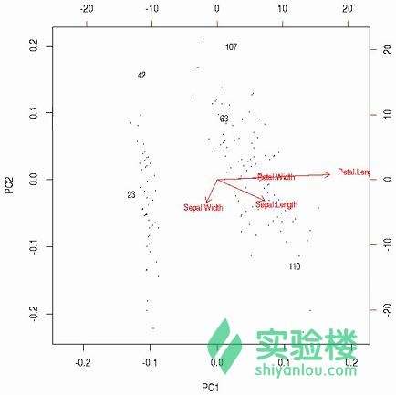

# 第 6 节 异常值检测

## 一、实验说明

### 1\. 环境登录

无需密码自动登录，系统用户名 shiyanlou

### 2\. 环境介绍

本实验环境采用带桌面的 Ubuntu Linux 环境，实验中会用到程序：

1.  LX 终端（LXTerminal）: Linux 命令行终端，打开后会进入 Bash 环境，可以使用 Linux 命令
2.  GVim：非常好用的编辑器，最简单的用法可以参考课程[Vim 编辑器](http://www.shiyanlou.com/courses/2)
3.  R:在命令行输入‘R’进入交互式环境，下面的代码都是在交互式环境运行。

### 3\. 环境使用

使用 R 语言交互式环境输入实验所需的代码及文件，使用 LX 终端（LXTerminal）运行所需命令进行操作。

实验报告可以在个人主页中查看，其中含有每次实验的截图及笔记，以及每次实验的有效学习时间（指的是在实验桌面内操作的时间，如果没有操作，系统会记录为发呆时间）。这些都是您学习的真实性证明。

## 二、课程介绍

这一节主要讲解如何使用 R 检测异常值。主要内容如下：

1.  单变量异常值检测
2.  使用局部异常因子进行异常值检测
3.  通过聚类的方法检验异常值
4.  检验时间序列数据里面的异常值

## 三、课程内容

### 1、单变量异常值检测

这一节主要讲单变量异常值检测，并演示如何将它应用到多元（多个[自变量](http://baike.baidu.com/view/379564.htm)）数据中。使用函数 boxplot.stats()实现单变量检测，该函数根据返回的统计数据生成箱线图。在上述函数的返回结果中，有一个参数 out，它是由异常值组成的列表。更明确的说就是里面列出了箱线图中箱须线外面的数据点。其中参数 coef 可以控制箱须线从箱线盒上延伸出来的长度，关于该函数的更多细节可以通过输入`?boxplot.ststs`查看。

画箱线图：

```r
> set.seed(3147)
# 产生 100 个服从正态分布的数据
> x <- rnorm(100)
> summary(x)
# 输出异常值
> boxplot.stats(x)$out
# 绘制箱线图
> boxplot(x) 
```

箱线图如下：


上图中的四个圆圈代表四个异常值，接下来尝试检验多元变量中的异常值。

```r
> y <- rnorm(100)
# 生成一个包含列名分别为 x 与 y 的数据框 df
> df <- data.frame(x, y)
> rm(x, y)
> head(df)
# 连接数据框 df
> attach(df)
# 输出 x 的异常值
> (a <- which(x %in% boxplot.stats(x)$out))
# 输出 y 中的异常值
> (b <- which(y %in% boxplot.stats(y)$out))
> detach(df)  # 断开与数据框的连接
# 输出 x,y 相同的异常值
> (outlier.list1 <- intersect(a,b))
> plot(df)
# 标注异常点
> points(df[outlier.list1,], col="red", pch="+", cex=2.5)
# x 或 y 中的异常值
> (outlier.list2 <- union(a,b))
> plot(df)
> points(df[outlier.list2,], col="blue", pch="x", cex=2) 
```

在一个应用中，如果有三个或者 3 个以上自变量，异常值最终的列表应该根据各个单变量异常检测到的异常数据的总体情况而产生。在现实应用中，要将理论和程序运行结果一起考虑从而检验出比较合适的异常值。

### 2、使用 LOF（局部异常因子）检测异常值

LOF（局部异常因子）是一种基于密度识别异常值的算法。算法思想是：将一个点的局部密度与分布在它周围的点的密度相比较，如果前者明显的比后者小，那么这个点相对于周围的点来说就处于一个相对比较稀疏的区域，这就表明该点事一个异常值。LOF 算法的缺点是它只对数值型数据有效。

使用包`DMwR`和包`dprep`中的 lofactor()可以计算 LOF 算法中的局部异常因子。

```r
> library(DMwR)
# 移除"Species"这个鸢尾花类别列数据
> iris2 <- iris[,1:4]
# k 是计算局部异常因子所需要判断异常点周围的点的个数
> outlier.scores <- lofactor(iris2, k=5)
# 绘制异常值得分的密度分布图
> plot(density(outlier.scores))
# 挑出得分排前五的数据作为异常值
> outliers <- order(outlier.scores, decreasing=T)[1:5]
# 输出异常值
> print(outliers) 
```

接下来对鸢尾花数据进行[主成分分析](https://zh.wikipedia.org/wiki/%E4%B8%BB%E6%88%90%E5%88%86%E5%88%86%E6%9E%90)，并利用产生的前两个主成分绘制成[双标图](https://zh.wikipedia.org/wiki/%E5%8F%8C%E6%A0%87%E5%9B%BE)来显示异常值。

```r
> n <- nrow(iris2)
> labels <- 1:n
# 除了异常值以外所有的数据用'.'标注
> labels[-outliers] <- "." 
> biplot(prcomp(iris2), cex=.8, xlabs=labels) 
```

输出结果如下：



上面的代码中，prcomp()实现对数据集 iris2 的主成分分析，biplot()取主成分分析结果的前两列数据也就是前两个主成分绘制双标图。上图中，x 轴和 y 轴分别代表第一、二主成分,箭头指向了原始变量名，其中 5 个异常值分别用对应的行号标注。

我们也可以通过 pairs()函数绘制散点图矩阵来显示异常值，其中异常值用红色的'+'标注:

```r
# 使用 rep()生成 n 个'.'
> pch <- rep(".", n)
> pch[outliers] <- "+"
> col <- rep("black", n)
> col[outliers] <- "red"
> pairs(iris2, pch=pch, col=col) 
```

散点图矩阵：


### 3、通过聚类检测异常值

检测异常值的另外一种方式就是聚类。先把数据聚成不同的类，选择不属于任何类的数据作为异常值。例如，基于密度的聚类 DBSCAN 算法的实现就是将与数据稠密区域紧密相连的数据对象划分为一个类，因此与其他对象分离的数据就会作为异常值。

也可以使用 K 均值算法实现异常值的检测。首先通过把数据划分为 k 组，划分方式是选择距离各自簇中心最近的点为一组；然后计算每个对象和对应的簇中心的距离（或者相似度），并挑出拥有最大的距离的点作为异常值。

使用鸢尾花数据集，结合 k 均值算法进行异常值检验的代码如下：

```r
> iris2 <- iris[,1:4]
> kmeans.result <- kmeans(iris2, centers=3)
# 输出簇中心
> kmeans.result$centers
# 分类结果
> kmeans.result$cluster
# 计算数据对象与簇中心的距离
> centers <- kmeans.result$centers[kmeans.result$cluster, ]
> distances <- sqrt(rowSums((iris2 - centers)²))
# 挑选出前 5 个最大的距离
> outliers <- order(distances, decreasing=T)[1:5]
# 输出异常值
> print(outliers)
> print(iris2[outliers,])
# 画出聚类结果
> plot(iris2[,c("Sepal.Length", "Sepal.Width")], pch="o",
+ col=kmeans.result$cluster, cex=0.3)
# 绘制类（簇）中心，用'*'标记
> points(kmeans.result$centers[,c("Sepal.Length", "Sepal.Width")], col=1:3,
+ pch=8, cex=1.5)
# 画出异常值，用'+'标记
> points(iris2[outliers, c("Sepal.Length", "Sepal.Width")], pch="+", col=4, cex=1.5) 
```

结果显示如下：


### 4、检测[时间序列](http://baike.baidu.com/view/76878.htm)中的异常值

本节介绍如何从时间序列数据中检测出异常值。首先使用函数 stl()对时间序列数据进行[稳健回归](http://baike.baidu.com/view/2137125.htm)方法分解，然后识别出异常值。实现代码如下：

```r
# 使用稳健回归拟合
> f <- stl(AirPassengers, "periodic", robust=TRUE)
> (outliers <- which(f$weights<1e-8))
# 绘图布局
> op <- par(mar=c(0, 4, 0, 3), oma=c(5, 0, 4, 0), mfcol=c(4, 1))
> plot(f, set.pars=NULL)
> sts <- f$time.series
> 画出异常值，用红色的'x'标记
> points(time(sts)[outliers], 0.8*sts[,"remainder"][outliers], pch="x", col="red")
> par(op) # reset layout 
```


上图中，remainder（残留项）对应的图就是经过分解后去除 seasonal（季节）、trend（趋势）影响后保留下来的不受约束的数据，也就是噪声数据。

### 5、思考

试着思考其他的异常值检验算法，并查询 R 中其他的包是否可以很好的检测到异常值。