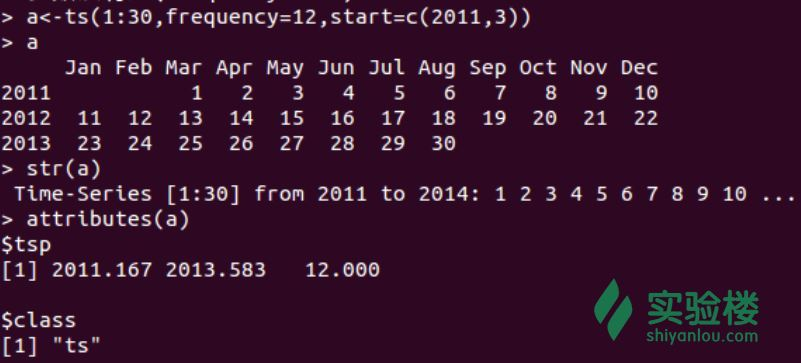
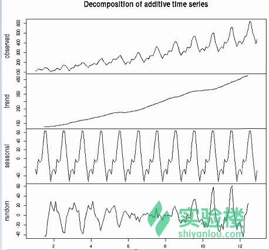
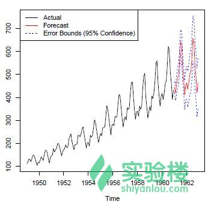
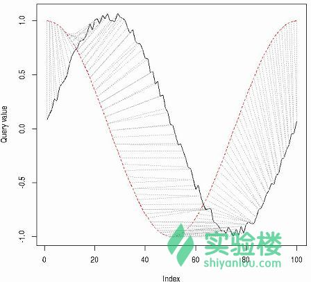
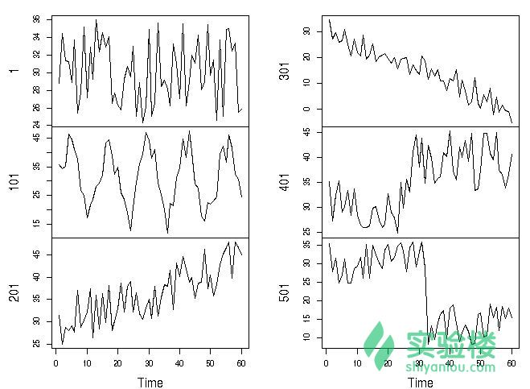
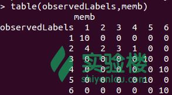
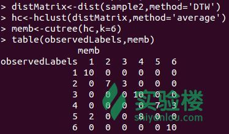
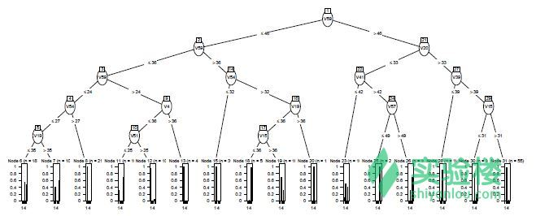
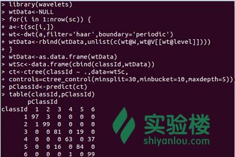
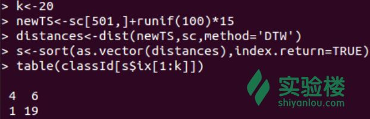

# 第 7 节 时间序列与数据挖掘

## 一、实验说明

### 1\. 环境登录

无需密码自动登录，系统用户名 shiyanlou

### 2\. 环境介绍

本实验环境采用带桌面的 Ubuntu Linux 环境，实验中会用到：

1.  LX 终端（LXTerminal）: Linux 命令行终端，打开后会进入 Bash 环境，可以使用 Linux 命令
2.  GVim：非常好用的编辑器，最简单的用法可以参考课程[Vim 编辑器](http://www.shiyanlou.com/courses/2)
3.  R:在命令行输入‘R’进入交互式环境，下面的代码都是在交互式环境运行
4.  数据：本节实验会用到 symthetic_control，需先进行下载：

```r
# 下载数据
wget http://labfile.oss.aliyuncs.com/courses/360/synthetic_control.tar.gz   
# 解压数据到当前文件夹
tar zxvf synthetic_control.tar.gz 
```

### 3\. 环境使用

使用 R 语言交互式环境输入实验所需的代码及文件，使用 LX 终端（LXTerminal）运行所需命令进行操作。

实验报告可以在个人主页中查看，其中含有每次实验的截图及笔记，以及每次实验的有效学习时间（指的是在实验桌面内操作的时间，如果没有操作，系统会记录为发呆时间）。这些都是您学习的真实性证明。

## 二、课程介绍

1.  R 中的时间序列数据
2.  将时间序列分解为趋势型、季节型以及随机型
3.  在 R 中构建[ARIMA 模型](https://zh.wikipedia.org/wiki/ARIMA%E6%A8%A1%E5%9E%8B)，并用其预测未来数据
4.  介绍[动态时间规划（DTW）](http://baike.baidu.com/link?url=5fZtosd6BVb4QamzBdfOgn7_qFhKj9mWjUJM372_r2kKJitFdQRqNPqsqQKHtNcl1PBZfaOzSDnNXQ5H1CjGBa)，然后使用 DTW 距离以及[欧式距离](http://baike.baidu.com/view/1615257.htm)处理时间序列从而实现[层次聚类](http://baike.baidu.com/view/3063767.htm)。
5.  关于时间序列分类的三个例子：一个是使用原始数据，一个是使用经过[离散小波变换（DWT）](http://baike.baidu.com/view/587013.htm)后的数据，另外一个是[KNN 分类](https://zh.wikipedia.org/wiki/%E6%9C%80%E8%BF%91%E9%84%B0%E5%B1%85%E6%B3%95)。

## 三、课程内容

### 1、R 中的时间序列数据

使用 ts 这个类可以抽取等时间距离的样本，当参数 frequency=7 的时候说明选取样本的频率单位是周（7 天），以此类推，频率为 12 和 4 分别生成月度和季度数据。具体实现如下：

```r
# 生成 1-30 的整数，频率是 12 也就是月度数据，从 2011 年 3 月开始
> a <- ts(1:30, frequency=12, start=c(2011,3))
> print(a)
# 转换为字符串型
> str(a)
# 输出该时间序列的属性
> attributes(a) 
```

执行结果如下：



### 2、时间序列分解

时间序列分解就是将时间序列按趋势性、季节性、周期性和不规则性依次分解。其中，趋势部分代表的是长期趋势，季节性指的是时间序列数据呈现季节性波动，周期性指的是指数据呈现周期性波动，不规则部分就是[残差](http://baike.baidu.com/view/1006910.htm)。

下面讲解一个关于时间序列分解的例子，使用的数据 AirPassengers 由 Box & Jenkins 国际航班从 1949 年到 1960 年的乘客数据组成。里面有 144 个观测值。

```r
> plot(AirPassengers)
# 将数据预处理成月度数据
> apts <- ts(AirPassengers, frequency=12)
# 使用函数 decompose()分解时间序列
> f <- decompose(apts)
# 季度数据
> f$figure
> plot(f$figure, type="b", xaxt="n", xlab="")
# 使用当前的时间区域给月份赋予名称
> monthNames <- months(ISOdate(2011,1:12,1))
# 使用月份名称标记 x 轴
# side=1 表示设置 x 轴，at 指的是范围从 10-12，las 表示分割的单位刻度为 2
> axis(1, at=1:12, labels=monthNames, las=2)
> plot(f) 
```

结果如下：



上图中，`observed`标注的表表示原始的时间序列分布图，往下第二个图是显示数据的呈现上升趋势图，第三个季节图显示数据受一定的季节因素影响，最后一个是在移除趋势和季节影响因素后的图。

**思考：**R 里面还有哪些包，哪些函数可以实现时间序列的分解，并试着使用那些函数实现分解，并将分解结果进行对比。

### 3、时间序列预测

时间序列预测就是基于历史数据预测未来事件。一个典型的例子就是基于股票的历史数据预测它的开盘价。在时间序列预测中有两个比较经典的模型分别是：自回归移动平均模型（ARMA）和差分整合移动平均自回归模型（ARIMA）。

下面使用单变量时间序列数据拟合 ARIMA 模型，并用该模型预测。

```r
# 参数 order 由（p,d,q）组成，p=1 指的是自回归项数为 1，list 内容是季节 seasonal 参数
> fit <- arima(AirPassengers, order=c(1,0,0), list(order=c(2,1,0), period=12))
# 预测未来 24 个月的数据
> fore <- predict(fit, n.ahead=24)
# 95%的置信水平下的误差范围（U,L）
> U <- fore$pred + 2*fore$se
> L <- fore$pred - 2*fore$se
# col=c(1,2,4,4)表示线的颜色分别为黑色，红色，蓝色，蓝色
# lty=c(1,1,2,2)中的 1，2 指连接点的先分别为实线和虚线
> ts.plot(AirPassengers, fore$pred, U, L, col=c(1,2,4,4), lty = c(1,1,2,2))
> legend("topleft", c("Actual", "Forecast", "Error Bounds (95% Confidence)"),col=c(1,2,4), lty=c(1,1,2)) 
```

预测结果如下：



### 4、时间序列聚类

时间序列聚类就是基于密度和距离将时间序列数据聚类，因此同一个类里面的时间序列具有相似性。有很多衡量距离和密度的指标比如欧式距离、[曼哈顿距离](https://zh.wikipedia.org/wiki/%E6%9B%BC%E5%93%88%E9%A0%93%E8%B7%9D%E9%9B%A2)、最大模、[汉明距离](https://zh.wikipedia.org/wiki/%E6%B1%89%E6%98%8E%E8%B7%9D%E7%A6%BB)、两个向量之间的角度（[内积](http://www.baike.com/wiki/%E5%86%85%E7%A7%AF)）以及动态时间规划（DTW）距离。

#### 4.1 动态时间规划距离

动态时间规划能够找出两个时间序列的最佳的对应关系，通过包'dtw'可以实现该算法。在包`dtw`中，函数 dtw(x,y,...)计算动态时间规划并找出时间序列 x 与 y 之间最佳的对应关系。

代码实现：

```r
> library(dtw)
# 平均生成 100 个在 0-2*pi 范围的序列 idx
> idx <- seq(0, 2*pi, len=100)
> a <- sin(idx) + runif(100)/10
> b <- cos(idx)
> align <- dtw(a, b, step=asymmetricP1, keep=T)
> dtwPlotTwoWay(align) 
```

a 与 b 这两个序列的最佳对应关系如下图所示：



#### 4.2 合成控制图的时间序列

合成控制图时间序列数据集`synthetic_control.data`存放于当前工作目录`/home/shiyanlou`下，它包含 600 个合成控制图数据，每一个合成控制图都是由 60 个观测值组成的时间序列，那些合成控制图数据被分为 6 类：

*   1-100：正常型；
*   101-200：周期型；
*   201-300：上升趋；
*   301-400：下降趋势；
*   401-500：上移；
*   401-600：下移。

首先，对数据进行预处理：

```r
> sc <- read.table("synthetic_control.data", header=F, sep="")
# 显示每一类数据的第一个样本观测值
> idx <- c(1,101,201,301,401,501)
> sample1 <- t(sc[idx,]) 
```

合成控制图时间序列样本数据分布如下：



#### 4.3 使用欧式距离层次聚类

首先从上面的合成控制图每一类数据中随机选取 10 个样本进行处理：

```r
> set.seed(6218)
> n <- 10
> s <- sample(1:100, n)
> idx <- c(s, 100+s, 200+s, 300+s, 400+s, 500+s)
> sample2 <- sc[idx,]
> observedLabels <- rep(1:6, each=n)
# 使用欧式距离层次聚类
> hc <- hclust(dist(sample2), method="average")
> plot(hc, labels=observedLabels, main="")
# 将聚类树划分为 6 类
> rect.hclust(hc, k=6)
> memb <- cutree(hc, k=6)
> table(observedLabels, memb) 
```

聚类结果与实际分类对比：



```r
 图 4.1 
```

图 4.1 中，第 1 类聚类正确，第 2 类聚类不是很好，有 1 个数据被划分到第 1 类，有 2 个数据划分到第 3 类，有 1 个数据划分到第 4 类，且上升趋势（第 3 类）和上移（第 5 类）并不能很好的被区分，同理，下降趋势（第 4 类）和下移（第 6 类）也没有被很好的被识别。

#### 4.4 使用 DTW 距离实现层次聚类

实现代码如下：

```r
> library(dtw)
> distMatrix <- dist(sample2, method="DTW")
> hc <- hclust(distMatrix, method="average")
> plot(hc, labels=observedLabels, main="")
> rect.hclust(hc, k=6)
> memb <- cutree(hc, k=6)
> table(observedLabels, memb) 
```

聚类结果如下：



```r
 图 4.2 
```

对比图 4.1 和 4.2 可以发现，由后者的聚类效果比较好可看出在测量时间序列的相似性方面，DTW 距离比欧式距离要好点。

### 5、时间序列分类

时间序列分类就是在一个已经标记好类别的时间序列的基础上建立一个分类模型，然后使用这个模系去预测没有被分类的时间序列。从时间序列中提取新的特征有助于提高分类模系的性能。提取特征的方法包括[奇异值分解（SVD）](https://zh.wikipedia.org/wiki/%E5%A5%87%E5%BC%82%E5%80%BC%E5%88%86%E8%A7%A3)、[离散傅里叶变化（PFT）](https://zh.wikipedia.org/wiki/%E7%A6%BB%E6%95%A3%E5%82%85%E9%87%8C%E5%8F%B6%E5%8F%98%E6%8D%A2)、[离散小波变化（DWT）](https://zh.wikipedia.org/wiki/%E9%9B%A2%E6%95%A3%E5%B0%8F%E6%B3%A2%E8%AE%8A%E6%8F%9B)和[分段聚集逼近（PAA）](http://www.jos.org.cn/ch/reader/create_pdf.aspx?file_no=3951)。

#### 5.1 使用原始数据分类

我们使用包`party`中的函数 ctree()来给原始时间序列数据分类。实现代码如下：

```r
# 给原始的数据集加入分类标签 classId
> classId <- rep(as.character(1:6), each=100)
> newSc <- data.frame(cbind(classId, sc))
> library(party)
> ct <- ctree(classId ~ ., data=newSc,controls = ctree_control(minsplit=30, minbucket=10, maxdepth=5))
> pClassId <- predict(ct)
> table(classId, pClassId)
# 计算分类的准确率
> (sum(classId==pClassId)) / nrow(sc)
> plot(ct, ip_args=list(pval=FALSE),ep_args=list(digits=0)) 
```

输出决策树：



#### 5.2 提取特征分类

接下来，我们使用 DWT（离散小波变化）的方法从时间序列中提取特征然后建立一个分类模型。[小波变换](http://baike.baidu.com/view/586841.htm)能处理多样变化的频率数据，因此具有自适应性。

下面展示一个提取 DWT 系数的例子。离散小波变换在 R 中可以通过包`wavelets`实现。包里面的函数 dwt()可以计算离散小波的系数，该函数中主要的 3 个参数 X、filter 和 boundary 分别是单变量或多变量的时间序列数据、使用的小波过滤方式以及分解的水平，函数返回的参数有 W 和 V 分别指离散小波系数以及尺度系数。原始时间序列可以通过函数 idwt()逆离散小波重新获得。

```r
> library(party)
> library(wavelets)
> wtData <- NULL
# 遍历所有时间序列
> for (i in 1:nrow(sc)) {
+ a <- t(sc[i,])
+ wt <- dwt(X=a, filter="haar", boundary="periodic")
+ wtData <- rbind(wtData, unlist(c(wt@W, wt@V[[wt@level]])))
+ }
> wtData <- as.data.frame(wtData)
> wtSc <- data.frame(cbind(classId, wtData))
# 使用 DWT 建立一个决策树，control 参数是对决策树形状大小的限制
> ct <- ctree(classId ~ ., data=wtSc,controls = ctree_control(minsplit=30, minbucket=10, maxdepth=5))
> pClassId <- predict(ct)
# 将真实分类与聚类后的类别进行对比
> table(classId, pClassId) 
```



#### 5.3 [K-NN 分类](http://baike.baidu.com/view/1485833.htm)

K-NN 算法也可以用于时间序列的分类。算法流程如下：

*   找出一个新对象的 k 个最近邻居
*   然后观察该区域内拥有相同属性的数量最多的类代表该区域所属的类

但是，这种直接寻找 k 个最近邻居的算法[时间复杂度](https://zh.wikipedia.org/wiki/%E6%97%B6%E9%97%B4%E5%A4%8D%E6%9D%82%E5%BA%A6)为 O(n**2)，其中 n 是数据的大小。因此，当处理较大数据的时候就需要一个有效索引的方式。包'RANN'提供一个快速的最近邻搜索算法，能够将算法的时间复杂度缩短为 O(n log n)。 下面是在没有索引的情况下实现 K-NN 算法：

```r
> k <- 20
# 通过在第 501 个时间序列中添加噪声来创建一个新的数据集
> newTS <- sc[501,] + runif(100)*15
# 使用‘DTW’方法计算新数据集与原始数据集之间的距离
> distances <- dist(newTS, sc, method="DTW")
# 给距离升序排列
> s <- sort(as.vector(distances), index.return=TRUE)
# s$ix[1:k]是排行在前 20 的距离，表哥输出 k 个最近邻居所属的类
> table(classId[s$ix[1:k]]) 
```

输出结果如下：



由上图输出表格数据可知，20 个邻居中有 19 个数据都属于第 6 类，因此将该类时间序列划分到第六类时间序列中。

**思考**：经过学习这么多时间序列分类，请思考以上时间序列分类方法的利与弊。