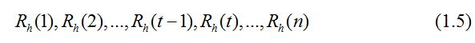

# 第 1 节 用时间序列预测股票收益

## 一、实验说明

### 1\. 环境配置

建议使用字符界面学习本次实验。在命令行输入下面的命令下载数据文件：

```r
wget http://labfile.oss.aliyuncs.com/courses/358/data.csv 
```

### 2\. 环境登录

无需密码自动登录，系统用户名 shiyanlou

### 3\. 环境介绍

本实验环境采用字符界面的 Ubuntu Linux 环境，主要用到：

1.  LX 终端（LXTerminal）: Linux 命令行终端，打开后会进入 Bash 环境，可以使用 Linux 命令。
2.  数据：来源于雅虎网站提供的 s&p500 指数的从 1970 年到 2009 年的历史数据`data.csv`。

>R 语言：R 是用于统计分析、绘图的语言和操作环境。R 是属于 GNU 系统的一个自由、免费、源代码开放的软件，它是一个用于统计计算和统计制图的优秀工具。

### 3\. 环境使用

直接在命令行输入`R`就可以进入 R 语言的交互式环境并编写代码，也可以通过编写脚本的形式例如将代码写入`test.r`这个脚本文件，在命令行输入 Rscript test.r 即可运行代码，为了方便解释函数的功能，本项目的代码全部在交互式环境中实现。

实验报告可以在个人主页中查看，其中含有每次实验的截图及笔记，以及每次实验的有效学习时间（指的是在实验桌面内操作的时间，如果没有操作，系统会记录为发呆时间）。这些都是您学习的真实性证明。

## 二、课程介绍

本课程翻译自《Data Mining with R: learning by case studies》的第三章——预测股市收益的部分内容，所有的代码都可以通过[官网](http://www.dcc.fc.up.pt/~ltorgo/DataMiningWithR/)下载。

建议在练习本项目之前学习[R 语言教程](https://www.shiyanlou.com/courses/27)以及[用 R 语言进行数据挖掘](https://www.shiyanlou.com/courses/360)。

>标准普尔 500 指数（英语：S&P 500，Standard & Poor's 500 index），又译为史坦普 500 指数，是一个由 1957 年起记录美国股市的平均记录，观察范围达美国的 500 家上市公司。

本项目使用`s&p500`来代表股票市场，并试图建立一个基于每天股票行情数据的股票预测模型。我们将使用不同的模型来预测未来的股票行情，将预测的结果与实际的交易规则相结合，从而发现其中的买卖信号。

#### 项目的知识点：

（1）学习如何用 R 语言处理股票数据

（2）学习如何解决时间序列问题

（3）学习如何建立股票交易模型并获取交易信号

## 三、时间序列预测

本项目中研究的`s&p500`数据就是一组[时间序列](http://baike.baidu.com/link?url=J5zL3tsp6y1waA_FvrnqUzK82w88uLE9mHRx3UVL3f5MS0z1Fa575vNF5hdXJwwbVqfBexLpe4uk3QssMFvAua)数据，这类数据的特点是每一个观测值都是以时间为顺序排列的数字，也就是说它是一组变量 Y 的时间序列观测值：


其中， yt 是序列变量 y 在 t 时刻的值。

时间序列分析的主要目标是以过去的观测值来建立一个模型并预测未来的观测值。在这次项目中研究的股票数据通常被称为多元时间序列，因为我们有多个变量在同一时间被记录，它们分别是[开盘价](http://baike.baidu.com/link?url=18Dx00dI64VzpXCgC_cAFV-G5xLKZAmG5HnZsApD94UJVcsWrPPT0yDRO2ogpAsnb8I641qpNvA5gnJmLby3Ta)(Open)，[最高价](http://baike.baidu.com/view/73508.htm)(High)，[最低价](http://baike.baidu.com/view/170008.htm)(Low)，[收盘价](http://baike.baidu.com/link?url=D7x1WHfz88hRcXGHgXZUeyUicchta6oCdHx8Uw1yD72fXCaBGBCG0ovkLGVka0DG5LONtDBbOjAnNASn2UgX1a)(Close)和[成交量](http://baike.baidu.com/view/34979.htm)(Volume)。我们将会利用这些多元变量的数据建立模型，本例是利用单个时间序列数据建立模型。

在金融时间序列分析中，一般是把重点放在预测一个风险比较低的收盘价上面，另外，为了避免趋势的影响，采用收盘价的增长率（或者对数比）作为基本的时间序列建模，而不是仅仅是取它的绝对值。下面我们将定义两个备选目标向量:


我们将会采用公式(1.2)，因为它对用户来说有一个更直观的解释。接下来，我们将集中建立一个由关于收盘价 t 阶差分的移动 h 天增长率的时间序列模型:


总而言之，我们的时间序列数据将由以下观测值组成:



用 R 语言定义一个函数，得到延迟 h 阶的收盘价格增长率（也叫收益率）向量（以一只股票的收盘价为例）

```r
# 加载‘data.csv’数据文件
> ibm <- read.csv(‘data.csv’,header=T)
# 创建一个函数 h.returns，有两个参数一个是向量 x 和延迟时间 h，h 的初始值为 1
> h.returns <- function(x,h=1) {
# diff 函数是取 x 的 h 阶差分，diff(x,lag=h)=x(t)-x(t-lag)
+ diff(x,lag=h)/x[1:(length(x)-h)]
+} 
```

接下来我们将使用 h.returns()函数生成一组数据集，用来建立一个预测‘s&p500’的收盘价在未来 h 天的增值率模型。最常用的方法就是使用距离最近的过去时间序列数据作为模型的输入变量观测值从而获得一组未来的时序数据。因此我们的模型将尝试根据最近一段时间的收盘价增长率预测 h 天的增长率，这种数据预测方法通常被称为时间延迟嵌入法。

函数 embed()就是被用来创建一系列时间序列嵌入的数据框，以下例子将会阐述该函数的用法（输入代码的过程中可以通过键盘中的上下箭头显示重复使用的代码）：

```r
> embed(c(45,677,34,2,-76,-23,0,45,-3445),dim=5) 
```

输出结果如下：


根据以上函数的结果显示可知，我们可以使用参数 dim 来设置嵌入的大小或者维度，从而将一个向量转换成一个 dim 维的矩阵。

将 embed()函数与我们之前已经定义好的函数 h.returns()一起使用就可以建立一个新的函数 embeded.dataset()，用来生成存储延迟一阶嵌入 10 维的收盘价增长率矩阵的数据框：

```r
#定义 embeded.dataset 函数，hday 是延迟阶数，emb 是嵌入的维数
> embeded.dataset <- function(data,quote=’Close’,hday=1,emb=10) {
# 将 1 阶差分后的收盘价增长率向量嵌入 11 维返回成一个矩阵给 ds
+ ds <- data.frame(embed(h.returns(data[,quote],h=hday), emb+hday))
+ ds <- ds[,c(1,(1+hday):(hday+emb))]
# 定义列名，分别是延迟 1 阶的向量，和延迟 1 阶嵌入 1-10 维的向量
+ names(ds) <- c(paste(’r’,hday,’.f’,hday,sep=""),
+ paste(’r’,hday,’.t’,0:(emb-1),sep=""))
+ ds$Date <- data[(hday+emb):(nrow(data)-hday),’Date’]
+ ds
+ }
> ibm.data <- embeded.dataset(ibm,hday=1) 
```

### 3.1 建立时间序列模型

由数据框 ibm.data 可知，我们可以使用[多元回归](http://baike.baidu.com/view/1536255.htm)方法来建立一个鉴于过去数据预测未来收益的模型，在此之前需要研究一下该数据框的属性。

下图显示的是收盘价 1 阶差分、嵌入 1 维的增长率向量[箱型图](http://baike.baidu.com/view/1376547.htm)，代码如下：

```r
# r1.f1 指的是收盘价延迟 1 阶、嵌入 1 维的增长率
> boxplot(ibm.data$r1.f1,boxwex=0.15,ylab=’1-day returns of Closing price’)
> rug(jitter(ibm.data$r1.f1),side=2) 
```

显示结果：


由上图可知，数据存在对称的长拖尾（离群点非常多），大部分的数据都在向外发散。

由于我们的数据集是用先前的 h 天的增长率信息作为预测时间序列下一个数据的依据，这里可以使用自回归方法来进一步观察数据，ACF 函数在默认情况下绘制一个时间延迟的变量自相关图。

```r
> acf(ibm.data$r1.f1,main=’’,ylim=c(-0.1,0.1)) 
```

显示结果：


上图显示的是变量`r1.f1`的自相关图。虚线部分表示 95%的置信区间的自相关系数的临界值，由上图可得，有显著的相关系数的值很少，因此并不能很好的作为预测变量`r1.f1`的条件，但是自相关指的是线性相关，因为我们在本次项目中并不使用线性相关，所以这里的线性相关图仍然能带来有用利的信息，上图中给出的一个很重要的信息就是建模中需要关注的变量个数。

分析过后，我们增加变量个数，使用一阶差分后的嵌入 24 维的时间序列：

```r
> ibm.data <- embeded.dataset(ibm,hday=1,emb=24)
> acf(ibm.data$r1.f1,main=’’,ylim=c(-0.1,0.1)) 
```

结果表明，虽然有部分自相关系数的值比较明显，但是总体上仍然很小（相关系数越远离 0 表示相关关系越明显）。

#### **模型一、神经网络**

>神经网络是一种运算模型，由大量的节点（或称“神经元”，或“单元”）和之间相互联接构成。每个节点代表一种特定的输出函数，称为激励函数。每两个节点间的连接都代表一个对于通过该连接信号的加权值，称之为权重（weight），这相当于人工神经网络的记忆。网络的输出则依网络的连接方式，权重值和激励函数的不同而不同。而网络自身通常都是对自然界某种算法或者函数的逼近，也可能是对一种逻辑策略的表达。

我们尝试建立一个提前一天预测收盘价收益行情的模型——神经网络，神经网络是金融预测中最常使用的模型，因为它能很好的解决非线性问题，包`nnet`是 R 中最常使用的神经网络工具。

现在我们将会阐述如何在 R 语言中建立神经网络模型从而进行预测。为了实现这个目标，需要将数据分为训练集和测试集，以 1990 年为分水岭分别取前 20 年的数据（1970 年到 1990 年初）和剩下的 20 年数据（1990 年到 2009 年底）。

```r
# 将数字类型数据转换成字符型再转化成合格的日期类型
> ibm.data$Date = as.Date(as.character(ibm.data$Date),format=”%d/%m/%Y”) 
# 训练集
> ibm.train <- ibm.data[ibm.data$Date < ’1990-01-01’,] 
# 测试集
> ibm.test <- ibm.data[ibm.data$Date > ’1989-12-31’,] 
```

为了使用使用 nnet()函数获得一个神经网络模型预测 1 天的数据，使用如何代码：

```r
> library(nnet)
# r1.f1 ~.指的是 r1.f1 这个因变量与 ibm.train 中其他所有自变量之间的公式关系
# -ncol(ibm.train)指的是除了 r1.f1 这一列的数据以外，其他变量都需要计算到神经网络模型中
> nn <- nnet(r1.f1 ~.,data=ibm.train[,-ncol(ibm.train)],
+ linout=T,size=10,decay=0.01,maxit=1000) 
```

神经网络模型输出如下：


在本例中该函数将建立一个由 10 个隐藏单元（参数 size）组成单隐层的神经网络。此外，权数将会以 0.01 的速度更新（参数 decay），参数 liout=T 是指目标变量是连续的，maxit 这个参数是指权重收敛算法中最大迭代次数为 1000。请注意我们已经删除了 ibm.data 这个数据集的最后一列数据也就是时间，该信息是在本次案例中是无关的，除非是研究季节等时间效应。

nnet()这个函数创建了一个连接 10 个隐藏单元以及 24 个输入单元的神经网络（本例中的预测变量数量），这些单元将会被合并连接到单个输出单元并产生 261 个连接。

```r
# 得出连接上的权重
> summary(nn)  
# 神经网络 nn 可以用来对测试集进行预测
> nn.preds <- predict(nn,ibm.test)  
# 画出真实值与预测值之间的分布图
> plot(ibm.test[,1],nn.preds,ylim=c(-0.01,0.01),
+ main=’Neural Net Results’,xlab=’True’,ylab=’NN predictions’)
> abline(h=0,v=0); abline(0,1,lty=2) 
```

输出结果如下：


在后面的章节中将会讨论如何评价时间序列模型，显然上图的点如果是在虚线上将会是最好的结果，这代表了预测值与真实值之间的零误差。

深度学习神经网络请参考[《Neural Networks for Time Series Prediction》。](http://www.cs.cmu.edu/afs/cs/academic/class/15782-f06/slides/timeseries.pdf)

#### ** 模型二、投影寻踪回归**

让我们尝试使用另一个多元回归方法—— 投影寻踪回归。

>投影寻踪是处理和分析高维数据的一类新兴的统计方法，其基本思想是将高维数据投影到低维（1～3 维）子空间上，寻找出反映原高维数据的结构或特征的投影，以达到研究和分析高维数据的目的。

我们可以通过以下代码建立这个模型：

```r
> pp <- ppr(r1.f1 ~ ., data=ibm.train[,-ncol(ibm.train)],nterms=5)
> pp.preds <- predict(pp,ibm.test) 
```

我们可以使用 ppr()函数建立一个投影寻踪回归模型。这个函数有一些参数。参数 nterms 设置变量的不同线性组合的数量，也可以使用参数 max.terms 来设置线性组合的最大组合数量。再添加最大组合数量以后，系统会通过移除较差线性组合来获得组合数量为 nterm 的模型。

同样，使用函数 predict 来获得模型的预测值。可以通过以下输入来查看线性组合情况：

```r
summary(pp) 
```

输出结果部分截图如下：


从上面的 summary()函数的输出结果中的组合系数可以看出，ppr()建立的模型中的线性组合数有 5 个，可以通过变量的系数和线性组合的系数得出模型。

#### **模型三、多元自适应回归(MARS)**

最后，我们将使用多元自适应回归模型。这是添加型回归模型的另一个例子，该模型有点复杂，可以通过以下公式表达：


其中，第一个求和代表单一变量的求和，第二个求和是指添加第二个变量的求和,依次类推......

MARS 模型在 R 中可以通过包`mda`实现，下面的代码是使用训练集的数据建立 MARS 模型并用测试集进行预测：

```r
> library(mda)
> m <- mars(ibm.train[,2:10],ibm.train[,1])
> m.preds <- predict(m,ibm.test[,2:10]) 
```

不过，MARS 函数并不是严格遵从 R 的语法，实际上这个函数的第一个参数是一个包含输入变量的数据框，第二个参数是各自的目标变量。

### 3.2 评估时间序列模型

通常，我们会将可用的时间序列数据分割成不同的时间窗口，利用历史数据建立模型并利用后面的时间序列数据进行测试。在本例中，我们的数据是从 1970 年一直到 2009 年的股票历史数据，我们将会设置一个时间点 t 作为测试时间的开始。t 时间以前的数据将会用来得到一个预测模型，t 之后的数据只是用来测试。

我们需要的是一个评价模型的指标比如均方误差之类的，而归一化均方差也通常能很好的测量模型的误差，在时间序列分析中比较常用的指标是 Theil U coefficient（泰尔 U 系数），它是一个处理时间序列问题的归一化均方误差，我们将使用以下等式来调整我们的模型预测：


其中，代表 Y 在 t+h 这个时间点的预测值。

泰尔系数的定义如下：


其中，是提前 h 天的模型预测值，我们的目标是归一化均方——泰尔系数的值越小于 1 越好。

下面使用神经网络模型的预测值计算泰尔系数：

```r
> naive.returns <- c(ibm.train[nrow(ibm.train),1],
+ ibm.test[1:(nrow(ibm.test)-1),1])
> theil <- function(preds,naive,true) {
+ sqrt(sum((true-preds)²))/sqrt(sum((true-naive)²))
+ }
> theil(nn.preds,naive.returns,ibm.test[,1]) 
```

结果输出为：0.6928834。

一般在预测市场趋势的时候，我们比较关心的是预测的准确率比如第二天到底是上涨还是下跌。在这里将使用命中率来预测非零的收益，并且有正有负（代表预测市场的上涨和下跌的准确率），使用以下 R 代码得到这些指标：

```r
# 定义一个预测收盘价收益命中率函数
> hit.rate <- function(preds,true) {
+ length(which(preds*true > 0))/length(which(true != 0))
+ }
# 定义一个预测上涨的命中率
> positive.hit.rate <- function(preds,true) {
+ length(which(preds > 0 & true > 0))/length(which(true > 0))
+ }
# 定义一个预测下跌的负命中率
> negative.hit.rate <- function(preds,true) {
+ length(which(preds < 0 & true < 0))/length(which(true < 0))
+ }
> hit.rate(nn.preds,ibm.test[,1])
> positive.hit.rate(nn.preds,ibm.test[,1])
> negative.hit.rate(nn.preds,ibm.test[,1]) 
```

我们可以将上面的这些评价指标全部加入到以下函数的结构中：

```r
> timeseries.eval <- function(preds,naive,true) {
+ th <- sqrt(sum((true-preds)²))/sqrt(sum((true-naive)²))
+ hr <- length(which(preds*true > 0))/length(which(true != 0))
+ pr <- length(which(preds > 0 & true > 0))/length(which(true > 0))
+ nr <- length(which(preds < 0 & true < 0))/length(which(true < 0))
# 预测的收益不为零的数量
+ n.sigs <- length(which(preds != 0))
# 预测股票上涨的比例
+ perc.up <- length(which(preds > 0)) / n.sigs
# 预测股票下跌的比例
+ perc.down <- length(which(preds < 0)) / n.sigs
+ round(data.frame(N=length(true),Theil=th,HitRate=hr,PosRate=pr,NegRate=nr,
+ Perc.Up=perc.up,Perc.Down=perc.down),
+ 3)
+ } 
```

上面的代码中使用 round()函数来设置结果的显示形式。Perc.Up 和 Perc.Down 分别指模型中预测市场上涨或者下跌的比例。

在这个时间序列中，考虑的问题都是以年为单位，测试时间历尽 20 年，但是在金融背景下我们需要的是这段时间内的每年的市场趋势。可以通过以下代码实现：

```r
> annualized.timeseries.eval <- function(preds,naive,test) {
+ res <- timeseries.eval(preds,naive,test[,1])
+
+ years <- unique(substr(test[,’Date’],1,4))
+ for(y in years) {
+ idx <- which(substr(test[,’Date’],1,4)==y)
+ res <- rbind(res,timeseries.eval(preds[idx],naive[idx],test[idx,1]))
+ }
+
+ row.names(res) <- c(’avg’,years)
+ res
+}
> annualized.timeseries.eval(nn.preds,naive.returns,ibm.test) 
```

输出结果如下：


该函数告诉我们，神经网络的性能在这 20 年里面并不稳定，此外，根据这个表的结果我们可以清楚地观察到泰尔系数与命中率之间的不统一，例如泰尔系数在 2008 年表现较为乐观，这时候的命中率达到 46.0%，而泰尔系数较为差的时间在 1996 年，此时的命中率反而较高为 55.9%。

### 3.3 选择模型

前面的预测中已经有三个回归模型提前一天预测 s&p500 指数数据并且有了评价模型的指标，那么接下来就是选择一个合适的模型。

模型的选择需要考虑两个问题：

*   哪些数据应该作为训练集，哪些数据作为测试集？

*   为确保评估的可靠性，应该选择怎样的指标？

在 3.1 节和 3.2 节已经部分的回答了这两个问题，但是模型的选择不应该只是依赖于测试集，因为这样不够全面，因此我们打算将训练分为两个阶段，一个阶段用来作为模型的变量数据，另外一个阶段用来选出“最好”的模型。一旦选择结束，我们就可以使用所有的训练集用在“最好”的模型上。

先将前面的 20 年数据分为两个部分，第一部分由最初的 12 年（1970-1981）组成模型中的变量数据，第二部分是剩下 8 年（1982-1989）数据用来选择最佳模型。最后再次使用全部的 20 年数据来训练最佳模型，该模型就是我们整个数据挖掘过程的结果。

首先获取时间段：

```r
> first12y <- nrow(ibm.data[ibm.data$Date < ’1982-01-01’,])
# 训练模型的数据集
> train <- ibm.train[1:first12y,]
# 选择模型的数据集
> select <- ibm.train[(first12y+1):nrow(ibm.train),] 
```

尝试调节神经网络函数中的 size 和 decay 这两个参数。以下代码是尝试 size 和 decay 这两个参数的 12 种不同组合，并将均方差和命中率存储在数据框中：

```r
> res <- expand.grid(Size=c(5,10,15,20),
+ Decay=c(0.01,0.05,0.1),
+ MSE=0,
+ Hit.Rate=0)
# 利用上面的 12 种组合生成 12 种神经网络
> for(i in 1:12) {
+ nn <- nnet(r1.f1 ~ .,data=train[,-ncol(train)],linout=T,
+ size=res[i,’Size’],decay=res[i,’Decay’],maxit=1000)
+ nn.preds <- predict(nn,select)
+ res[i,’MSE’] <- mean((nn.preds-select[,1])²)
+ res[i,’Hit.Rate’] <- hit.rate(nn.preds,select[,1])
+ } 
```

expand.grid()函数用来生成不同因变量的所有组合，评估模型的指标可通过使用 annualized.timeseries.eval()这个函数算出，但是由于里面的参数变量的数量会对输出数据会有干扰，因此在本模型中我们试图使用两个统计量来评价模型，一个是回归精度，一个是市场准确率信号。前者不是之前使用的泰尔系数而是均方误差，因为前面已经用 20 年数据测试了这个指标，事实证明并不是很准确。

通过输入 res 查看最后的结果,如下图所示：


由上图可知，回归精度的结果波动不大（都是在 0.000123 处波动），最好的情况就是误差最小、命中率最高，根据上图结果可知倾向于选择 20 个隐藏单元和 0.1 的衰变率。

利用前 12 年的数据建立三个模型：

```r
> nn <- nnet(r1.f1 ~ .,data=train[,-ncol(train)],linout=T,size=20,decay=0.1,maxit=1000)
> nn.preds <- predict(nn,select)
> pp <- ppr(r1.f1 ~ ., data=train[,-ncol(train)],nterms=5)
> pp.preds <- predict(pp,select)
> m <- mars(train[,2:20],train[,1])
> m.preds <- predict(m,select[,2:20])
> naive.returns <- c(train[first12y,1],select[1:(nrow(select)-1),1]) 
```

接下来就是用后面的 8 年数据选择模型，分别输入以下命令，得出三个模型的评价结果：

```r
> annualized.timeseries.eval(nn.preds,naive.returns,select) 
```


```r
> annualized.timeseries.eval(pp.preds,naive.returns,select) 
```


```r
> annualized.timeseries.eval(m.preds,naive.returns,select) 
```


无论从哪个指标来看，神经网络模型在回归预测中显著的好于另外两个模型，但是这种模型并不能给予一个很好的预测市场信号。实际上，神经预测模型能够很好的预测好的市场行情，并且可以通过 MARS 模型预测市场的交易信号。但是我们仍然需要把这些有价值的信息应用在市场交易中。

### 3.4 从预测到交易行为

这一节的目的是基于前面已经建立好的数据挖掘模型来建立一个股票交易系统，因此最终的模型将通过这个系统的输出结果评估。

建立这个系统的第一步是将预测市场的信号转化为实际的交易行为。这些行为主要是：购买、出售或者持有。考虑到数据的局限性，我们不能做出日内交易的策略。因此，我们决定在每天的市场交易结束后做出决策并在第二天开盘前公开我们的交易行为。

下面的代码将是使用阈值化方法产生的交易信号矢量来预测市场变化：

```r
> buy.signals <- function(pred.ret,buy=0.05,sell=-0.05) {
+ sig <- ifelse(pred.ret < sell,’sell’,
+ ifelse(pred.ret > buy,’buy’,’hold’))
+ factor(sig,levels=c(’sell’,’hold’,’buy’))
+ } 
```

通过上面的函数 buy.signals()可以用来产生一系列上面建立的三个模型预测结果的交易信号。

## 四、评价交易信号

我们可以将系统给出的交易信号与实际的市场趋势进行对比来检查交易行为。下面将会选择一个周期的数据将实际市场趋势与 MARS 模型预测结果进行对比。

```r
> mars.actions <- buy.signals(m.preds,buy=0.01,sell=-0.01)
> market.moves <- buy.signals(select[,1],buy=0.01,sell=-0.01)
> table(mars.actions,market.moves) 
```

输出结果如下：


我们使用函数 table()以获得一个列联表，该表可以显示我们按照模型预测采取的行动与市场实际的走势对比。我们可以看到，在 26（=8+11+7）个卖出行为中,市场上只有 8 个相对应的实际股票卖出行为。而在总共 26 个场合下，实际上有 11 个可能是可以持有股票的，有 7 个可能是可以买入股票，说明此时的股市很好，有上涨的空间，如果此时我们根据模型的预测在这 26 个场合下都是卖出股票，那么我们将可能失去钱或者说不能获得更大的利益！但是，这些预测至少让我们更多的了解市场趋势，因为它也是根据每个正确（或不正确）的猜测得出的相关观察量。这意味着即使我们对市场走势的命中率不是很好，我们仍然可能赚钱。下面的两个函数将为我们提供关于交易信号更多的信息：

```r
# 定义一个函数计算交易行为的准确率，不同行为的数量，以及买卖信号的平均收益比
> signals.eval <- function(pred.sig,true.sig,true.ret) {
+ t <- table(pred.sig,true.sig)
+ n.buy <- sum(t[’buy’,])
+ n.sell <- sum(t[’sell’,])
+ n.sign <- n.buy+n.sell
+ hit.buy <- round(100*t[’buy’,’buy’]/n.buy,2)
+ hit.sell <- round(100*t[’sell’,’sell’]/n.sell,2)
+ hit.rate <- round(100*(t[’sell’,’sell’]+t[’buy’,’buy’])/n.sign,2)
+ ret.buy <- round(100*mean(as.vector(true.ret[which(pred.sig==’buy’)])),4)
+ ret.sell <- round(100*mean(as.vector(true.ret[which(pred.sig==’sell’)])),4)
+ data.frame(n.sess=sum(t),acc=hit.rate,acc.buy=hit.buy,acc.sell=hit.sell,
+ n.buy=n.buy,n.sell=n.sell,ret.buy=ret.buy,ret.sell=ret.sell)
+ }
# 计算每年的所得数据
> annualized.signals.results <- function(pred.sig,test) {
+ true.signals <- buy.signals(test[,1],buy=0,sell=0)
+ res <- signals.eval(pred.sig,true.signals,test[,1])
+ years <- unique(substr(test[,’Date’],1,4))
+ for(y in years) {
+ idx <- which(substr(test[,’Date’],1,4)==y)
+ res <- rbind(res,signals.eval(pred.sig[idx],true.signals[idx],test[idx,1]))
+ }
+ row.names(res) <- c(’avg’,years)
+ res
+ }
> annualized.signals.results(mars.actions,select) 
```

显示结果如下：


从上面的显示结果可以发现，交易信号并不能很准确的预测市场行为（买入行为竟然有负值，卖出行为也存在正值！除了 1983 年的预测较为理想以外）。

如果我们把这个评价函数应用到投影寻踪法和神经网络预测上，将会得到以下结果：

```r
> annualized.signals.results(buy.signals(pp.preds,buy=0.01,sell=-0.01),select) 
```


```r
> annualized.signals.results(buy.signals(nn.preds,buy=0.01,sell=-0.01),select) 
```


结果再次显示不好的结果，神经网络都没有产生任何交易信号。

## 五、总结

数据挖掘是一个循环过程。不同的数据挖掘步骤通常用来反馈并改善整体性能。通过该项目的不太令人满意的交易表现可知，我们需要尝试循环我们的数据挖掘过程，以提高预测性能。所以通过获取收盘价比率的滞后值预测第二天的收益显然是不够准确的去预测非线性域中的股票报价。因此，我们需要丰富我们的数据类型来改进我们的模型（比如引入移动平均价格等），后面的课程中将会研究股市模型中的一些有用的技术指标。