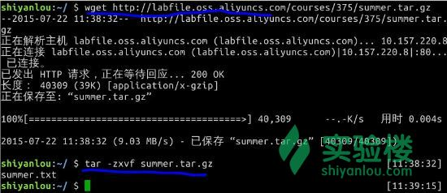
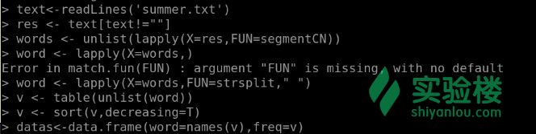
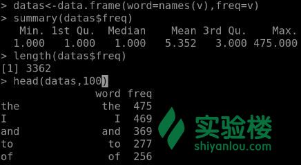
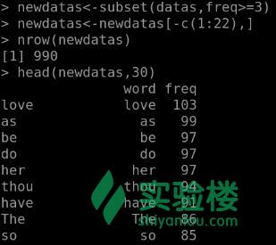
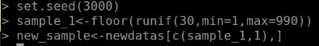

# 第 1 节 绘制文字云

## 一、实验说明

### 1\. 环境登录

无需密码自动登录，系统用户名 shiyanlou

### 2\. 环境介绍

本实验环境采用带桌面的 Ubuntu Linux 环境，实验中会用到程序：

1.  LX 终端（LXTerminal）: Linux 命令行终端，打开后会进入 Bash 环境，可以使用 Linux 命令
2.  GVim：非常好用的编辑器，最简单的用法可以参考课程[Vim 编辑器](http://www.shiyanlou.com/courses/2)
3.  R:在命令行输入‘R’进入交互式环境，下面的代码都是在交互式环境运行。

### 3\. 环境使用

使用 R 语言交互式环境输入实验所需的代码及文件，使用 LX 终端（LXTerminal）运行所需命令进行操作。

实验报告可以在个人主页中查看，其中含有每次实验的截图及笔记，以及每次实验的有效学习时间（指的是在实验桌面内操作的时间，如果没有操作，系统会记录为发呆时间）。这些都是您学习的真实性证明。

## 二、课程介绍

本次项目课是在学习了[R 语言教程](https://www.shiyanlou.com/courses/27)、[用 R 语言进行数据挖掘](https://www.shiyanlou.com/courses/360)之后的又一个项目课练习。主要学习使用分词包`Rwordseg`对莎士比亚的名著[《仲夏夜之梦》](http://baike.baidu.com/subview/110602/7716322.htm)中的内容进行单词频数统计，提取关键词，并进行数据清洗，最后使用包`wordcloud`根据关键词出现的频数对该书绘制标签云图，从而在一定程度上了解名著。

## 三、课程内容

>“文字云”也称“词云”就是对网络文本中出现频率较高的“关键词”予以视觉上的突出，形成“关键词云层”或“关键词渲染”，从而过滤掉大量的文本信息，使浏览网页者只要一眼扫过文本就可以领略文本的主旨。

### 1、环境准备

**数据准备**

在命令行终端输入以下命令行，并解压文件：

```r
# 下载 summer 压缩包
$ wget http://labfile.oss.aliyuncs.com/courses/375/summer.tar.gz
# 解压文件
$ tar -zxvf summer.tar.gz 
```



解压后的`summer.txt`文档就是本次项目使用的数据，是莎士比亚的名著《仲夏夜之梦》的英文电子档。

**R 的逻辑包准备**

项目中需要用到的分词包`Rwordseg`用于对文本中的词进行频数统计 ，该包是 R 中的中文分词包，这里面用于英文文档的提取是因为文本挖掘包`tm`运行环境在 R-3.1.0 以上，而实验楼 ubuntu 系统自带的 R 版本比较低。因此，在英文单词比较少的情况下，使用中文分词包同样可以达到比较好的分词效果。

`Rwordseg`包依赖于`rJava`包，并且需要预装好 java 环境，以及[java 环境变量的配置](http://www.cnblogs.com/samcn/archive/2011/03/16/1986248.html)。

首先，安装`rJava`方法如下：

由于网络原因配置 R 安装包的 CRAN 源,将下面内容添加到/usr/lib/R/etc/Rprofile.site

```r
# set a CRAN mirror  
 local({r <- getOption("repos")  
       r["CRAN"] <- "http://mirrors.aliyuncs.com/CRAN/"  
       options(repos=r)}) 
```

安装`rJava`:

```r
# 进入 R 语言环境
$ sudo R
# 安装 rJava 包
> install.packages('rJava') 
```

具体的从本地安装 Rwordseg 包的流程如下：

```r
# 下载 Rworgseg 的安装包
$ wget http://labfile.oss.aliyuncs.com/courses/375/Rwordseg_0.2-1.tar.gz
# 解压
$ gunzip Rwordseg_0.2-1.tar.gz
# 进入 R 语言的交互式环境
$ sudo R
# 从本地安装逻辑包
> install.packages('Rwordseg_0.2-1.tar',repos=NULL,type='source') 
```

### 2、数据清洗

英文中很多单词并没有实际上的关键词作用，例如冠词`the`、人称代词`he`等单词并不能指向实际的意义，它们只是构成一句话的语法组成元素，那么这一类的词就需要被剔除，被清洗，这就是数据清洗，清洗对文本关键词提取没有影响的单词。

**文本分词**

分词在英文中就是单词或者词组（本文主要是单词），一个单词在文中出现的频率越高就越证明它在文章中占有的地位，也就是关键字。其中文本分词包`Rwordseg`用于提取单词。

下面使用`Rwordseg`对文档进行分词统计（输入`?function`可以查询函数的具体使用方法）：

```r
# 加载包
> library(Rwordseg)
# 以字符串形式读入文本
> text<-readLines('summer.txt')
# 清除所有空字符串的行
> res <- text[text!=""]
# 使用 segmentCN 函数对字符串 res 进行分词归类
> words <- unlist(lapply(X=res,FUN=segmentCN))
# 以空字符串为分隔符对字符串分割并对每个单词位置进行赋值
> word <- lapply(X=words,FUN=strsplit," ")  
# 计算每个单词的频数
> v <- table(unlist(word))
# 按照单词出现的频数（词频）降序排列
> v <-sort(v,decreasing=T)
# 将数据存储为数据框的形式，数据由单词和对应的频数组成
> datas <- data.frame(word=names(v),freq=v) 
```



**数据预处理**

数据预处理就是噪声数据清除。首先，观察数据集的分布：

```r
> summary(datas$freq)
> length(datas$freq)
> head(datas,100) 
```

结果显示部分截图如下：



由上图中 summary 函数的输出结果可知，频数的分布并不均匀，中位数为 1，说明文中有一半左右的单词都只是出现了一次而已，单词出现一次的可以忽略不计，且第 3 分位数为 3，也就是说 3362 个单词中，关键词主要分布在频数为 3-475 的单词中，因此需要将数据集中频数比较低的数据剔除。

观察 head 函数的运行结果，频数排名前 22 的单词均是冠词、人称代词、连接词、介词之类与文章内容无关的单词，从第 23 个开始，与文章有关的单词才开始出现，因此需要将这一类组成英文句子语法结构的单词剔除。

首先，使用 subset 函数实现数据集的初步筛选，剔除频数低的单词（关于 subset 函数的使用可以输入`?subset`查看函数文档）。再剔除与文章无关的单词

```r
# 使用 sunset 函数选取关键词分布区域
> newdatas <- subset(datas,freq>=3)
# 剔除与文章无关的单词
> newdatas <- newdatas[-c(1:22),]
> nrow(newdatas)
> head(newdatas,30) 
```



由 length 函数的输出结果可知，清洗数据后保留了 990 个单词，由于初次清洗后的数据集仍然比较大，而且根据 head 函数查看排名前 30 的数据中仍然有很多与文章内容无关的单词，因此需要抽样；但是剔除这些单词，观察一些大写的单词：LYSANDER、HERMIA、BOTTOM、THESEUS 这些专有名词都是需要关注的关键词，可能是人名或者地名。

```r
# 设置随机种子
> set.seed(3000)
# 抽样后使用 floor 函数对抽样结果取整
> sample_1 <- floor(runif(30,min=1,max=990))
# 新的数据集样本
> new_sample <- newdatas[c(sample_1,1),] 
```



这里的抽样数量选择 31（30+1），是取总体数量 990 的开平方 31，其中由于排名第一的`love`这个单词是与文章内容有关的关键词，因此需要加入到样本中。因此选取的样本数据集应该就是将 floor 抽取的行号和第 1 行所代表的数据。

### 3、绘制文字云

```r
# 加载词云包
> library(wordcloud)
# 参数 scale 设置字体的大小，col 设置字体颜色为彩虹色
> wordcloud(words=new_sample$word,freq=new_sample$freq,scale=c(10,.5),col=rainbow(length(new_sample$freq))) 
```

输出结果如下：


上图中仍然有诸如 have、our、what、some 这类不具有明显意义的单词，但是它仍然能给我们带来一定的信息，像 love、PUCK、HIPPOLYTA、dead 和 die 出现的概率就很高，从某个层面上反映了《仲夏夜之梦》这个故事主题。

## 四、作业

观察大写单词的频数，并且尝试提取大写单词组成的数据集，并总结单词背后的意义。