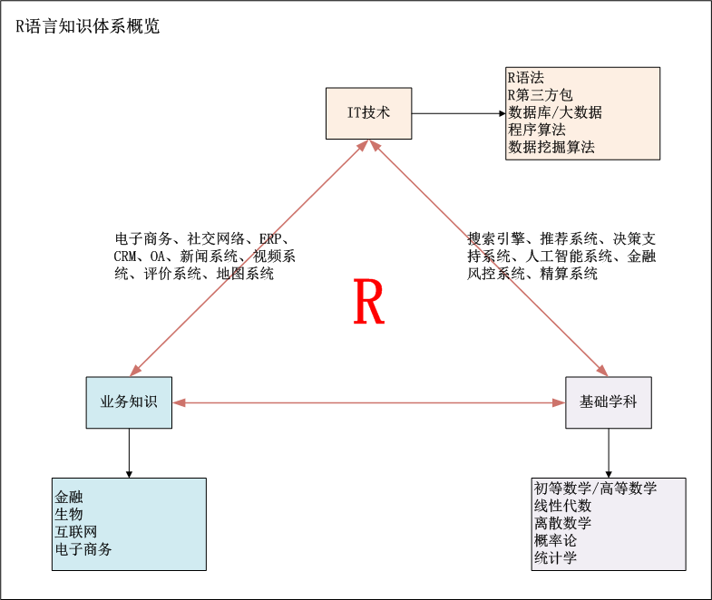
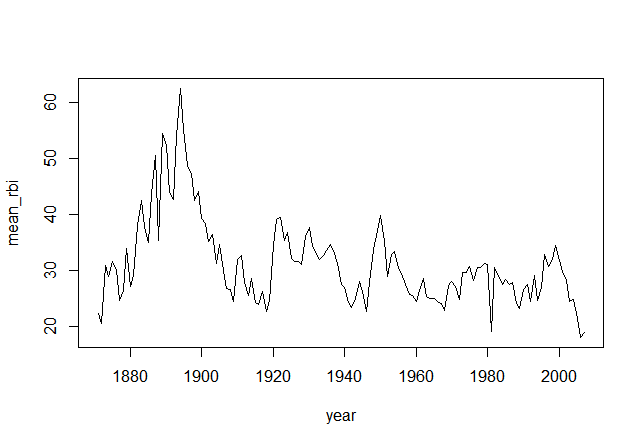
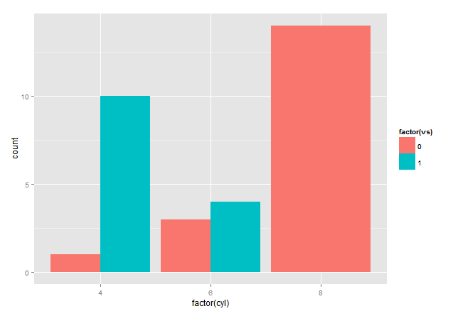

# R 语言教程

R 是属于 GNU 系统的一个自由、免费、源代码开放的软件，它是一个用于统计计算和统计制图的优秀工具。本实验课程基于张丹的 R 语言系列博客制作。

## 一、实验说明

### 1\. 环境登录

无需密码自动登录，系统用户名 shiyanlou

### 2\. 环境介绍

本实验环境采用 Ubuntu Linux 桌面环境，实验中会用到桌面上的程序：

1.命令行终端: Linux 命令行终端，打开后会进入 Bash 环境，可以使用 Linux 命令

2.Firefox 及 Opera：浏览器，可以用在需要前端界面的课程里，只需要打开环境里写的 HTML/JS 页面即可

3.gvim：非常好用的 Vim 编辑器，最简单的用法可以参考课程[Vim 编辑器](http://www.shiyanlou.com/courses/2)

4.gedit 及 Brackets：如果您对 gvim 的使用不熟悉，可以用这两个作为代码编辑器，其中 Brackets 非常适用于前端代码开发

### 3\. 环境使用

使用编辑器输入实验所需的代码及文件，使用命令行终端运行所需命令进行操作。

“实验记录”页面可以在“我的主页”中查看，每次实验的截图及笔记，以及有效学习时间（指的是在实验桌面内操作的时间，如果没有操作，系统会记录为发呆时间）。这些都是您在实验楼学习的真实性证明。

### 4\. 参考文档

本实验课程基于张丹的 R 语言系列博客制作：

*   http://blog.fens.me/series-r/

推荐阅读作者的 R 语言著作：

*   [《R 的极客理想-工具篇》](http://blog.fens.me/r-book1/)

## 二、 R 的语言介绍

R 语言是一门统计语言，主要用于数学建模、统计计算、数据处理、可视化等几个方向，R 语言天生就不同于其他的编程语言。R 语言封装了各种基础学科的计算函数，我们在 R 语言编程的过程中只需要调用这些计算函数，就可以构建出面向不同领域、不同业务的、复杂的数学模型。掌握 R 语言的语法，仅仅是学习 R 语言的第一步，要学好 R 语言，需要你具备基础学科能力(初等数学，高等数学，线性代数，离散数学，概率论，统计学)+业务知识(金融，生物，互联网)+IT 技术(R 语法，R 包，数据库，算法)。所以把眼光放长点，只有把自己的综合知识水平提升，你才能真正地学好 R 语言。换句话说，一旦你学成了 R 语言，你将是不可被替代的。

### 1\. R 的知识体系结构概览

R 的知识体系结构是复杂的，要想学好 R，就必须把多学科的知识综合运用，所以最大的难点不在于语言本身，而在于使用者的知识基础和综合运用的能力。

首先，从宏观上让我们先看一下 R 的知识体系结构的全貌，然后再分别解释每个部分的细节。



注：此图仅仅是我对 R 语言的理解，不排除由于个人阅历有限，观点片面的问题。

图中我将 R 语言知识体系结构分为 3 个部分：IT 技术 + 业务知识 + 基础学科。

*   IT 技术：是计算机时代必备的技术之一，R 语言就是一种我们应该要掌握的技术。
*   业务知识：是市场经验和法则，不管你在什么公司，都会有自己的产品、销售、市场等，你要了解你的公司产品有什么，客户是谁，怎么才能把产品卖给你的客户。
*   基础学科：是我们这十几年在学校学的理论知识，当初学的时候并不知道是为了什么，毕业后如果你还能掌握一些知识并实际运用，那么这将是你最有价值的竞争力。

每个部分知识单独看都有其局限性，但如果能把知识两两结合起来，就构成了我们现在社会的各种技术创新点。

*   IT 技术+业务知识：创造了阿里巴巴的电子商务帝国，腾讯全生态链的社交网络。
*   IT 技术+基础学科：创造了 Google 搜索的神话，华尔街金融不败的帝国。当然，R 语言只是一门计算机语言技术，不能独自承担改写历史的重任，但 R 语言实给了我们很大的想像空间，让我们能动手去了解这个世界的规律，找到无穷无尽的交叉点，创造出新的帝国。

如果你和我一样，都能站在这个角度来学习和使用 R 语言，那么我们一定可以成为并肩向前的同路人。我们正在努力改变着未来。

### 2\. R 语言基础的知识

蓝图总是宏大和美好的，具体落实也将是困难重重的。希望大家持之以恒坚持学习！

R 语言基础的知识，包括 R 语言的语法，R 语言核心包的使用，R 语言的内核编程，R 语言包的开发，以及 R 语言的虚拟机。

#### 2.1 R 语言的语法

语法是我们了解 R 语言的第一步，和所有人一样，我也在很短的时间就适应 R 的语法规则，数据结构，基本类型，常用函数等等。但其实 R 的语法上的坑远比你知道的多得多。

我举个例子，看谁能准确的回答。比如，最基础的符号操作"=","<-","<<-" ，三者有什么区别，分别在什么时候用？不要偷偷说问题太偏了，实际根本用不到。我的代码里处处都在用这 3 个符号，只是你不知道而已。在学习 R 的时候，不要用已经掌握的 C,Java,Python 的经验直接去套 R 的语法，掉坑里的就是这些人。要重头开始学，一路上没有捷径。

R 语言是函数式语言，语法自由，命名自由，使用简单，这只是对于普通用户来说的。作为一个有理想的极客，怎么能只停留在语法上呢！R 是完全面向对象的，你了解什么是面向对象吗？R 的面向对象打破了 R 原有的自由，但又要兼容原有的自由语法，多么纠结的设计啊，你能体会到吗？并不是记住了 R 的语法，就代表掌握了 R 语言。里面各种坑，只有自己踩了，再自己爬出来，才是真正的成长。

#### 2.2 R 语言核心包的使用

R 语言同其他语言一样，在软件启动时，为我们提供了 7 个核心包，包括了众多的基础函数，如数学计算函数，统计计算函数，日期函数，包加载函数，数据处理函数，函数操作函数，图形设备函数等。通过 search()函数，可以查看到 R 启动时默认加载 7 个核心包。

**注：在终端中输入 R 即可进入 R 语言编程环境，输入 q()退出环境。**

```r
> search()
[1] ".GlobalEnv"        "package:stats"     "package:graphics"
[4] "package:grDevices" "package:utils"     "package:datasets"
[7] "package:methods"   "Autoloads"         "package:base" 
```

这 7 个核心包，就是我们构建复杂模型的基础。由于这几个核心包比较底层，很多函数都是用 C 语言封装的没有 R 的源代码，而且除了官方文档，几乎没有其他更详细的文档介绍，所以这几个核心包就是学习的门槛，不要觉得某些函数会用了就行了，背后还有更深一层意义。

再问个问题，R 的所有操作都是函数操作，那么“a<-1:10”语句会被解析对应什么函数？

```r
> a<-1:10;a
 [1]  1  2  3  4  5  6  7  8  9 10 
```

答案是，"1:10"对应"seq(1:10)"，"<-"对应 assign()。

```r
> assign('b',seq(1:10));b
 [1]  1  2  3  4  5  6  7  8  9 10 
```

掌握这种对应关系的意义在于，因为 R 是解释型语言，我们可以通过传递一个函数 A 的句柄，让其他的函数 B 动态调用这个函数 A，这就是动态语言中的闭包特性的使用思路。在 JavaScript 中，已经被广泛使用了，但在 R 语言中，却只有核心包的一些函数在使用这种语法。在 R 语言中，这种需要有计算机背景知识的地方还有很多，特别是在考虑如何提升 R 性能的部分。所以，不要太轻易就说自己掌握了 R 语言，多想想如何才能把其他语言的基础带到 R 语言的世界里。

#### 2.3 R 语言的内核编程

R 语言的内核编程，又是一个比较复杂的计算机学科的问题。R 的内核编程应该包括哪些内容呢，除了刚才说的 R 的语法和 R 的核心包，还有面向对象编程，量向化计算，特殊数据类型，环境空间等。

面向对象编程，是一种对现实世界理解和抽象的方法，主要用于解决复杂问题的设计及实现。在 Java 的世界里，从 2003 年开始我接触 Java 的时候，社区就已经在聊面向对象的程序设计了。对于 R 语言来说，直到 2010 年发布的 2.12 版本，才最终有了 RC 类型的面向对象实现。面向对象的成熟，标志着 R 已经具备了构建复杂大型应用的能力，但如何真正地把面向对象用好，似乎也并不是统计人擅长的。有能力写出像 HadleyWickham 面向对象代码的人，在 R 的圈子里，实在是极少数的。

量向化计算，是 R 语言特有的一种并行计算方式。在 R 中，向量是 R 的基本数据类型(vector)，当你对一个向量进行操作时，程序会对向量中每个元素进行分别计算，计算结果以向量的形式返回。比如，最常见的两个等长的向量相加。

```r
> 1:10+10:1
 [1] 11 11 11 11 11 11 11 11 11 11 
```

向量化计算，在 R 中有很广泛的应用场景，基本可以取代循环计算，高效的完成计算任务。我们定义两个向量，先相加再求和，run1()函数用向量化计算实现，run2()用循环方法实现。

```r
> a<-1:100000
> b<-100000:1

> run1<-function(){  # 向量化计算
+   sum(as.numeric(a+b))
+ }

> run2<-function(){  # 循环计算
+   c2<-0
+   for(i in 1:length(a)){
+     c2<-a[i]+b[i]+c2
+   }
+   c2
+ }

> system.time(run1())
用户  系统  流逝
0.000 0.000 0.001 

> system.time(run2())
用户  系统  流逝
0.190 0.002 0.396 
```

通过运行程序，我们可以清楚地看出，向量化计算要比循环快(上述时间根据机器的不同可能会有所不同)。当算法越复杂数据量越大的时候，计算的时间差距会越明显的。R 的编程中的一条法则就是用向量计算代替所有的循环计算。

特殊数据类型，R 语言中除了那些基本的数据类型，还有一些高级的数据类型，并不是不常用，而是你不知道。

S3 类型，S4 类型，RC 类型分别对应 R 语言支持的三种面向对象编程的数据结构。

环境类型(environment)，由内核定义的一个数据结构，由一系列的、有层次关系的框架(frame)组成，每个环境对应一个框架，用来区别不同的运行时空间(scope)。

环境空间，在进行 R 包开发时，是必备的一个知识点。每个环境空间都是环境类型的一个实例。每个 R 包都会被加载到一个环境空间中，形成有层次关系的、可调用的空间结构。

我们定义的函数和变量，都会存在于 R 的环境空间中，通过 ls()就可以看到当前环境空间中的这些变量，比如，刚才量向化计算定义的变量和函数。

```r
> ls()
[1] "a"    "b"    "run1" "run2" 
```

除了我们自己定义的变量和函数，环境空间中还有很多其他的变量和函数，比如 sum(), length(),system.time()等，这些函数我们可以直接使用，但是它们并不在当前环境空间中，所以直接用 ls()是查看不到的。当我们切换到 base 的环境空间时，就可以找到 sum()的函数定义了。

```r
> ls(pattern="^sum$",envir=baseenv())
[1] "sum" 
```

R 语言内核编程，如同其他语言一样，有很多的知识细节，并不是只有我提到的这几点。但由于缺少文档，同时 R 核心技术的不普及，所以知道的人就不多，会用的人更少。我也在每天探索，期待发现更多的秘密。

## 三、小结

R 语言是一门统计语言，主要用于数学建模、统计计算、数据处理、可视化等几个方向，R 语言天生就不同于其他的编程语言，要学好 R 语言，需要你具备基础学科能力(初等数学，高等数学，线性代数，离散数学，概率论，统计学)+业务知识(金融，生物，互联网)+IT 技术(R 语法，R 包，数据库，算法)。

## 四、练习

请深入了解 R 语言可以应用在哪些方面。

实验中有任何问题欢迎到[实验楼问答](http://www.shiyanlou.com/questions)提问。

## 一、基础

R 是一种语法非常简单的表达式语言(expression language),大小写敏感。 可以在 R 环境下使用的命名字符集依赖于 R 所运行的系统和国家(系统的 locale 设置)、允许数字、字母、“.”和“_”

### 1.命名

命名必须以”.”或者字母开头，以”.”开头时第二个字符不允许是数字。

### 2.基本命令

基本命令要么是表达式（expressions），要么就是赋值（assignments）。

*   表达式：命令将被解析，并将结果显示在屏幕上，同时清空该命令所占内存。
*   赋值：命令将被解析，并把值传给变量，但结果不会自动显示在屏幕上。

命令可以被”;”隔开或者另起一行。基本命令可以通过大括弧{},放在一起构成一个复合表达式。

注释：一行中以井号”#”开头 换行：如果一条命令在一行结束的时候在语法上还不完整，换行提示符，默认是+

### 3\. 基本的对象

R 创建和控制的实体被称为对象。它们可以是变量，数组，字符串，函数，或者其他通过这些实体定义的一般性的结构。

*   矩阵（matrix）或者更为一般的数组（array）是多维的广义向量。实际上，它们就是向量，而且可以同时被两个或者更多个索引引用，并且以特有的方式显示出来。
*   因子（factor）为处理分类数据提供的一种有效方法。
*   列表（list）是一种泛化（generalform）的向量。它没有要求所有元素是同一类型，许多时候它本身就是向量和列表类型。列表为统计计算的结果返回提供了一种便利的方法。
*   数据框（data frame）是和矩阵类似的一种结构。在数据框中，列可以是不同的对象。可以把数据框看作是一个行表示观测个体并且（可能）同时拥有数值变量和分类变量的‘数据矩阵’。许多实验数据都可以很好的用数据框描述，处理方式是分类变量而响应值是数值变量。
*   函数（function）是可以保存在项目工作空间的 R 对象。该对象为 R 提供了一个简单而又便利的功能扩充方法。当编写你自己的函数在 R 会话过程中，对象是通过名字创建和保存的。objects(),ls()可以显示当前会话的对象名字。rm()可以删除对象。

#### 对象持久化

R 会话中创建的所有对象可以永久地保存在一个文件中以便于以后的 R 会话调用。在每一次 R 会话结束的时候，你可以保存当前所有可用的对象。如果你想这样做，这些对象将会写入当前目录下一个叫.RData 的文件中，并且所有在这次会话中用过的命令行都会被保存在.Rhistory 的文件中。当 R 再次在同一目录下启动，这些对象将从这个文件中重新导入工作空间。同时，相关的历史命令文件也会被导入。

## 二、向量和赋值

向量是由一串有序数值构成的序列

```r
> x <- c(10.4, 5.6, 3.1, 6.4, 21.7);x
[1] 10.4 5.6 3.1 6.4 21.7 
```

函数 c()完成的赋值语句，这里的函数 c()可以有任意多个参数，而它返回的值则是一个把这些参数首尾相连形成的向量。

赋值也可以用函数 assign()实现。

```r
> assign("x", c(10.4, 5.6, 3.1, 6.4, 21.7));x
[1] 10.4 5.6 3.1 6.4 21.7 
```

赋值符<-,->可以看作是该命令一个语义上的缩写。

```r
> c(10.4, 5.6, 3.1, 6.4, 21.7) -> x;x
[1] 10.4 5.6 3.1 6.4 21.7 
```

### 1.向量运算

在算术表达式中使用向量将会对该向量的每一个元素都进行同样的算术运算。出现在同一个表达式中的向量最好是长度一致。如果他们的长度不一样，该表达式的值将是一个和其中最长向量等长的向量。表达式中短的向量会被循环使用以达到最长向量的长度。对于一个常数就是简单的重复。

```r
> x <- 1:5
> y <- 1:3
> v <- 2*x + y + 1;v
[1] 4 7 10 10 13 
```

### 2.逻辑向量

逻辑向量元素可以被赋予的值,有 TRUE，FALSE 和 NA 逻辑向量可以由条件式（conditions）产生 temp <- x > 13

```r
> temp <- 1 < 3;temp
[1] TRUE 
```

### 3.字符向量

字符向量就是字符串，可以用双引号和单引号作分割符。

paste():可以把单独的字符连成字符串，可以有任意多的参数。参数中的任何数字都将被显式地强制转换成字符串，而且以同样的方式在终端显示。默认的分隔符是单个的空格符。

修改分隔符换成空字符""

```r
> labs <- paste(c("X","Y"), 1:10, sep="");labs
[1] "X1" "Y2" "X3" "Y4" "X5" "Y6" "X7" "Y8" "X9" "Y10" 
```

### 4.索引向量：通过索引值可以选择和修改一个数据集的子集

一个向量的子集元素可以通过向量名后面的方括号中加入索引向量得到。如果一个表达式的结果是向量，则我们可以直接在表达式的末尾方括号中加入索引向量以得到结果向量的子向量.

*   逻辑向量:索引向量必须和被挑选元素的向量长度一致。向量中对应索引向量元素为 TRUE 的元素将会被选中，而那些对应 FALSE 的元素则被忽略。

```r
> x <- c(TRUE, TRUE, FALSE, TRUE, FALSE)
> y <- x[x];y
[1] TRUE TRUE TRUE 
```

*   正整数向量:索引向量必须是 1,2,…,length(x)的子向量。索引向量中索引对应的元素将会被选中，并且在结果向量中的次序和索引向量中的次序一致。这种索引向量可以是任意长度的，结果向量的长度和索引向量完全一致。

```r
> x <- 1:10
> x[1:5]
[1] 1 2 3 4 5 
```

*   负整数向量:这种索引向量指定被排除的元素而不是包括进来。

```r
> x <- 1:10
> x[-(1:5)]
[1] 6 7 8 9 10 
```

*   字符串向量:这可能仅仅用于一个对象可以用 names 属性来识别它的元素。名字向量的子向量可以像上面第二条提到的正整数标签一样使用。

```r
> fruit <- c(5, 10, 1, 20) 
> names(fruit) <- c("orange”, “banana”, “apple”, “peach”) 
> lunch <- fruit[c(“apple”,“orange”)];lunch
apple orange
    1     5 
```

## 三、运算符

算术运算符：

```r
+ - * / 
```

逻辑运算符：

```r
<，<=，>，>=，==,!=, &, |, ! 
```

数学函数：

```r
log，exp，sin，cos，tan，sqrt ，max ，min，range，length，sum，prod，var 
```

**注：var(x): 等价于 sum((x-mean(x))²)/(length(x)-1)**

## 四、控制语句

### 1.条件语句:if

```r
if (expr1) expr2 else expr3 
```

### 2.循环控制：for,repeat,while

```r
for (name in expr1) expr2 
```

其中 name 是循环变量，expr1 是一个向量表达式，而 expr2 常常是根据虚拟变量 name 而设计的成组表达式。在 name 访问 expr1 所有可以取到的值时，expr2 都会运行。

例如使用 for 和 if：

```r
> for (i in 1:5) {
+     if (i %% 2 == 0) {
+         print(paste(i, "is even"))
+     } else {
+         print(paste(i, "is odd"))
+     }
+ }
[1] "1 is odd"
[1] "2 is even"
[1] "3 is odd"
[1] "4 is even"
[1] "5 is odd" 
```

**警告：相比其他程序语言，R 代码里面很少使用 for(),执行效率很低**

```r
repeat expr
while (condition) expr 
```

while 例子：

```r
> x <- 1:5
> sum <- 0
> i <- 1
> while (i <= length(x)) {
+     sum <- sum + x[i]
+     i <- i + 1
+ }
> sum
[1] 15 
```

repeat 例子：

```r
> x <- 1:5
> sum <- 0
> i <- 1
> repeat {
+     if (i > length(x)) {
+         break
+     }
+     sum <- sum + x[i]
+     i <- i + 1
+ }
> sum
[1] 15 
```

关键字 break：可以用于结束任何循环，甚至是非常规的。它是结束 repeat 循环的唯一办法。 关键字 next：可以用来结束一次特定的循环，然后直接跳入"下一次"循环，类似大家熟悉的 continue。

## 五、 生成正则序列

`1:30`语句等价于向量 c(1,2,…,29,30)，`30:1`语句可用来产生一个逆向的数列。 seq：数列生成中最为常用的工具

```r
> seq(1,5,1)
[1] 1 2 3 4 5 
```

rep：把一个数的完整拷贝多次，保持数列顺序

```r
> x <- 1:3
> rep(x, times=2)
[1] 1 2 3 1 2 3 
```

## 六、缺损值

在某些情况下，向量的元素可能有残缺。当一个元素或者值在统计的时候"不可得到"（not available）或者"值丢失"（missing value），相关位置可能会被保留并且赋予一个特定的值 NA。任何含有 NA 数据的运算结果都将是 NA。 函数 is.na(x)返回一个和 x 同等长度的向量。它的某个元素值为 TRUE 当且仅当 x 中对应元素是 NA。

```r
> z <- c(1:3,NA); ind <- is.na; ind
[1] FALSE FALSE FALSE TRUE 
```

第二种"缺损"值，也称为非数值 NaN(Not a Number)

```r
0/0 或 Inf 
```

## 七、 对象

### 1.内在属性：模式和长度

R 操作的实体是对象。实数或复数向量，逻辑向量和字符串向量之类的对象属于"原子"型的对象，因为它们的元素都是一样的类型或模式。R 的对象类型包括数值型，复数型，逻辑型,字符型和原生型。向量必须保证它的所有元素是一样的模式。因此任何给定的向量必须明确属于逻辑性，数值型，复数型，字符型或者原生型。

列表是任何模式的对象的有序序列。列表被认为是一种"递归"结构而不是原子结构,因为它们的元素可以以它们各自的方式单独列出。函数和表达式也是递归结构。

所有对象都有模式(mode)和长度(length)两个内在属性

```r
> x <- 1:3
> mode(x)
[1] "numeric"
> length(x)
[1] 3 
```

### 2.外部属性

attributes(x):给出对象当前定义的非内在属性的列表。 attr(object, name): 可以用来设置对象的外部属性。

```r
> z<-c(1:3,NA)
> attr(z, "name") <- "abc"
> attributes(z)
$name
[1] "abc" 
```

### 3.对象的类属性

R 里面的所有对象都属于类(class)，可以通过函数 class(x)查看。 对于简单的向量，类是对应的模式(mode)："numeric"，"logical"，"character" 或者"list"，其他的类型，像"matrix"，"array"，"factor" 和"data.frame" 就可能是其他值。

## 八、因子(factor)

假定我们有一份来自澳大利亚所有州和行政区的信息样本以及他们各自所在地的州名。

```r
> state <- c("tas", "sa", "qld", "nsw", "nsw", "nt") 
```

在字符向量中，"有序"意味着以字母排序的。

创建因子 factor：

```r
> statef <- factor(state)
> statef
[1] tas sa  qld nsw nsw nt 
Levels: nsw nt qld sa tas 
```

levels():可以用来得到因子的水平（levels）。

```r
> levels(statef)
[1] "nsw" "nt"  "qld" "sa"  "tas" 
```

#### 函数 tapply()和不规则数组

为计算样本中每个州的平均收入，我们可以用函数 tapply()：

```r
> incomes <- c(60, 49, 40, 61, 64, 60)
> incmeans <- tapply(incomes, statef, mean)
> incmeans
nsw   nt  qld   sa  tas 
62.5 60.0 40.0 49.0 60.0 
```

函数 tapply() 可以用来处理一个由多个分类因子决定的向量下标组合。

## 九、小结

R 语言中使用的命名字符集依赖于 R 所运行的系统和国家(系统的 locale 设置)、允许数字、字母、“.”和“_”，命名必须以”.”或者字母开头，以”.”开头时第二个字符不允许是数字，<-，->，R 语言的基本对象有矩阵、因子、列表、数据框和函数，assign()都可以赋值，c()可以有任意多个参数，而它返回的值则是一个把这些参数首尾相连形成的向量，paste()可以把单独的字符连成字符串，可以有任意多的参数，运算符有算术运算符、逻辑运算符、数学函数，控制语句有 if...else,for,while,repeat,seq()是数列生成中最为常用的工具，rep()把一个数的完整拷贝多次，并保持数列顺序，在某些情况下，向量的元素可能有残缺。当一个元素或者值在统计的时候"不可得到"（not available）或者"值丢失"（missing value），相关位置可能会被保留并且赋予一个特定的值 NA，对象有内在属性和外在属性，因子中常用 levels()和 tapply()操作。

## 十、练习

请熟练使用 R 语言基本对象的常用操作。

实验中有任何问题欢迎到[实验楼问答](http://www.shiyanlou.com/questions)提问。

## 一、 数组

数组可以看作是带有多个下标类型相同的元素集合。 维度向量(dimension vector)是一个正整数向量。如果它的长度为 k，那么该数组就是 k-维的。

向量只有在定义了 dim 属性后才能作为数组在 R 中使用。 假定，z 是一个含 1500 个元素的向量

```r
> z<-seq(1,1500)
> dim(z) <- c(3,5,100)
> attributes(z)
$dim
[1]   3   5 100 
```

对 dim 属性的赋值使得该向量成一个 3×5×100 的数组。

### 1.数组索引

数组元素可以通过给定数组名及其后方括号中用逗号隔开的下标访问。可以根据索引数组去给数组中不规则的元素集合赋值或者将数组中特定的元素返回到一个向量中。

### 2.array()

除了用设定一个向量 dim 属性的方法来构建数组，它还可直接通过函数 array 将向量转换得到。

假定向量 h 有 24 个或更少的数值，那么命令

```r
> h <- seq(1,24)
> Z <- array(h, dim=c(3,4,2)) 
```

等价于

```r
> dim(h) <- c(3,4,2) 
```

### 3.向量和数组混合运算

*   表达式运算是从左到右进行的。
*   短的向量操作数将会被循环使用以达到其他操作数的长度。
*   有且只有短的向量和数组在一起，数组必须有一样的属性 dim，否则返回一个错误。
*   向量操作数比矩阵或者数组操作数长时会引起错误。
*   如果数组结构给定，同时也没有关于向量的错误信息和强制转换操作，结果将是一个和它的数组操作数属性 dim 一致的数组。

### 4.数组的外积

数组一个非常重要的运算就是外积运算（outer product）。如果 a 和 b 是两个数值数组，它们的外积将是这样的一个数组：维度向量通过连接两个操作数的维度向量得到；数据向量则由 a 的数据向量元素和 b 的数据向量元素的所有可能乘积得到。外积是通过特别的操作符%o%实现：

```r
> a <- 1:3
> b <- 1:3
> ab <- a %o% b
> ab <- outer(a, b, "*")
> ab
     [,1] [,2] [,3]
[1,]    1    2    3
[2,]    2    4    6
[3,]    3    6    9 
```

命令中的乘法操作符可以被任意一个双变量函数代替。

```r
> x<-c(1,2,3);y<-c(2,3,4)
> f <- function(x, y) cos(y)/(1 + x²)
> z <- outer(x, y, f) 
```

两个常规向量的外积是一个双下标的数组(就是矩阵，最大秩为 1)。

### 5.数组的广义转置

函数 aperm(a, perm) 可以用来重排一个数组 a

```r
B <- aperm(z, c(2,1)) 
```

等价操作

```r
t(z) 
```

## 二、矩阵

矩阵是一个双下标的数组。R 包括许多只对矩阵操作的操作符和函数。例如上面提到的 t(X)就是矩阵的转置函数。函数 nrow(A)和 ncol(A)将会分别返回矩阵 A 的行数和列数。

### 1.矩阵相乘

操作符%*% 用于矩阵相乘。 如果 A 和 B 是大小一样的方阵，那么

```r
A * B 
```

将是一个对应元素乘积的矩阵，而

```r
A %*% B 
```

则是一个矩阵积。如果 x 是一个向量，那么

```r
x %*% A %*% x 
```

通过上述数组外积中的 z 和 x 试试下列代码：

```r
> z * z
> z %*% z
> x %*% z %*% x 
```

crossprod():可以完成"矢积"运算，也就是说 crossprod(X,y) 和 t(X) %*% y 等价，而且在运算上更为高效。 diag():返回以该向量元素为对角元素的对角矩阵。

### 2.解线性方程和求逆

求解线性方程组是矩阵乘法的逆运算。当下面的命令运行后，

```r
b <- A %*% x 
```

如果仅仅给出 A 和 b，那么 x 就是该线性方程组的根。在 R 里面，用命令

```r
solve(A,b) 
```

矩阵的逆可以用下面的命令计算

```r
solve(A) 
```

## 三、小结

R 语言中数组可以看作是带有多个下标类型相同的元素集合。 维度向量(dimension vector)是一个正整数向量。如果它的长度为 k，那么该数组就是 k-维的。向量只有在定义了 dim 属性后才能作为数组在 R 中使用。除了用设定一个向量 dim 属性的方法来构建数组，它还可直接通过函数 array 将向量转换得到，outer()可以做外积运算，aperm()可以做数组的广义转置，等价于 t()，%*%可以做矩阵的相乘，crossprod()可以完成"矢积"运算，也就是 crossprod(X,y) 和 t(X) %*% y 等价，而且在运算上更为高效，diag()返回以该向量元素为对角元素的对角矩阵，使用 solve()可以对矩阵求逆。

## 四、练习

请举出一个使用 solve()解线程方程的例子。

实验中有任何问题欢迎到[实验楼问答](http://www.shiyanlou.com/questions)提问。

## 一、对数据进行运算的常用函数：

#### 1.round() 四舍五入

例：

```r
> x <- c(3.1416, 15.377, 269.7)
> round(x, 0)                #保留整数位
[1] 3 15 270
> round(x, 3)                #保留到三位小数
[1] 3.142 15.377 269.700 
```

#### 2.trunc() 取整

floor() 向下取整 ceiling() 向上取整 例：

```r
> xx <- c(3.60, 12.47, -3.60, -12.47)

> trunc(xx)
[1] 3 12 -3 -12
> floor(xx)
[1] 3 12 -4 -13
> ceiling(xx)
[1] 4 13 -3 -12 
```

#### 3.logb(a, b) 以 b 为底的对数，省略 b 表示自然数

log() 自然对数 log10() 以 10 为底的常用对数 例：

```r
> logb(8, 2)
[1] 3
> log(8); logb(8)
[1] 2.079442
[1] 2.079442
> log10(100); logb(100, 10)
[1] 2
[1] 2 
```

#### 4.sqrt()平方根 exp()指数

```r
> sqrt(4)
[1] 2
> exp(1)
[1] 2.718282 
```

#### 5.求弦函数

sin()正弦 cos()余弦 tan()正切 asin()反正弦 acos()反余弦 atan()反正切 sinh()双曲正弦 tanh()双曲正切

#### 6.nchar()字符长度

例：

```r
> xx <- 'ShiYanLou is good!'
> nchar(xx)
[1] 18 
```

#### 7.substring()取子字符串

例：

```r
> substring(xx, 1, 9)
[1] "ShiYanLou" 
```

#### 8.paste()连接字符

语法是：paste(..., sep = " ", collapse = NULL)

例 1：

```r
> x <- 'ShiYanLou'; y <- 'is'; z <- 'good!'
> paste(x, y, z)
[1] "ShiYanLou is good!" 
```

例 2：

```r
> paste(c('x', 'y'), 1:4, sep = '')
[1] "x1" "y2" "x3" "y4" 
```

例 3：

```r
> paste('x', 1:4, sep = '', collapse = '+')
[1] "x1+x2+x3+x4" 
```

更多函数可查看：[`doc.fens.me/cos/R-refcard.pdf`](http://doc.fens.me/cos/R-refcard.pdf)

## 二、小结

R 语言中有常用的一些函数，round()可以四舍五入，trunc()取整，floor()向下取整，ceiling()向上取整，logb(a, b) 求以 b 为底的对数，省略 b 表示自然数，sqrt()求平方根，exp()求指数，求弦函数如 sin()正弦、cos()余弦等，nchar()求字符长度，substring()求取子字符串，paste()可以连接字符。

## 三、练习

请再举出三个常用函数的例子。

实验中有任何问题欢迎到[实验楼问答](http://www.shiyanlou.com/questions)提问。

## 一、R 的扩展包

### 1\. plyr (数据处理)

plyr 是一个数据处理的包，可以把大的数据集通过一些条件拆分成小的数据集的功能包。

数据集 baseball(http://www.baseball-databank.org/) 21,699 records covering 1,288 players, spanning 1871 to 2007

**举例：击球得分：RBI(Run batted in)**

```r
$ sudo R
> install.packages("plyr")
> library(plyr)
> ?baseball
> ddply(baseball, .(lg), c("nrow", "ncol"))
> rbi <- ddply(baseball, .(year), summarise, mean_rbi = mean(rbi, na.rm = TRUE))
> plot(mean_rbi ~ year, type = "l", data = rbi) 
```



### 2\. stringr (字符串处理)

stringr 是一个字符串处理的包，可以方便地进行各种字符串的操作。

```r
> install.packages("stringr")
> library(stringr)
> fruits <- c("one apple", "two pears", "three bananas");fruit
[1] "one apple" "two pears" "three bananas"
> str_replace(fruits, "[aeiou]", "-")
[1] "-ne apple" "tw- pears" "thr-e bananas"
> str_replace_all(fruits, "[aeiou]", "-")
[1] "-n- -ppl-" "tw- p--rs" "thr-- b-n-n-s"
> str_replace_all(fruits, "([aeiou])", "")
[1] "n ppl" "tw prs" "thr bnns"
> str_replace_all(fruits, "([aeiou])", "\\1\\1")
[1] "oonee aapplee" "twoo peeaars" "threeee baanaanaas"
> str_replace_all(fruits, "[aeiou]", c("1", "2", "3"))
[1] "1n1 1ppl1" "tw2 p22rs" "thr33 b3n3n3s"
> str_replace_all(fruits, c("a", "e", "i"), "-")
[1] "one -pple" "two p-ars" "three bananas" 
```

### 3\. ggplot2 (可视化)

ggplot2 专业级的可视化绘图包

```r
> install.packages("ggplot2")
> library(ggplot2)
> g<-ggplot(mtcars, aes(x=factor(cyl), fill=factor(vs)))
> g+geom_bar(position="dodge") 
```



## 二、小结

R 语言中有很多扩展包，如 plyr 包可以做数据处理，stringr 包可以做字符串处理，ggplot2 是专业级的可视化绘图包。

## 三、练习

请再举出一个常用扩展包的例子。

实验中有任何问题欢迎到[实验楼问答](http://www.shiyanlou.com/questions)提问。