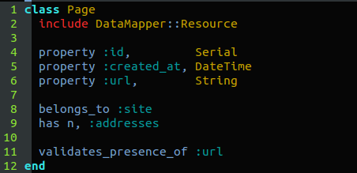
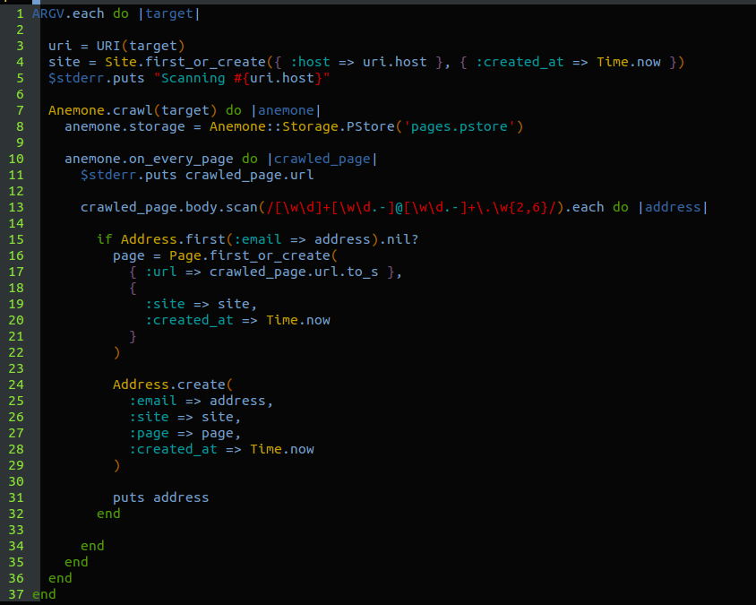

# Ruby 制作 E-mail 小爬虫

不知道各位有没有在成堆的垃圾邮件中，寻找某宝密码重置的邮件，简直是一场杯具。。。。我们总是小心翼翼的保护着我们的邮箱，但还是被别有用心的人知道；e-mail 爬虫就是这些人的工具之一，它可以在某个网页上过滤出一个个的 e-mail，然后发送垃圾邮件。

## Ruby！ E-mail 小爬虫

Ruby**据说**是一个比 Python 还要简洁还要快速的编程语言 ：）

好吧，这里并不是要挑起编程语言之间的战争，每个语言都有自己适应的场景，作为程序员应该知道在什么样的应用场景之下，用哪种的语言来实现业务逻辑，才是最重要的。

这次，我们使用 Ruby 来获取网页上的 e-mail 地址。

不知道各位有没有在成堆的垃圾邮件中，寻找某宝密码重置的邮件，简直是一场杯具。。。。我们总是小心翼翼的保护着我们的邮箱，但还是被别有用心的人知道；e-mail 爬虫就是这些人的工具之一，它可以在某个网页上过滤出一个个的 e-mail，然后发送垃圾邮件。

[“加密”你的 email 地址，防止爬虫收集](http://m.poorren.com/ser-email-address/)

当然，我们抱着学习的心态，来了解它的基本结构，揭开它神秘的面纱。

代码下载：

```rb
git clone http://git.shiyanlou.com/shiyanlou/email_spider 
```

## 一、准备工作

实验楼已经提供了 Ruby 运行环境，但是，还是需要我们安装一些插件：

##### 将 gem 下载源换为国内源

**请确保只有 ruby.taobao.org**

```rb
$ gem sources --remove http://rubygems.org/
$ gem sources -a http://mirrors.aliyuncs.com/rubygems/
$ gem sources -l

*** CURRENT SOURCES ***

http://mirrors.aliyuncs.com/rubygems/ 
```

##### 安装 Ruby 爬虫库 anemone

```rb
$ sudo apt-get update
$ sudo apt-get install ruby1.9.1-dev
$ sudo apt-get install libsqlite3-dev
$ sudo gem install anemone 
```

[查看对应的数据库支持](http://datamapper.org/getting-started.html)

##### Ruby 数据库支持

```rb
sudo gem install data_mapper
sudo gem install dm-sqlite-adapter 
```

## 二、数据库设计

我们使用 sqlite3 来放置我们扒下来的数据：

**Site**：存储爬行过的网站

**Page**：存储爬行过的存在 email 地址的**页面的 URL**

**Address**：email 地址

我们只讲解其中一个表的 model，其他更深入的请看：

[data_mapper property 详解](http://datamapper.org/docs/properties.html)

源文件**data.rb**：



Page 模型需要 include 模块**DataMapper::Resource**，引入相应的方法，其中就包括了 property，belongs*to，has n，validates*presence_of，这些我们马上需要用到的方法。

**property**：定义了对象的属性（表的字段类型），Serial 是自增 ID，并且是主键。

**belongs_to**： 定义了一对多的关系，一个网站可能包含了多个网页 URL

**has n**：定义多对多的关系，一个网页上可能包含多个 email 地址，一个 email 可能同时存在多个网页上。

**validates*presence*of**：检查 url 是否存在。

[data_mapper validates 详解](http://datamapper.org/docs/validations.html)

## 三、爬虫代码

首先，我们需要引入 uri 和 anemone 包，其次还需要刚才定义的数据库的 model

```rb
require 'uri'
require 'anemone'
require_relative 'data' 
```

**data**是对 data.rb 文件的引用。

##### crawl.rb



**ARGV**：获取命令行参数

```rb
ruby crawl.rb http://www.test.test 
```

**ARGV**是 Ruby 的数组，所以我们用循环来处理它，因为我可以输入不只一个 URL，如果，我们使用多线程的话，这样就可以同一时间处理多个 URL，事半功倍。

然后马上使用 URI()来处理传入的 URL，结果返回给 uri，下一步就把这个结果存入数据库中，**uri.host**网站的域名，和当前时间(这里使用的是内置模块 Time) [URI 模块，官方文档，英文](http://www.ruby-doc.org/stdlib-1.9.3/libdoc/uri/rdoc/URI.html)

接下来的事情就很写意了，我们不需要自己去做很多的比如什么广度和深度算法的设计，我们只需要给它一个入口的 URL，它会自动的去爬行，根本停不下来啊！

使用模块**Anemone**的方法**crawl**创建一个新的爬虫，参数就传一个我们想爬行的 URL 就 OK 了！

**Storage.PStore**用来缓存新扒下来的网页代码，**on*every*page**处理每个页面，正则去匹配 email，该页面的所有 email 会被包装在一个数组里面，然后循环这个数组并将结果存放数据库。

[Anemone 爬虫模块](http://www.rubydoc.info/github/chriskite/anemone/Anemone)

if 判断将会去查询 address 表，如果这个数据存在就更新，不存在则创建。

[Datamapper 更删查改详解](http://datamapper.org/docs/create_and_destroy.html)

最后，将得到的 E-mail 地址输出到屏幕，又接着下一次循环，你要是不想等了，直接 Ctrl+c 吧 ：）