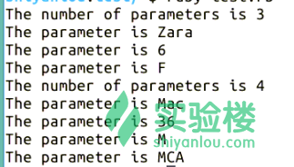

# 第 4 节 Ruby 方法（函数）

## 一、实验说明

### 1\. 环境登录

无需密码自动登录，系统用户名 shiyanlou

### 2\. 环境介绍

本实验环境采用 Ubuntu Linux 桌面环境，实验中会用到桌面上的程序：

1.  命令行终端: Linux 命令行终端，打开后会进入 Bash 环境，可以使用 Linux 命令
2.  Firefox 及 Opera：浏览器，可以用在需要前端界面的课程里，只需要打开环境里写的 HTML/JS 页面即可
3.  gvim：非常好用的 Vim 编辑器，最简单的用法可以参考课程 [Vim 编辑器](http://www.shiyanlou.com/courses/2)
4.  gedit 及 Brackets：如果您对 gvim 的使用不熟悉，可以用这两个作为代码编辑器，其中 Brackets 非常适用于前端代码开发

### 3\. 环境使用

使用编辑器输入实验所需的代码及文件，使用命令行终端运行所需命令进行操作。

“实验记录”页面可以在“我的主页”中查看，每次实验的截图及笔记，以及有效学习时间（指的是在实验桌面内操作的时间，如果没有操作，系统会记录为发呆时间）。这些都是您在实验楼学习的真实性证明。

### 4\. 实验介绍

本次课程讲解 Ruby 中的方法，也就是函数。将会涉及到函数的定义、函数返回值、函数参数声明以及 类中的函数等等知识点。

## 二、方法定义

如何定义一个方法？

在 Ruby 中方法就相当于其他编程语言中的函数，但是方法必须是以小写字母开头的（**切记！**）！

```rb
def method_name [args]
    statements
end 
```

与其他编程语言（如 C 语言）一样，其方法也可以接收参数

范例：

```rb
#!/usr/bin/ruby        #文件名为 test.rb

def test(arg1="Hello",arg2="Ruby!")
    puts "#{arg1} #{arg2}"
end
test        #调用 test 方法 
```

运行：

```rb
$ ruby test.rb
Hello Ruby! 
```

Tip：在 ruby 程序中 `#` 代表注释

## 三、返回值

如何让一个方法具有返回值？

同样 ruby 的方法也可以有返回值的

```rb
#!/usr/bin/ruby    #文件名为 re_test.rb

def re_test
    i = 20
    j = 30
    k = i + j
    return k
end
re_var = re_test        #调用 re_test 方法，并将其返回值赋给 var(局部变量，还记得起几种变量的定义方式了么？)
puts "return value: ",re_var 
```

运行：

```rb
$ ruby re_test.rb
return value:
50 
```

## 四、可变数量的参数声明方法

范例：

```rb
#!/usr/bin/ruby    #文件名 decla_te.rb

def decla_te(*decla)
   puts "The number of parameters is #{ decla.length}"
   for i in 0... decla.length
      puts "The parameter is #{ decla [i]}"
   end
end
decla_te "Zara", "6", "F"
decla_te "Mac", "36", "M", "MCA" 
```

运行：

```rb
$ ruby decla_te.rb 
```



如果单个 decla 作为 decla_te 的参数，则调用时只能传一个参数，加上 `*` 后参数数量就是可变的了

## 五、类中的方法

如果您学习过 C++，那么您肯定对私有 (private) 和公有 (public) 不会陌生。

同样 Ruby 也是有 private 和 public 的，而且当方法定义在类定义外时则该方法默认被标记为 private，若在类定义中那么默认标记为 public。

范例：

```rb
#!/usr/bin/ruby        #文件名为 class_fun.rb

class Class_fun            #创建一个 Class_fun 类
    def fun1
        puts "This is the first test for class."
    end
    def fun2
        puts "This is the second test for class."
    end             #类中包括两个成员函数
end
test1=Class_fun.new
test2=Class_fun.new    #创建类 Class_fun 的两个对象
test1.fun1            #对象调用类的成员函数
test2.fun2 
```

运行：

```rb
$ ruby class_fun.rb 
```


**Tip：类名的首字母一定是大写的**

## 六、作业思考

> * 自己写写其他的例子，将上面提到的各种类型的变量都应用到。

## 七、参考文档

> * 本实验课程基于：[Ruby 官方教程](https://www.ruby-lang.org/zh_cn/documentation/)