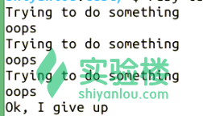

# 第 6 节 Ruby 循环与判断

## 一、实验说明介绍

### 1\. 环境登录

无需密码自动登录，系统用户名 shiyanlou

### 2\. 环境介绍

本实验环境采用 Ubuntu Linux 桌面环境，实验中会用到桌面上的程序：

1.  命令行终端: Linux 命令行终端，打开后会进入 Bash 环境，可以使用 Linux 命令
2.  Firefox 及 Opera：浏览器，可以用在需要前端界面的课程里，只需要打开环境里写的 HTML/JS 页面即可
3.  gvim：非常好用的 Vim 编辑器，最简单的用法可以参考课程 [Vim 编辑器](http://www.shiyanlou.com/courses/2)
4.  gedit 及 Brackets：如果您对 gvim 的使用不熟悉，可以用这两个作为代码编辑器，其中 Brackets 非常适用于前端代码开发

### 3\. 环境使用

使用编辑器输入实验所需的代码及文件，使用命令行终端运行所需命令进行操作。

“实验记录”页面可以在“我的主页”中查看，每次实验的截图及笔记，以及有效学习时间（指的是在实验桌面内操作的时间，如果没有操作，系统会记录为发呆时间）。这些都是您在实验楼学习的真实性证明。

### 4\. 实验介绍

本次课程介绍 Ruby 中的循环与判断。其中循环包括 while、until 循环等，判断包括 if、case 等等知识点。

## 二、循环

### 1\. while 循环与 until 循环

语法 1：

```rb
while conditional [do]
   code
end 
```

当 conditional 为真时执行 code

语法 2：

```rb
code while condition 
```

或者

```rb
begin
    code    
end while conditional 
```

当 conditional 为真时，执行 code。

可以与 C 语言的 do…while 语句进行对比

范例：

```rb
#!/usr/bin/ruby        #文件名为 while.rb

$i = 0
$num = 3
puts "begin while"
while $i < $num  do
   puts("Inside the loop(while) i = #$i" )
   $i +=1
end
puts "end while"
$i=0
puts "begin do while"
begin
   puts("Inside the loop(do while) i = #$i" )
   $i +=1
end while $i < $num
puts "end do while" 
```

运行：

```rb
$ ruby while.rb 
```


### 2\. until 循环

语法 1：

```rb
until conditional [do]
   code
end 
```

语法 2：

```rb
code until conditional 
```

或者：

```rb
begin
   code
end until conditional 
```

请与 while 循环进行对比练习。

### 3\. for、break 和 next 语句

for 范例 1：

```rb
#!/usr/bin/ruby

for i in 0..5        #新建范围
   puts "Value of local variable is #{i}"
end 
```

for 范例 2：

```rb
#!/usr/bin/ruby

(0..5).each do |i|
   puts "Value of local variable is #{i}"
end 
```

break 范例：

```rb
#!/usr/bin/ruby

for i in 0..5
   if i > 2 then
      break        #退出循环
   end
   puts "Value of local variable is #{i}"
end 
```

next 范例：

```rb
#!/usr/bin/ruby

for i in 0..5
   if i < 2 then
      next        #跳转到下一次循环
   end
   puts "Value of local variable is #{i}"
end 
```

### 4\. redo 和 retry 语句

redo 范例：

```rb
#!/usr/bin/ruby        #文件名为 redo.rb

for i in 0..5
   if i < 2 then
      puts "Value of local variable is #{i}"
      redo        #重新开始最内部循环的该次迭代，不检查循环条件
   end
end 
```

运行结果将无限循环：

```rb
$ ruby redo.rb 
```


如果 retry 出现在 begin 表达式的 rescue 子句中，则从 begin 主体的开头重新开始执行。

语法：

```rb
begin
   do_something         #抛出的异常
rescue
   #处理错误
   retry                 #重新从 begin 开始
end 
```

如果 retry 出现在迭代内、块内或者 for 表达式的主体内，则重新开始迭代调用。迭代的参数会重新评估。

范例：

```rb
#!/usr/bin/ruby     #文件名为 retry.rb

n = 0
begin
  puts 'Trying to do something'
  raise 'oops'        #抛出一个消息为"oops"的 RuntimeError
rescue => ex        #捕捉异常，并将异常保存至 ex 变量
  puts ex            #打印异常消息
  n += 1
  retry if n < 3
end
puts "Ok, I give up" 
```

运行：

```rb
$ ruby retry.rb 
```



## 三、判断

### 1\. if 语句

if 范例 1：

```rb
#!/usr/bin/ruby        #文件名为 if1.rb

x=1
if x > 2
   puts "x is greater than 2"    #句 1
elsif x <= 2 and x!=0
   puts "x is 1"            #句 2
else
   puts "I can't guess the number"    #句 3
end 
```

如果 x>2 则执行句 1，否则如果 x<=2 并且 x!=0 则执行句 2，其他情况执行句 3。

运行：

```rb
$ ruby if1.rb
x is 1 
```

if 范例 2：

```rb
#!/usr/bin/ruby        #文件名为 if2.rb

$debug=1
print "debug\n" if $debug    #如果“if $debug”为真，则执行 print “debug\n” 
```

运行：

```rb
$ ruby if2.rb
debug 
```

### 2\. unless 语句

unless 范例 1：

```rb
#!/usr/bin/ruby        #文件名为 unless.rb

x=1
unless x>2
   puts "x is less than 2"    #句 1
 else
  puts "x is greater than 2"    #句 2
end
#如果 x>2 为假则执行句 1，否则执行句 2 
```

运行：

```rb
$ ruby unless.rb
x is less than 2 
```

与 if 语句相似，下面看范例 2。

unless 范例 2：

```rb
#!/usr/bin/ruby        #文件名为 unless2.rb

$var = 1                #不能写为 ture
print "1 -- Value is set\n" if $var        #复习 if 语句，并与 unless 语句对比
print "2 -- Value is set\n" unless $var    #如果 $var 为假，则执行 print "2 -- Value is set\n"

$var = false            #不能写成 0
print "3 -- Value is set\n" unless $var 
```

运行：

```rb
$ ruby unless2.rb
1 -- Value is set
3 -- Value is set 
```

### 3\. case 语句

范例：

```rb
#!/usr/bin/ruby        #文件名为 case.rb

$age = 56
case $age                #比较指定的 age
when 0 .. 2            #与 0,1,2 三个数字进行比较
    puts "baby"        #若匹配，则执行此句
when 3 .. 6
    puts "little child"
when 7 .. 12
    puts "child"
when 13 .. 18
    puts "youth"
else                    #若以上均不匹配
    puts "adult"        #则执行此句
end                    #不要忘了 case…end 
```

运行：

```rb
$ ruby case.rb
adult 
```

## 四、作业思考

> * 比较 “循环和判断” 中各种不同形式的异同。

## 参考文档

> * 本实验课程基于： [Ruby 官方教程](https://www.ruby-lang.org/zh_cn/documentation/)