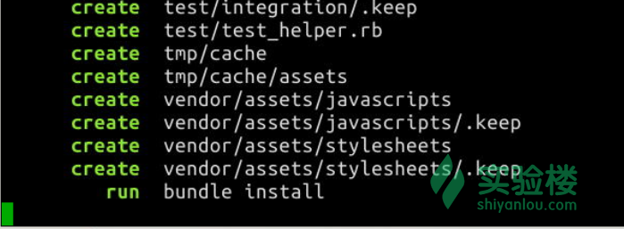

# 第 1 节 Rails 介绍与环境配置

## 实验介绍

本实验是[实验楼](https://www.shiyanlou.com)课程[《Rails 基础入门》](https://www.shiyanlou.com/courses/103)的第一节实验。在本系列课程中，你将从零开始学习[Rails 框架](http://rubyonrails.org/)。

本节实验中，我们将学习怎么样配置 Rails 环境。

本节实验代码位于本课程[Rails 基础入门代码库](http://git.shiyanlou.com/shiyanlou/shiyanlou_cs103)项目中`chapter1`目录，你可以克隆该项目到本地进行查看。

本课程基于[《Ruby on Rails 入门》](http://guides.ruby-china.org/)制作。本课程在其基础加入了大量说明，并针对实验楼环境进行了适当修改。希望通过学习本课程，你能熟悉 Rails 中的各种概念，并能使用 Rails 开发简单的项目。

## Rails 介绍

Ruby on Rails 是一种结合 Ruby 语言与 Rails 平台的一种网页编程语言，Ruby 语言以自然、简洁、快速著称，全面支持面向对象程序设计，而 Rails 则是 Ruby 广泛应用方式之一，在 Rails 平台上设计出一套独特的 MVC 开发架构，采取模型（Model）、外观（View）、控制器（Controller）分离的开发方式，不但减少了开发中的问题，更简化了许多繁复的动作。

Rails 的官方网站是 http://rubyonrails.org/， 官方网站上关于 Rails 的详尽资料，你可以在此网站上查询各种 Rails API。同时 Rails 也有中文网站：http://guides.ruby-china.org/ 。

在学习 Rails 的过程，牢记以下两点，将对我们的学习大有帮助：

*   多约定，少配置
*   不做重复的事

Rails 是一个很庞大的框架，包含了网站开发的方方面面，下面我们将通过一个简单例子来看看 Rails 是怎么样运行起来的。

## Rails 基础

### 环境配置

开始每一个 Rails 应用前，都少不了环境配置。Rails 既是 Web 框架，同时也是一个命令，通过该命令，我们可以初始化一个 Rails 应用。在[实验楼](https://www.shiyanlou.com)的环境中，已经默认安装好 Rails 框架，如果你需要手动安装，可以通过以下方式安装：

```rb
$ sudo gem install rails 
```

同时，在这节实验中，我们将博客数据存储在 [sqlite](https://www.sqlite.org/) 中，sqlite 是一个非常轻量级的数据库，我们不需要启动任何数据库程序就可以使用它。你可以通过以下命令验证实验环境中是否已经安装`sqlite`：

```rb
$ sqlite3 --version 
```

如果提示找不到该命令，则说明还没有安装，我们可以通过以下命令安装 sqlite:

```rb
sudo apt-get install sqlite3 
```

同时为了保证 Rails 的 sqlite 相关的 gem 能正常使用，需要安装 sqlite 的开发文件，如果不安装的话，会发现后文中的`bundle install`命令会执行失败：

```rb
sudo apt-get install libsqlite3-dev 
```

这样一来，我们的环境就配置好啦，是不是很简单？你也可以使用以下命令验证 Rails 的版本：

```rb
$ rails --version 
```

下图是以上命令在实验楼环境中的输出结果：


### 创建一个应用

上面我们说过，Rails 不仅仅是一个框架，而且是一个命令，通过`rails`命令我们可以进行很多操作。比如我们可以通过`rails new app_name`创建我们的应用，该命令会创建一个名为`app_name`的应用目录，这个目录中包含我们需要开发整个`app_name`网站的所有相关代码。下面让我们尝试下：

```rb
$ cd ~/Code
$ rails new blog 
```

你会发现`rails new blog`命令会卡在以下界面：



这是由于默认情况下`rails new blog`命令不仅仅会初始化`blog`应用目录，而且会通过 [Bundler](http://bundler.io/) 工具根据默认创建的`Gemfile`（这里是`blog/Gemfile`) 安装`blog`应用依赖的所有 gem 包。而默认情况下，`Gemfile`中使用 gem 源是 `https://rubygems.org` ，这个地址对于国内访问来非常慢，所以我们需要修改这个源，加快速度。我们可以直接通过 `Crtl+C`按键，终止`rails new blog`命令，然后进入`~/Code/blog`目录。修改`Gemfile`文件中的地址`https://rubygems.org` 为 `http://mirrors.aliyuncs.com/rubygems/`，然后通过以下命令安装`blog`应用以来的所有 gem 包:

```rb
$ bundle install 
```

下图是该命令的部分输出：


到这里整个应用就创建完成了。现在可以看到`blog`目录下出现了很多子目录以及文件，这些子目录和文件的作用如下：

*   `app/` :存放程序的控制器、模型、视图、帮助方法、邮件和静态资源文件。本文主要关注的是这个文件夹。
*   `bin/` :存放运行程序的 rails 脚本，以及其他用来部署或运行程序的脚本。
*   `config/`: 设置程序的路由，数据库等。
*   `config.ru` : 基于 Rack 服务器的程序设置，用来启动程序。
*   `db/` : 存放当前数据库的模式，以及数据库迁移文件。
*   `Gemfile`, `Gemfile.lock` : 这两个文件用来指定程序所需的 gem 依赖件，用于 Bundler gem。
*   `lib/` : 程序的扩展模块
*   `log/` : 程序的日志文件。
*   `public/` : 唯一对外开放的文件夹，存放静态文件和编译后的资源文件。
*   `Rakefile`: 保存并加载可在命令行中执行的任务。任务在 Rails 的各组件中定义。如果想添加自己的任务，不要修改这个文件，把任务保存在 lib/tasks 文件夹中。
*   `test/` : 单元测试，固件等测试用文件。

经过上面的步骤，也许你有几个疑问：

*   有什么办法可以不让`rails new`命令不自动执行`bundle install`命令吗？

    当然是可以的，我们可以通过`rails new blog --skip-bundle`命令，跳过自动安装依赖 gem 的步骤，然后修改`Gemfile`后，再通过`bundle install`命令进行安装。

*   `Gemfile`有什么作用？`Bundler`又是什么？

    `Gemfile`文件中列出了当前应用用到的所有 gem 包（gem 包就是各种 ruby 包），同时它可以根据应用的环境（比如开发环境，或者测试环境）加载不同的 gem 包。其实`Gemfile`是被`Bundler`工具使用的，也就是`bundle`命令。关于`Bundler`的更多信息，可以参考：http://bundler.io/

### 运行 Rails 应用

到目前为止，我们可以将`blog`应用运行起来了，虽然我们只是仅仅创建了它。进入`blog`目录（~/Code/blog`）目录执行以下命令：

```rb
$ rails server 
```

下图是该命令的输出：


可以看到现在 Rails 运行起来了，并且监听在`3000`端口，现在我们可以通过浏览器访问这个地址。打开浏览器，输入地址`localhost:3000`，可以看到效果如下：


下面如果我们想访问`localhost:3000`的时候显示一些自定义信息，比如`Hello 实验楼`该怎么办？ 前面我们说过 Rails 是一个 MVC 框架，如果我们要自定义显示信息，就需要创建一个控制器（对应 MVC 中的 C）和相应的视图（也就是 MVC 中的 V）。同时我们需要一个路由，什么是路由呢？简单来说，就是一组根据我们访问的 URL 执行相应的控制器的规则。也就是路由能根据访问 URL 以及请求的参数，执行对应的控制器。

控制器用来接受向程序发起的请求。路由决定哪个控制器会接受到这个请求。一般情况下，每个控制器都有多个路由，对应不同的动作。动作用来提供视图中需要的数据。

视图的作用是，以人类能看懂的格式显示数据。有一点要特别注意，数据是在控制器中获取的，而不是在视图中。视图只是把数据显示出来。默认情况下，视图使用 eRuby（嵌入式 Ruby）语言编写（模板），经由 Rails 解析后，再发送给用户。

那么怎么样创建控制器呢？通过`rails generate controller`命令创建即可。通过以下命令，我们可以创建一个名为`welcome`的控制器和一个名为`index`的动作：

```rb
$ rails generate controller welcome index 
```

该命令运行后，Rails 会生成很多文件以及相应的路由：


可以看到 `rails generate controller welcome index`命令，会创建一个名为`welcome`的控制器和一个名为`welcome`的视图，并且已经将相应的 Ruby 代码和相应的模板文件（也就是视图）生成。同时还生成了许多其他文件，比如测试代码，coffeescript，以及 sass 文件。同时还会生成相应的路由。

上文中，我们说到，会创建名为`index`的访问，那这个访问在什么地方呢？我们查看下`~/Code/blog/app/controllers/welcome_controller.rb` 文件内容：

```rb
class WelcomeController < ApplicationController
  def index
  end
end 
```

可以看到原来这里定义了`WelcomeController`控制器，同时该控制器包含一个`index`方法（动作）。

生成的路由在什么地方呢？来让我们下`~/Code/blog/config/routes.rb`文件，在文件中有这么几行：

```rb
Rails.application.routes.draw do
  get 'welcome/index' 
```

看到了么？ `get 'welcome/index'` 的意思是说，如果访问的是 url 是`welcome/index`则执行`Welcome`控制器的`index`方法。你还记得那句话吗？ `多约定，少配置`，这里就是一种约定。

既然现在路由可以匹配`welcome/index`，不如让我们直接访问下该 URL，在浏览器输入以下地址：`localhost:3000/welcome/index`，下图是访问的结果：


到这里，如果我们想自定义信息，最简单的方法当然是直接修改 HTML 文件了。在`rails generate controller welcome index`命令的输出中，我们可以看到控制器`welcome`的方法`index`对应的视图文件是`app/view/welcome/index.html.erb`，这里我们修改该文件就可以达到我们的目的。编辑该文件，输入以下内容:

```rb
<h1>hello, shiyanlou</h1> 
```

等等，如果我们想要让`blog`应用的首页就显示控制器`welcome`的方法`index`对应的视图文件，该怎么办呢？回到刚才的``~/Code/blog/config/routes.rb`文件，找到以 root 开头的代码行，去掉注释，变成这样：

```rb
root 'welcome#index' 
```

`root 'welcome#index'` 告知 Rails，访问程序的根路径时，交给`welcome`控制器中的`index`动作处理。`get 'welcome/index'` 告知 Rails，访问 http://localhost:3000/welcome/index 时，交给`welcome`控制器中的`index`动作处理。现在我们重新访问`localhost:3000`，效果如下：


本节中，我们学习了怎么样将 Rails 应用运行起来。希望你能按照本实验说明一步一步操作，这样你才能最大的吸收本节的内容。下一节中，我们将实现一些真正有用的东西。