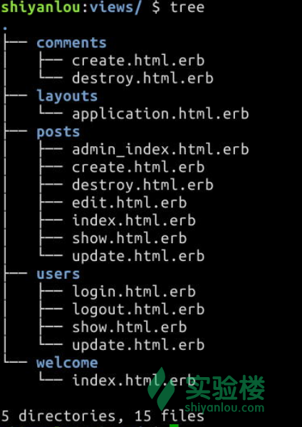
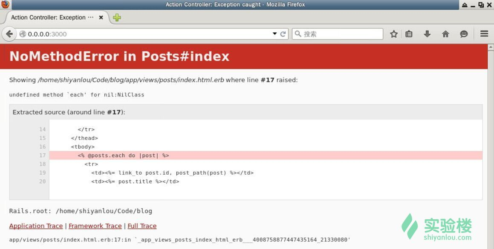
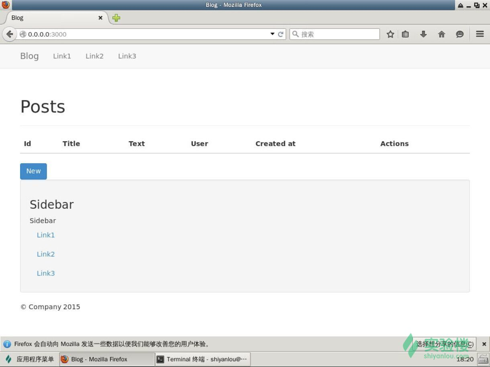

# 第 4 节 Rails 视图

## 实验介绍

本实验是[实验楼](https://www.shiyanlou.com)课程[《Rails 基础入门》](https://www.shiyanlou.com/courses/103)的第四节实验。本节实验中，我们将学习使用 Rails 的视图。

本节实验代码位于本课程[Rails 基础入门代码库](http://git.shiyanlou.com/shiyanlou/shiyanlou_cs103)项目中`chapter4`目录，你可以克隆该项目到本地进行查看。

本课程基于[《Ruby on Rails 入门》](http://guides.ruby-china.org/)制作。本课程在其基础加入了大量说明，并针对实验楼环境进行了适当修改。希望通过学习本课程，你能熟悉 Rails 中的各种概念，并能使用 Rails 开发简单的项目。

## 视图

在本课程的第二节中，我们学习了 Rails 框架中的控制器，也就是 Action Controller。在 Rails 中，请求第一步交给控制器处理（一般情况进行逻辑处理），第二步交给视图进行渲染，最终将页面呈现给用户。所以控制器和视图相辅相成的，同样，视图的数据是由控制器传递进去的。控制器和视图，也就是 Action Controller 和 Action View 组成了 Rails 框架中的 Action Pack。一般来说，Action Controller 的作用是和数据库通信，根据需要执行 CRUD 操作，Action View 用来构建响应。

Action View 模板由嵌入 HTML 的 Ruby 代码编写。为了保证模板代码简洁明了，Action View 提供了很多帮助方法，用来构建表单、日期和字符串等。如果需要，自己编写帮助方法也很简单。其实 Rails 中的视图就是 HTML 模板，只不过这些模板由 Ruby 代码（erb）编写。

Rails 中的视图也有命名约定。一般情况下，视图名和对应的控制器方法（动作）同名。比如在第二节实验中，我们通过命令`rails g controller users login logout show update` 创建 `UsersController`的时候，会生成相应的方法对应的视图。比如在命令中我们生成了`UsersController`，且指定了该控制器有四个方法（动作），分别是`login`, `logout`, `show`以及`update`，则 Rails 会在 `app/views/users`目录中生成相应的方法的视图模板。`app/views/users`目录本身也是 Rails 自动生成的，它对应了`UsersController`控制器，该控制器下所有视图都位于该目录中。下图是之前我们创建的所有控制器时默认创建的视图文件：



### 视图的组成

视图用于渲染展示给用户的 HTML 文件，最终产生的 HTML 代码由三部分组成：模板，局部视图和布局。Rails 的视图 Action View 模板可以使用多种语言编写。如果模板文件的扩展名是`.erb`，则使用的是 ERB 和 HTML。Action View 模板还支持 XML 模板，但是这里我们不做介绍。

#### ERB 模板

ERB 模板以`.html.erb`命名，其中包含了 HTML 代码和 Ruby 代码。其中 Ruby 代码包含在`<% %>`和`<%= %>`标签中。 `<% %>`用于执行 Ruby 代码， 没有返回值，比如条件判断，循环或者代码块。`<%= %>`用于输出结果。例如下面的代码，循环遍历名字：

```rb
<h1>Names of all the people</h1>
<% @people.each do |person| %>
  Name: <%= person.name %><br>
<% end %> 
```

在上述代码中，循环使用普通嵌入标签`<% %>`，输出名字时使用输出式嵌入标签`<%= %>`。常规的输出方法，例如 print 或 puts，无法在 ERB 模板中使用。

#### 局部视图

所谓局部视图就是将多个页面模板中会出现的重复的代码片段，提取出来，写入到单独的文件中，在模板中重复使用。比如很多网站，每一个页面都会有一个`footer`，这个`footer`包含网站的常用链接以及一些介绍。这个`footer`会出现在网站的所有页面中，所以我们可以将这部分代码提取出来，写入到`_footer.html.erb`文件中，这样就可以在模板中使用了。

我们想在视图中使用上面定义的局部视图，可以在视图中调用`render`方法：

```rb
<%= render "footer" %> 
```

这样，模板渲染到上述代码时，就会渲染名为`_footer.html.erb`文件。注意，文件名前面有个下划线。局部视图文件前面加上下划线是为了和普通视图区分，不过加载局部视图时不用加上下划线。`_footer.html.erb`应该是被所有控制器的视图共享，所以我们可以将`_footer.html.erb`放入一个`app/views/shared/`目录, 其中`shared`目录表示所有视图文件公用的局部视图都放在这里。这样如果想在视图中渲染该模板，可以使用下面的方法

```rb
<% render "shared/footer" %> 
```

怎么样传递变量到局部模板中去呢？有两种方式。

当我们使用渲染一个局部模板时，这个模板就是一个`ActionView::Partials::PartialRenderer`对象，在这个对象中，存在一个和模板名同名的变量。比如有下面的代码：

```rb
<%= render partial: "product" %> 
```

上面的代码和`<%= redner "product" %>`作用一样。这样在`_product.html.erb`中，就可以使用本地变量`product`了，和下面的写法是等效的：

```rb
<%= render partial: "product", locals: {product: @product} %> 
```

其中 `locals` 指明了传递给局部模板什么变量，同时这些变量在局部模板中的名字。

#### 布局

布局用来渲染 Rails 控制器动作的页面整体结构。一般来说，Rails 程序中有多个布局，大多数页面都使用这个布局渲染。例如，网站中可能有个布局用来渲染用户登录后的页面，以及一个布局用来渲染市场和销售页面。在用户登录后使用的布局中可能包含一个顶级导航，会在多个控制器动作中使用。

在使用 Rails 创建应用的时候， 会自动创建一个布局，位于 `app/views/layouts/application.html.erb`，其代码如下：

```rb
<!DOCTYPE html>
<html>
<head>
  <title>Blog</title>
  <%= stylesheet_link_tag    'application', media: 'all', 'data-turbolinks-track' => true %>
  <%= javascript_include_tag 'application', 'data-turbolinks-track' => true %>
  <%= csrf_meta_tags %>
</head>
<body>

<%= yield %>

</body>
</html> 
```

可以看到这个默认布局非常简单，必要的时候我们可以修改自定义它。

#### 帮助方法

所谓帮助方法是一些用于帮助我们生成表单，html tag 或者用于处理数据的方法。这些方法的使用可以提高模板的书写效率。下面我们将简单介绍部分帮助方法，更多的信息可以参考：http://api.rubyonrails.org/classes/ActionView/Helpers.html 。

*   `div_for`

创建一个 DIV 标签的快捷方式，可以穿入一个 Action Record 对象。如下面代码：

```rb
<%= div_for(@post, class: "frontpage") do %>
  <td><%= @post.title %></td>
<% end %> 
```

会生成如下的 HTML：

```rb
<div id="post_1234" class="post frontpage">
  <td>Hello World!</td>
</div> 
```

*   `image_path`

生成 `app/assets/images` 文件夹中所存图片的地址。得到的地址是从根目录到图片的完整路径。

```rb
image_path("edit.png") 
```

会生成`/assets/edit.png`图片地址。

*   `image_tag`

生成图片的 HTML image 标签。图片的地址可以是完整的 URL，或者 `app/assets/images`文件夹中的图片。

```rb
image_tag("icon.png") 
```

以上代码生成`imag`标签：``。

*   `javascript_include_tag`

指定的每个资源生成 HTML script 标签。可以传入 `app/assets/javascripts` 文件夹中所存 JavaScript 文件的文件名（扩展名 .js 可加可不加），或者可以使用相对文件根目录的完整路径。

```rb
javascript_include_tag "common" 
```

会生成 HTML 代码：`<script src="/assets/common.js"></script>`

*   `javascript_path`

生成`app/assets/javascripts`文件夹中 JavaScript 文件的地址。如果没指定文件的扩展名，会自动加上 .js。

```rb
javascript_path "common" 
```

会生成：`/assets/common.js`, 童颜的还有`stylesheet_link_tag` 以及`stylesheet_path`方法。

*   `form_for`

`form_for`方法用于处理模型实例的表单。例如有个名为`Person`的模型，想要创建一个新实例，可以使用如下的代码实现相应的表单：

```rb
<%= form_for @person, url: {action: "create"} do |f| %>
  <%= f.text_field :first_name %>
  <%= f.text_field :last_name %>
  <%= submit_tag 'Create' %>
<% end %> 
```

生成的 HTML 如下：

```rb
<form action="/people/create" method="post">
  <input id="person_first_name" name="person[first_name]" type="text" />
  <input id="person_last_name" name="person[last_name]" type="text" />
  <input name="commit" type="submit" value="Create" />
</form> 
```

表单提交后，创建的 `params` 对象如下：

```rb
{"action" => "create", "controller" => "people", "person" => {"first_name" => "William", "last_name" => "Smith"}} 
```

## 博客项目中使用 Bootstrap

### 安装 `twitter-bootstrap-rails` gem

到这里，你应该了解 Action View 的大部分内容了。为了让 Active View 渲染的 HTML 更好看一些，我还需要写很多 CSS 代码。但是好在现在有各种前端框架给我们使用，这些框架解决了前端开发中的常用问题，比如 [Bootstrap](http://www.bootcss.com/) 但是怎么样在我们的博客项目中使用 Bootstrap 框架呢？这里我们可以借助 [twitter-bootstrap-rails](https://github.com/seyhunak/twitter-bootstrap-rails)这个 gem。

在正式尝试使用 Bootstrap 之前，我们需要恢复第三节实验中的博客项目环境。

上一节实验的代码位于: http://git.shiyanlou.com/shiyanlou/shiyanlou_cs103/src/master/chapter3/blog 目录中。我们可以通过以下命令克隆该项目：

```rb
$ cd ~/Code
$ git clone  http://git.shiyanlou.com/shiyanlou/shiyanlou_cs103.git rails_base 
```

以上命令我们克隆了本课程的代码到`rails_base`目录，接着我们进入`~/Code/rails_base/chapter3/blog`目录，开始安装博客项目依赖的 gem 包：

```rb
$ cd ~/Code/rails_base/chapter3/blog
$ bundle install 
```

在开始安装 Bootstrap 之前，我先看下目前博客项目在安装配置 Bootstrap 之前的样子，首先通过以下命令启动博客项目：

```rb
$ rails s 
```

接着在浏览器中访问`http://0.0.0.0:3000`，效果如下：


目前为止，整个项目恢复回来了，我们也看到了在安装 Bootstrap 之前的博客项目首页样子，非常简陋。让我们来安装 Bootstrap 来看看效果吧。

首先编辑 博客项目目录下的`Gemfile` 添加以下内容：

```rb
gem "therubyracer"
gem "less-rails"
gem "twitter-bootstrap-rails" 
```

然后在博客项目目录中，也就是`~/Code/rails_base/chapter4/blog`目录中执行以下命令：

```rb
$ bundle install 
```

该命令执行过程中可能会要求输入用户密码，在实验楼环境中用户为`shiyanlou`。等命令执行完毕后，`twitter-bootstrap-rails` gem 就安装完成了。

### 使用 Bootstrap 框架

在之前的课程中，我们已经创建了博客项目的控制器以及数据库模型。在正式使用 Bootstrap 之前，我们有些必要的命令需要执行，以下命令都在博客项目目录中执行。

```rb
$ rake db:migrate 
$ rails g bootstrap:install
$ rails g bootstrap:layout
$ rails g bootstrap:themed Posts 
```

上面的命令中，首先我们通过`rake db:migrate`更新了数据库表。然后通过命令`rails g bootstrap:install` 安装了 Bootstrap 框架，接着通过命令`rails g boostrap:layout` 生成了一个包含 Bootstrap 框架的项目布局文件，该命令执行的时候会询问是否覆盖原来的布局文件`views/layouts/application.erb.html`，选择覆盖(输入字母 a)即可。最后，我们通过命令`rails g bootstrap:themed Posts`创建了`PostsController`控制器的视图文件，该命令执行过程同样会询问是否覆盖原来的视图文件，选择覆盖即可。下图是以上命名的执行过程：


到这里，Bootstrap 已经安装好了，再让我们访问下`http://0.0.0.0:3000`，效果如下：



报错啦，看下图中的报错信息：`undefined method each for nil:NilClass`。可以想到是由于模板中的变量`@posts`的值是`nil`的原因。其实根本原因是由于我们没有在`PostsController`控制器中传递相应的`@posts`变量导致的。编辑`app/controllers/posts_controller.rb`，修改为以下内容：

```rb
class PostsController < ApplicationController
  def index
    @posts = Post.all
  end

  def show
  end

  def admin_index
  end

  def create
  end

  def edit
  end

  def update
  end

  def destroy
  end
end 
```

变化在于，我们添加了一行`@posts = Post.all`代码。`Post`是我们在第三节实验中创建数据库模型。让我们再次访问下博客项目首页，现在一切工作正常：



比安装 Bootstrap 之前的首页丰富好看多了。

也许你有疑问？这里为什么我们访问博客项目首页，会执行`PostsController`的`index`方法呢？这是由于我们在第二节实验中配置了相关路由的原因。要查看 Rails 项目的路由，可以在项目目录中执行`rake routes`命令，下图是我们博客项目的路由配置：


在第一条路由中`root GET / posts#index`我们配置了访问博客项目首页时执行`posts#ihndex`方法。

到这里，我们已经学习了 Rails 中的大部分内容：Action Controller（控制器），路由，Active Record（模型）以及 Action View （视图）。在接下来的课程中，我们将利用这些知识开始一步一步实现我们的博客项目。