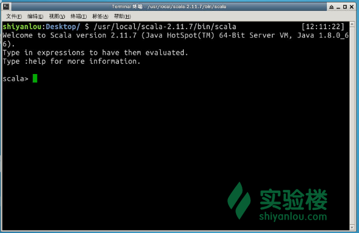

# 第 3 节 List 简介

## 一、实验简介

我们在前面介绍 Scala 编程时，没有对 Scala 库提供的函数库介绍。Scala 支持的集合类型比如`List`、`Set`、`Map`、`Array`等，它们功能非常强大。如果你之前用过 C#的`LINQ`，基本上`LINQ`支持的功能，Scala 的集合类型都支持。很多以前需要循环来实现的，在 Scala 中可能只需要一行就可以实现，我们会有专门的课程来介绍 Scala 支持的集合类型。

本实验对 Scala 中最常用的`List`类型做个简要的介绍。

### 准备工作

为了使用交互式 Scala 解释器，你可以在打开的终端中输入命令：

```scala
cd /usr/local/scala-2.11.7/bin/

scala 
```

当出现`scala>`开始的命令行提示符时，就说明你已经成功进入解释器了。如下图所示。



## 二、List 简介

`List`和`Array`非常相像，但有两个重要的不同点：`List`是不可变的(immutable)，也就是 List 创建后，不可以修改。`List`具有递归的结构（也就是链接表结构），而数组不是。

和数组一样，`List`中的元素必须是同类型的。下面我们来看看如何构造一个`List`对象：

```scala
scala> val fruit = List("apple","oranges","pears")
fruit: List[String] = List(apple, oranges, pears)

scala> val empty=List()
empty: List[Nothing] = List() 

scala> val fruit = "apple" :: "orange" :: "pears"  :: Nil
fruit: List[String] = List(apple, orange, pears)

scala> val empty = Nil
empty: scala.collection.immutable.Nil.type = List()

scala> val nums = 1 :: 2 :: 3 :: 4 :: Nil
nums: List[Int] = List(1, 2, 3, 4) 
```

`List`可以通过构造函数创建，也可以通过 `::` 连接每个元素。`::`是右结合的，在通过`::`构造列表时，需要在最右边使用`Nil`。这样，编译器才知道构造一个`List`，因为字符串`String`本身不支持`::`操作。

### 2.1 基本操作

*   `head`：取`List`的首元素。
*   `tail`：取除首元素之外的`List`的其它元素。
*   `isEmpty` ：判断`List`是否为空。

具体的用法如下：

```scala
scala> empty.isEmpty
res0: Boolean = true

scala> fruit.head
res1: String = apple

scala> fruit.tail
res2: List[String] = List(orange, pears) 
```

### 2.2 列表模式匹配

可以使用模式对多个元素进行赋值，具体如下：

```scala
scala> val List(a,b,c)=fruit
a: String = apple
b: String = orange
c: String = pears

scala> val a::b::c = fruit
a: String = apple
b: String = orange
c: List[String] = List(pears) 
```

### 2.3 合并两个 List

合并两个`List`，可以使用 `:::` 操作符。这个操作符也是右连接的：

```scala
scala> List(1,2) ::: List (3,4,5)
res3: List[Int] = List(1, 2, 3, 4, 5)

scala> List() ::: List (1,2,3)
res4: List[Int] = List(1, 2, 3) 
```

### 2.4 反向 List

使用 `reverse` 可以逆转`List`中元素的顺序：

```scala
scala> List(1,2,3,4,5,6).reverse
res6: List[Int] = List(6, 5, 4, 3, 2, 1) 
```

### 2.5 drop、take 和 splitAt

`drop`、`take`操作为`head`、`tail` (和`init`)的一般形式。 `xs take n` 返回`List`的前`n`个元素，`xs drop n`返回除前`n`个元素的`List`余下的元素。如果`n`比`List`全长要大，则返回`空 List`。

`splitAt`可以把一个`List`在指定位置分成两个`List`。`xs spliatAt n` 和　`(xs taken n, xs drop n)`是等价。

用法如下：

```scala
scala> val abcde =List ('a','b','c','d','e')
abcde: List[Char] = List(a, b, c, d, e)

scala> abcde take 2
res8: List[Char] = List(a, b)

scala> abcde drop 2
res9: List[Char] = List(c, d, e)

scala> abcde splitAt 2
res10: (List[Char], List[Char]) = (List(a, b),List(c, d, e)) 
```

### 2.6 flatten 展开嵌套 List

`flatten`可以展开嵌套的`List`为一个单个`List`。比如：

```scala
scala> List(List(1,2),List(3,4),List(5,6)).flatten
res11: List[Int] = List(1, 2, 3, 4, 5, 6) 
```

### 2.7 zip 和 unzip List

`zip`在两个`List`中分别去对应的元素，组成二元组，构成新的 List：

```scala
scala> abcde.indices zip abcde
res12: scala.collection.immutable.IndexedSeq[(Int, Char)] = Vector((0,a), (1,b), (2,c), (3,d), (4,e))

scala> abcde zip List(1,2,3)
res13: List[(Char, Int)] = List((a,1), (b,2), (c,3)) 
```

而 unzip 执行相反的操作：

```scala
scala> val zipped=abcde.zipWithIndex
zipped: List[(Char, Int)] = List((a,0), (b,1), (c,2), (d,3), (e,4))

scala> zipped.unzip
res14: (List[Char], List[Int]) = (List(a, b, c, d, e),List(0, 1, 2, 3, 4)) 
```

### 2.8 显示列表 toString 和 mkString

`toString`显示`List`的正规字符表示。`mkString`可以格式化`List`显示：

```scala
scala> abcde.toString
res15: String = List(a, b, c, d, e)

scala> abcde.mkString("[",",","]")
res16: String = [a,b,c,d,e]

scala> abcde mkString ""
res17: String = abcde

scala> abcde mkString("\n")
res19: String =
a
b
c
d
e 
```

### 2.9 对列表使用高阶函数

`map` 可以对`List`的每个元素逐个应用某个函数，转换成另外一个列表：

```scala
scala> List(1,2,3) map (_ + 1)
res20: List[Int] = List(2, 3, 4)

scala> val words= List("the","quick","brown","fox")
words: List[String] = List(the, quick, brown, fox)

scala> words map (_.length)
res21: List[Int] = List(3, 5, 5, 3) 
```

`flatMap`和`map`类似，但它使用的函数需要返回一个列表，然后它把这个函数用于到`List`的每个元素，然后合并列表：

```scala
scala> words map (_.toList)
res22: List[List[Char]] = List(List(t, h, e), List(q, u, i, c, k), List(b, r, o, w, n), List(f, o, x))

scala> (words map (_.toList)).flatten
res23: List[Char] = List(t, h, e, q, u, i, c, k, b, r, o, w, n, f, o, x)

scala> words flatMap (_.toList)
res24: List[Char] = List(t, h, e, q, u, i, c, k, b, r, o, w, n, f, o, x) 
```

### 2.10 过滤列表

`filter`、`partition`、`find`、`takeWhile`、`dropWhile`、`span`可以用来根据条件过滤列表的元素，构成新列表。

```scala
scala> List(1,2,3,4,5) filter (_ % 2==0)
res25: List[Int] = List(2, 4)

scala>  List(1,2,3,4,5) partition (_ % 2==0)
res27: (List[Int], List[Int]) = (List(2, 4),List(1, 3, 5)) 
```

## 三、实验总结

在本实验中，我们着重对`List`类型进行了介绍，主要涉及了该类型下的一些常用的操作。项目本身是一部分，而对于更多的数据类型的介绍部分将会在后续的项目课中提供。希望你能在实际开发过程中能够使用到这些操作，以简化逻辑上流程。