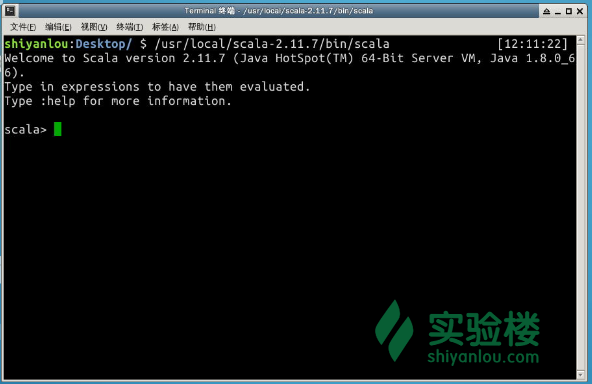

# 第 6 节 在 Java 中调用 Scala 函数

## 一、实验简介

你知道吗？我们对前面定义的计算 24 的代码，稍作修改后，可以在 Java 中调用。本节实验我们就将为你介绍如何调用。

本节实验具有一定难度，推荐具有 Java 编程基础的同学作深入了解。

### 准备工作

为了使用交互式 Scala 解释器，你可以在打开的终端中输入命令：

```scala
cd /usr/local/scala-2.11.7/bin/

scala 
```

当出现`scala>`开始的命令行提示符时，就说明你已经成功进入解释器了。如下图所示。



## 二、在 Java 代码中调用 Scala 函数

在通常情况下，在 Java 中调用 Scala 函数非常简单；反之，从 Scala 中调用 Java 代码也很简单。这是因为，Scala 代码最终也要编译成 Java class 文件。以后我们将详细介绍 Java 和 Scala 之间的互操作的用法，这里简要介绍下如何在 Java 代码中调用之前我们定义的计算 24 的算法。

>编者注：实验楼为你提供了`Eclipse`作为 Java 的开发环境，请根据实际需要决定是否使用（如果仅需编辑代码，可以只用 Sublime Text）。

在上一个实验中，我们给出了完整的代码。其中的`Test`由`App`派生。如果我们希望把`Test`定义的一些方法如`cal24`、`cal24once` 作为库函数调用，我们无需让`Test`由`App`派生，只需要另外再定义 `cal24once` 的一个重载版本：

```scala
object Cal24 {

   ...
   def cal24once(a:Int,b:Int,c:Int,d:Int) {
   cal24once(List(a,b,c,d))
  }

  def hello {
    println("Hello from Scala")
  }

} 
```

我们把这段代码存成`Cal24.scala`。 下面我们使用`scalac` 对它进行编译：

```scala
scalac Cal24.scala 
```

然后我们列出由 `scalac` 编译后生成的 `class` 文件：

>编者注：`class`文件所处的文件目录是取决于你执行上一个`scalac`编译命令时指定的。请同学们注意组织好源文件和类文件的存放位置。

```scala
Add.class                                          Cal24.class
Add$.class                                         Cal24$.class
BinaryOp.class                                     Cal24.scala
BinaryOp$class.class                               Divide.class
Bracket$$anonfun$matchBracket$1.class              Divide$.class
Bracket$$anonfun$matchBracket$2.class              Multiply.class
Bracket.class                                      Multiply$.class
Bracket$.class                                     Rational.class
Cal24$$anonfun$cal24$1$$anonfun$apply$1.class      Rational$.class
Cal24$$anonfun$cal24$1.class                       Subtract.class
Cal24$$anonfun$cal24once$1$$anonfun$apply$2.class  Subtract$.class
Cal24$$anonfun$cal24once$1$$anonfun$apply$3.class  
Cal24$$anonfun$cal24once$1.class                   
Cal24$$anonfun$calculate$1.class 
```

其中 `Cal24` 定义了我们所需的库函数，我们可以使用`javap` 看看它对应的 java 类定义：

>编者注：下面的命令中，路径`~/Desktop/Scala/Cal24`需要修改为你存放项目文件的实际位置。

```scala
root@shiyanlou:~/Desktop/Scala/Cal24# javap Cal24
Compiled from "Cal24.scala"
public final class Cal24 {
  public static void hello();
  public static void cal24once(int, int, int, int);
  public static void cal24once(scala.collection.immutable.List<java.lang.Object>);
  public static void cal24(scala.collection.immutable.List<java.lang.Object>);
  public static scala.Tuple3<java.lang.String, java.lang.String, Rational> calculate(java.lang.String, scala.collection.immutable.List<java.lang.Object>);
  public static Rational eval(java.lang.String);
  public static scala.collection.immutable.List<java.lang.String> templates();
} 
```

可以看到，Scala 的`object` (`singleton`对象）对应于 Java 的 `public final class`， `Cal24`的函数为`static`。

然后我们定义一个`TestCal24.java`：

```scala
public class TestCal24{
    public static void main(String[] args) {
        Cal24.cal24once(5,2,3,4);
    }
} 
```

然后我们使用`javac`来编译`TestCal24.java`。此时，我们需要指明`scala`库的位置。

>编者注：`$SCALA_HOME`为配置好的系统环境变量。如果你没有配置该项，你可以使用`/usr/local/scala-2.11.7`代替`$SCALA_HOME`。另外，你还需要根据自己的项目实际情况，指明`TestCal24.java`的具体路径，例如`~/Desktop/Scala/TextCal24.java`。

```scala
javac -cp $SCALA_HOME/lib/scala-library.jar:. TestCal24.java 
```

`-cp (class path)` 指明 Scala 类定义的路径。

然后运行编译后的 `TestCal24` 代码：

>编者注：同理，此命令中的`$SCALA_HOME`和`TestCal24`也需要根据你的实际情况，决定是否修改。

```scala
root@shiyanlou:~/Desktop/Scala/Cal24# java -cp $SCALA_HOME/lib/scala-library.jar:. TestCal24
List(5, 2, 3, 4):(N-(N-N))*N:(5-(2-3))*4 
```

调用成功，这样你可以在 Java 应用（包括 Android 应用）中使用 Scala 的函数库。

## 三、实验总结

本节我们学习了如何在 Java 代码中调用 Scala 函数。完成了本实验的学习后，今后无论是在 Spark 上使用 Scala，还是将其用作其他用途，相信你都对这门语言有了更加深入的认识。我们将继续开设更多的 Scala 课程，以满足你的学习需求。

在学习过程中有任何问题和建议，都欢迎你通过实验楼的[问答](https://www.shiyanlou.com/questions/)版块与我们交流！