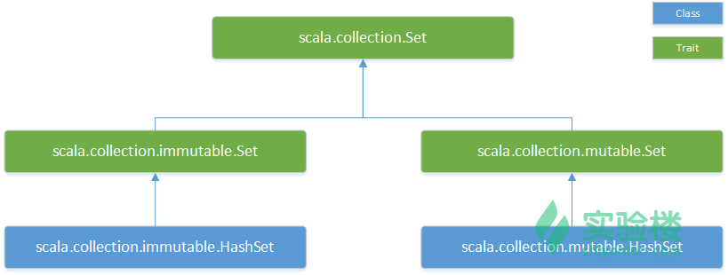

# 第 2 节 起步 Scala

## 一、实验简介

在详细介绍 Scala 编程之前，我们通过本实验给你一个 Scala 的整体印象，更重要的是让你开始写代码。强烈建议初学 Scala 编程者编译运行本实验的每个示例。

如果你是个非常有经验的程序员，那么本实验可以使得你获得足够的知识开始编写一些实用的程序。

### 1.1 知识点

*   交互式 Scala 解释器的使用方法
*   变量、函数的定义
*   循环、迭代的实现
*   数组的参数化
*   List、元组、Set 和 Map 的使用
*   识别函数编程风格
*   读取文件

### 1.2 准备工作

为了使用交互式 Scala 解释器，你可以在打开的终端中输入命令：

```scala
cd /usr/local/scala-2.11.7/bin/

scala 
```

当出现`scala>`开始的命令行提示符时，就说明你已经成功进入解释器了。如下图所示。


## 二、交互式 Scala 解释器的使用方法

### 2.1 学习使用交互式 Scala 解释器

开始使用 Scala 的最简单的方式是使用交互式 Scala 解释器，只要输入 Scala 表达式，Scala 解释器会立即解释执行该语句并输出结果。当然你也可以使用如 Scala IDE 或 IntelliJ IDEA 集成开发环境。不过本教程开始还是以这种交互式 Scala 解释器为主。

使用 Scala 解释器，首先你需要下载安装 Scala 运行环境。 然后再命令行输入`scala`，则进入 scala 解释器，下图为 Linux 环境下 scala 解释器界面：


你可以使用`:help` 命令列出一些常用的 Scala 解释器命令。

退出 Scala 解释器，输入：

```scala
:quit 
```

在`scala >`提示符下，你可以输入任意的 Scala 表达式，比如输入`1+2`，解释器显示：

```scala
res0: Int = 3 
```

这行显示包括：

*   一个由 Scala 解释器自动生成的变量名或者由你指定的变量名用来指向计算出来的结果（比如 `res0` 代表 `result0`变量）
*   一个冒号，后面紧跟个变量类型比如`Int`
*   一个等于号`=`
*   计算结果，本例为`1+2`的结果`3`

`resX` 变量名可以用在之后的表达式中，比如：此时`res0=3`,如果输入　`res0 *3` ,则显示 `res1: Int =9`。

### 2.2 定义一些变量

Scala 定义了两种类型的变量 `val` 和 `var` ，`val` 类似于 Java 中的`final` 变量，一旦初始化之后，不可以重新复制（我们可以称它为`常变量`）。而`var` 类似于一般的非`final`变量。可以任意重新赋值。

比如定义一个字符串常变量：

```scala
scala> val msg="Hello,World"
msg: String = Hello,World 
```

这个表达式定义了一个`msg`变量，为字符串常量。它的类型为 `string` (`java.lang.string`)。 可以看到我们在定义这个变量时并不需要像 Java 一样定义其类型，Scala 可以根据赋值的内容推算出变量的类型。这在 Scala 语言中成为“type inference”。当然如果你愿意，你也可以采用和 Java 一样的方法，明确指定变量的类型，如：

```scala
scala> val msg2:String ="Hello again,world"
msg2: String = Hello again,world 
```

不过这样写就显得不像 Scala 风格了。此外 Scala 语句也不需要以分号结尾。 如果在命令行中需要分多行输入，Scala 解释器在新行前面显示`|`，表示该行接着上一行。比如：

```scala
scala> val msg3=
     | "Hello world 3rd time"
msg3: String = Hello world 3rd time 
```

### 2.3 定义一些函数

Scala 既是面向对象的编程语言，也是面向函数的编程语言，因此函数在 Scala 语言中的地位和类是同等第一位的。下面的代码定义了一个简单的函数求两个值的最大值：

```scala
scala> def max(x:Int,y:Int) : Int ={
     | if (x >y) x
     | else
     | y
     | }
max: (x: Int, y: Int)Int 
```

Scala 函数以`def`定义，然后是函数的名称（如`max`)，然后是以逗号分隔的参数。Scala 中变量类型是放在参数和变量的后面，以“`：`”隔开。这种做的一个好处是便与“type inference”。刚开始有些不习惯（如果你是 Pascal 程序员会觉的很亲切）。同样如果函数需要返回值，它的类型也是定义在参数的后面（实际上每个 Scala 函数都有返回值，只是有些返回值类型为`Unit`，类似为`void`类型）。

此外每个 Scala 表达式都有返回结果（这一点和 Java，C#等语言不同），比如 Scala 的 `if else` 语句也是有返回值的，因此函数返回结果无需使用`return`语句。实际上在 Scala 代码应当尽量避免使用`return`语句。函数的最后一个表达式的值就可以作为函数的结果作为返回值。

同样由于 Scala 的“type inference”特点，本例其实无需指定返回值的类型。对于大多数函数 Scala 都可以推测出函数返回值的类型，但目前来说回溯函数（函数调用自身）还是需要指明返回结果类型的。

下面在定义个“没有”返回结果的函数（其它语言可能称这种无返回值的函数为程式）。

```scala
scala> def greet() = println("hello,world")
greet: ()Unit 
```

`greet`函数的返回值类型为 Unit 表示该函数不返回任何有意义的值，`Unit`类似于 Java 中的`void`类型。这种类型的函数主要用来获得函数的“副作用”，比如本函数的副作用是打印招呼语。

### 2.4 编写 Scala 脚本

Scala 本身是设计用来编写大型应用的，但它也可以作为脚本语言来执行，脚本为一系列 Scala 表达式构成以完成某个任务，比如前面的`Hello World`脚本，你也可以使用脚本来实现一些比如复制文件，创建目录之类的任务。

### 2.5 使用 while 配合使用 if 实现循环

下面的代码使用`while`实现一个循环：

```scala
var i=0
while (i < args.length) {
  println (args(i))
  i+=1
} 
```

为了测试这段代码，可以将该代码存成一个文件，比如`printargs.scala` 。你可以通过上一个实验中提到的 Sublime Text 2 编辑器来完成这步。然后将该语句作为脚本运行，比如在命令行中输入：

```scala
/usr/local/scala-2.11.7/bin/scala ~/Desktop/printargs.scala I like Scala 
```

（其中`~/Desktop/printargs.scala`是你保存脚本文件的路径，请根据实际情况修改）

则显示：


这里要注意的是 Scala 不支持`++i`和`i++`运算符，因此需要使用`i += 1` 来加一。 这段代码看起来和 Java 代码差不多，实际上`while` 也是一个函数，你自动可以利用 scala 语言的扩展性，实现`while` 语句，使它看起来和 Scala 语言自带的关键字一样调用。

Scala 访问数组的语法是使用`()`而非`[]`。

这里介绍了使用`while`来实现循环，但这种实现循环的方法并不是最好的 Scala 风格，在下一步介绍使用一种更好的方法来避免通过索引来枚举数组元素。

### 2.6 使用 foreach 和 for 来实现迭代

第五步使用`while`来实现循环，和使用 Java 实现无太大差异，而 Scala 是面向函数的语言，更好的方法是采用“函数式”风格来编写代码。比如上面的循环，使用`foreach`方法如下：

```scala
args.foreach(arg => println(arg)) 
```

该表达式，调用`args`的`foreach`方法，传入一个参数，这个参数类型也是一个函数（`lambda`表达式，和 C#中概念类似）。这段代码可以再写的精简些，你可以利用 Scala 支持的缩写形式，如果一个函数只有一个参数并且只包含一个表达式，那么你无需明确指明参数。因此上面的代码可以写成：

```scala
args.foreach( println) 
```

Scala 中也提供了一个称为“for comprehension”，它比 Java 中的`for`功能更强大。“for comprehension”（可称之为 for 表达式）将在后面介绍，这里先使用`for`来实现前面的例子：

```scala
for (arg <-args)
  println(arg) 
```

### 2.7 使用类型参数化数组

在 Scala 中你可以使用`new`来实例化一个类。当你创建一个对象的实例时，你可以使用数值或类型参数。如果使用类型参数，它的作用类似 Java 或.Net 的`Generic`类型。所不同的是 Scala 使用方括号来指明数据类型参数，而非尖括号。比如：

```scala
val greetStrings = new ArrayString
greetStrings(0)= "Hello"
greetStrings(1)= ","
greetStrings(2)= "world!\n"
for(i <- 0 to 2)
  print(greetStrings(i)) 
```

可以看到 Scala 使用`[]`来为数组指明类型化参数，本例使用`String`类型，数组使用`()`而非`[]`来指明数组的索引。其中的`for`表达式中使用到`0 to 2` ，这个表达式演示了 Scala 的一个基本规则，如果一个方法只有一个参数，你可以不用括号和`.`来调用这个方法。

因此这里的 `0 to 2`， 其实为`(0).to(2)` 调用的为整数类型的 `to` 方法，`to` 方法使用一个参数。Scala 中所有的基本数据类型也是对象（和 Java 不同），因此 `0` 可以有方法（实际上调用的是`RichInt`的方法），这种只有一个参数的方法可以使用操作符的写法（不用`.`和括号），实际上 Scala 中表达式 `1+2` ，最终解释为 `(1).+(2)+` 也是`Int`的一个方法，和 Java 不同的是，Scala 对方法的名称没有太多的限制，你可以使用符合作为方法的名称。

这里也说明为什么 Scala 中使用`()`来访问数组元素，在 Scala 中，数组和其它普遍的类定义一样，没有什么特别之处，当你在某个值后面使用`()`时，Scala 将其翻译成对应对象的`apply`方法。因此本例中`greetStrings(1)` 其实调用 `greetString.apply(1)` 方法。这种表达方法不仅仅只限于数组，对于任何对象，如果在其后面使用`()`，都将调用该对象的 apply 方法。同样的如果对某个使用 `()` 的对象赋值，比如：

```scala
greetStrings(0)="Hello" 
```

Scala 将这种赋值转换为该对象的 `update` 方法， 也就是 `greetStrings.update(0,”hello”)`。因此上面的例子，使用传统的方法调用可以写成：

```scala
val greetStrings =new ArrayString
greetStrings.update(0,"Hello")
greetStrings.update(1,",")
greetStrings.update(2,"world!\n")
for(i <- 0 to 2)
  print(greetStrings.apply(i)) 
```

从这点来说，数组在 Scala 中并不某种特殊的数据类型，和普通的类没有什么不同。

不过 Scala 还是提供了初始化数组的简单的方法，比如什么的例子数组可以使用如下代码：

```scala
val greetStrings =Array("Hello",",","World\n") 
```

这里使用`()`其实还是调用 Array 类的关联对象 Array 的 apply 方法，也就是：

```scala
val greetStrings =Array.apply("Hello",",","World\n") 
```

### 2.8 使用 Lists

Scala 也是一个面向函数的编程语言，面向函数的编程语言的一个特点是，调用某个方法不应该有任何副作用，参数一定，调用该方法后，返回一定的结果，而不会去修改程序的其它状态（副作用）。这样做的一个好处是方法和方法之间关联性较小，从而方法变得更可靠和重用性高。使用这个原则也就意味着就变量的设成不可修改的，这也就避免了多线程访问的互锁问题。

前面介绍的数组，它的元素是可以被修改的。如果需要使用不可以修改的序列，Scala 中提供了`Lists`类。和 Java 的`List`不同，Scala 的`Lists`对象是不可修改的。它被设计用来满足函数编程风格的代码。它有点像 Java 的`String`，`String`也是不可以修改的，如果需要可以修改的`String`对像，可以使用`StringBuilder`类。

比如下面的代码：

```scala
val oneTwo = List(1,2)
val threeFour = List(3,4)
val oneTwoThreeFour=oneTwo ::: threeFour
println (oneTwo + " and " + threeFour + " were not mutated.")
println ("Thus, " + oneTwoThreeFour + " is a new list") 
```

定义了两个`List`对象`oneTwo`和`threeFour` ，然后通过`:::`操作符（其实为`:::`方法）将两个列表链接起来。实际上由于`List`的不可以修改特性，Scala 创建了一个新的`List`对象`oneTwoThreeFour`来保存两个列表连接后的值。

`List`也提供了一个`::`方法用来向`List`中添加一个元素，`::`方法（操作符）是右操作符，也就是使用`::`右边的对象来调用它的`::`方法，Scala 中规定所有以`：`开头的操作符都是右操作符，因此如果你自己定义以`：`开头的方法（操作符）也是右操作符。

如下面使用常量创建一个列表：

```scala
val oneTowThree = 1 :: 2 ::3 :: Nil
println(oneTowThree) 
```

调用空列表对象`Nil`的 `::`方法 也就是：

```scala
val oneTowThree =  Nil.::(3).::(2).::(1) 
```

Scala 的`List`类还定义其它很多很有用的方法，比如 `head`、`last`、`length`、`reverse`、`tail`等。这里就不一一说明了，具体可以参考`List`的文档。

### 2.9 使用元组（Tuples)

Scala 中另外一个很有用的容器类为`Tuples`，和`List`不同的是，`Tuples`可以包含不同类型的数据，而`List`只能包含同类型的数据。`Tuples`在方法需要返回多个结果时非常有用。（`Tuple`对应到数学的`矢量`的概念）。

一旦定义了一个元组，可以使用`._`和`索引`来访问员组的元素（矢量的分量，注意和数组不同的是，元组的索引从 1 开始）。

```scala
val pair=(99,"Luftballons")
println(pair._1)
println(pair._2) 
```

元组的实际类型取决于它的分量的类型，比如上面`pair`的类型实际为 `Tuple2[Int,String]`，而 `(‘u’,’r’,”the”,1,4,”me”)`的类型为`Tuple6[Char,Char,String,Int,Int,String]`。

目前 Scala 支持的元组的最大长度为 22。如果有需要，你可以自己扩展更长的元组。

### 2.10 使用 Sets 和 Maps

Scala 语言的一个设计目标是让程序员可以同时利用面向对象和面向函数的方法编写代码，因此它提供的集合类分成了可以修改的集合类和不可以修改的集合类两大类型。比如`Array`总是可以修改内容的，而`List`总是不可以修改内容的。类似的情况，`Scala`也提供了两种`Sets`和`Map`集合类。

比如 Scala API 定义了`Set`的`基 Trait`类型`Set`（`Trait`的概念类似于 Java 中的`Interface`，所不同的 Scala 中的`Trait`可以有方法的实现），分两个包定义`Mutable`（可变）和`Immutable`（不可变），使用同样名称的子`Trait`。下图为`Trait`和类的基础关系：



使用`Set`的基本方法如下：

```scala
var jetSet = Set ("Boeing","Airbus")
jetSet +="Lear"
println(jetSet.contains("Cessna")) 
```

缺省情况`Set`为`Immutable Set`，如果你需要使用可修改的集合类（`Set`类型），你可以使用全路径来指明`Set`，比如 `scala.collection.mutalbe.Set` 。

Scala 提供的另外一个类型为`Map`类型，Scala 也提供了`Mutable`和`Immutable` 两种 Map 类型，如下图所示。


Map 的基本用法如下（Map 类似于其它语言中的关联数组如 PHP）

```scala
val romanNumeral = Map ( 1 -> "I" , 2 -> "II",
  3 -> "III", 4 -> "IV", 5 -> "V")
println (romanNumeral(4)) 
```

### 2.11 学习识别函数编程风格

Scala 语言的一个特点是支持面向函数编程，因此学习 Scala 的一个重要方面是改变之前的指令式编程思想（尤其是来自 Java 或 C#背景的程序员），观念要想函数式编程转变。首先在看代码上要认识哪种是指令编程，哪种是函数式编程。实现这种思想上的转变，不仅仅会使你成为一个更好的 Scala 程序员，同时也会扩展你的视野，使你成为一个更好的程序员。

一个简单的原则，如果代码中含有`var`类型的变量，这段代码就是传统的指令式编程，如果代码只有`val`变量，这段代码就很有可能是函数式代码，因此学会函数式编程关键是不使用`vars`来编写代码。

来看一个简单的例子：

```scala
def printArgs ( args: Array[String]) : Unit ={
    var i=0
    while (i < args.length) {
      println (args(i))
      i+=1
    }
} 
```

来自 Java 背景的程序员开始写 Scala 代码很有可能写成上面的实现。我们试着去除`vars`变量，可以写成跟符合函数式编程的代码：

```scala
def printArgs ( args: Array[String]) : Unit ={
    for( arg <- args)
      println(arg)
} 
```

或者更简化为：

```scala
def printArgs ( args: Array[String]) : Unit ={
    args.foreach(println)
} 
```

这个例子也说明了尽量少用`vars`的好处，代码更简洁和明了，从而也可以减少错误的发生。因此 Scala 编程的一个基本原则上，能不用`vars`，尽量不用`vars`，能不用`mutable`变量，尽量不用`mutable`变量，能避免函数的副作用，尽量不产生副作用。

### 2.12 读取文件

使用脚本实现某个任务，通常需要读取文件，本节介绍 Scala 读写文件的基本方法。比如下面的例子读取文件的每行，把该行字符长度添加到行首：

```scala
import scala.io.Source
if (args.length >0 ){
  for( line <- Source.fromFile(args(0)).getLines())
    println(line.length + " " + line)
}
   else
      Console.err.println("Please enter filename") 
```

可以看到 Scala 引入包的方式和 Java 类似，也是通过`import`语句。文件相关的类定义在`scala.io`包中。 如果需要引入多个类，Scala 使用 “`_`” 而非 “`*`”.

## 三、实验总结

通过本实验的介绍，你应该对 Scala 编程有了一个大概的了解，可以编写一些简单的 Scala 脚本语言。Scala 的功能远远不止这些，在后面的实验我们再作详细介绍。