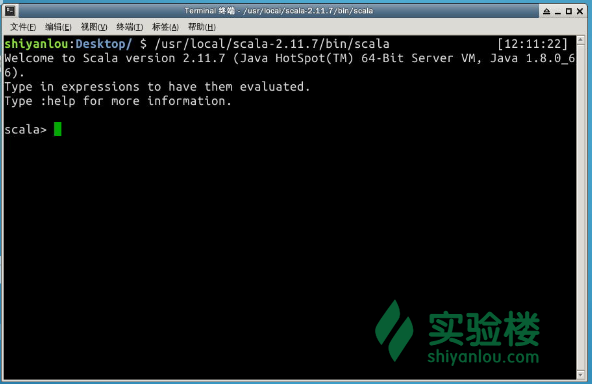

# 第 8 节 函数（二）

## 一、实验简介

接上一实验，我们将继续为你介绍尾递归、函数柯里化等具有 Scala 特色的函数使用方法。

### 1.1 知识点

*   尾递归
*   减低代码重复
*   柯里化函数
*   创建新的控制结构
*   传名参数

### 1.2 准备工作

为了使用交互式 Scala 解释器，你可以在打开的终端中输入命令：

```scala
cd /usr/local/scala-2.11.7/bin/

scala 
```

当出现`scala>`开始的命令行提示符时，就说明你已经成功进入解释器了。如下图所示。



## 二、函数的具体使用（第二部分）

### 2.1 尾递归

在前面的内容中，我们提到过：可以使用递归函数来消除需要使用`var`变量的`while`循环。下面为一个使用逼近方法求解的一个递归函数表达：

```scala
def approximate(guess: Double) : Double =
  if (isGoodEnough(guess)) guess
  else approximate(improve(guess)) 
```

通过实现合适的`isGoodEnough`和`improve`函数，说明这段代码在搜索问题中经常使用。如果你打算让`approximate`运行地快些，你很可能使用下面循环来实现上面的算法：

```scala
def approximateLoop(initialGuess: Double) : Double = {
  var guess = initialGuess
  while(!isGoodEnough(guess))
    guess=improve(guess)
  guess
 } 
```

那么这两种实现哪一种更可取呢？从简洁度和避免使用`var`变量上看，使用函数化编程递归比较好。但是有`while`循环是否运行效率更高些？实际上，如果我们通过测试，两种方法所需时间几乎相同，这听起来有些不可思议，因为回调函数看起来比使用循环要耗时得多。

其实，对于`approximate`的递归实现，Scala 编译器会做些优化。我们可以看到`approximate`的实现，最后一行还是调用`approximate`本身，我们把这种递归叫做`尾递归`。Scala 编译器可以检测到尾递归而使用循环来代替。

因此，你应该习惯使用递归函数来解决问题，如果是尾递归，那么在效率上不会有什么损失。

**1.跟踪尾递归函数**

一个尾递归函数在每次调用中，不会构造一个新的调用栈(stack frame)。所有的递归都在同一个执行栈中运行。如果你在调试时，在尾递归中遇到调试错误，你将不会看到嵌套的调用栈。比如下面的代码，非尾递归的一个实现：

```scala
scala> def boom(x:Int):Int=
     |   if(x==0) throw new Exception("boom!") else boom(x-1) + 1
boom: (x: Int)Int

scala> boom(5)
java.lang.Exception: boom!
  at .boom(<console>:8)
  at .boom(<console>:8)
  at .boom(<console>:8)
  at .boom(<console>:8)
  at .boom(<console>:8)
  at .boom(<console>:8)
  ... 32 elided 
```

`boom`不是一个尾递归，因为最后一行为一个递归加一操作。可以看到调用`boom(5)`的调用栈，为多层。

我们修改这段代码，使它构成一个尾递归：

```scala
scala> def bang(x:Int):Int=
     |        if(x==0) throw new Exception("boom!") else bang(x-1)
bang: (x: Int)Int

scala> bang(5)
java.lang.Exception: boom!
  at .bang(<console>:8)
  ... 32 elided 
```

这一次，你就只能看到一层调用栈。Scala 编译器将尾递归优化成循环实现。如果你不想使用这个特性，可以添加 scalac 编译参数 `-g:notailcalls` 来取消这个优化。此后，如果抛出异常，尾递归也会显示多层调用栈。

**2.尾递归的一些局限性**

目前来说，Scala 编译器只能对那些直接实现尾递归的函数，比如前面的`approximate`和`bang`。如果一个函数间接实现尾递归，比如下面代码：

```scala
def isEven(x:Int): Boolean =
  if(x==0) true else isOdd(x-1)

def isOdd(x:Int): Boolean=
  if(x==0) false else isEven(x-1) 
```

`isEven`和`isOdd`事件也是为递归，但不是直接定义的尾递归，scala 编译器无法对这种递归进行优化。

### 2.2 减低代码重复

在前文中，我们说过：Scala 没有内置很多控制结构。这是因为 Scala 赋予了程序员自己扩展控制结构的能力。Scala 支持函数值（值的类型为函数，而非函数的返回值）。为避免混淆，我们使用函数类型值来指代类型为函数的值。

所有的函数可以分成两个部分：一是公共部分，这部分在该函数的调用都是相同的；另外一部分为非公共部分，这部分在每次调用该函数上是可以不同的。公共部分为函数的定义体，非公共部分为函数的参数。但你使用函数类型值做为另外一个函数的参数时，函数的非公共部分本身也是一个算法（函数），调用该函数时，每次你都可以传入不同函数类型值作为参数，这个函数称为`高阶函数`——函数的参数也可以是另外一个函数。

使用高级函数可以帮助你简化代码，它支持创建一个新的程序控制结构来减低代码重复。

比如，你打算写一个文件浏览器，你需要写一个 API 支持搜索给定条件的文件。首先，你需要添加一个方法，该方法可以通过查询包含给定字符串的文件。比如你可以查所有“`.scala`”结尾的文件。你可以定义如下的 API：

```scala
object FileMatcher {
  private def filesHere = (new java.io.File(".")).listFiles
  def filesEnding(query : String) =
    for (file <-filesHere; if file.getName.endsWith(query))
      yield file
} 
```

`filesEnding` 方法从本地目录获取所有文件（方法`filesHere`)，然后使用过滤条件（文件以给定字符串结尾）输出给定条件的文件。

到目前为止，这代码实现非常好，也没有什么重复的代码。接着，你有必要使用新的过滤条件，文件名包含指定字符串，而不仅仅以某个字符串结尾的文件列表。你需要实现了下面的 API。

```scala
def filesContaining( query:String ) =
    for (file <-filesHere; if file.getName.contains(query))
      yield file 
```

`filesContaining`和`filesEnding` 的实现非常类似，不同点在于一个使用`endsWith`，另一个使用`contains`函数调用。若过了一段时间，你又想支持使用正则表达式来查询文件，那么可以实现下面的对象方法：

```scala
def filesRegex( query:String) =
   for (file <-filesHere; if file.getName.matches(query))
      yield file 
```

这三个函数的算法非常类似，所不同的是过滤条件稍有不同。在 Scala 中，我们可以定义一个高阶函数，将这三个不同过滤条件抽象成一个函数，作为参数传给搜索算法，我们可以定义这个高阶函数如下：

```scala
def filesMatching( query:String, 
    matcher: (String,String) => Boolean) = {
    for(file <- filesHere; if matcher(file.getName,query))
      yield file
   } 
```

这个函数的第二个参数`matcher`的类型也为函数（如果你熟悉 C#，类似于`delegate`)，该函数的类型为 `(String, String) =>Boolean`，可以匹配任意使用两个 String 类型参数，返回值类型为 Boolean 的函数。使用这个辅助函数，我们可以重新定义`filesEnding`、`filesContaining`和`filesRegex`。

```scala
def filesEnding(query:String) =
   filesMatching(query,_.endsWith(_))

def filesContaining(query:String)=
   filesMatching(query,_.contains(_))

def filesRegex(query:String) =
   filesMatching(query,_.matches(_)) 
```

这个新的实现和之前的实现相比，已经简化了不少。实际上，代码还可以简化，我们注意到参数`query`在`filesMatching`的作用只是把它传递给`matcher`参数。这种参数传递实际上也不是必需的。简化后代码如下：

```scala
object FileMatcher {
  private def filesHere = (new java.io.File(".")).listFiles

  def filesMatching(
    matcher: (String) => Boolean) = {
    for(file <- filesHere; if matcher(file.getName))
      yield file
   }

  def filesEnding(query:String) =
   filesMatching(_.endsWith(query))

  def filesContaining(query:String)= 
   filesMatching(_.contains(query))

  def filesRegex(query:String) = 
   filesMatching(_.matches(query))
} 
```

函数类型参数 `_.endsWith(query)`、`_.contains(query)`和`_.matches(query)` 为函数闭包，因为它们绑定了一个自由变量`query`。因此，我们可以看到，闭包也可以用来简化代码。

### 2.3 柯里化函数

前面我们说过，Scala 允许程序员自己新创建一些控制结构，并且可以使得这些控制结构在语法看起来和 Scala 内置的控制结构一样。

在 Scala 中，需要借助于[柯里化(Currying)](http://baike.baidu.com/view/2804134.htm)，柯里化是把接受多个参数的函数变换成接受一个单一参数（最初函数的第一个参数）的函数，并且返回接受余下的参数而且返回结果的新函数的技术。

下面先给出一个普通的非柯里化的函数定义，实现一个加法函数：

```scala
scala> def plainOldSum(x:Int,y:Int) = x + y
plainOldSum: (x: Int, y: Int)Int

scala> plainOldSum(1,2)
res0: Int = 3 
```

下面在使用“柯里化”技术来定义这个加法函数，原来函数使用一个参数列表，“柯里化”把函数定义为多个参数列表：

```scala
scala> def curriedSum(x:Int)(y:Int) = x + y
curriedSum: (x: Int)(y: Int)Int

scala> curriedSum (1)(2)
res0: Int = 3 
```

当你调用`curriedSum (1)(2)`时，实际上是依次调用两个普通函数（非柯里化函数），第一次调用使用一个参数`x`，返回一个函数类型的值；第二次使用参数`y`调用这个函数类型的值。

我们使用下面两个分开的定义在模拟`curriedSum`柯里化函数：

首先定义第一个函数：

```scala
scala> def first(x:Int) = (y:Int) => x + y
first: (x: Int)Int => Int 
```

然后我们使用参数`1`调用这个函数来生成第二个函数（回忆前面定义的闭包）。

```scala
scala> val second=first(1)
second: Int => Int = <function1>

scala> second(2)
res1: Int = 3 
```

`first`、`second`的定义演示了柯里化函数的调用过程，它们本身和`curriedSum` 没有任何关系，但是我们可以使用`curriedSum` 来定义`second`，如下：

```scala
scala> val onePlus = curriedSum(1)_
onePlus: Int => Int = <function1> 
```

下划线“`_`” 作为第二参数列表的占位符， 这个定义的返回值为一个函数，当调用时会给调用的参数加一。

```scala
scala> onePlus(2)
res2: Int = 3 
```

通过柯里化，你还可以定义多个类似`onePlus`的函数，比如`twoPlus`：

```scala
scala> val twoPlus = curriedSum(2) _
twoPlus: Int => Int = <function1>

scala> twoPlus(2)
res3: Int = 4 
```

### 2.4 创建新的控制结构

对于支持函数作为“头等公民”的语言，你可以有效地创建新的控制结构，即使该语言的语法是固定的。你所要做的是创建一个方法，该方法使用函数类型作为参数。

比如：下面为一个“双倍”的控制结构，这个“双倍”控制结构可以重复一个操作，然后返回结果。

```scala
scala> def twice (op:Double => Double, x:Double) =op(op(x))
twice: (op: Double => Double, x: Double)Double

scala> twice(_ + 1, 5)
res0: Double = 7.0 
```

上面调用`twice` ，其中 `_+1` 调用两次，也就是`5`调用两次`+1`，结果为`7`。

你在写代码时，如果发现某些操作需要重复多次，你就可以试着将这个重复操作写成新的控制结构，在前面我们定义过一个`filesMatching`函数：

```scala
def filesMatching(
    matcher: (String) => Boolean) = {
    for(file <- filesHere; if matcher(file.getName))
      yield file
   } 
```

如果我们把这个函数进一步通用化，可以定义一个通用操作如下：

打开一个资源，然后对资源进行处理，最后释放资源，你可以为这个“模式”定义一个通用的控制结构如下：

```scala
def withPrintWriter (file: File, op: PrintWriter => Unit) {
  val writer=new PrintWriter(file)
  try{
    op(writer)
  }finally{
    writer.close()
  }
} 
```

使用上面定义，我们使用如下调用：

```scala
withPrintWriter(
   new File("date.txt"),
   writer => writer.println(new java.util.Date)
) 
```

使用这个方法的优点在于`withPrintWriter`，而不是用户定义的代码，`withPrintWriter`可以保证文件在使用完成后被关闭，也就是不可能发生忘记关闭文件的事件。这种技术成为“租赁模式”。这是因为这种类型的控制结构，比如`withPrintWriter` 将一个 `PrintWriter` 对象“租”给`op`操作。当这个`op`操作完成后，它通知不再需要租用的资源，在`finally`中可以保证资源被释放，而无论`op`是否出现异常。

这里调用语法还是使用函数通常的调用方法，使用`()`来列出参数。在 Scala 中，如果你调用函数只有一个参数，你可以使用`{}`来替代`()`。比如，下面两种语法是等价的：

```scala
scala> println ("Hello,World")
Hello,World

scala> println { "Hello,world" }
Hello,world 
```

上面第二种用法，使用`{}`替代了`()`，但这只适用在使用一个参数的调用情况。 前面定义`withPrintWriter` 函数使用了两个参数，因此不能使用`{}`来替代`()`，但如果我们使用柯里化重新定义下这个函数如下：

```scala
import scala.io._
import java.io._
def withPrintWriter (file: File)( op: PrintWriter => Unit) {
  val writer=new PrintWriter(file)
  try{
    op(writer)
  }finally{
    writer.close()
  }
} 
```

将一个参数列表，变成两个参数列表，每个列表含一个参数，这样我们就可以使用如下语法来调用`withPrintWriter`。

```scala
val file = new File("date.txt")
withPrintWriter(file){
  writer => writer.println(new java.util.Date)
} 
```

第一个参数我们还是使用`()`（我们也可以使用`{}`)。第二个参数我们使用`{}`来替代`()`，这样修改过的代码使得`withPrintWriter` 看起来和 Scala 内置的控制结构语法一样。

### 2.5 传名参数

上篇我们使用柯里化函数定义一个控制机构`withPrintWriter` ，它使用时语法调用有如 Scala 内置的控制结构：

```scala
val file = new File("date.txt")
withPrintWriter(file){
  writer => writer.println(new java.util.Date)
} 
```

不过仔细看一看这段代码，它和 scala 内置的`if`或`while`表达式还是有些区别的。`withPrintWriter`的`{}`中的函数是带参数的，含有“`writer=>`”。 如果你想让它完全和`if`和`while`的语法一致，在 Scala 中可以使用`传名参数`来解决这个问题。

**注：**我们知道通常函数参数传递的两种模式：一是传值，一是引用。而这里是第三种——按名称传递。

下面我们用一个具体的例子，来说明传名参数的用法：

```scala
var assertionsEnabled=true
def myAssert(predicate: () => Boolean ) =
  if(assertionsEnabled && !predicate())
    throw new AssertionError 
```

这个`myAssert`函数的参数为一个函数类型，如果标志`assertionsEnabled`为`True`时，`myAssert` 根据`predicate` 的真假决定是否抛出异常。如果`assertionsEnabled` 为`false`，则这个函数什么也不做。

这个定义没什么问题，但在调用时，看起来却有些别扭，比如：

```scala
myAssert(() => 5 >3 ) 
```

这里还需要 `()=>`，你可能希望直接使用 `5>3`，但此时会报错：

```scala
scala> myAssert(5 >3 )
<console>:10: error: type mismatch;
 found   : Boolean(true)
 required: () => Boolean
              myAssert(5 >3 ) 
```

此时，我们可以把按值传递的（上面使用的是按值传递，传递的是函数类型的值）参数，修改为按名称传递的参数。修改方法是使用 `=>` 开始，而不是 `()=>`来定义函数类型，如下：

```scala
def myNameAssert(predicate:  => Boolean ) =
  if(assertionsEnabled && !predicate)
    throw new AssertionError 
```

此时你就可以直接使用下面的语法来调用`myNameAssert`：

```scala
myNameAssert(5>3) 
```

此时就和 Scala 内置控制结构一样了。看到这里，你可能会想：我为什么不直接把参数类型定义为`Boolean`呢？比如：

```scala
def boolAssert(predicate: Boolean ) =
  if(assertionsEnabled && !predicate)
    throw new AssertionError 
```

调用也可以使用：

```scala
boolAssert(5>3) 
```

和`myNameAssert` 调用看起来也没什么区别，其实两者有着本质的区别：一个是传值参数，一个是传名参数。

在调用`boolAssert(5>3)`时，`5>3`是已经计算出为`true`，然后传递给`boolAssert`方法，而`myNameAssert(5>3)`，表达式`5>3`没有事先计算好传递给`myNameAssert`，而是先创建一个函数类型的参数值。这个函数的`apply`方法将计算`5>3`，然后这个函数类型的值作为参数传给`myNameAssert`。

因此，这两个函数的一个明显区别是：如果设置`assertionsEnabled` 为`false`，然后尝试计算 `x/0 ==0`：

```scala
scala> assertionsEnabled=false
assertionsEnabled: Boolean = false

scala> val x = 5
x: Int = 5

scala> boolAssert ( x /0 ==0)
java.lang.ArithmeticException: / by zero
  ... 32 elided

scala> myNameAssert ( x / 0 ==0) 
```

可以看到`boolAssert` 抛出`java.lang.ArithmeticException: / by zero` 异常。这是因为这是个传值参数。首先计算 `x/0` ，然后抛出异常，而 `myNameAssert` 没有任何显示。这是因为这是个传名参数，传入的是一个函数类型的值，不会先计算 `x/0 ==0`，而在`myNameAssert` 函数体内，由于`assertionsEnabled`为`false`，传入的`predicate`没有必要计算（短路计算），因此什么也不会打印。

如果我们把`myNameAssert` 修改一下，把`predicate`放在前面:

```scala
scala> def myNameAssert1(predicate:  => Boolean ) =
     |   if( !predicate && assertionsEnabled )
     |     throw new AssertionError
myNameAssert1: (predicate: => Boolean)Unit

scala> myNameAssert1 ( x/0 ==0)
java.lang.ArithmeticException: / by zero
  at $anonfun$1.apply$mcZ$sp(<console>:11)
  at .myNameAssert1(<console>:9)
  ... 32 elided 
```

这个传名参数函数也抛出异常（你可以想想是为什么）。

前面的`withPrintWriter` 我们暂时没法使用传名参数。若去掉`writer=>`，则难以实现“租赁模式”。不过，我们可以看看下面的例子，设计一个`withHelloWorld`控制结构。这个`withHelloWorld`总打印一个“`hello,world`”。

```scala
import scala.io._
import java.io._
def withHelloWorld ( op: => Unit) {
  op   
  println("Hello,world")
}

val file = new File("date.txt")
withHelloWorld{
  val writer=new PrintWriter(file)
  try{
   writer.println(new java.util.Date)
  }finally{
    writer.close()
  }
}

withHelloWorld {
  println ("Hello,Guidebee")
} 

-----

Hello,world 
Hello,Guidebee
Hello,world 
```

可以看到，`withHelloWorld` 的调用语法和 Scala 内置控制结构非常象了。

## 三、实验总结

作为一门将函数放在首要位置的编程语言，Scala 可以被称之为“为函数而生”。在这两个实验中，我们几乎从函数的各个方面进行了深入了解，而你需要做的就是在今后的开发过程中思考如何细化代码。